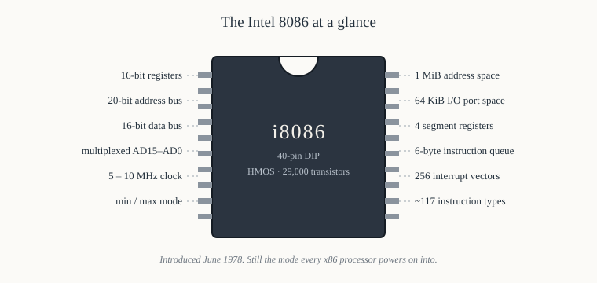

# Chapter 0 — Introduction

[Contents](README.md) · [Next: Setting up the toolchain →](01-toolchain-setup.md)

---

## Goal

Explain what the 8086 is, why a chip designed in 1978 is still the best thing to learn a processor
on, and what you will be able to do by the end of this book that you cannot do now.

This chapter contains no code. It is the only one that doesn't.

---

## 1. What the 8086 actually is

The Intel 8086 is a 16-bit microprocessor, introduced in June 1978, fabricated in HMOS, containing
roughly 29,000 transistors on a die about 33 mm², packaged in a 40-pin dual in-line package, running
at 5 MHz in its first version and 10 MHz in its last.

Unpack that sentence, because every phrase in it is a design decision that the rest of the book
explains.

**16-bit** means the registers that hold data are 16 bits wide, the arithmetic unit adds 16 bits at
a time, and the data bus carries 16 bits per transfer. A 16-bit register holds a number from 0 to
65,535 unsigned, or −32,768 to +32,767 signed. This is the single most important number to hold in
your head: the 8086's natural quantity is a 16-bit word.

**Microprocessor** means the whole central processing unit is on one chip — the registers, the
arithmetic and logic unit, the instruction decoder and the control logic. Before microprocessors,
a CPU was a board, or a cabinet.

**29,000 transistors.** A modern processor has tens of billions. The 8086 is small enough that you
can genuinely hold its whole structure in your mind, which is exactly why it is worth learning. You
will not be approximating; by Chapter 18 you will know what every pin does and what happens on every
clock edge of a memory read.

**40-pin DIP.** Forty pins is not many. The 8086 needs 20 address lines and 16 data lines, which is
36 already, plus power, ground, clock and a dozen control signals. It doesn't fit — so Intel
*multiplexed* the buses, sending addresses and data over the same wires at different times. That one
compromise, forced by package economics, shapes the entire external interface, and Chapters 11–15
are essentially about living with it.

**5 MHz.** One clock tick every 200 nanoseconds. A memory read takes four ticks, so 800 ns. A 16-bit
multiply takes up to 133 ticks — about 27 microseconds. You can count the cycles of an entire
program by hand, and in Chapter 32 you will.



---

## 2. Why this chip, in this decade

There are three honest answers, and one dishonest one that you should reject.

### 2.1 It is the ancestor that never died

Every Intel and AMD processor made since 1978 can still execute 8086 machine code. Not "emulate" —
execute. When an x86-64 processor powers on today, in 2026, it starts in **real mode**, with `CS`
and `IP` set exactly as the 8086's were, fetching its first instruction from physical address
`0xFFFF0`, with segmentation working exactly the way Chapter 9 describes. The boot firmware's first
job is to climb out of that state.

This is not trivia. It means the 8086 is not a museum piece you learn *instead of* a modern CPU; it
is the bottom layer of a modern CPU, and it is still reachable. If you have ever wondered why x86 has
`AX`, `BX`, `CX`, `DX` with odd implied uses, why the stack grows downwards, why `LOOP` uses `CX`
specifically, why there is a `DIV` instruction that can fault, why segment registers exist at all —
those answers are in this book, and they are still the reasons your laptop behaves the way it does.

### 2.2 It is complete but small

A teaching processor with 12 instructions teaches you 12 instructions. The 8086 has a real
instruction set — around 117 basic instruction types, which expand into a few thousand opcode
encodings — with real addressing modes, real interrupts, real string operations. It has everything
a processor needs to run an operating system, because it did run several.

But it has no cache, no branch predictor, no out-of-order execution, no virtual memory, no
protection rings, no floating-point unit (that's the separate 8087, Chapter 54), and no
micro-architectural surprises. Nothing between the instruction you wrote and the pins that move.
When you write `MOV AX, [BX]`, you can name the four clock cycles during which the address appears
on the pins, the cycle on which `RD#` falls, and the cycle on which the data is latched. On a modern
CPU, nobody can tell you that.

### 2.3 It makes hardware legible

The 8086 was designed to be wired up by a person, on a board, with TTL chips around it. The
schematics in Part V are not illustrations — they are buildable. When you connect an 8255 PPI to
port addresses `0x00`–`0x03` in Chapter 47, you will design the address decoder yourself, from a
74LS138 truth table, and you will be able to say why port `0x00` and port `0x08` are the same
register if you decode carelessly.

That connection — from a line of assembly, through the CPU's pins, through a decoder, into a
peripheral's register, out to an LED — is the thing most software people never see, and it is the
thing that makes everything above it make sense.

### 2.4 The dishonest answer

"You should learn the 8086 because it is used in industry." It is not, and has not been for thirty
years. Nobody is shipping new 8086 designs. If you want an 8-bit or 16-bit chip for an embedded
product today you will reach for an AVR, an ARM Cortex-M, an ESP32 or a RISC-V part.

Learn the 8086 because it is the clearest teacher of things that are permanently true — how a bus
cycle works, what an interrupt really costs, why alignment matters, how a stack frame is built —
and because it is the literal foundation of the architecture that runs most of the world's servers
and desktops. Not because a job advert asks for it.

---

## 3. What you will be able to do

By the end of Part II you will be able to read the 8086 datasheet's timing diagrams without help,
explain what happens on each of the four T-states of a bus cycle, compute a physical address from a
segment:offset pair in your head, and say what every one of the 40 pins does in both operating
modes.

By the end of Part III you will be able to assemble 8086 instructions to machine code **by hand**,
byte by byte, including the ModR/M byte, and disassemble a hex dump back again. You will know what
every instruction does to every flag, and why `CMP` and `SUB` set flags identically.

By the end of Part IV you will have written and run something like eighty complete programs, from
"add two numbers" to a bouncing ball in 320×200 graphics, all in real DOS executables, all debugged
by single-stepping through registers.

By the end of Part V you will have designed, on paper, a complete 8086 system: memory decoded into
EPROM and SRAM, an 8255 driving LEDs and reading switches, an 8253 generating a precise delay, an
8259A prioritising three interrupt sources, and an 8251A talking to a terminal at 9600 baud.

---

## 4. What this book does not cover

**Protected mode.** The 8086 has none. Segmentation here is the simple shift-and-add of Chapter 9,
with no descriptors, no privilege levels and no memory protection whatsoever. Any program can write
any byte of memory. Protected mode arrives with the 80286 and is sketched in Chapter 55.

**32-bit anything.** No `EAX`, no `ESI`, no scaled index addressing, no `MOVZX`. Those are 80386
instructions. If you have seen modern x86 assembly, you will find this instruction set noticeably
poorer, and the constraints are instructive.

**Floating point in the core.** The 8086 cannot add two real numbers. Chapter 54 covers the 8087
coprocessor, which can, and explains the `ESC`/`WAIT` mechanism by which the two chips cooperate.

**Modern operating systems.** Everything runs under DOS, or on bare metal. There is no scheduler, no
memory manager and no protection. That is a feature here: nothing is hidden from you.

---

## 5. How to read this book

**Type the programs.** Not copy — type. The muscle memory of writing `mov ah, 0x09` matters more
than you expect, and the typos you make will teach you the assembler's error messages, which you
will need.

**Do the hand-assembly exercises in Chapter 20.** They are tedious. They are also the single
exercise that converts assembly language from "a text format" into "a description of bytes", and
everything after is easier for having done them.

**Read the timing diagrams slowly.** Chapter 13 is the hardest chapter in Part II and the one the
rest of the hardware material depends on. Take a signal, follow it from left to right across the
four T-states, and say out loud what it is doing and why. Then take the next one.

**Use the appendices as you go.** Appendix A has every instruction with flags and clock counts;
Appendix C has every DOS and BIOS call used in the book. You are not expected to memorise either.

**Exercises.** Every chapter ends with exercises, and every exercise is answered in
[Appendix H](H-exercise-solutions.md). Attempt before you look; the answers explain reasoning, not
just results.

---

## 6. A first look at what we are aiming for

Here, with no explanation whatsoever, is a complete 8086 program. It is 29 bytes of machine code. By
Chapter 34 you will understand every one of those bytes, including the ones the assembler generated
that you did not write.

```asm
; hello.asm — the traditional first program
        org  0x100                  ; a .COM file is loaded at offset 0x100

start:  mov  dx, msg                ; DS:DX -> the string to print
        mov  ah, 0x09               ; DOS function 09h: write string
        int  0x21                   ; call DOS
        mov  ax, 0x4C00             ; function 4Ch, exit code 0
        int  0x21                   ; call DOS: terminate

msg:    db   'Hello, 8086!', 0x0D, 0x0A, '$'
```

Assembled, it is:

```
0100  BA 0C 01     mov dx, 0x010C
0103  B4 09        mov ah, 0x09
0105  CD 21        int 0x21
0107  B8 00 4C     mov ax, 0x4C00
010A  CD 21        int 0x21
010C  48 65 6C 6C 6F 2C 20 38 30 38 36 21 0D 0A 24
```

Six questions you cannot yet answer, all of which this book answers:

1. Why does the program start at offset `0x100` and not `0`? (Chapter 35 — the PSP.)
2. Why is the address `0x010C` stored in memory as the bytes `0C 01`? (Chapter 2 — little-endian.)
3. Why does `mov dx, 0x010C` assemble to `BA` and `mov ah, 0x09` to `B4`? (Chapter 20 — the opcode
   map puts the register number in the low three bits.)
4. What does `int 0x21` actually do to the processor — which registers change, where does it go?
   (Chapter 31 — the interrupt vector table.)
5. Why does the string end in `$`? (Chapter 36 — DOS function 09h's terminator, an inheritance from
   CP/M.)
6. What is `DS` pointing at when this runs, and who set it? (Chapter 35 — DOS sets all four segment
   registers to the PSP for a `.COM` program.)

---

## 7. A map of the journey

```
  Part I          Part II             Part III          Part IV         Part V
  ------          -------             --------          -------         ------
  numbers   -->   architecture   -->  instructions  --> programs   -->  hardware
  logic           registers           encoding          DOS/BIOS        8255/8253
  fetch-           segmentation        addressing        debugging       8259/8251
   decode-        pins & bus          flags             graphics        ADC/DAC
   execute        timing              interrupts        algorithms      8087

   ch 0-4          ch 5-18            ch 19-32          ch 33-46        ch 47-55
```

Parts I and II are about *what the machine is*. Part III is about *what you can tell it*. Parts IV
and V are about *doing something with that*.

If you are impatient, you can read Chapter 1, then jump to Chapters 33 and 34 to get a program
running, then come back to Chapter 2. Nothing later depends on you having read Part II before
writing your first program. But do come back — Part IV's programs make far more sense when you know
what `DS` is for.

---

## Exercises

**0.1** The 8086 has 20 address lines. How many distinct byte addresses can it produce? Express the
answer in bytes and in kilobytes.

**0.2** At 5 MHz, how long is one clock period? If a memory read takes four clock periods, how many
memory reads per second can the processor perform at most?

**0.3** The 8086's data bus is 16 bits. Its address bus is 20 bits. Its package has 40 pins, of
which two are power, two are ground and one is the clock. Show arithmetically why address and data
lines had to share pins.

**0.4** A 16-bit register is used to hold an unsigned count. A loop decrements it once per
iteration and stops at zero. What is the largest number of iterations such a loop can perform?

**0.5** Without looking it up: in the hex dump in §6, the two bytes at offset `0x0101` are `0C 01`,
and they represent the value `0x010C`. State the general rule this implies about how the 8086
stores multi-byte values in memory.

Answers in [Appendix H](H-exercise-solutions.md#chapter-0).

---

[Contents](README.md) · [Next: Setting up the toolchain →](01-toolchain-setup.md)
