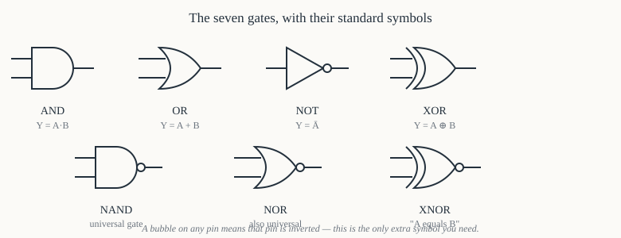
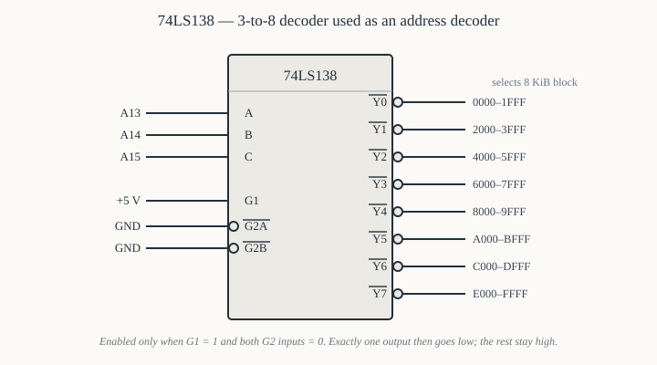
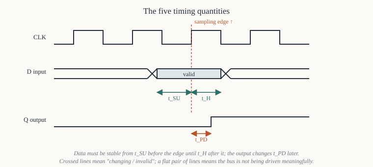

# Chapter 3 — Digital logic recap

[← Number systems](02-number-systems.md) · [Contents](README.md) · [Next: What a processor actually does →](04-what-a-cpu-does.md)

---

## Goal

Give you exactly the electronics needed to read the schematics in Part II and build the interfaces in
Part V, and no more. We are not designing circuits; we are learning to *read* them, and to understand
what the 8086's pins are physically doing.

Five things to take away: what a logic gate is, what active-low means, what a latch does and why the
8086 needs one, what a decoder does and why every peripheral needs one, and what tri-state means and
why a bus is impossible without it.

If you have done a digital electronics course, read §4 (active-low), §6 (latches vs flip-flops) and
§8 (tri-state and buses), and skip the rest.

---

## 1. Voltage as logic

A digital circuit represents a bit as a voltage on a wire. In the TTL family that surrounds an
8086 — the 74LS series — the convention is:

| Logic level | Output voltage (driver guarantees) | Input voltage (receiver accepts) |
|-------------|-----------------------------------|----------------------------------|
| **0** (low) | 0 V to 0.4 V | 0 V to 0.8 V |
| **1** (high) | 2.4 V to 5 V | 2.0 V to 5 V |
| forbidden | — | 0.8 V to 2.0 V |

Two points that matter in practice.

**There is a margin.** A driver promises to pull below 0.4 V, but a receiver accepts anything below
0.8 V. The 0.4 V gap is *noise margin*: the signal can be corrupted by that much and still be read
correctly. The same 0.4 V margin exists at the top. Design rules about trace length, decoupling
capacitors and termination all exist to protect that margin.

**The middle band is undefined, not "half".** A wire sitting at 1.5 V is not a half-bit; its value is
whatever the receiver happens to decide, which may differ between two receivers on the same wire and
may change with temperature. Circuits are designed so no wire ever sits there for long. The
*floating* wire of §8 is the main way it happens accidentally, and pull-up resistors are the cure.

---

## 2. The gates

Seven symbols cover everything in this book.



| Gate | Output is 1 when… | Algebra | Truth table (2-input) |
|------|-------------------|---------|----------------------|
| **AND** | all inputs are 1 | `Y = A·B` | 00→0, 01→0, 10→0, 11→1 |
| **OR** | any input is 1 | `Y = A+B` | 00→0, 01→1, 10→1, 11→1 |
| **NOT** | the input is 0 | `Y = Ā` | 0→1, 1→0 |
| **NAND** | *not* all inputs are 1 | `Y = A·B` inverted | 00→1, 01→1, 10→1, 11→0 |
| **NOR** | *no* input is 1 | `Y = A+B` inverted | 00→1, 01→0, 10→0, 11→0 |
| **XOR** | inputs differ | `Y = A⊕B` | 00→0, 01→1, 10→1, 11→0 |
| **XNOR** | inputs are equal | `Y = A⊕B` inverted | 00→1, 01→0, 10→0, 11→1 |

Three of these earn their keep constantly in 8086 work:

**NAND is universal.** Any logic function can be built from NAND gates alone, which is why the 74LS00
(quad 2-input NAND) is the most common chip on any board. A NAND with its inputs tied together is an
inverter.

**XOR is "not equal".** It is how a comparator is built, how a parity generator is built, and how the
8086's `XOR AX, AX` clears a register in two bytes instead of three. It is also a conditional
inverter: `A ⊕ 0 = A`, `A ⊕ 1 = Ā`.

**AND masks, OR sets.** `x AND 0` forces a bit to 0 and `x AND 1` leaves it alone; `x OR 1` forces a
bit to 1 and `x OR 0` leaves it alone. Every bit-manipulation idiom in Chapter 25 is that pair of
sentences.

### 2.1 De Morgan's theorems

Two identities that let you redraw a circuit without changing it, and that explain why the same chip
appears with two different symbols in real schematics:

```
  NOT(A AND B)  =  (NOT A) OR  (NOT B)
  NOT(A OR  B)  =  (NOT A) AND (NOT B)
```

In symbols: a NAND gate is identical to an OR gate with both inputs inverted. Designers draw whichever
version makes the *active levels* read naturally — which is §4's subject. When you see an OR gate with
bubbles on its inputs, it is a NAND, and it is drawn that way because the inputs are active-low.

---

## 3. Combinational vs sequential

**Combinational** logic's output depends only on its inputs right now. Gates, decoders, multiplexers,
adders. Give it the same inputs and you get the same output, always.

**Sequential** logic's output depends on inputs *and on stored state*. Latches, flip-flops, registers,
counters, the whole of a CPU. It has memory, and therefore it has a notion of *before* and *after*,
and therefore it needs a clock.

The 8086 is sequential. The glue chips around it are mostly combinational (decoders, buffers) with a
few sequential ones (address latches).

---

## 4. Active-low, and how to read a signal name

Half the signals in an 8086 system are **active-low**: the action happens when the wire is at 0 V,
not 5 V.

Notation, all meaning the same thing:

```
  ‾R‾D‾        overbar        (datasheets, our figures)
  RD#          hash suffix    (this book's prose, and Intel's modern docs)
  /RD          slash prefix   (older texts)
  nRD          n prefix       (ARM-world convention)
  RD_L , RD_n  suffix         (HDL source)
```

Why active-low is so common has a real cause: TTL outputs can *sink* considerably more current than
they can *source*. A 74LS output pulling low can hold 8 mA; pulling high it manages 0.4 mA. So the
"strong" state is low, and designers assign the state that must be strong — the asserted one — to low.

### 4.1 Reading it correctly

`RD#` asserted means `RD# = 0` means "a read is happening".
`RD#` deasserted means `RD# = 1` means "no read is happening".

The words **asserted** and **active** mean "doing its thing", regardless of voltage. Get in the habit
of saying "`WR#` is asserted" rather than "`WR#` is high/low"; the former is unambiguous and the
latter requires the listener to remember the polarity.

### 4.2 Why it matters immediately

The 8086's memory read control is `RD#`, and a typical SRAM's read enable is `OE#`. Both active-low,
so they connect directly. But the 8086's `M/IO#` pin is *high* for memory and *low* for I/O — a pin
with two active levels, named with a slash to show it. Wiring it to a chip select that expects
active-low memory access requires an inverter, and forgetting that inverter is the classic first
mistake in Chapter 16.

---

## 5. Decoders

A decoder takes an *n*-bit binary input and asserts exactly one of its 2ⁿ outputs.

The 74LS138 — a 3-to-8 decoder — is the chip you will use most in this book.



```
Inputs:  C B A      three address bits (C is most significant)
         G1         active-HIGH enable
         G2A# G2B#  two active-LOW enables
Outputs: Y0#..Y7#   eight active-LOW outputs
```

The chip is enabled only when `G1 = 1` **and** `G2A# = 0` **and** `G2B# = 0`. When enabled, the
output selected by `CBA` goes low and the other seven stay high. When not enabled, **all** outputs
stay high.

| G1 | G2A# | G2B# | C | B | A | Asserted output |
|----|------|------|---|---|---|-----------------|
| 0 | × | × | × | × | × | none |
| × | 1 | × | × | × | × | none |
| 1 | 0 | 0 | 0 | 0 | 0 | `Y0#` |
| 1 | 0 | 0 | 0 | 0 | 1 | `Y1#` |
| 1 | 0 | 0 | 0 | 1 | 0 | `Y2#` |
| 1 | 0 | 0 | 1 | 1 | 1 | `Y7#` |

### 5.1 Why a CPU needs this

The 8086 puts a 20-bit address on the bus. Several memory and I/O chips share that bus. Each must
respond only to its own range of addresses, and must stay silent otherwise. The job of "turn this
address range into one chip-select signal" is address decoding, and the 74LS138 does it eight ranges
at a time.

A concrete example, fully worked in Chapter 16: feed `A15 A14 A13` into `CBA`, tie `G1` high and both
`G2` inputs low. Then `Y0#` asserts for addresses `0x0000`–`0x1FFF`, `Y1#` for `0x2000`–`0x3FFF`, and
so on in 8 KiB steps. Wire `Y0#` to a RAM's `CS#` and that RAM occupies the first 8 KiB.

### 5.2 Partial decoding and aliasing

If you decode only some address lines — say you ignore `A19`–`A16` — then the chip responds to
*every* address whose lower bits match, no matter what the upper bits are. The chip appears at many
addresses at once. That is **aliasing**, and it is not necessarily a bug: it saves a chip, and it is
exactly what small systems do deliberately. It becomes a bug when you later add a second device in a
range you thought was free. Chapter 17 §5 works an aliasing example and shows how to detect it from
software.

---

## 6. Latches and flip-flops

Both store a bit. The difference is *when* they capture it, and confusing them causes real bugs.

**A latch is level-triggered.** While its enable input is asserted, the output follows the input
("transparent"). When the enable deasserts, the output holds the last value.

**A flip-flop is edge-triggered.** It samples the input at the instant of a clock edge and holds it
until the next edge. It is never transparent.

```
       D  ──┐                          D  ──┐
            │  latch                        │  flip-flop
      EN ───┤  Q follows D while EN=1  CLK ─┤▷ Q takes D only at the ↑ edge
            │  Q holds when EN=0            │
       Q  ──┘                          Q  ──┘
```

### 6.1 The 74LS373 and why the 8086 cannot work without it

The 8086 has 40 pins and needs 36 for address plus data (§1 of Chapter 0). Intel's answer was to
**multiplex**: pins `AD15`–`AD0` carry address bits `A15`–`A0` during the first clock of a bus cycle,
then switch to carrying data `D15`–`D0` for the rest of it.

That works for the CPU, but memory needs the address to stay stable for the whole cycle. So the
address must be *captured* the moment it is valid and held. That is a latch's job.

The **74LS373** is an octal transparent latch with tri-state outputs. Three of them (24 bits, of which
we use 20 plus `BHE#`) sit next to every 8086.

```
   8086                       74LS373                    memory
   AD0..AD7  ──────────────>  D0..D7      Q0..Q7  ────>  A0..A7
   ALE       ──────────────>  LE (G)
   GND       ──────────────>  OE#
```

`ALE` — Address Latch Enable — is an 8086 output that pulses high during T1, exactly while the address
is valid on the multiplexed pins. The latch is transparent during that pulse and holds afterwards, so
the address stays presented to memory for the whole bus cycle even after the CPU has reused those pins
for data.

This is the single most important piece of glue logic in an 8086 system, and Chapter 13 shows its
timing against the bus cycle. If you understand `ALE` and the 373, you understand why the 8086's
external interface looks the way it does.

### 6.2 A register is just flip-flops side by side

Eight D flip-flops sharing one clock is an 8-bit register. The 8086's `AX` is sixteen of them (plus
the logic that lets `AH` and `AL` be written separately). Nothing more mysterious than that.

---

## 7. Buffers and drivers

A **buffer** passes its input to its output unchanged. Pointless logically; essential electrically.

**Fan-out.** A 74LS output can drive about 20 LS inputs. A bus with more loads than that needs a
buffer to restore drive strength. The 8086 itself can drive one TTL load and about 100 pF — almost
nothing — which is why a real system buffers every bus line.

**Direction control.** A bidirectional buffer (a *transceiver*, e.g. the 74LS245 / Intel 8286) can
pass signals either way, chosen by a direction pin. The data bus needs this because data flows into
the CPU on a read and out of it on a write. The 8086 provides `DT/R#` (Data Transmit/Receive) exactly
to drive it, and `DEN#` (Data Enable) to switch it on only during the data phase.

```
   8086                      74LS245
   AD0..AD7  <────────────>  A0..A7      B0..B7 <──────> memory data bus
   DT/R#     ────────────>   DIR          (1 = A to B = CPU writing)
   DEN#      ────────────>   OE#          (0 = enabled)
```

---

## 8. Tri-state, and why a bus is possible at all

An ordinary gate output is always driving — either pulling to 5 V or to 0 V. Connect two such outputs
together with one high and one low and you have a short circuit from supply to ground through two
transistors. Chips die this way.

But a bus is *by definition* a set of wires with many devices attached. Memory must be able to put
data on `D0`–`D15`; so must the CPU; so must every peripheral. They cannot all drive at once.

The solution is a third output state: **high impedance**, written `Hi-Z` or `Z`. A tri-state output
can be 0, 1, or *disconnected* — electrically absent, as if the wire were cut.

```
  OE#=0 :  output drives 0 or 1   (enabled)
  OE#=1 :  output is Hi-Z         (floating, contributing nothing)
```

**The bus discipline is: exactly one driver at a time.** Every device's output enable is derived from
the address decoder and the read/write controls, so at most one is ever enabled. When two are enabled
simultaneously — because of a decoding mistake — the result is *bus contention*: excessive current,
corrupted data, and chips that run hot and eventually fail.

The 8086 itself tri-states its `AD` pins whenever it is not using the bus, which is what makes DMA
(Chapter 51) possible: the DMA controller asks via `HOLD`, the 8086 floats all its bus pins and
acknowledges with `HLDA`, and the DMA controller drives the bus instead.

### 8.1 Floating inputs and pull-ups

A tri-stated wire with nothing driving it *floats* — it drifts into the forbidden band of §1 and is
read unpredictably. Where a wire might have no driver, a **pull-up resistor** (typically 4.7 kΩ to
5 V) gently holds it high. This is why `READY`, `HOLD`, `NMI` and the interrupt request lines in a
real design have pull-ups or pull-downs: an unconnected input is not "0", it is noise.

---

## 9. Timing vocabulary

The waveforms in Chapter 13 use five terms. Learn them here, where there is no other complexity.



**Propagation delay (t<sub>PD</sub>).** Time from an input change to the resulting output change.
A 74LS138 takes about 20 ns. Delays add up along a path, and the sum must fit inside one bus cycle;
that is the whole of timing analysis.

**Setup time (t<sub>SU</sub>).** How long a data input must be stable *before* a clock or latch edge
for the device to capture it reliably.

**Hold time (t<sub>H</sub>).** How long it must remain stable *after* the edge.

**Access time (t<sub>ACC</sub>).** For a memory, the delay from a valid address to valid data out. A
150 ns EPROM takes 150 ns. Whether that is fast enough is the calculation in Chapter 16 §6, and when
it is not, you insert **wait states** (Chapter 13 §7).

**Rise and fall time.** How long a signal takes to cross between levels. Non-zero, and the reason a
5 MHz clock needs care about ringing on long traces.

Conventional waveform notation, used throughout Part II:

```
        ┌─────┐              a signal that goes high then low
 ───────┘     └───────

 ───────┐     ┌───────       active-low signal asserted in the middle
        └─────┘

 ──────<XXXXXXX>───────      a bus: shaded/crossed = value changing or invalid
 ──────<  DATA >───────      the angled edges mark where it becomes valid

 ───────ZZZZZZZ────────      high impedance (floating)
```

---

## 10. The chips you will actually meet

A short glossary of part numbers, so a schematic is not alphabet soup.

| Part | Function | Where it appears |
|------|----------|------------------|
| 74LS00 | quad 2-input NAND | glue, everywhere |
| 74LS04 | hex inverter | polarity fixes |
| 74LS08 / 74LS32 | quad AND / quad OR | combining decoder outputs |
| 74LS138 | 3-to-8 decoder | address decoding (Ch 16, 17) |
| 74LS139 | dual 2-to-4 decoder | bank selection (Ch 10) |
| 74LS245 | octal bus transceiver | data bus buffering (Ch 14) |
| 74LS373 | octal transparent latch | address demultiplexing (Ch 14) |
| 74LS374 | octal D flip-flop | output ports |
| 8282 / 8283 | Intel's octal latch (non-inv / inv) | the 373's Intel-branded equivalent |
| 8286 / 8287 | Intel's octal transceiver | the 245's equivalent |
| 8284A | clock generator | Ch 12 |
| 8288 | bus controller | Ch 15 |
| 8259A | interrupt controller | Ch 49 |
| 8255A | parallel I/O | Ch 47 |
| 8253/8254 | timer | Ch 48 |
| 8251A | serial | Ch 50 |
| 8237A | DMA | Ch 51 |
| 2764 / 27256 | 8 K / 32 K EPROM | Ch 16 |
| 6116 / 6264 | 2 K / 8 K SRAM | Ch 16 |

Intel's 82xx parts and the equivalent 74LS parts are interchangeable in most designs; Intel's are
specified against the 8086's timing, which is why textbooks use them.

---

## 11. Reading a schematic

Four conventions, and then you can read every figure in this book.

**Power and ground are usually implicit.** A 74LS138 has `VCC` on pin 16 and `GND` on pin 8. The
schematic will not draw them. Assume every chip is powered.

**A bus is drawn as one thick line with a slash and a number.** `/8` means eight wires. Individual
signals join it with a label; `A0` leaving a bus and `A0` entering a chip are the same wire even
though no line connects them on the page.

**Named nets connect without a drawn wire.** If two pins are both labelled `ALE`, they are connected.
This is how large schematics stay readable.

**A bubble means inverted.** A bubble on a chip pin means that pin is active-low. A bubble on a gate
output means the gate's function is inverted (AND + bubble = NAND).

---

## 12. What you need from this chapter, in six lines

1. Signals are 0 or 1; active-low signals *act* when they are 0, and are written `RD#`.
2. `ALE` + a 74LS373 latch turn the 8086's multiplexed `AD` pins back into a stable address bus.
3. A 74LS138 turns address bits into chip-select signals; that is address decoding.
4. Tri-state outputs let many devices share one bus; exactly one may drive at a time.
5. A transceiver (74LS245) buffers the data bus, with direction from `DT/R#` and enable from `DEN#`.
6. Timing analysis is adding propagation delays along a path and checking the total fits.

---

## Exercises

**3.1** Draw the truth table for a 3-input NAND gate. How many of the eight rows have output 0?

**3.2** Using De Morgan, redraw `NOT(A) AND NOT(B)` as a single standard gate.

**3.3** A 74LS138 has `A15`, `A14`, `A13` on its `C`, `B`, `A` inputs (C = A15), `G1` tied high and
both `G2` inputs tied low. Which address range asserts `Y5#`?

**3.4** In the same circuit, address lines `A19`–`A16` are not connected to anything. Give three
different addresses that all assert `Y5#`.

**3.5** Explain in one sentence why the 8086 needs `ALE`, and state what would go wrong if the latch
were omitted and `AD0`–`AD15` were wired straight to memory.

**3.6** A 74LS245 has `DIR` connected to `DT/R#` and `OE#` connected to `DEN#`. During a memory
*read*, what logic levels does the 8086 put on those two pins, and which way does data flow through
the transceiver?

**3.7** What is the difference between a latch and a flip-flop? Which one is a 74LS373, and why is
that the right choice for address demultiplexing?

**3.8** Two memory chips are accidentally decoded so that both respond to address `0x8000`. Describe
what happens electrically during a read from that address.

**3.9** A memory chip has an access time of 250 ns. The 8086 runs at 5 MHz and a bus cycle is four
clock periods, of which about 3 periods are available for the memory to respond. Is the chip fast
enough? Show the arithmetic.

**3.10** Why do unused inputs on a TTL chip need to be tied high or low rather than left
unconnected?

Answers in [Appendix H](H-exercise-solutions.md#chapter-3).

---

[← Number systems](02-number-systems.md) · [Contents](README.md) · [Next: What a processor actually does →](04-what-a-cpu-does.md)
