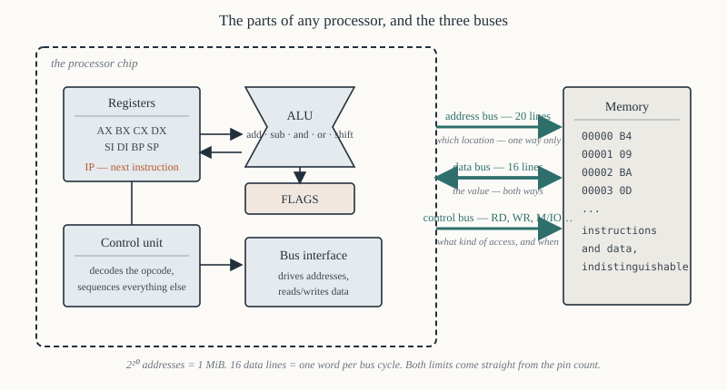

# Chapter 4 — What a processor actually does

[← Digital logic recap](03-digital-logic-recap.md) · [Contents](README.md) · [Next: The family →](05-family-history.md)

---

## Goal

Build the fetch–decode–execute cycle from nothing, on a machine simple enough to trace on paper, and
then show precisely which parts of the 8086 correspond to which parts of it. By the end you should be
able to answer: *what is the processor doing, right now, between two of my instructions?*

This is the last chapter of Part I. From Chapter 5 onward everything is specifically about the 8086.

---

## 1. The stored-program idea

A processor is a machine that repeats one loop forever:

```
    fetch the next instruction from memory
    figure out what it says
    do it
    repeat
```

That is it. Everything else — pipelining, interrupts, segmentation, the whole instruction set — is
refinement of those four lines.

The idea that makes it powerful is that **instructions live in the same memory as data**. This is the
*stored-program* or von Neumann architecture, and it has one consequence you will exploit and one you
will trip over.

*Exploit:* a program can compute an address and read from it, so it can process arrays, follow
pointers, and load other programs. A loader is just a program that writes bytes into memory and then
jumps to them.

*Trip over:* the processor cannot tell instructions from data. If `IP` ends up pointing at your string
table, the 8086 will happily execute `'H','e','l','l','o'` as machine code (`0x48` is `DEC AX`,
`0x65` is a segment prefix…) and the result will be nonsense, or a crash, or — worst — silent
corruption. Chapter 27 §8 shows how a mis-typed jump does exactly this.

The alternative, *Harvard* architecture, gives instructions and data separate memories and separate
buses. Microcontrollers often use it. The 8086 does not.

---

## 2. The parts of a processor



Five components, and a handful of wires.

### 2.1 Registers

A small number of very fast storage locations *inside* the chip. Fast because there is no bus cycle:
reading a register costs no external time at all, while reading memory costs four clock periods
minimum.

One register is special: the **program counter**, which holds the address of the next instruction. On
the 8086 it is called `IP` — the Instruction Pointer — and it is not directly readable or writable by
ordinary instructions, only by jumps, calls and returns.

### 2.2 The Arithmetic and Logic Unit

A block of combinational logic that takes two inputs and a function selector and produces a result
plus status bits. Add, subtract, AND, OR, XOR, shift. It has no memory; it is pure gates — an adder
built exactly as Chapter 2 §4 describes, plus multiplexers to pick which operation's output to keep.

The status bits it produces — carry out, zero, sign, parity, overflow — are captured in the **flags
register**, and Chapter 8 covers every one.

### 2.3 The control unit

The part that reads the instruction and asserts the right control signals in the right order: "put
`BX` on the internal bus, latch it into the ALU's A input, put the memory data on the B input, select
ADD, capture the output into `AX`, update the flags." On the 8086 this is a small microcode ROM; on
simpler chips it is a hardwired state machine.

The control unit is the part that "understands" instructions. Everything else is plumbing.

### 2.4 The bus interface

The logic that talks to the outside world: puts addresses on the address bus, asserts `RD#` or `WR#`,
reads or drives the data bus, waits for `READY`. On the 8086 this is a distinct unit — the **Bus
Interface Unit** — and giving it a life of its own is the 8086's main architectural trick (Chapter 6).

### 2.5 Memory (outside the chip)

Addressable bytes. The processor sends an address and a read/write indication; memory returns or
accepts a byte or word. It is passive: it never initiates anything.

---

## 3. The three buses

Everything between the CPU and everything else travels on three groups of wires.

| Bus | Width on 8086 | Direction | Carries |
|-----|---------------|-----------|---------|
| **Address** | 20 lines, `A19`–`A0` | CPU → memory/IO (output only) | *which* location |
| **Data** | 16 lines, `D15`–`D0` | bidirectional | the value being moved |
| **Control** | ~10 lines | mostly CPU → out | *what kind* of access, and when |

The width of each determines a fundamental limit:

- **Address bus width sets the address space.** 20 lines → 2²⁰ = 1,048,576 distinct addresses =
  1 MiB. This is why the 8086 can address exactly 1 MiB and not a byte more, and it is the constraint
  that forces segmentation in Chapter 9.
- **Data bus width sets the transfer size.** 16 lines → one word per bus cycle. The 8088 has 8, so it
  needs two cycles for a word (Chapter 18).
- **Control bus says what is happening.** `RD#`, `WR#`, `M/IO#`, `ALE`, `DT/R#`, `DEN#`, `INTA#` and
  the rest. Without it the memory would not know whether the address on the bus is a read, a write, or
  meaningless.

On the 8086 the address and data buses **share pins** — `AD15`–`AD0` carry both at different times —
so what reaches the rest of the board is a *demultiplexed* address bus produced by the latches of
Chapter 3 §6.1. Logically there are still three buses; physically there are fewer wires leaving the
chip than that implies.

---

## 4. A processor you can trace by hand

To make the cycle concrete, here is a deliberately tiny machine — not the 8086, just an illustration.
It has:

- one 8-bit accumulator, `A`
- one 8-bit program counter, `PC`
- 16 bytes of memory, addresses `0`–`15`
- four instructions:

| Opcode | Mnemonic | Meaning |
|--------|----------|---------|
| `1n` | `LOAD n` | `A ← memory[n]` |
| `2n` | `ADD n` | `A ← A + memory[n]` |
| `3n` | `STORE n` | `memory[n] ← A` |
| `4n` | `JMP n` | `PC ← n` |
| `00` | `HALT` | stop |

One byte per instruction: high nibble is the opcode, low nibble is the address.

### 4.1 A program

Add the numbers at addresses 13 and 14, store the answer at 15, stop.

```
addr   byte   meaning
  0     1D     LOAD 13
  1     2E     ADD 14
  2     3F     STORE 15
  3     00     HALT
 ...
 13     07     data: 7
 14     05     data: 5
 15     00     result goes here
```

### 4.2 Tracing it

Start with `PC = 0`, `A` = undefined.

**Instruction 1**

| Phase | What happens | State after |
|-------|--------------|-------------|
| Fetch | address bus ← `PC` (0); read; data bus returns `1D`; `PC ← PC+1` | `PC=1`, IR=`1D` |
| Decode | high nibble `1` = LOAD; low nibble `D` = 13 | — |
| Execute | address bus ← 13; read; data bus returns `07`; `A ← 07` | `A=07` |

**Instruction 2**

| Phase | What happens | State after |
|-------|--------------|-------------|
| Fetch | address bus ← 1; read → `2E`; `PC ← 2` | `PC=2`, IR=`2E` |
| Decode | `2` = ADD, operand 14 | — |
| Execute | read memory[14] = `05`; ALU computes `07 + 05`; `A ← 0C` | `A=0C` |

**Instruction 3**

| Phase | What happens | State after |
|-------|--------------|-------------|
| Fetch | read memory[2] = `3F`; `PC ← 3` | `PC=3` |
| Decode | `3` = STORE, operand 15 | — |
| Execute | address bus ← 15, data bus ← `0C`, assert write | memory[15] = `0C` |

**Instruction 4**

| Phase | What happens | State after |
|-------|--------------|-------------|
| Fetch | read memory[3] = `00`; `PC ← 4` | `PC=4` |
| Decode | `00` = HALT | — |
| Execute | stop clocking the sequencer | halted |

Four things to notice, all of which carry straight over to the 8086:

**The PC increments during fetch, not after execute.** By the time the instruction executes, `PC`
already points past it. That is why a jump can simply overwrite `PC`, and — importantly for
Chapter 27 — why a *relative* jump's displacement is measured from the address of the **next**
instruction, not from the jump itself.

**Fetch and execute both use the bus.** They cannot happen at the same instant on a single-bus
machine. Instruction 2 above needed two bus cycles: one to fetch `2E`, one to read memory[14]. The
8086's answer to this bottleneck is the instruction queue (Chapter 6), which overlaps them.

**Decode is free.** It is combinational logic looking at the opcode bits. It costs propagation delay,
not bus cycles. That is why the 8086's instruction *encoding* (Chapter 20) is designed so the first
byte tells the decoder how many more bytes to expect.

**The data and the code are the same memory.** Nothing stops us writing `STORE 2` and modifying the
program while it runs. Early programs did this routinely — it was the only way to do indexed
addressing on machines without index registers.

---

## 5. Where the 8086 differs from that toy

Seven ways, each pointing at a later chapter.

**1. Instructions are 1 to 6 bytes, not 1.** The opcode is one byte (sometimes with a prefix before
it); it may be followed by a ModR/M byte, up to two displacement bytes and up to two immediate bytes.
The decoder must fetch, examine, and fetch more. → Chapter 20.

**2. There are fourteen registers, not one.** Which means the instruction must *encode which
register*, which is what ModR/M is for. → Chapters 7, 20.

**3. Operands can come from many places.** Register, immediate, memory at a constant address, memory
at `[BX]`, memory at `[BX+SI+8]`… These are the addressing modes, and computing the address is a step
of its own — the *effective address* calculation, which costs real clock cycles. → Chapters 19, 32.

**4. Addresses are 20 bits but registers are 16.** So every memory reference combines a segment
register and an offset. → Chapter 9.

**5. Fetch and execute overlap.** The Bus Interface Unit fetches ahead into a six-byte queue while the
Execution Unit works on an earlier instruction. Our toy's strict fetch-then-execute is replaced by two
loosely coupled loops. → Chapter 6.

**6. Execution can be interrupted.** Between any two instructions, an external signal can divert the
processor to a handler and back. Our toy has no such thing. → Chapter 31.

**7. There is a stack.** `SP` and `SS` define a region used automatically by `CALL`, `RET`, `PUSH`,
`POP` and interrupts. → Chapter 28.

---

## 6. A real 8086 instruction, traced the same way

Take a single instruction:

```asm
        add  ax, [bx+si+4]
```

It assembles to three bytes: `03 40 04`. Here is everything the processor does, in order. Don't try
to absorb the details — the point is to see the *shape*, and every step is a forward reference.

**Fetch.** The BIU has probably already fetched these bytes into the queue, during earlier
instructions. If not, it performs a bus cycle: physical address = `CS × 16 + IP`, `ALE` pulses, the
address is latched, `RD#` asserts, two bytes arrive. → Chapters 6, 13.

**Decode.** `03` is "ADD r16, r/m16" — register destination, 16-bit, memory or register source. The
decoder knows a ModR/M byte follows. → Chapter 20.

**ModR/M.** `40` = `01 000 000`: `mod=01` (memory, 8-bit displacement follows), `reg=000` (`AX`),
`r/m=000` (`[BX+SI]`). So the destination is `AX` and the source is memory at `[BX+SI+disp8]`. →
Chapter 20 §4.

**Displacement.** The next byte `04` is the 8-bit displacement, sign-extended to 16 bits → `+4`.

**Effective address.** `EA = BX + SI + 4`, computed in the EU. This takes **11 clock periods** on an
8086 — base plus index plus displacement is among the most expensive addressing modes there is, and
the `BP+SI` / `BX+DI` pairings cost 12. → Chapter 19 §7.

**Physical address.** `[BX+SI+4]` defaults to the data segment, so
`physical = DS × 16 + EA`. → Chapter 9 §3.

**Operand fetch.** A bus cycle reads a word from that physical address. If the address is odd, the
8086 needs *two* bus cycles instead of one. → Chapter 10 §4.

**Execute.** The ALU adds the fetched word to `AX`.

**Flags.** `CF`, `PF`, `AF`, `ZF`, `SF`, `OF` are all updated from the result. → Chapter 8.

**Writeback.** The sum goes into `AX`.

**`IP` advance.** `IP` was incremented by 3 as the bytes left the queue.

Total on a real 8086: 9 clocks for the ADD itself plus 11 for the effective address — 20 — plus, if
the operand happened to be at an odd address, 4 more for the extra bus cycle. Chapter 32 does this
arithmetic properly.

---

## 7. Machine cycles, instruction cycles, and T-states

Three words that are easy to confuse and that examiners love.

**T-state.** One clock period. At 5 MHz, 200 ns. The smallest unit of time the processor has.

**Machine cycle (bus cycle).** One complete transaction on the bus: a memory read, a memory write, an
I/O read, an I/O write, or an interrupt acknowledge. On the 8086 a bus cycle is **four T-states**,
named T1, T2, T3 and T4, plus any wait states (`Tw`) inserted between T3 and T4. → Chapter 13.

**Instruction cycle.** The total time to complete one instruction: possibly several machine cycles,
plus internal T-states during which no bus activity happens at all.

```
 instruction cycle ─────────────────────────────────────────────────►
 ┌──────────────┬──────────────┬────────────────────────────────┐
 │ machine cycle│ machine cycle│   internal execution (no bus)  │
 │ (fetch)      │ (operand rd) │                                │
 │ T1 T2 T3 T4  │ T1 T2 T3 T4  │   T  T  T  T  T                │
 └──────────────┴──────────────┴────────────────────────────────┘
```

The ratio matters: `ADD AX, BX` (register to register) needs **3 clocks and no bus cycle at all**,
because both operands are already inside the chip. `ADD AX, [BX+SI+4]` needs 9 + 11 = 20 clocks *and*
a bus cycle. Same operation; nearly seven times the cost. Almost all hand optimisation of 8086 code
is moving work out of memory and into registers, and Chapter 32 gives the numbers to justify it.

---

## 8. What "executing" a program means, end to end

Put the pieces together for a real program on a real DOS machine. When you type `first.com`:

1. `COMMAND.COM` calls DOS's EXEC function, which finds the file.
2. DOS allocates memory, builds a **Program Segment Prefix** — a 256-byte control block — and loads
   the file's bytes at offset `0x100` in that block. (Chapter 35.)
3. DOS sets `CS`, `DS`, `ES` and `SS` all to the PSP's segment, sets `SP` to the top of the segment,
   pushes a return address, and jumps to `CS:0100`.
4. The 8086's BIU computes `CS × 16 + 0x100`, starts fetching, and fills the queue.
5. The EU takes bytes from the queue and the loop of §1 begins.
6. `int 0x21` transfers control, via the interrupt vector table at physical address `0x00084`
   (= 4 × 0x21), to DOS's handler. (Chapter 31.)
7. Eventually `mov ah, 0x4C` / `int 0x21` asks DOS to terminate; DOS frees the memory and returns to
   `COMMAND.COM`.

Every one of those steps is unpacked in a later chapter. This is the skeleton they hang on.

---

## 9. Von Neumann's bottleneck, and the 8086's answer

The single memory that makes stored programs possible also makes them slow: instructions and data
compete for the same bus. A processor that spends four clocks fetching an instruction and four more
fetching its operand is idle inside for most of both.

Three historical answers:

**Prefetch queue.** Fetch instructions during the clocks when the bus would otherwise be idle, and
keep them in an internal FIFO. The 8086 has a six-byte queue; the 8088, a four-byte one. This is the
8086's answer and it is the subject of Chapter 6. It gives roughly a 20–30% speedup on typical code
and *nothing at all* on code that jumps constantly, because every jump throws the queue away.

**Cache.** Keep recently used memory in fast on-chip storage. The 8086 has none; the 80486 was the
first x86 with one on-chip.

**Separate buses.** Harvard architecture. Not used here.

The reason to know this now: it explains the one performance rule of 8086 programming that is not
obvious from instruction timings. **A taken jump costs more than its clock count suggests**, because
it flushes the queue and the next instruction must be fetched from cold. Chapter 32 §6 quantifies it.

---

## 10. Summary

```
  fetch   : read the instruction bytes at CS:IP, advance IP
  decode  : work out the operation, the operands and the length
  execute : compute the effective address, read operands, run the ALU,
            update the flags, write the result back
  repeat  : unless an interrupt intervenes

  address bus width  -> size of address space   (20 bits -> 1 MiB)
  data bus width     -> transfer size           (16 bits -> one word per cycle)
  control bus        -> what kind of access, and when

  T-state        = 1 clock period          (200 ns at 5 MHz)
  machine cycle  = 4 T-states + waits      (one bus transaction)
  instruction cycle = however many of those it takes
```

---

## Exercises

**4.1** In the toy machine of §4, write a program that computes `memory[13] + memory[14] +
memory[15]` and stores the result at `memory[12]`. Give the bytes and their addresses.

**4.2** The toy machine's `JMP n` sets `PC ← n`. Write a program that loops forever, adding
`memory[14]` to `A` each time. What is the problem with this program as written, and what would the
machine need to make it useful?

**4.3** An 8086 executes `ADD AX, BX`. How many bus cycles does this instruction require, and why?

**4.4** An 8086 executes `ADD AX, [SI]`. How many bus cycles does it require *at minimum*, assuming
the instruction bytes are already in the queue? Assume the address in `SI` is even.

**4.5** A processor has a 24-bit address bus and a 32-bit data bus. What is its address space in
bytes? How many bytes does one bus cycle transfer?

**4.6** Explain, in terms of §1, what happens if a program executes `JMP` to the address of a string
of ASCII text. Why is the failure usually not immediate?

**4.7** At 5 MHz with no wait states, how long does one 8086 machine cycle take? How many machine
cycles per second is that?

**4.8** Give one advantage and one disadvantage of the von Neumann architecture compared with the
Harvard architecture.

**4.9** Why does a taken jump cost more than its published clock count on an 8086, while a
not-taken conditional jump does not?

**4.10** In §4.2's trace, `PC` was 1 while instruction `1D` was executing. If the toy machine had a
relative jump instruction `JR d` meaning "`PC ← PC + d`", and it sat at address 5, what value of `d`
would jump to address 9?

Answers in [Appendix H](H-exercise-solutions.md#chapter-4).

---

[← Digital logic recap](03-digital-logic-recap.md) · [Contents](README.md) · [Next: The family →](05-family-history.md)
