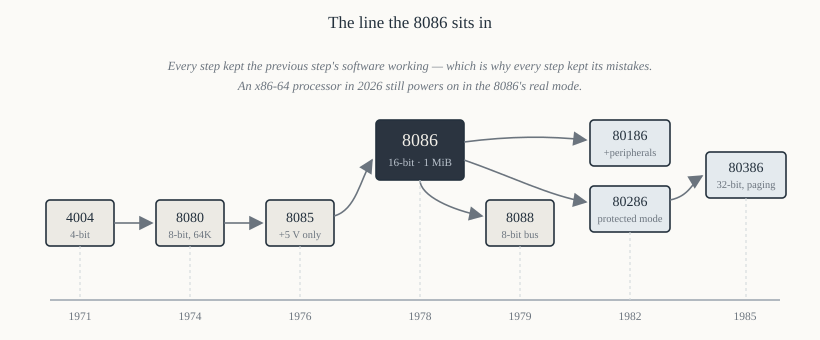

# Chapter 5 — The family

[← What a processor does](04-what-a-cpu-does.md) · [Contents](README.md) · [Next: Architecture: BIU and EU →](06-architecture-biu-eu.md)

---

## Goal

Explain where the 8086 came from, because almost every strange thing about it is an inheritance.
Segmentation, the `AX`/`BX`/`CX`/`DX` names, the `IN`/`OUT` instructions, the `DAA` instruction, the
fact that `AL` is special in a dozen places — none of these were designed from a blank sheet. They
were compromises made to let 8080 programs be translated mechanically into 8086 programs.

Knowing this converts "why is it like that?" into "of course it's like that".

---

## 1. The line



| Year | Part | Bits | Address space | Clock | The one thing it added |
|------|------|------|---------------|-------|------------------------|
| 1971 | **4004** | 4 | 4 KiB program / 1280 B data | 740 kHz | the first microprocessor at all |
| 1972 | **8008** | 8 | 16 KiB | 500 kHz | 8-bit data, a stack (7 levels, on-chip) |
| 1974 | **8080** | 8 | 64 KiB | 2 MHz | a usable general-purpose CPU; CP/M ran on it |
| 1976 | **Z80** (Zilog) | 8 | 64 KiB | 2.5 MHz | 8080-compatible, plus index registers — the competitor that forced Intel's hand |
| 1976 | **8085** | 8 | 64 KiB | 3 MHz | single +5 V supply, on-chip clock, serial I/O |
| 1978 | **8086** | 16 | **1 MiB** | 5–10 MHz | 16-bit registers and ALU, segmentation, prefetch queue |
| 1979 | **8088** | 16 internal / 8 external | 1 MiB | 5–8 MHz | cheaper 8-bit bus — the IBM PC's chip |
| 1982 | **80186/80188** | 16 | 1 MiB | 6–16 MHz | integrated timer, DMA, interrupt controller, chip selects |
| 1982 | **80286** | 16 | 16 MiB physical, 1 GiB virtual | 6–25 MHz | protected mode: descriptors, privilege levels, memory protection |
| 1985 | **80386** | 32 | 4 GiB | 16–40 MHz | 32-bit registers, paging, virtual 8086 mode |

The through-line: every part could run the previous part's software, and every part kept the
previous part's mistakes to do it.

---

## 2. The 8080's ghost

The 8086 was designed under an explicit constraint: it had to be possible to translate 8080 assembly
source into 8086 assembly source **mechanically**, statement by statement, so the CP/M software
library could move to the new chip. Intel shipped a converter, `CONV86`, that did exactly that.

That single requirement explains a great deal.

### 2.1 The register names and their shapes

The 8080 had a 8-bit accumulator `A`, and register pairs `BC`, `DE`, `HL` that could be used as 16-bit
quantities or as six 8-bit registers `B`, `C`, `D`, `E`, `H`, `L`.

The 8086 mirrors the structure exactly:

```
  8080:    A        B C      D E      H L      SP
             ↓        ↓        ↓        ↓        ↓
  8086:   AX(AH:AL) BX(BH:BL) CX(CH:CL) DX(DH:DL) SP
```

That is *why* the 8086 has exactly four general registers, each splittable into a high and low half,
and why `AX` is an accumulator with special short forms. It is not because four is a good number; it
is because the 8080 had those pairs.

The 8080's `HL` was its memory pointer — the pair you put an address in — and the 8086's `BX` inherits
that role: `BX` is the only one of `AX`–`DX` that can be used as a base register in an addressing
mode. `[BX]` is legal; `[AX]` is not, on the 8086. Students find this arbitrary; it is a fossil.

### 2.2 Instructions that exist only for translation

**`DAA`, `DAS`, `AAA`, `AAS`** — decimal adjustment. The 8080 had `DAA` because CP/M-era business
software did decimal arithmetic. Chapter 24 covers them.

**`XLAT`** — table lookup via `AL` and `BX`. A direct descendant of an 8080 idiom.

**`LAHF` / `SAHF`** — load `AH` from flags, store `AH` to flags. These exist *purely* so 8080 code
that pushed and popped the flag byte could be translated. The flag bits they move are in the same
positions the 8080 used, which is why the 8086's flag register has bits 1, 3 and 5 permanently
fixed — they are the 8080's unused flag bits, preserved. Chapter 8 §3.

**`IN` / `OUT` and a separate I/O space.** The 8080 had a 256-port I/O space accessed by dedicated
instructions rather than by memory addresses. The 8086 kept the idea and widened it to 65,536 ports.
Chapter 17 discusses whether it was worth it. (The 68000 did without, and nobody missed it.)

### 2.3 Why this matters to you

When you meet an 8086 instruction that seems arbitrarily restricted — `XLAT` only works on `AL` and
`BX`; `LOOP` only counts in `CX`; string instructions only use `SI` and `DI`; `MUL` always writes
`DX:AX` — the honest explanation is usually "the encoding had no room, and the 8080 did it that way".
The implicit-operand design saved bytes, which mattered enormously when memory cost dollars per
kilobyte.

---

## 3. Why segmentation

The 8086 has 16-bit registers and a 20-bit address bus. Chapter 9 explains the mechanism; this is the
reason.

In 1976, when the 8086 was specified, 64 KiB — what a flat 16-bit address could reach — was clearly
going to be too small within the chip's lifetime, and 16-bit registers were what the transistor budget
allowed. Intel needed more than 16 bits of address from 16-bit registers.

The options were:

**Bank switching** (what 8-bit machines did): a hardware register selects which 64 KiB "bank" is
visible. Crude, and software has to know about it constantly.

**Wider registers** (what the 68000 did two years later with 32-bit registers and a 24-bit bus).
Expensive in 1978 transistors, and it breaks 8080 translation.

**Segmentation**: keep 16-bit registers, but form the address from *two* of them — a segment register
shifted left 4 bits, plus an offset. 16 + 4 = 20.

Intel chose the third. It bought:

- 1 MiB of address space from 16-bit registers;
- programs that are automatically relocatable — a `.COM` program does not care what segment it is
  loaded into, because all its addresses are offsets;
- mechanical 8080 translation, since an 8080 program's 64 KiB world becomes one segment.

And it cost:

- a 64 KiB limit on any single array or code module without segment juggling;
- 4096 different `segment:offset` pairs for every physical address (Chapter 9 §5);
- pointer comparison that is not simply integer comparison;
- twenty years of programmers learning about `near` and `far`.

The 80286 tried to fix the ugliness with descriptors; the 80386 added paging; the x86-64 architecture
finally made segmentation vestigial. But the 8086's version is the one you have to understand to read
anything else, and it is simple — genuinely simple, four lines of arithmetic.

---

## 4. The 8088 and the accident of the IBM PC

The 8088, introduced a year after the 8086, is the same chip internally with an 8-bit external data
bus and a 4-byte queue instead of 6. Every instruction, every register, every flag is identical. It
is simply slower, because a 16-bit transfer needs two bus cycles instead of one.

IBM chose it for the 5150 PC in 1981, for three reasons that had nothing to do with the processor:

1. **8-bit support chips were cheap and available.** A 16-bit bus would have needed two of everything
   or new parts.
2. **Existing 8-bit board designs could be adapted**, shortening the schedule — the PC was built in
   about a year by IBM's standards, which was unheard of.
3. **It looked less threatening to IBM's minicomputer business**, which mattered politically inside
   IBM more than it should have.

The consequence is that the architecture the world standardised on was the *cheap variant of the
compromise chip*. Chapter 18 details the differences.

---

## 5. What the 8086 actually contains

For orientation before Chapter 6 opens it up:

| Quantity | Value |
|----------|-------|
| Transistors | ~29,000 |
| Process | 3 µm HMOS |
| Die size | ~33 mm² |
| Package | 40-pin DIP (ceramic or plastic) |
| Supply | single +5 V ±10% |
| Power | ~1.7 W typical (350 mA) |
| Clock | 5 MHz (8086), 8 MHz (8086-2), 10 MHz (8086-1) |
| Clock duty cycle | 33% — high for one third of the period (Chapter 12) |
| Registers | 8 general (4 splittable), 4 segment, `IP`, `FLAGS` |
| Address space | 1 MiB memory, 64 KiB I/O |
| Instruction queue | 6 bytes |
| Interrupt vectors | 256 |
| Basic instructions | ~117 mnemonics, ~3,800 opcode/operand combinations |

For comparison, the 8085 had 6,500 transistors and the 80386 had 275,000. The 8086 sits at the point
where a chip is complex enough to be interesting and simple enough to be completely understood.

---

## 6. The support chips, and why they exist

A bare 8086 can do nothing. It cannot generate its own clock, cannot hold an address stable, cannot
prioritise interrupts, cannot measure time. Intel sold a matched set:

| Chip | Job | Why the CPU can't do it |
|------|-----|-------------------------|
| **8284A** | clock generator, `RESET` and `READY` synchronisation | needs a crystal oscillator and a 33% duty cycle divider — analogue-ish, and pin-hungry |
| **8282/8283** | address latch | the address pins are multiplexed and must be held |
| **8286/8287** | data transceiver | the CPU can drive only one TTL load |
| **8288** | bus controller (maximum mode) | decodes `S2–S0` into `MEMR#`, `MEMW#`, `IOR#`, `IOW#`, `INTA#` |
| **8289** | bus arbiter | multiple masters on one bus |
| **8259A** | interrupt controller | the CPU has one `INTR` pin and needs eight prioritised sources |
| **8255A** | parallel I/O | the CPU has no general-purpose I/O pins at all |
| **8253/8254** | programmable timer | counting in software wastes the whole CPU |
| **8251A** | USART | serialising bits in software is possible but pointless |
| **8237A** | DMA controller | moving memory→device through the CPU is slow |
| **8087** | numeric coprocessor | the 8086 has no floating point |

Part V builds with most of these. What is worth noticing now is how much of the "computer" is *not*
the processor. The 8086 is one chip in a set of a dozen, and the interesting design work in 1980 was
in the wiring between them.

---

## 7. What came after, briefly

**80186 (1982).** An 8086 core plus the clock generator, two DMA channels, three timers, an interrupt
controller and programmable chip selects, all on one die. Ten new instructions — `PUSHA`, `POPA`,
`ENTER`, `LEAVE`, `BOUND`, `INS`, `OUTS`, immediate `PUSH`, immediate multiply, and shift/rotate by
an immediate count greater than 1. That last one matters: on an 8086, `SHL AX, 4` is illegal; you
must write `MOV CL, 4` / `SHL AX, CL`. If you ever see `shl ax, 4` assemble without complaint, your
assembler is not in 8086 mode. (This is why Chapter 33 tells you to write `CPU 8086`.)

The 80186 never became a PC processor — it made assumptions about peripheral addresses that clashed
with the IBM PC — but it was everywhere in embedded systems.

**80286 (1982).** Real mode identical to an 8086, plus **protected mode**, where a segment register
holds a *selector* into a descriptor table rather than a paragraph address. Descriptors carry a base,
a limit and access rights, so memory can be protected and a segment can be larger or smaller than
64 KiB. Four privilege rings. 24-bit physical address bus → 16 MiB. Famously, it could enter
protected mode but not leave it cleanly, which caused a decade of ingenious workarounds.

**80386 (1985).** 32-bit registers (`EAX` and friends), 32-bit addresses → 4 GiB, **paging** on top of
segmentation, and *virtual 8086 mode*, which lets a protected-mode OS run real-mode DOS programs in a
sandbox. This is the architecture modern x86 is still an extension of. Chapter 55 sketches the path.

---

## 8. Why learn the 8086 rather than the 8085 or the 80386

**Versus the 8085**, which many courses teach first: the 8085 is simpler, but it is a dead end — its
instruction set has no descendants, its 64 KiB space forces tricks that teach nothing general, and it
has no addressing modes worth the name. The 8086 is not much harder and everything you learn
transfers.

**Versus the 80386 or modern x86**: a modern x86 manual is 5,000 pages and describes four operating
modes, three instruction-set extensions you must ignore, and a memory model with both segmentation and
paging. You cannot hold it in your head, and the bus is inaccessible behind caches. The 8086 is the
same ideas at a scale you can finish.

The right sequence, if you have the time, is: 8086 → 80386 protected mode → modern x86-64. Each is the
previous one with a layer added, and the layers are comprehensible individually.

---

## 9. Summary

- The 8086's oddities are inherited from the 8080, because mechanical source translation was a design
  requirement.
- Four general registers splittable into halves, `BX` as the pointer register, implicit operands and
  a separate I/O space are all 8080 fossils.
- Segmentation exists to get 20 address bits out of 16-bit registers, and it buys relocatability at
  the cost of a 64 KiB granule.
- The 8088 is an 8086 with an 8-bit bus; IBM's choice of it for commercial reasons is why x86 became
  the standard.
- A working 8086 system needs a dozen support chips, and Part V is about them.
- The 80186 added ten instructions; the 80286 added protected mode; the 80386 added 32 bits and
  paging. Everything since is a further layer.

---

## Exercises

**5.1** The 8080 had a 64 KiB address space. The 8086 has 1 MiB. By what factor did the address space
grow, and how many extra address lines does that require?

**5.2** Name three 8086 instructions that exist chiefly to make 8080 code translatable, and say what
each one did on the 8080.

**5.3** Why can `[BX]` be used as a memory operand but `[AX]` cannot? Give the historical reason, not
just "the encoding doesn't allow it".

**5.4** Intel could have given the 8086 twenty-bit registers instead of segmentation. Give two
reasons they did not.

**5.5** List three things the 8088 shares with the 8086 and two things that differ.

**5.6** `SHL AX, 4` assembles on an 80186 but not on an 8086. Write the two-instruction 8086
equivalent.

**5.7** Which support chip would you need to (a) prioritise six interrupt sources, (b) hold the
address stable during a bus cycle, (c) generate a 1 kHz square wave, (d) read eight switches?

**5.8** The 80286 introduced protected mode. State, in one sentence each, two things it made possible
that the 8086 cannot do at all.

Answers in [Appendix H](H-exercise-solutions.md#chapter-5).

---

[← What a processor does](04-what-a-cpu-does.md) · [Contents](README.md) · [Next: Architecture: BIU and EU →](06-architecture-biu-eu.md)
