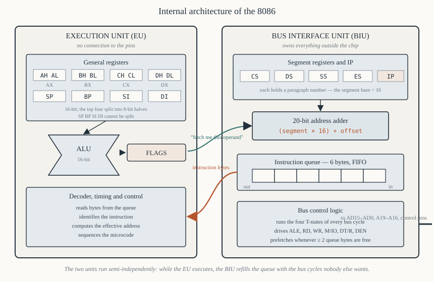

# Chapter 6 — Architecture: the BIU and the EU

[← The family](05-family-history.md) · [Contents](README.md) · [Next: The registers →](07-registers.md)

---

## Goal

Open the chip. The 8086 is divided into two units that run semi-independently, connected by a six-byte
queue. Understanding that division explains the 8086's performance, its instruction timings, why
jumps are expensive, why self-modifying code fails in a specific way, and what `IP` really points at.

This is the chapter the rest of Part II is built on.

---

## 1. The division



The 8086 contains two functional units:

**The Bus Interface Unit (BIU)** owns the outside world. It computes physical addresses, runs bus
cycles, and fetches instruction bytes ahead of time into a queue. It contains the four segment
registers, the instruction pointer, the address adder, and the 6-byte instruction queue.

**The Execution Unit (EU)** owns the computation. It takes instruction bytes from the queue, decodes
them, computes effective addresses, runs the ALU and updates the flags. It contains the eight general
registers, the ALU, the flags register, and the control/timing logic.

The EU **has no connection to the outside world at all**. When it needs to read memory, it asks the
BIU. When the BIU is busy, the EU waits. When the EU is busy computing, the BIU uses the free bus
time to fetch more instructions.

```
       ┌───────────────── E U ─────────────────┐  ┌────────── B I U ──────────┐
       │  AX BX CX DX  SP BP SI DI             │  │  CS DS SS ES   IP         │
       │  ALU                                  │  │  address adder (×16 + off)│
       │  FLAGS                                │  │  bus control logic        │
       │  instruction decoder                  │  │                           │
       │  timing and control                   │  │  ┌─ 6-byte queue ─┐       │
       └───────────────┬───────────────────────┘  └──┴────────────────┴───────┘
                       │        instruction bytes        │
                       └◄───────────────────────────────┘         to the pins ►
```

---

## 2. Why split it

A processor that fetches, then executes, then fetches, then executes is idle on the bus while
executing and idle internally while fetching. Look again at §7 of Chapter 4:

```
 fetch      execute        fetch      execute
 ████████  ░░░░░░░░░░░░░  ████████  ░░░░░░░░░░░░░
 bus busy   bus IDLE       bus busy  bus IDLE
```

The bus — the expensive, slow resource — is idle for most of the time. The 8086's fix is to let the
BIU fetch *during* the shaded periods:

```
 EU:   ░ execute A ░░░░  ░ execute B ░░░░  ░ execute C ░░░░
 BIU:  ████ fetch C ███  ████ fetch D ███  ████ fetch E ███
```

The two units overlap. This is **pipelining** in its simplest two-stage form, and on typical code it
removes most of the instruction-fetch time from the critical path.

The gain is real but bounded. Measurements on period code put it at roughly 20–30% over a
non-prefetching design. It cannot be more, because:

- the EU still has to wait for *operand* reads and writes, which the queue does not help with;
- every jump discards the queue;
- short instructions are consumed faster than the bus can refill.

---

## 3. The instruction queue

Six bytes, first in first out.

```
   ┌────┬────┬────┬────┬────┬────┐
   │ B0 │ B1 │ B2 │ B3 │ B4 │ B5 │
   └────┴────┴────┴────┴────┴────┘
     ▲                          ▲
     EU takes from here    BIU adds here
```

### 3.1 The refill rule

The BIU starts a fetch cycle whenever **at least two bytes** of the queue are empty. Two, not one,
because the 8086 fetches a *word* at a time — it has a 16-bit data bus, so fetching one byte would
waste half of every bus cycle.

(The 8088, with its 8-bit bus, fetches single bytes and refills whenever **one** byte is free. Its
queue is four bytes, because a deeper queue would not help when the bus can only deliver half as
fast. Chapter 18.)

### 3.2 Priority: operands beat prefetch

If the EU needs a memory operand at the same moment the BIU wants to prefetch, **the operand wins**.
Prefetching is opportunistic; it only ever uses bus cycles nobody else wants. This is the right
priority — an EU stalled on an operand is stalled now, whereas a prefetch that is late merely risks a
stall later.

### 3.3 What flushes the queue

Any change to `CS:IP` that is not simple sequential advance:

- a taken conditional jump (`JZ`, `JNE`, …)
- an unconditional jump (`JMP`)
- a `CALL` or `RET`
- an interrupt, `INT`, or `IRET`
- a `LOOP` that loops

When this happens the queue is emptied and the BIU begins fetching from the new address. **The EU
then waits with nothing to do for a full bus cycle at least** — typically 4 clocks, plus the decode.
This is why jump instructions carry two clock counts in Intel's tables:

```
JMP  near        15 clocks
Jcc  (taken)     16 clocks
Jcc  (not taken)  4 clocks
```

Four versus sixteen. A conditional jump that is *not* taken costs almost nothing, because nothing is
discarded. One that is taken costs four times as much. Chapter 32 §6 turns this into an optimisation
rule: **arrange loops so the common case falls through.**

### 3.4 The queue and self-modifying code

If a program writes a new instruction byte into memory at an address the BIU has *already fetched
into the queue*, the 8086 executes the **old** byte. There is no coherency check; the queue is not
invalidated by writes.

```asm
; fragment — does NOT do what it looks like on an 8086
        mov  byte [patch], 0x40     ; write INC AX over the NOP below
patch:  nop                         ; already in the queue -> still executes as NOP
```

Self-modifying code was common in the era, and the rule programmers used was: put at least six bytes
(four on an 8088) of other instructions between the write and the modified location, or force a
queue flush with a jump. This is also why a debugger that patches a breakpoint into code just ahead
of the current `IP` can miss it.

On the 80486 and later, a write to a prefetched address *does* flush the pipeline, so this code
behaves "correctly" on modern hardware — which means DOSBox may not reproduce the 8086 behaviour
either. If you want to see it, you need real silicon.

### 3.5 What `IP` actually contains

Because of the queue, **`IP` points past the last byte the BIU fetched, not at the instruction the EU
is executing.** They can be up to six bytes apart.

This matters in exactly one visible place: there is no instruction that reads `IP` directly, so you
cannot observe the discrepancy from software — *except* through `CALL`, which pushes the address of
the instruction *following* the call, and through interrupts, which push the address of the next
instruction. Those pushed values are the EU's notion of `IP`, adjusted, not the BIU's fetch pointer.
The hardware keeps both and does the bookkeeping.

When a debugger shows you `IP`, it is showing the EU's value — the address of the next instruction to
execute. That is the one you care about.

---

## 4. The BIU in detail

Four jobs.

### 4.1 Physical address generation

The BIU holds `CS`, `DS`, `SS`, `ES` and `IP`, and contains a dedicated 20-bit adder. Every memory
reference is:

```
   physical address  =  (segment register × 16)  +  offset
                     =  (segment register << 4)  +  offset
```

Chapter 9 covers this fully, including which segment register is chosen for which kind of reference.
The important architectural point here is that **the adder is in the BIU, not the EU**, and it is
separate from the ALU. Address arithmetic and data arithmetic happen in different hardware and can
happen at the same time.

### 4.2 Bus cycles

When the EU asks for a memory or I/O operand, or when the queue needs filling, the BIU runs a bus
cycle: four T-states, driving the address, then the data, with `ALE`, `RD#`/`WR#`, `DT/R#`, `DEN#`
and `M/IO#` sequenced appropriately. Chapter 13 walks through every clock edge.

### 4.3 Prefetch

As §3.

### 4.4 Data transfer to and from the EU

The BIU owns a temporary register through which operands pass. The EU never sees the pins.

---

## 5. The EU in detail

### 5.1 The general registers

`AX`, `BX`, `CX`, `DX`, `SP`, `BP`, `SI`, `DI`. Sixteen bits each; the first four splittable into
8-bit halves. Chapter 7 is entirely about them.

### 5.2 The ALU

16 bits wide, performing add, subtract, AND, OR, XOR, NOT, shift, rotate, increment and decrement.
Multiply and divide are done by *microcode* — a sequence of shift-and-add or shift-and-subtract steps
driven by the control unit — which is why `MUL` takes 70–77 clocks and `DIV` up to 162, against 3 for
`ADD`. Chapter 23 §6.

### 5.3 The flags

Nine bits in a 16-bit register: `CF`, `PF`, `AF`, `ZF`, `SF`, `TF`, `IF`, `DF`, `OF`. Chapter 8.

### 5.4 The effective-address calculation

Before the BIU can be asked for a memory operand, the EU must work out the offset from the addressing
mode — `[BX+SI+disp]` and friends. This is EU work and it costs clocks (5 to 12, Chapter 19 §7)
before the bus cycle even starts.

### 5.5 The decoder and control

Reads bytes from the queue, identifies the instruction, and sequences everything above. It is
microcoded: each instruction corresponds to a routine in an on-chip ROM.

---

## 6. A complete trace with the queue visible

Follow six instructions and watch both units. Assume the queue starts empty (as after a jump) and
each bus cycle is 4 clocks with no wait states.

```asm
0100:   mov  ax, 5          ; B8 05 00     3 bytes, 4 clocks
0103:   mov  bx, 3          ; BB 03 00     3 bytes, 4 clocks
0106:   add  ax, bx         ; 01 D8        2 bytes, 3 clocks
0108:   mov  [num], ax      ; A3 20 01     3 bytes, 10 clocks + bus cycle
010B:   inc  cx             ; 41           1 byte,  2 clocks (actually 3 on 8086)
010C:   jmp  start          ; EB F2        2 bytes, 15 clocks
```

| Clock | BIU | Queue contents | EU |
|-------|-----|----------------|-----|
| 1–4 | fetch word at 0100 | `B8 05` | idle (queue empty) |
| 5–8 | fetch word at 0102 | `B8 05 00 BB` | decoding `B8`, takes 3 bytes → `mov ax,5` |
| 9–12 | fetch word at 0104 | `BB 03 00 01` | executing `mov ax,5` |
| 13–16 | fetch word at 0106 | `03 00 01 D8` | `mov bx,3` |
| 17–20 | fetch word at 0108 | `01 D8 A3 20` | `add ax,bx` (3 clocks, no bus) |
| 21–24 | queue nearly full — BIU idle | `A3 20 01 41` | `mov [num],ax` starts; EA = 0120 |
| 25–28 | **write cycle** to `DS:0120` | `41 EB F2` | waiting for the write |
| 29–31 | fetch resumes | `41 EB F2 ..` | `inc cx` |
| 32–46 | — | **flushed** | `jmp start` — queue discarded at clock ~34 |
| 47–50 | fetch word at the jump target | rebuilding | **stalled** |

Three lessons from the table:

1. **At the start the EU is stalled** for a full bus cycle. Every jump reproduces this.
2. **In the middle the BIU goes idle** because the queue is full — the EU is the bottleneck during
   register-only work.
3. **The write cycle at clock 25 delays prefetch**, exactly as §3.2 says.

The overlap is imperfect in both directions, and which unit is the bottleneck depends entirely on the
code. Register-heavy code starves the BIU; memory-heavy code starves the EU.

---

## 7. Consequences you can act on

**Prefer register operands.** `ADD AX, BX` is 3 clocks and no bus traffic. `ADD AX, [BX]` is 9 + 5 =
14 clocks and a bus cycle that also delays prefetch.

**Prefer short instructions in loops.** A 2-byte instruction consumes the queue half as fast as a
4-byte one, so the BIU keeps up more easily.

**Arrange conditional jumps to fall through in the common case.** 4 clocks versus 16.

**Align word data to even addresses.** An odd-addressed word needs two bus cycles instead of one
(Chapter 10 §4). That is 4 extra clocks *and* extra queue pressure.

**Do not expect self-modifying code to work** without flushing.

**Do not try to hand-count cycles on DOSBox.** The emulator does not model the queue. The numbers in
Appendix A are the real chip's.

---

## 8. Compared with the 8088

| | 8086 | 8088 |
|---|------|------|
| External data bus | 16 bits | 8 bits |
| Queue depth | 6 bytes | 4 bytes |
| Refill threshold | 2 bytes free | 1 byte free |
| Bytes per fetch cycle | 2 | 1 |
| Word operand at even address | 1 bus cycle | 2 bus cycles |
| Word operand at odd address | 2 bus cycles | 2 bus cycles |

The 8088's BIU is starved: it can deliver one byte per four clocks, and the EU can consume an
instruction every three. On the 8088 the prefetch queue is usually empty and the processor is almost
always fetch-bound, which is why an 8088 runs typical code around 30–40% slower than an 8086 at the
same clock. Chapter 18.

---

## 9. Summary

```
  BIU:  segment registers, IP, address adder, bus control, 6-byte queue
        -> generates physical addresses, runs bus cycles, prefetches

  EU:   general registers, ALU, flags, decoder, control
        -> computes effective addresses, executes, sets flags
        -> has no external connection; asks the BIU for everything

  Queue: 6 bytes FIFO; refilled when >= 2 bytes free; word-at-a-time
         flushed by any jump, call, return, interrupt or IRET
         not invalidated by writes -> self-modifying code needs care

  Result: fetch and execute overlap; ~20-30% faster than not overlapping;
          taken jumps cost 4x not-taken ones because of the flush
```

---

## Exercises

**6.1** State which unit — BIU or EU — contains each of: `AX`, `CS`, `IP`, the flags, the ALU, the
address adder, the instruction queue, `SP`.

**6.2** The BIU refills the queue when at least two bytes are free. Why two rather than one?

**6.3** A loop body consists of six 2-byte register-only instructions and a conditional jump back.
Will the BIU or the EU be the bottleneck? Explain.

**6.4** `JNZ` is documented as 16 clocks when taken and 4 when not taken. Account for the 12-clock
difference.

**6.5** Explain why the following fragment does not increment `AX` on a real 8086, and give two
different fixes.

```asm
        mov  byte [patch], 0x40
patch:  nop
```

**6.6** The EU needs a memory operand at the same moment the BIU wants to prefetch. Which happens
first, and why is that the right choice?

**6.7** After a `JMP`, the EU is stalled. For how many clocks at minimum, assuming no wait states,
before it can begin decoding the first instruction at the target?

**6.8** An 8088 has a 4-byte queue and fetches one byte per bus cycle. Given that a bus cycle is 4
clocks and a typical instruction is 2.5 bytes and takes about 10 clocks to execute, is the 8088 fetch
bound or execute bound? Show the arithmetic.

**6.9** Why does the 8086 have a *separate* address adder in the BIU rather than using the ALU in the
EU?

**6.10** A debugger sets a breakpoint by writing `0xCC` (`INT 3`) over the first byte of an
instruction. Under what circumstance would that breakpoint fail to trigger on a real 8086?

Answers in [Appendix H](H-exercise-solutions.md#chapter-6).

---

[← The family](05-family-history.md) · [Contents](README.md) · [Next: The registers →](07-registers.md)
