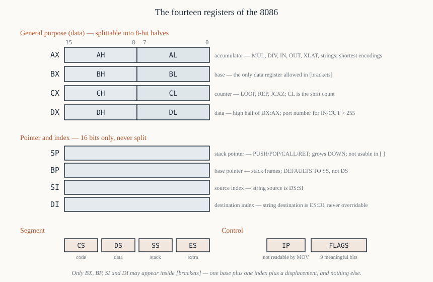

# Chapter 7 — The registers

[← Architecture](06-architecture-biu-eu.md) · [Contents](README.md) · [Next: The FLAGS register →](08-flags.md)

---

## Goal

Cover all fourteen registers: what each holds, which instructions assume it without being told, and —
the part textbooks skip — *which restrictions are real*. The 8086's registers are not
interchangeable. Knowing exactly where they are special is the difference between writing assembly
and fighting it.

---

## 1. The complete set



Fourteen 16-bit registers, in four groups:

```
  GENERAL PURPOSE (data)          POINTER AND INDEX
  ┌────────┬────────┐             ┌─────────────────┐
  │   AH   │   AL   │  AX         │       SP        │  stack pointer
  ├────────┼────────┤             ├─────────────────┤
  │   BH   │   BL   │  BX         │       BP        │  base pointer
  ├────────┼────────┤             ├─────────────────┤
  │   CH   │   CL   │  CX         │       SI        │  source index
  ├────────┼────────┤             ├─────────────────┤
  │   DH   │   DL   │  DX         │       DI        │  destination index
  └────────┴────────┘             └─────────────────┘
   15     8 7      0                15             0

  SEGMENT                          CONTROL
  ┌─────────────────┐             ┌─────────────────┐
  │       CS        │  code       │       IP        │  instruction pointer
  ├─────────────────┤             ├─────────────────┤
  │       DS        │  data       │     FLAGS       │  status and control
  ├─────────────────┤             └─────────────────┘
  │       SS        │  stack
  ├─────────────────┤
  │       ES        │  extra
  └─────────────────┘
```

Two of them cannot be written by ordinary instructions: `IP` (only jumps, calls, returns and
interrupts change it) and `CS` (only far jumps, far calls, far returns and interrupts). Everything
else is freely assignable, with the caveats in §9.

---

## 2. The data registers

All four are 16 bits and split into two independently addressable 8-bit halves. The halves are
*aliases*, not copies:

```asm
        mov  ax, 0x1234         ; AX = 0x1234, so AH = 0x12 and AL = 0x34
        mov  ah, 0xAB           ; AX is now 0xAB34 — writing AH changed AX
        inc  al                 ; AL = 0x35, AX = 0xAB35
```

There is no way to address the halves of `SP`, `BP`, `SI` or `DI` on the 8086. (The 80386 added
`ESI`/`SI` but never an `SIL`; that arrived with x86-64.)

### 2.1 `AX` — the accumulator

The most privileged register. Special in more places than any other:

| Instruction | Why `AX`/`AL` specifically |
|-------------|---------------------------|
| `MUL` / `IMUL` | multiplicand is always `AL` or `AX`; product goes to `AX` or `DX:AX` |
| `DIV` / `IDIV` | dividend is always `AX` or `DX:AX`; quotient to `AL`/`AX`, remainder to `AH`/`DX` |
| `IN` / `OUT` | the only register that can talk to an I/O port |
| `XLAT` | translates `AL` through a table at `[BX]` |
| `LODS` / `STOS` / `SCAS` | the string element always passes through `AL`/`AX` |
| `DAA` `DAS` `AAA` `AAS` `AAM` `AAD` | all operate on `AL` (and `AH` for `AAM`/`AAD`) |
| `CBW` | sign-extends `AL` into `AX` |
| `LAHF` / `SAHF` | move flags through `AH` |

It also has **shorter encodings**. Compare:

```
  05 34 12     add ax, 0x1234      3 bytes   — special accumulator form
  81 C3 34 12  add bx, 0x1234      4 bytes   — general form
```

The accumulator-immediate form of `ADD`, `ADC`, `SUB`, `SBB`, `CMP`, `AND`, `OR`, `XOR` and `TEST` is
one byte shorter. Over a whole program this matters, and it is why hand-written 8086 code keeps its
hot value in `AX`.

Likewise `MOV AX, [addr]` (opcode `A1`, 3 bytes) is shorter than `MOV BX, [addr]` (opcode `8B`, 4
bytes).

### 2.2 `BX` — the base register

`BX` is the only data register usable as a **base** in a memory operand:

```asm
        mov  al, [bx]           ; legal
        mov  al, [bx+si]        ; legal
        mov  al, [bx+di+4]      ; legal
        mov  al, [ax]           ; ILLEGAL — no such addressing mode exists
        mov  al, [cx]           ; ILLEGAL
        mov  al, [dx]           ; ILLEGAL
```

The complete list of registers that may appear inside brackets on an 8086 is **`BX`, `BP`, `SI`,
`DI`** — and only in the combinations Chapter 19 tabulates. This is the single restriction that most
surprises people coming from a modern architecture, and its origin is the 8080's `HL` (Chapter 5
§2.1).

`BX` is also `XLAT`'s table base.

Default segment for `[BX]` is `DS`.

### 2.3 `CX` — the counter

Implicit in every counting construct:

| Instruction | Use of `CX` |
|-------------|-------------|
| `LOOP`, `LOOPE`, `LOOPZ`, `LOOPNE`, `LOOPNZ` | decrements `CX`, branches while non-zero |
| `JCXZ` | branches if `CX` is zero (used *before* a loop) |
| `REP`, `REPE`, `REPNE` prefixes | repeat count for string instructions |
| `SHL`/`SHR`/`ROL`/`ROR`/… by variable count | the count comes from **`CL`**, never `CX` |

Note the last row carefully: shifts take their count from the 8-bit `CL`, not the 16-bit `CX`.

```asm
        mov  cl, 4
        shl  ax, cl             ; legal — shift by CL
        shl  ax, cx             ; ILLEGAL — no such form
        shl  ax, 4              ; ILLEGAL on 8086 (legal on 80186+)
```

### 2.4 `DX` — data, and the I/O port register

Three jobs:

**Upper half of 32-bit products and dividends.** `MUL BX` puts the 32-bit product in `DX:AX`.
`DIV BX` takes the 32-bit dividend from `DX:AX` and leaves the remainder in `DX`.

**Port address for variable I/O.** `IN AL, 0x60` can address ports 0–255 only, because the port
number is an immediate byte. To reach ports above 255 — and most peripherals in a real system are up
there — the port number must be in `DX`:

```asm
        mov  dx, 0x03F8         ; COM1 data register
        in   al, dx             ; read it
```

**A general 16-bit register** the rest of the time. It cannot be used as a base or index.

---

## 3. The pointer and index registers

Four 16-bit registers, not splittable, all usable in addressing modes (except `SP`).

### 3.1 `SP` — stack pointer

Points to the **top of the stack**, within the segment given by `SS`. The 8086's stack:

- grows **downwards** — `PUSH` *decrements* `SP` by 2, then writes;
- is always word-aligned in operation — there is no `PUSH` of a single byte on the 8086;
- is used automatically by `PUSH`, `POP`, `CALL`, `RET`, `INT`, `IRET` and by hardware interrupts.

```
   PUSH AX  :   SP ← SP − 2 ;  [SS:SP] ← AX
   POP  AX  :   AX ← [SS:SP] ;  SP ← SP + 2
```

`SP` **cannot be used inside brackets**: `mov ax, [sp]` is not an 8086 instruction. (The 80386's
encoding added it via the SIB byte.) To read the stack without popping, use `BP` — §3.2 — which is
precisely why `BP` exists.

### 3.2 `BP` — base pointer

A second pointer into the stack, for reading parameters and locals without disturbing `SP`.

**`BP`'s default segment is `SS`, not `DS`.** This is the one default that catches everybody:

```asm
        mov  al, [bx]           ; reads DS:BX
        mov  al, [bp]           ; reads SS:BP   ← different segment!
        mov  al, [bp+si]        ; reads SS:BP+SI
        mov  al, [si]           ; reads DS:SI
```

The reason is that `BP` was designed for stack frames, and stack frames live in the stack segment.
Chapter 28 builds a full stack frame with it. If you want `BP` to address the data segment, you must
say so explicitly with a segment override:

```asm
        mov  al, [ds:bp]        ; NASM emits a 3Eh segment-override prefix
```

### 3.3 `SI` and `DI` — the index registers

Usable as general pointers, and **required** by the string instructions:

| Instruction | Source | Destination |
|-------------|--------|-------------|
| `MOVSB`/`MOVSW` | `DS:SI` | `ES:DI` |
| `CMPSB`/`CMPSW` | `DS:SI` | `ES:DI` |
| `SCASB`/`SCASW` | `AL`/`AX` | compared against `ES:DI` |
| `LODSB`/`LODSW` | `DS:SI` | `AL`/`AX` |
| `STOSB`/`STOSW` | `AL`/`AX` | `ES:DI` |

Note the asymmetry: **`SI` is always relative to `DS` and `DI` is always relative to `ES`** in string
operations. `SI`'s segment can be overridden with a prefix; `DI`'s cannot — `ES:DI` is hard-wired for
string destinations. Chapter 29 §4.

Outside string instructions both default to `DS` and both can be used freely:

```asm
        mov  ax, [si]           ; DS:SI
        mov  ax, [di]           ; DS:DI
        mov  ax, [bx+si+10]     ; DS:(BX+SI+10)
```

---

## 4. The segment registers

Four 16-bit registers, each holding a **paragraph number** — the physical address of a 64 KiB window
divided by 16. Chapter 9 is entirely about how they are used; this section covers what each is *for*.

| Register | Name | Used automatically for |
|----------|------|------------------------|
| `CS` | code segment | every instruction fetch: `CS:IP` |
| `DS` | data segment | most data references: `[BX]`, `[SI]`, `[DI]`, `[addr]` |
| `SS` | stack segment | `PUSH`/`POP`/`CALL`/`RET`, and anything addressed via `BP` or `SP` |
| `ES` | extra segment | string destinations (`ES:DI`), and whatever else you point it at |

`ES` is the one with no fixed job — it exists so a program can address a second data area (a screen
buffer, a second array) without constantly reloading `DS`.

### 4.1 What you can and cannot do with them

```asm
        mov  ax, 0xB800
        mov  es, ax             ; legal: 16-bit register -> segment register
        mov  es, 0xB800         ; ILLEGAL: no immediate-to-segment MOV exists
        mov  ax, ds             ; legal: segment register -> 16-bit register
        mov  es, ds             ; ILLEGAL: no segment-to-segment MOV
        push es                 ; legal
        pop  ds                 ; legal — the usual way to copy DS from ES
        mov  cs, ax             ; assembles, but is meaningless/dangerous — never do it
        add  ax, es             ; ILLEGAL — segment registers only MOV, PUSH, POP
```

The "no immediate to segment register" rule costs you a scratch register on every segment load, and
you will write `mov ax, <seg>` / `mov ds, ax` hundreds of times. It is not an assembler limitation;
the encoding simply does not exist.

### 4.2 The `MOV SS` interrupt shadow

Loading `SS` and `SP` takes two instructions, and between them the stack is momentarily inconsistent
— `SS` is new, `SP` is old. If an interrupt arrived there, it would push onto garbage.

The 8086 handles this: **after a `MOV` into `SS` (or a `POP SS`), interrupts are inhibited for the
duration of the following instruction.** So the idiom

```asm
        mov  ss, ax
        mov  sp, 0x1000         ; protected — no interrupt can occur between these
```

is safe *provided the two instructions are adjacent*. Put anything between them and the protection
is gone. Note that early 8088 steppings had a bug here, which is why some old code wraps the pair in
`CLI`/`STI` anyway.

---

## 5. `IP` — the instruction pointer

Holds the offset, within the code segment, of the next instruction. The physical address being
fetched is `CS × 16 + IP`.

**You cannot read or write `IP` directly.** There is no `MOV AX, IP`. It changes only through:

- sequential advance as instructions are consumed;
- `JMP`, `Jcc`, `LOOP` (near and short forms change `IP`; far forms change `CS:IP`);
- `CALL` / `RET`;
- `INT` / `IRET` and hardware interrupts.

The standard trick to discover the current `IP` is to call the next instruction and pop the pushed
return address:

```asm
        call next
next:   pop  ax                 ; AX = offset of 'next'
```

This works because `CALL` pushes the address of the instruction *after* it, which is `next` itself.
Position-independent code used this constantly.

Recall from Chapter 6 §3.5 that the BIU's fetch pointer runs ahead of the EU's `IP`; the value the
hardware pushes on a `CALL` is always the EU's, i.e. the correct one.

---

## 6. `FLAGS`

Nine meaningful bits out of sixteen. Full treatment in [Chapter 8](08-flags.md); summarised here for
completeness:

```
 15 14 13 12 11 10  9  8  7  6  5  4  3  2  1  0
  -  -  -  - OF DF IF TF SF ZF  - AF  - PF  - CF
```

Six are **status** flags, set by arithmetic (`CF`, `PF`, `AF`, `ZF`, `SF`, `OF`); three are
**control** flags, set by you (`TF`, `IF`, `DF`).

---

## 7. The implicit-use table

The single most useful page in this chapter. Which register does each instruction assume?

| Register | Instructions that use it without being told |
|----------|---------------------------------------------|
| `AL` | `MUL`, `IMUL`, `DIV`, `IDIV` (8-bit), `IN`, `OUT`, `XLAT`, `LODSB`, `STOSB`, `SCASB`, `CBW`, `DAA`, `DAS`, `AAA`, `AAS`, `AAM`, `AAD` |
| `AH` | `MUL`/`DIV` (8-bit results), `LAHF`, `SAHF`, `AAM`, `AAD`, `CBW` (destination half) |
| `AX` | `MUL`, `IMUL`, `DIV`, `IDIV` (16-bit), `IN`, `OUT`, `LODSW`, `STOSW`, `SCASW`, `CWD` |
| `BX` | `XLAT` (table base); base addressing `[BX…]` |
| `CL` | variable-count `SHL`, `SHR`, `SAL`, `SAR`, `ROL`, `ROR`, `RCL`, `RCR` |
| `CX` | `LOOP`, `LOOPE`, `LOOPNE`, `JCXZ`, and `REP`-prefixed string instructions |
| `DX` | `MUL`/`DIV` high half (`DX:AX`), variable-port `IN`/`OUT` |
| `SI` | `MOVS`, `CMPS`, `LODS` source (`DS:SI`) |
| `DI` | `MOVS`, `CMPS`, `SCAS`, `STOS` destination (`ES:DI`) |
| `SP` | `PUSH`, `POP`, `CALL`, `RET`, `INT`, `IRET`, hardware interrupts |
| `BP` | nothing implicit — but defaults to `SS` when used in an address |
| `CS` | instruction fetch |
| `DS` | default data segment |
| `SS` | stack, and `BP`/`SP`-based addressing |
| `ES` | string destination |

Memorising this table saves you from a whole class of bug where an instruction quietly destroys a
register you were using. The commonest instance: `MUL BX` destroys `DX`. If you had something in
`DX`, it is gone.

---

## 8. Default segments, in one table

Every memory reference uses a segment register, chosen by *what kind* of reference it is:

| Type of reference | Offset from | Default segment | Override allowed? |
|-------------------|-------------|-----------------|-------------------|
| Instruction fetch | `IP` | `CS` | **no** |
| Stack operation (`PUSH`/`POP`/`CALL`/`RET`) | `SP` | `SS` | **no** |
| General data, address doesn't involve `BP` | effective address | `DS` | yes |
| Any address involving `BP` | effective address | `SS` | yes |
| String source | `SI` | `DS` | yes |
| String destination | `DI` | `ES` | **no** |

Worth reading twice. The two "no"s and the `BP` row are where bugs live.

---

## 9. What you cannot do — the restriction list

Collected in one place, because every one of these produces an assembler error you will meet.

```asm
  mov  [bx], [si]          ; no memory-to-memory MOV (except string instructions)
  mov  ds, 0x1234          ; no immediate to segment register
  mov  es, ds              ; no segment to segment
  mov  ax, [ax]            ; AX/CX/DX cannot be used in an address
  mov  ax, [sp]            ; SP cannot be used in an address
  mov  ax, [bx+bp]         ; two base registers — not a valid combination
  mov  ax, [si+di]         ; two index registers — not a valid combination
  shl  ax, 4               ; immediate shift count > 1 is 80186+
  push 0x1234              ; immediate PUSH is 80186+
  mov  ah, ax              ; size mismatch
  mov  ax, bl              ; size mismatch
  in   bx, dx              ; only AL/AX can do I/O
  add  ax, cs              ; segment registers support only MOV, PUSH, POP
```

The valid bracket combinations are exactly:

```
  [BX]  [BP]  [SI]  [DI]
  [BX+SI]  [BX+DI]  [BP+SI]  [BP+DI]
  ...each optionally + an 8-bit or 16-bit displacement
  [disp16]                      (direct address, no register)
```

**One base (`BX` or `BP`) plus one index (`SI` or `DI`) plus an optional displacement.** Nothing else.
Chapter 19 derives this from the ModR/M encoding, where it stops being arbitrary.

---

## 10. State at reset and at program start

### 10.1 After `RESET`

| Register | Value |
|----------|-------|
| `CS` | `0xFFFF` |
| `IP` | `0x0000` |
| `DS`, `SS`, `ES` | `0x0000` |
| `FLAGS` | `0x0000` (so `IF = 0` — interrupts disabled) |
| queue | empty |

So the first instruction is fetched from physical `0xFFFF × 16 + 0 = 0xFFFF0` — sixteen bytes below
the top of the 1 MiB space. There is room for exactly one short instruction there, and it is always a
far jump into the real ROM. Chapter 12 §5.

### 10.2 When DOS starts a `.COM` program

| Register | Value |
|----------|-------|
| `CS`, `DS`, `ES`, `SS` | all the same — the PSP segment |
| `IP` | `0x0100` |
| `SP` | `0xFFFE` (top of the 64 KiB segment), or less if memory is short |
| `AX` | drive validity codes for the command-line parameters |
| `BX`, `CX`, `DX`, `SI`, `DI`, `BP` | not guaranteed — assume garbage |

All four segment registers being equal is what makes a `.COM` program's single-segment model work.
Chapter 35.

### 10.3 When DOS starts an `.EXE` program

| Register | Value |
|----------|-------|
| `CS:IP` | from the EXE header's entry point, relocated |
| `SS:SP` | from the header |
| `DS`, `ES` | **the PSP segment**, *not* your data segment |

That last row is the reason every MASM `.EXE` program begins:

```asm
        mov  ax, @data
        mov  ds, ax
```

Chapter 35 §5.

---

## 11. Worked example — every register in use

A complete, runnable program that gives each register a clearly defined job. It counts the vowels in
a string and prints the count.

```asm
; vowels.asm — count vowels in a string, print the total
; nasm -f bin vowels.asm -o vowels.com
;
; register allocation
;   SI -> current position in the text        (DS:SI, advanced by LODSB)
;   AL -> the character just read
;   BX -> current position in the vowel table
;   DL -> the table character being compared
;   CX -> the running count
;   AX -> scratch at the end, for the division
        org  0x100

start:
        mov  si, text           ; SI = source pointer, relative to DS
        xor  cx, cx             ; CX = 0. XOR is 2 bytes; MOV CX,0 is 3.

.next:
        lodsb                   ; AL <- [DS:SI]; SI <- SI+1
        or   al, al             ; sets ZF if AL is zero — the terminator
        jz   .done
        or   al, 0x20           ; force lower case: bit 5 is the case bit

        mov  bx, vowels         ; BX = start of the vowel table
.scan:
        mov  dl, [bx]           ; DL = this table entry (DS:BX)
        or   dl, dl             ; end of table?
        jz   .next              ;   yes — this character was not a vowel
        cmp  al, dl
        je   .hit
        inc  bx
        jmp  .scan
.hit:
        inc  cx                 ; one more vowel
        jmp  .next

.done:
        ; CX holds the count (< 100). Split it into two decimal digits.
        mov  ax, cx             ; DIV works on AX, not CX
        mov  bl, 10
        div  bl                 ; AL <- AX/10 (tens), AH <- AX mod 10 (units)
        add  ax, 0x3030         ; +0x30 to each half: binary -> ASCII digit
        mov  [result], al       ; tens digit
        mov  [result+1], ah     ; units digit

        mov  dx, result
        mov  ah, 0x09
        int  0x21               ; print it

        mov  ax, 0x4C00
        int  0x21               ; exit

text:   db   'The quick brown fox jumps over the lazy dog', 0
vowels: db   'aeiou', 0
result: db   '00', 0x0D, 0x0A, '$'
```

Output: `11`.

Every register in the program has exactly one job, and the block at the top says what it is. Note in
particular:

- `SI` is used *because* `LODSB` requires it — no other register would do.
- `CX` holds the count, but has to be copied into `AX` before the division, *because* `DIV` reads its
  dividend from `AX` and nowhere else (§2.1).
- `BX` walks the table, *because* `[BX]` is a legal address form and `[DX]` is not (§2.2).
- `add ax, 0x3030` converts both digits in one instruction: it adds `0x30` to `AL` and `0x30` to
  `AH` simultaneously. This is safe only because `AL` cannot exceed 9 here, so its addition cannot
  carry into `AH`.

The habit to build is that comment block. **Decide each register's job before writing the loop.**
Every non-trivial program in Part IV starts with one.

---

## 12. Summary

```
  AX  accumulator   MUL DIV IN OUT XLAT string element; shortest encodings
  BX  base          the only data register allowed in [brackets]; XLAT table
  CX  counter       LOOP, REP, JCXZ; CL is the shift count
  DX  data          high half of DX:AX; port number for IN/OUT above 255

  SP  stack ptr     PUSH/POP/CALL/RET; grows DOWN; not usable in [brackets]
  BP  base ptr      stack frames; DEFAULTS TO SS, not DS
  SI  source idx    string source DS:SI
  DI  dest idx      string destination ES:DI — segment cannot be overridden

  CS  code          with IP, the instruction being fetched; not writable by MOV
  DS  data          default for most memory references
  SS  stack         for SP and BP based addressing
  ES  extra         string destination; the free one

  IP  instr ptr     not directly readable; changed only by control transfers
  FLAGS             9 meaningful bits — Chapter 8

  Valid address forms: [BX|BP] + [SI|DI] + disp, any subset, or [disp16]
```

---

## Exercises

**7.1** `AX` contains `0x7F2C`. What are `AH` and `AL`? After `mov ah, 0x10`, what is `AX`?

**7.2** Which of these are legal 8086 instructions? For each illegal one, say why and give a working
replacement.

```asm
(a) mov  ax, [bx+si+2]
(b) mov  ax, [bx+bp]
(c) mov  ds, es
(d) mov  cx, [di]
(e) mov  [bx], [si]
(f) mov  al, [sp]
(g) shl  bx, cl
(h) shl  bx, 3
(i) in   al, 0x3F8
(j) push cs
```

**7.3** Write the two-instruction sequence that copies `DS` into `ES`. Then write a different
two-instruction sequence that does the same thing without using any general register.

**7.4** `mov al, [bp+4]` reads from which segment? `mov al, [bx+4]` reads from which segment? Explain
the difference in one sentence.

**7.5** After `mov ax, 0x0010` / `mov bx, 0x0300` / `mul bx`, what is in `AX` and what is in `DX`?
What was in `DX` before, and does it matter?

**7.6** You need to read I/O port `0x0378`. Write the two instructions. Explain why `in al, 0x378`
does not work.

**7.7** List every 8086 instruction that changes `SP` without `SP` appearing in the source text.

**7.8** A program does `mov ss, ax` followed by `mov sp, bx`. Why is no `CLI` needed between them,
and what would break if you inserted a `nop` between them?

**7.9** Write the three-instruction sequence that determines the current value of `IP` and leaves it
in `AX`. Explain why it works.

**7.10** For each of these memory references, state the default segment register:
`[BX]`, `[BP]`, `[SI]`, `[DI]`, `[BP+SI]`, `[BX+DI]`, `[0x1234]`, the destination of `STOSB`, the
source of `LODSB`, an instruction fetch.

**7.11** Why is `add ax, 5` three bytes while `add bx, 5` is also three bytes, but `add ax, 0x1234`
is three bytes while `add bx, 0x1234` is four?

**7.12** Which registers does `DIV BX` read, and which does it write? What happens if the quotient
does not fit?

Answers in [Appendix H](H-exercise-solutions.md#chapter-7).

---

[← Architecture](06-architecture-biu-eu.md) · [Contents](README.md) · [Next: The FLAGS register →](08-flags.md)
