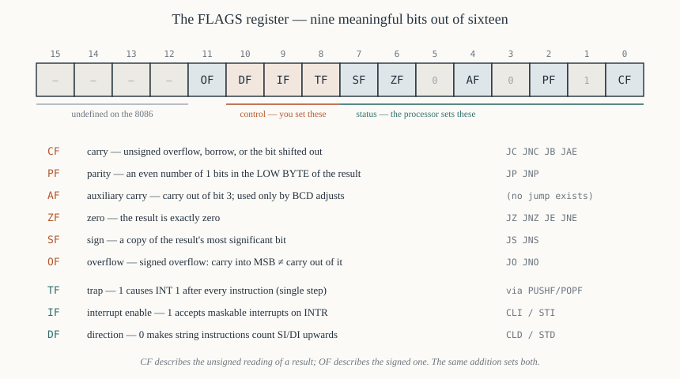

# Chapter 8 — The FLAGS register

[← The registers](07-registers.md) · [Contents](README.md) · [Next: Memory segmentation →](09-segmentation.md)

---

## Goal

Nine bits. Every conditional branch you will ever write depends on them, and the commonest class of
assembly bug is testing the wrong one. This chapter gives, for each flag, the exact rule that sets
it, worked examples of it being 0 and 1, which instructions affect it, and which branches read it.

Read §4 (`CF` versus `OF`) and §9 (the summary table) even if you skip everything else.

---

## 1. The layout



```
 bit  15 14 13 12 11 10  9  8  7  6  5  4  3  2  1  0
     ┌──┬──┬──┬──┬──┬──┬──┬──┬──┬──┬──┬──┬──┬──┬──┬──┐
     │  │  │  │  │OF│DF│IF│TF│SF│ZF│  │AF│  │PF│  │CF│
     └──┴──┴──┴──┴──┴──┴──┴──┴──┴──┴──┴──┴──┴──┴──┴──┘
       └── undefined ──┘      status    ▲  status ▲
                              and         reserved
                              control
```

| Bit | Symbol | Name | Kind |
|-----|--------|------|------|
| 0 | `CF` | Carry | status |
| 1 | — | reserved, always 1 | — |
| 2 | `PF` | Parity | status |
| 3 | — | reserved, always 0 | — |
| 4 | `AF` | Auxiliary carry | status |
| 5 | — | reserved, always 0 | — |
| 6 | `ZF` | Zero | status |
| 7 | `SF` | Sign | status |
| 8 | `TF` | Trap | control |
| 9 | `IF` | Interrupt enable | control |
| 10 | `DF` | Direction | control |
| 11 | `OF` | Overflow | status |
| 12–15 | — | undefined on the 8086 | — |

**Status flags** are set *by* the processor to describe a result. You read them.
**Control flags** are set *by* you to change how the processor behaves. It reads them.

The reserved bits are the 8080's unused flag positions, preserved so `LAHF`/`SAHF` could move an
8080 flag byte unchanged (Chapter 5 §2.2). Bits 12–15 read back as 1 on a real 8086 when pushed with
`PUSHF`; on the 80286 and later they mean something. Never depend on them.

---

## 2. `ZF` — the zero flag (bit 6)

**Rule: `ZF = 1` if and only if the result is exactly zero. Otherwise `ZF = 0`.**

That is all of it, and it is the flag with no subtleties. "Result" means the full width — all 8 bits
or all 16.

```asm
        mov  al, 5
        sub  al, 5              ; AL = 0        -> ZF = 1
        sub  al, 1              ; AL = 0xFF     -> ZF = 0
        mov  ax, 0x0100
        sub  ax, 0x0100         ; AX = 0x0000   -> ZF = 1
        mov  al, 0x00
        mov  ah, 0x01           ; MOV sets no flags at all -> ZF unchanged
```

That last line is worth stopping on. **`MOV` never affects any flag.** Neither do `PUSH`, `POP`,
`LEA`, `LDS`, `LES`, `XCHG`, `IN`, `OUT`, `NOT`, `JMP`, `CALL` or `RET`. This is a feature: you can
compute a flag, then move data around, then branch on the flag.

### 2.1 The `CMP` idiom

`CMP a, b` computes `a − b`, sets all the flags from the result, and **throws the result away**. So:

```asm
        cmp  ax, bx
        je   equal              ; taken when AX == BX, because AX-BX == 0 -> ZF=1
```

`JE` and `JZ` are the *same instruction* (opcode `74`). Two mnemonics for one opcode, because "jump
if equal" reads better after `CMP` and "jump if zero" reads better after `DEC`.

### 2.2 Testing for zero without `CMP`

```asm
        or   ax, ax             ; 2 bytes, sets ZF from AX, doesn't change AX
        test ax, ax             ; 2 bytes, same effect
        cmp  ax, 0              ; 3 bytes (4 for non-accumulator registers)
```

`OR ax, ax` leaves `AX` unchanged (`x OR x = x`) but sets the flags. It was the standard idiom
because it is shorter. `TEST ax, ax` does the same thing via AND and is clearer to a modern reader.
Both also set `SF`, which `CMP ax, 0` does too — all three are interchangeable for this purpose.

---

## 3. `SF` — the sign flag (bit 7)

**Rule: `SF` is a copy of the most significant bit of the result.** Bit 7 for a byte operation, bit
15 for a word operation.

```asm
        mov  al, 0x7F
        add  al, 1              ; AL = 0x80 = 1000 0000 -> SF = 1
        mov  al, 0x80
        add  al, 0x80           ; AL = 0x00             -> SF = 0, ZF = 1
        mov  ax, 0xFFFF
        inc  ax                 ; AX = 0x0000           -> SF = 0
```

`SF` is *meaningful* only if you are treating the value as signed. The processor copies the top bit
regardless.

### 3.1 The sign of a subtraction is not the comparison you want

A tempting but **wrong** way to compare signed numbers:

```asm
        cmp  ax, bx
        js   less_than          ; WRONG in general
```

`JS` jumps when `SF = 1`, i.e. when `AX − BX` came out negative. That is the right answer *unless the
subtraction overflowed*. With `AX = 0x8000` (−32768) and `BX = 0x0001`, `AX − BX` = `0x7FFF`, which
is positive, so `SF = 0` and the jump is not taken — even though −32768 < 1.

The correct signed comparison is `JL`, which tests **`SF ≠ OF`**. That combination is exactly "the
result's sign, corrected for overflow". Chapter 27 §5 tabulates all of them; the rule to remember is:

> For signed comparisons use `JL`, `JLE`, `JG`, `JGE`. For unsigned use `JB`, `JBE`, `JA`, `JAE`.
> Never hand-roll them from `JS` and `JC`.

---

## 4. `CF` — the carry flag (bit 0)

The most-used and most-misunderstood flag.

**Rule for addition: `CF = 1` if there was a carry out of the most significant bit** — i.e. if the
true unsigned sum did not fit.

**Rule for subtraction: `CF = 1` if a borrow was needed** — i.e. if the first operand was, as an
unsigned number, smaller than the second.

```asm
        mov  al, 0xFF
        add  al, 1              ; AL = 0x00, CF = 1   (256 doesn't fit in 8 bits)
        mov  al, 0x7F
        add  al, 1              ; AL = 0x80, CF = 0   (128 fits fine unsigned)
        mov  al, 5
        sub  al, 3              ; AL = 0x02, CF = 0   (5 >= 3, no borrow)
        mov  al, 3
        sub  al, 5              ; AL = 0xFE, CF = 1   (3 < 5, borrow)
```

### 4.1 `CF` is how you build wide arithmetic

The 8086 adds 16 bits at a time. `ADC` (add with carry) computes `dest + src + CF`, so a 32-bit
addition is two instructions:

```asm
        add  ax, cx             ; low  halves; CF = carry out
        adc  bx, dx             ; high halves + that carry
```

and 64-bit is four. Chapter 39 §7 builds arbitrary precision this way. The same applies to `SBB` for
subtraction.

**Nothing between the `ADD` and the `ADC` may touch `CF`.** `MOV` is safe; `INC` and `DEC` are
*also* safe, and that is exactly why they do not affect `CF` — see §4.3.

### 4.2 `CF` is also the shift-out bit

Every shift and rotate moves one bit into `CF`:

```asm
        mov  al, 0b1000_0001
        shl  al, 1              ; AL = 0b0000_0010, CF = 1 (the bit shifted out)
        shr  al, 1              ; AL = 0b0000_0001, CF = 0
        rcl  al, 1              ; rotate THROUGH carry: CF goes in at the bottom
```

This gives a compact way to test an individual bit — shift it into `CF` and use `JC`. Chapter 26.

### 4.3 The instructions that deliberately do not touch `CF`

**`INC` and `DEC` affect every status flag except `CF`.**

This is not an oversight; it is exactly what makes this loop possible:

```asm
        clc                     ; CF = 0 to start
next:
        adc  ax, [si]           ; accumulate with carry from the previous word
        inc  si                 ; advance the pointer — CF survives
        inc  si
        loop next               ; LOOP does not touch flags either
```

If `INC` cleared `CF`, multi-precision loops would need `PUSHF`/`POPF` around every pointer bump.

The flags `INC` and `DEC` *do* set are `OF`, `SF`, `ZF`, `AF` and `PF`. So `dec cx` / `jnz` works
(it sets `ZF`), and `inc al` / `jo` detects signed overflow past 127.

### 4.4 Setting and clearing `CF` deliberately

```asm
        clc                     ; CF = 0
        stc                     ; CF = 1
        cmc                     ; CF = NOT CF
```

A common convention: a subroutine returns with `CF = 0` for success and `CF = 1` for failure, with an
error code in `AX`. DOS's `INT 21h` uses exactly this convention (Chapter 36 §3), so you will write

```asm
        int  0x21
        jc   error
```

constantly.

---

## 5. `OF` — the overflow flag (bit 11)

**Rule: `OF = 1` if the carry into the most significant bit differs from the carry out of it.**

Equivalently, and more usefully in your head:

> **Addition overflows** when both operands have the same sign and the result has the other sign.
> **Subtraction overflows** when the operands have different signs and the result's sign differs from
> the first operand's.

Adding a positive to a negative can *never* overflow. Neither can subtracting two numbers of the same
sign. Those two facts cut the cases you have to check in half.

```asm
        mov  al, 0x7F           ; +127
        add  al, 1              ; +1  -> AL = 0x80 = −128. Two positives, negative
                                ;        result -> OF = 1. CF = 0.
        mov  al, 0x80           ; −128
        sub  al, 1              ; −1  -> AL = 0x7F = +127. OF = 1, CF = 0.
        mov  al, 0xFF           ; −1
        add  al, 1              ; +1  -> AL = 0x00. Different signs -> OF = 0.
                                ;        But CF = 1, because 255+1 overflows unsigned.
```

Read that last pair once more. `0xFF + 0x01`: the *unsigned* interpretation overflows (`CF = 1`); the
*signed* interpretation is perfectly fine (−1 + 1 = 0, `OF = 0`). The processor sets both flags from
the same addition and lets you pick.

### 5.1 `INTO`

The 8086 has an instruction that traps on overflow: `INTO` generates interrupt 4 if `OF = 1` and does
nothing otherwise. Placed after a signed arithmetic instruction, it turns overflow into an exception.
Almost nobody used it. Chapter 31 §6.

### 5.2 `NEG` and `OF`

`NEG AL` computes `0 − AL`. For `AL = 0x80` (−128), the answer would be +128, which does not fit in
8 bits, so `NEG` leaves `0x80` and sets `OF = 1`. This is the only value for which `NEG` overflows.
Chapter 22 §7.

---

## 6. `AF` — the auxiliary carry flag (bit 4)

**Rule: `AF = 1` if there was a carry out of bit 3 into bit 4** (for a subtraction, a borrow from bit
4 into bit 3).

It looks only at the boundary between the two nibbles of the low byte. It is meaningless for 16-bit
arithmetic in any general sense.

```asm
        mov  al, 0x0F
        add  al, 1              ; AL = 0x10. Carry from bit 3 -> AF = 1
        mov  al, 0x08
        add  al, 1              ; AL = 0x09. No nibble carry  -> AF = 0
```

**`AF` exists for exactly one purpose: BCD arithmetic.** The six decimal-adjust instructions
(`DAA`, `DAS`, `AAA`, `AAS`) read it to decide whether a nibble needs correcting. Chapter 24 shows
all of it.

There is **no conditional jump that tests `AF`**. You cannot branch on it directly; you can only
observe it via `PUSHF` or `LAHF`. If you find yourself wanting to, you almost certainly want `CF`.

---

## 7. `PF` — the parity flag (bit 2)

**Rule: `PF = 1` if the low 8 bits of the result contain an even number of 1 bits.**

Two traps:

1. **It is *even* parity** — set when the count of 1s is even, which is the opposite of what the name
   suggests to some people.
2. **It only ever looks at the low 8 bits**, even for 16-bit operations. `AX = 0xFF01` sets `PF` from
   `0x01`, which has one 1 bit — odd — so `PF = 0`.

```asm
        mov  al, 0b0000_0011    ; two 1 bits -> even
        or   al, al             ; PF = 1
        mov  al, 0b0000_0111    ; three 1 bits -> odd
        or   al, al             ; PF = 0
        mov  ax, 0xFFFF         ; low byte 0xFF has eight 1 bits -> even
        or   ax, ax             ; PF = 1
```

`PF` was included for serial communications, where parity bits had to be computed in software. With a
hardware USART (Chapter 50) doing it instead, `PF` became nearly useless. The branches that read it
are `JP`/`JPE` (jump if parity even) and `JNP`/`JPO` (jump if parity odd).

---

## 8. The control flags

These three you set; the processor obeys.

### 8.1 `IF` — interrupt enable (bit 9)

**`IF = 1`: the processor accepts maskable interrupts on the `INTR` pin. `IF = 0`: it ignores them.**

```asm
        cli                     ; CLear Interrupt flag  -> IF = 0, interrupts OFF
        sti                     ; SeT Interrupt flag    -> IF = 1, interrupts ON
```

What `IF = 0` does **not** block:

- **NMI** — the non-maskable interrupt pin. Nothing masks it, by definition.
- **Software interrupts** — `INT n` executes regardless.
- **Exceptions** — divide error (`INT 0`), single-step, `INTO`.

Interrupt handlers begin with `IF` already cleared, because the `INT` sequence clears it
automatically (Chapter 31 §4). If a handler wants to be interruptible, it must `STI` itself.

The classic use is protecting a critical section:

```asm
        cli
        mov  ax, [ticks]        ; read a 32-bit counter that an ISR updates
        mov  dx, [ticks+2]      ;   — must not be interrupted between the two
        sti
```

Keep `CLI` regions short. Every clock spent with interrupts off is a clock the keyboard and timer
cannot be serviced.

### 8.2 `DF` — direction flag (bit 10)

**`DF = 0`: string instructions increment `SI`/`DI` (forwards). `DF = 1`: they decrement
(backwards).**

```asm
        cld                     ; CLear Direction -> forwards, SI/DI increase
        std                     ; SeT Direction   -> backwards, SI/DI decrease
```

The increment is 1 for byte operations (`MOVSB`) and 2 for word operations (`MOVSW`) — the processor
knows the size from the instruction.

**The convention is that `DF = 0`.** DOS, the BIOS and every library assume it. If you set `DF` for a
backwards copy, clear it again before calling anything. An interrupt handler that uses string
instructions must `CLD` on entry and restore `DF` (via `PUSHF`/`POPF`) on exit, because it has no
idea what the interrupted code had set.

The one case where `DF = 1` is genuinely needed: copying overlapping regions upwards in memory.
Chapter 29 §6.

### 8.3 `TF` — trap flag (bit 8)

**`TF = 1`: the processor generates interrupt 1 after *every* instruction.**

This is how single-step debuggers work. There is no `STT`/`CLT` instruction pair; you must set the
bit by manipulating the flag word:

```asm
        pushf
        pop  ax
        or   ax, 0x0100         ; set bit 8
        push ax
        popf                    ; TF = 1 — the NEXT instruction will trap
```

The 8086 checks `TF` at the *end* of an instruction, so the instruction that sets it does not itself
trap; the following one does. The `INT 1` sequence pushes the flags and then clears `TF`, so the
handler itself runs at full speed; `IRET` restores the pushed flags, turning stepping back on.
Chapter 46 §4 builds a working single-stepper.

---

## 9. Which instructions affect which flags

The table you will come back to. `×` = modified per the rules above, `?` = undefined (do not rely on
it), `0`/`1` = forced, blank = unaffected.

| Instruction | OF | SF | ZF | AF | PF | CF |
|-------------|----|----|----|----|----|-----|
| `ADD`, `ADC`, `SUB`, `SBB`, `CMP` | × | × | × | × | × | × |
| `INC`, `DEC` | × | × | × | × | × | *unchanged* |
| `NEG` | × | × | × | × | × | × |
| `AND`, `OR`, `XOR`, `TEST` | **0** | × | × | ? | × | **0** |
| `NOT` | | | | | | *unchanged — no flags at all* |
| `SHL`, `SHR`, `SAL`, `SAR` | × | × | × | ? | × | × |
| `ROL`, `ROR`, `RCL`, `RCR` | × | | | | | × |
| `MUL`, `IMUL` | × | ? | ? | ? | ? | × |
| `DIV`, `IDIV` | ? | ? | ? | ? | ? | ? |
| `DAA`, `DAS` | ? | × | × | × | × | × |
| `AAA`, `AAS` | ? | ? | ? | × | ? | × |
| `AAM`, `AAD` | ? | × | × | ? | × | ? |
| `MOV`, `PUSH`, `POP`, `LEA`, `LDS`, `LES`, `XCHG`, `XLAT`, `IN`, `OUT` | | | | | | *none* |
| `CLC` / `STC` / `CMC` | | | | | | 0 / 1 / toggle |
| `CLD` / `STD` | | | | | | *`DF` only* |
| `CLI` / `STI` | | | | | | *`IF` only* |
| `SAHF` | | × | × | × | × | × |
| `POPF`, `IRET` | *all flags loaded from the stack* | | | | | |

Four rows deserve comment.

**The logical instructions force `CF = 0` and `OF = 0`.** Always, unconditionally. So `AND AX, AX`
clears the carry as a side effect — which is sometimes convenient and sometimes a disaster in the
middle of a multi-precision loop.

**`MUL` and `IMUL` set `CF` and `OF` together, and they mean something specific:** both are 0 if the
upper half of the product is just sign extension (i.e. the result fits in the lower half), and both
are 1 otherwise. So after `MUL BL`, `CF = 1` means "`AH` is not zero — the 8-bit multiply produced a
16-bit answer". `SF`, `ZF`, `PF` and `AF` are genuinely undefined; different steppings of the chip
leave different values.

**`DIV` and `IDIV` leave every flag undefined.** Do not branch on flags after a division; compare
explicitly.

**`NOT` affects nothing.** It is the only logical instruction that doesn't, and it surprises people.
If you need flags from a complement, use `NEG` or follow with `OR ax, ax`.

---

## 10. Reading and writing the flags as data

Four instructions move the flag register around.

```asm
        pushf                   ; push the 16-bit FLAGS onto the stack
        popf                    ; pop 16 bits into FLAGS
        lahf                    ; AH <- low byte of FLAGS (SF ZF - AF - PF - CF)
        sahf                    ; low byte of FLAGS <- AH
```

`LAHF`/`SAHF` move only the low eight bits, so they reach `SF`, `ZF`, `AF`, `PF` and `CF` — but not
`OF`, `IF`, `DF` or `TF`. They exist for 8080 compatibility (Chapter 5).

The standard "preserve the flags across some work" pattern:

```asm
        pushf
        ; ... anything at all, including instructions that change flags ...
        popf                    ; flags restored exactly
```

An interrupt handler must do this if it is not going to `IRET` immediately, because the caller's
flags are its state.

### 10.1 Inspecting flags in a debugger

`DEBUG` and DOSBox-X print flags as two-letter codes rather than bits:

| Flag | Set shown as | Clear shown as |
|------|--------------|----------------|
| `OF` | `OV` (overflow) | `NV` (no overflow) |
| `DF` | `DN` (down) | `UP` (up) |
| `IF` | `EI` (enable interrupt) | `DI` (disable interrupt) |
| `SF` | `NG` (negative) | `PL` (plus) |
| `ZF` | `ZR` (zero) | `NZ` (not zero) |
| `AF` | `AC` (aux carry) | `NA` (no aux carry) |
| `PF` | `PE` (parity even) | `PO` (parity odd) |
| `CF` | `CY` (carry) | `NC` (no carry) |

So a register dump line reading

```
NV UP EI PL NZ NA PO NC
```

means every flag is clear. Memorise `NZ` and `CY` at least; you will read them a thousand times.

---

## 11. Worked example — one addition, eight flags

```asm
        mov  al, 0x9C
        add  al, 0x7B
```

Do it in binary:

```
      1001 1100     0x9C
    + 0111 1011     0x7B
    -----------
    1 0001 0111     result byte = 0x17, carry out = 1
```

Now every flag, with its reasoning:

| Flag | Value | Why |
|------|-------|-----|
| `CF` | **1** | there was a carry out of bit 7 |
| `ZF` | 0 | the result `0x17` is not zero |
| `SF` | 0 | bit 7 of `0x17` is 0 |
| `PF` | **1** | `0x17` = `0001 0111` — bits 0, 1, 2 and 4 are set, four 1 bits, even |
| `AF` | **1** | low nibbles `C` + `B` = 12 + 11 = 23 ≥ 16, so a carry left bit 3 |
| `OF` | 0 | `0x9C` is negative (−100), `0x7B` is positive (+123); operands of different signs cannot overflow |

Check `OF` the other way: carry *into* bit 7 — from `0001 1100 + 0111 1011` in the low seven bits =
`0x1C + 0x7B` = `0x97`, which is ≥ 0x80, so yes, there is a carry into bit 7. Carry *out* of bit 7 is
also 1. Equal, so `OF = 0`. ✔

And the interpretations agree: unsigned, 156 + 123 = 279, which does not fit in a byte — hence
`CF = 1` and the wrapped result 279 − 256 = 23 = `0x17`. Signed, −100 + 123 = +23 — which fits, hence
`OF = 0`, and `0x17` is indeed +23.

---

## 12. Summary

```
  CF  carry     unsigned overflow / borrow / shifted-out bit    JC  JNC  JB  JAE
  PF  parity    even number of 1s in the LOW BYTE               JP  JNP
  AF  aux       carry out of bit 3 — BCD only, no jump exists   (none)
  ZF  zero      result is exactly 0                             JZ  JNZ  JE  JNE
  SF  sign      copy of the result's top bit                    JS  JNS
  OF  overflow  signed overflow: carry-in != carry-out of MSB   JO  JNO
  TF  trap      1 => INT 1 after every instruction              (set via PUSHF/POPF)
  IF  interrupt 1 => INTR accepted                              CLI / STI
  DF  direction 0 => strings go forwards                        CLD / STD

  MOV, PUSH, POP, LEA, XCHG, IN, OUT, NOT, JMP, CALL:  no flags at all
  INC, DEC:                                            all but CF
  AND, OR, XOR, TEST:                                  CF = OF = 0 always
  DIV, IDIV:                                           every flag undefined
```

---

## Exercises

**8.1** For each of the following 8-bit operations, give the result and the values of `CF`, `ZF`,
`SF`, `OF`, `AF` and `PF`:

```
(a) mov al,0x3A : add al,0x7C
(b) mov al,0xF0 : add al,0x10
(c) mov al,0x50 : sub al,0x60
(d) mov al,0x80 : neg al
(e) mov al,0x0F : inc al
```

**8.2** Why does `INC` not affect `CF`? Give a concrete piece of code that would break if it did.

**8.3** `AX = 0x8000` and `BX = 0x0001`. After `cmp ax, bx`, which of `JB`, `JL`, `JS`, `JG` are
taken? Explain each.

**8.4** Write three different two-byte instructions that set `ZF` according to whether `AX` is zero,
without changing `AX`.

**8.5** After `and ax, ax`, what are `CF` and `OF`, regardless of the value in `AX`? Why is this
dangerous inside a multi-precision addition loop?

**8.6** `PF` is set from `0x1234`'s low byte. Is it 1 or 0? Show your working.

**8.7** Write the code that sets `TF` and explain why the instruction that sets it does not itself
cause a trap.

**8.8** An interrupt handler uses `MOVSB`. Write the entry and exit sequences that make it safe with
respect to `DF`.

**8.9** DOS returns errors by setting `CF`. Write the four-line idiom for calling `INT 21h` and
branching to an error routine.

**8.10** A subroutine must preserve all of the caller's flags but needs to use `CMP` internally.
Write its first and last instructions.

**8.11** After `mov al, 200` / `mov bl, 3` / `mul bl`, what is in `AX`? What are `CF` and `OF`, and
what do they tell you?

**8.12** Explain why `JE` and `JZ` assemble to the same opcode, and give a situation where each name
reads better.

Answers in [Appendix H](H-exercise-solutions.md#chapter-8).

---

[← The registers](07-registers.md) · [Contents](README.md) · [Next: Memory segmentation →](09-segmentation.md)
