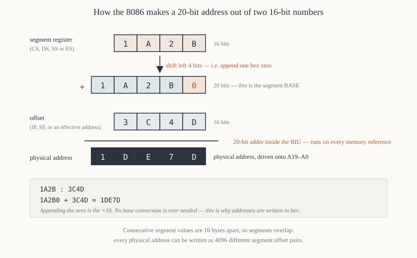

# Chapter 9 — Memory segmentation

[← The FLAGS register](08-flags.md) · [Contents](README.md) · [Next: Memory organisation →](10-memory-organisation.md)

---

## Goal

Make segmentation completely mechanical. It is four lines of arithmetic, and once you can do the
arithmetic in your head — in both directions — the whole subject stops being mysterious. Then we
cover the parts that genuinely are awkward: aliasing, the 64 KiB limit, wrap-around, `near` versus
`far`, and pointer comparison.

By the end you should be able to convert `1A2B:3C4D` to a physical address in about five seconds.

---

## 1. The problem, restated

The 8086 has:

- **20 address lines** → it can address 2²⁰ = 1,048,576 bytes = 1 MiB
- **16-bit registers** → any single register can hold 0 … 65,535

A 16-bit register cannot hold a 20-bit address. Four bits short. The gap has to be filled somehow,
and segmentation is how.

---

## 2. The mechanism



Every memory reference involves **two** 16-bit quantities:

- a **segment** value, from one of `CS`, `DS`, `SS`, `ES`
- an **offset**, from a register, a displacement, or a computation

The physical address is formed by:

```
      segment value         1 A 2 B          (16 bits)
      shifted left 4 bits  1 A 2 B 0         (20 bits)
      plus the offset      + 3 C 4 D         (16 bits)
                           ─────────
      physical address       1 D E 7 D       (20 bits)
```

In one line:

```
   physical address  =  segment × 16  +  offset
                     =  (segment << 4) + offset
```

Shifting a hex number left by four bits is *appending a zero digit*. That is the whole trick, and it
is why hex is the right base for this work: you never have to convert anything.

### 2.1 The adder is real hardware

The BIU contains a dedicated 20-bit adder for exactly this (Chapter 6 §4.1). It runs on every memory
reference, in parallel with everything else, and costs no extra clocks.

### 2.2 Notation

A segmented address is written `segment:offset`:

```
   1A2B:3C4D     ->  physical 0x1DE7D
   0000:0400     ->  physical 0x00400
   B800:0000     ->  physical 0xB8000      (the colour text-mode screen)
   FFFF:0000     ->  physical 0xFFFF0      (the reset address)
```

---

## 3. Worked conversions

Do these by hand until they are automatic.

### 3.1 Segment:offset → physical

**`2000:1234`**

```
   2000 -> 20000
         +  1234
         ───────
           21234
```

**`0700:0100`** — where a `.COM` program lives if DOS loaded it at segment `0x0700`:

```
   0700 -> 07000
         +  0100
         ───────
           07100
```

**`F000:FFF0`** — near the top of memory:

```
   F000 -> F0000
         +  FFF0
         ───────
           FFFF0
```

**`1234:ABCD`** — one with carries, done digit by digit:

```
     12340
   +  ABCD
   ───────
```

`0+D = D`. `4+C = 16 = 0x10`, write `0` carry `1`. `3+B+1 = 15 = 0xF`, write `F`. `2+A = 12 = 0xC`.
`1+0 = 1`. Result `0x1CF0D`.

### 3.2 Physical → segment:offset

This direction has **many** answers (§5). The conventional one: take the top four hex digits as the
segment, the last digit as the offset.

**`0x4A37B`**

```
   segment = 4A37, offset = 000B     ->  4A37:000B
```

Check: `4A370 + 000B = 4A37B`. ✔

But `4A30:007B` works too (`4A300 + 007B = 4A37B`), as does `4000:A37B`, as does `49FF:038B`. All
name the same byte.

### 3.3 The range a segment covers

A segment register holding `S` gives access to physical addresses

```
   from  S × 16 + 0x0000
   to    S × 16 + 0xFFFF
```

which is a 65,536-byte window starting at `S × 16`. So:

| `DS` | Window |
|------|--------|
| `0000` | `0x00000` – `0x0FFFF` |
| `1000` | `0x10000` – `0x1FFFF` |
| `1001` | `0x10010` – `0x2000F` |
| `B800` | `0xB8000` – `0xC7FFF` |
| `F000` | `0xF0000` – `0xFFFFF` |

Note row 3: consecutive segment values differ by **16 bytes**, not 64 KiB. Segments overlap
massively. A segment can begin at any multiple of 16, and 16 bytes is called a **paragraph** — hence
"a segment register holds a paragraph number".

---

## 4. Which segment register gets used

The processor picks automatically, based on the *kind* of reference. You met this table in Chapter 7
§8; here it is with the reasoning.

| Reference | Offset from | Segment | Why |
|-----------|-------------|---------|-----|
| instruction fetch | `IP` | `CS` | code lives in the code segment, by definition |
| `PUSH`/`POP`/`CALL`/`RET`/`INT` | `SP` | `SS` | the stack lives in the stack segment |
| data, address does **not** use `BP` | EA | `DS` | the default for ordinary variables |
| data, address **does** use `BP` | EA | `SS` | `BP` was designed for stack frames |
| string source | `SI` | `DS` | |
| string destination | `DI` | `ES` | so a copy can cross segments |

So:

```asm
        mov  ax, [0x1234]       ; DS:1234
        mov  ax, [bx]           ; DS:BX
        mov  ax, [si]           ; DS:SI
        mov  ax, [di]           ; DS:DI
        mov  ax, [bp]           ; SS:BP       <- note
        mov  ax, [bp+si]        ; SS:BP+SI    <- note
        mov  ax, [bx+di]        ; DS:BX+DI
        push ax                 ; SS:SP
        movsb                   ; DS:SI -> ES:DI
```

### 4.1 Segment override prefixes

You can force a different segment register by putting a **prefix byte** before the instruction. In
NASM:

```asm
        mov  ax, [es:bx]        ; read from ES:BX instead of DS:BX
        mov  ax, [cs:0x100]     ; read from the code segment
        mov  ax, [ds:bp]        ; read from DS:BP instead of SS:BP
        mov  [es:di], al
```

The four prefix bytes are:

| Prefix byte | Forces |
|-------------|--------|
| `0x26` | `ES` |
| `0x2E` | `CS` |
| `0x36` | `SS` |
| `0x3E` | `DS` |

They cost **one byte and two clocks** each. They also apply to the *whole* instruction, so
`MOVSB` with an override changes the source (`DS:SI`) but **never** the destination (`ES:DI`) — the
string destination segment is the one thing that cannot be overridden.

The override is also why `rep movsb` with a prefix is documented as unreliable when interrupted on
early 8086 steppings: the prefix is lost if an interrupt occurs mid-repeat. Chapter 29 §8.

---

## 5. Aliasing: many addresses, one byte

Because segments start every 16 bytes, **each physical address can be named 4096 different ways**.

Physical `0x10000`:

```
   1000:0000     0FFF:0010     0FFE:0020     0FFD:0030    ...
   0F00:1000     0E00:2000     0000:???      <- not reachable, offset would need 0x10000
```

The segments that can reach it run from `0x0001` (offset `0xFFF0`) up to `0x1000` (offset `0x0000`)
— exactly 4096 values.

Three consequences, all of which cause real bugs:

**Pointer comparison is not address comparison.** `1000:0000` and `0FFF:0010` are the same byte but
compare unequal as 32-bit values. Any code that tests whether two far pointers are equal must
*normalise* them first (§5.1) or compare the computed physical addresses.

**A pointer can be "normalised" or not.** A normalised far pointer has an offset in the range
`0x0000`–`0x000F`, so each physical address has exactly one normalised form. Some C compilers of the
era normalised on every pointer arithmetic operation (`huge` pointers) and some did not (`far`
pointers) — the difference was a documented, painful distinction.

**Two different segment registers can overlap.** If `DS = 0x1000` and `ES = 0x1004`, then `DS:0040`
and `ES:0000` are the same byte. A "copy from one buffer to another" that assumes no overlap can
silently corrupt data. Chapter 29 §6.

### 5.1 Normalising a far pointer

```asm
; Normalise the far pointer in DX:AX so that 0 <= AX <= 15.
;   physical = DX*16 + AX
;   new DX   = DX + (AX >> 4)
;   new AX   = AX & 0x000F
normalise:
        push cx
        mov  cx, ax             ; keep a copy of the offset
        shr  ax, 1
        shr  ax, 1
        shr  ax, 1
        shr  ax, 1              ; AX = offset / 16   (8086 has no SHR ax,4)
        add  dx, ax             ; fold it into the segment
        mov  ax, cx
        and  ax, 0x000F         ; keep only the low nibble
        pop  cx
        ret
```

Four separate `shr ax, 1` instructions, because an immediate shift count greater than 1 is an 80186
instruction (Chapter 5 §7). Alternatively `mov cl, 4` / `shr ax, cl` — two instructions and one more
byte, but fewer clocks if the count were larger.

---

## 6. The 64 KiB limit and what it costs

An offset is 16 bits. Therefore **no single data structure can exceed 64 KiB without changing a
segment register**, and no procedure can be reached by a near `CALL` unless it is in the same 64 KiB.

This is the real cost of segmentation, and it shaped a decade of software:

**Memory models.** C compilers offered `tiny`, `small`, `compact`, `medium`, `large` and `huge`
models, differing in whether code and data pointers were 16-bit (near) or 32-bit (far):

| Model | Code | Data | Typical use |
|-------|------|------|-------------|
| tiny | near | near | everything in one 64 KiB segment — a `.COM` file |
| small | near | near | separate code and data segments, 64 KiB each |
| medium | **far** | near | large program, small data |
| compact | near | **far** | small program, large data |
| large | far | far | both large |
| huge | far | far + normalised | arrays over 64 KiB |

**`near` and `far` keywords.** A `far` pointer is 32 bits (segment + offset) and a `far` call pushes
both `CS` and `IP`. Chapter 28 §7.

**Array indexing above 64 KiB** requires segment arithmetic on every access, which is why `huge`
pointers were notoriously slow.

### 6.1 Offset wrap-around

If an offset calculation exceeds `0xFFFF`, it **wraps within the segment** — it does not carry into
the segment register.

```asm
        mov  bx, 0xFFFF
        mov  ds, ax             ; suppose DS = 0x2000
        mov  al, [bx+2]         ; offset = 0xFFFF + 2 = 0x0001, NOT 0x10001
                                ; reads physical 0x20001, not 0x30001
```

This is genuine 8086 behaviour and a rich source of bugs when a buffer runs up to the end of a
segment.

### 6.2 The `0x100000` wrap and the HMA

What about the *physical* address exceeding 20 bits?

```
   FFFF:FFFF  =  0xFFFF0 + 0xFFFF  =  0x10FFEF
```

That is 21 bits. The 8086 has only 20 address lines, so address bit 20 is simply not there — the
address wraps to `0x0FFEF`. On a real 8086, `FFFF:0010` and `0000:0000` are the same byte.

The IBM PC/AT, with an 80286, *did* have address line 20, so this wrap stopped happening, and
software that relied on it broke. IBM's fix was the infamous **A20 gate**: a hardware gate, wired
through the keyboard controller of all things, that could force address line 20 to zero to emulate
the 8086. The 64 KiB minus 16 bytes reachable above 1 MiB when A20 is enabled became the **High
Memory Area**, which DOS 5 used to load most of itself out of conventional memory (`DOS=HIGH`).

An entire era of PC arcana descends from the 8086 having exactly 20 address pins.

---

## 7. Segments in practice

### 7.1 A `.COM` program: one segment for everything

```
   CS = DS = SS = ES = (say) 0x0700

   physical 0x07000  ┌──────────────────┐  offset 0x0000
                     │  PSP (256 bytes) │
   physical 0x07100  ├──────────────────┤  offset 0x0100  <- entry point
                     │  your code       │
                     ├──────────────────┤
                     │  your data       │
                     ├──────────────────┤
                     │  free            │
                     │        ...       │
                     │  stack (grows ↓) │
   physical 0x16FFF  └──────────────────┘  offset 0xFFFF  <- SP starts here
```

All four segment registers equal, one 64 KiB world, no `far` anything. This is why `.COM` programs
are so simple, and why they are limited to 64 KiB total. Chapter 35.

### 7.2 An `.EXE` program: separate segments

```
   CS -> code segment
   DS -> data segment          (you must load it yourself — DOS sets DS to the PSP)
   SS -> stack segment
   ES -> whatever you need
```

Each can be up to 64 KiB, and they can be anywhere in the 1 MiB space. Chapter 35 §5.

### 7.3 Reaching hardware: the video buffer

The colour text-mode screen is memory-mapped at physical `0xB8000`. To write to it:

```asm
        mov  ax, 0xB800
        mov  es, ax             ; ES -> video segment
        mov  di, 0              ; top-left character cell
        mov  al, 'A'
        mov  ah, 0x1F           ; attribute: white on blue
        mov  [es:di], ax        ; one character + attribute = one word
```

`ES` is used because `DS` still has to point at the program's own data. This is the everyday reason
`ES` exists. Chapter 45 does full graphics this way.

### 7.4 Reading the interrupt vector table

The IVT lives at physical `0x00000`–`0x003FF`: 256 entries of four bytes each (offset then segment).
To read the address of `INT 21h`:

```asm
        xor  ax, ax
        mov  es, ax             ; ES = 0x0000
        mov  bx, 0x21 * 4       ; = 0x84 — each vector is 4 bytes
        mov  dx, [es:bx]        ; DX = offset of the handler
        mov  ax, [es:bx+2]      ; AX = segment of the handler
```

Chapter 31 §3 does this properly — including why you should ask DOS (`INT 21h`, `AH = 35h`) rather
than poke the table yourself.

---

## 8. Segmentation compared

| Scheme | Address = | Pros | Cons |
|--------|-----------|------|------|
| **Flat 16-bit** (8080) | offset | simple | 64 KiB, full stop |
| **Bank switching** (many 8-bit systems) | bank register selects a window | cheap | software must manage banks explicitly; no uniform addressing |
| **8086 segmentation** | seg × 16 + off | 1 MiB from 16-bit registers; automatic relocation | 64 KiB granule; aliasing; no protection |
| **80286 protected mode** | descriptor table lookup | protection, limits, up to 16 MiB | complex; slow segment loads |
| **Paging** (80386+) | page table lookup | uniform flat view, protection, virtual memory | needs tables in memory, a TLB |

The 8086's version has **no protection at all**. A segment register can hold any value; there is no
limit checking; any program can write any byte in the 1 MiB space, including the interrupt vector
table and the operating system. That is not a flaw in the design so much as an omission that the
80286 corrected, and it is why DOS has no memory protection whatsoever.

The *good* property, which is easy to overlook: **automatic relocation**. A `.COM` program uses only
offsets, so DOS can load it at any paragraph boundary and it just works, with no relocation table and
no fixups. In 1981 that was worth a great deal.

---

## 9. Summary

```
  physical address = segment × 16 + offset
                   = (segment << 4) + offset
                   = "append a hex 0 to the segment, then add the offset"

  segment register holds a PARAGRAPH number; a paragraph is 16 bytes
  each segment is a 64 KiB window starting at segment × 16
  segments overlap; each physical address has 4096 segment:offset forms

  default segments:  code -> CS   stack/BP -> SS   data -> DS   string dest -> ES
  overrides:         26 ES, 2E CS, 36 SS, 3E DS — 1 byte, 2 clocks
  cannot override:   instruction fetch, stack operations, ES:DI string destination

  offsets wrap at 0xFFFF within the segment
  physical addresses wrap at 0xFFFFF (20 lines) -> the A20 story
```

---

## Exercises

**9.1** Convert to physical addresses: (a) `0000:0500`, (b) `1000:0100`, (c) `A000:FFFF`,
(d) `FFFF:000F`, (e) `07C0:0000`.

**9.2** Give three different `segment:offset` pairs for physical address `0x25000`.

**9.3** What is the physical address range covered by a segment register holding `0x3ABC`?

**9.4** `DS = 0x1234`. What physical address does `mov ax, [0x5678]` read?

**9.5** `SS = 0x2000`, `BP = 0x0100`. What physical address does `mov ax, [bp+4]` read? What would
`mov ax, [ds:bp+4]` read if `DS = 0x3000`?

**9.6** How many distinct `segment:offset` pairs name physical address `0x08000`? Show how you get
the number.

**9.7** A program sets `DS = 0x1000` and `ES = 0x1008`. Does `DS:0080` refer to the same byte as
`ES:0000`? Show the arithmetic.

**9.8** `BX = 0xFFFE`, `DS = 0x4000`. What physical address does `mov al, [bx+4]` read? Explain why
it is not `0x50002`.

**9.9** Write the four instructions that set `ES` to `0xB800` and store the word `0x0741` at the
first screen cell.

**9.10** Why can a `.COM` program be loaded at any segment without relocation, while an `.EXE`
program needs a relocation table?

**9.11** Normalise the far pointer `2345:6789` — that is, give the equivalent pointer whose offset is
less than 16.

**9.12** A loop copies 100 bytes from `DS:SI` to `ES:DI` where `DS = 0x2000`, `SI = 0x0000`,
`ES = 0x1FF0`, `DI = 0x0100`. Do the source and destination overlap? If so, from which byte?

Answers in [Appendix H](H-exercise-solutions.md#chapter-9).

---

[← The FLAGS register](08-flags.md) · [Contents](README.md) · [Next: Memory organisation →](10-memory-organisation.md)
