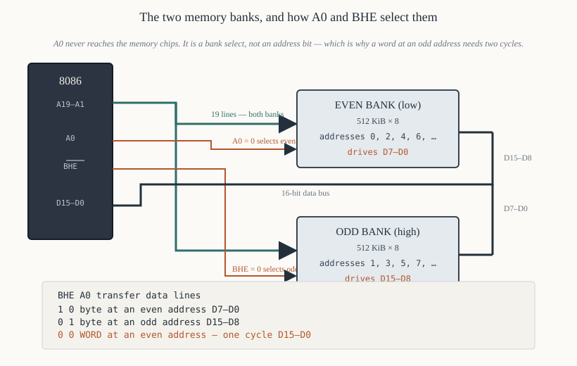
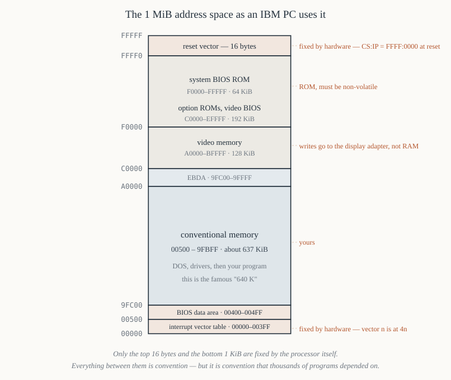

# Chapter 10 — Memory organisation

[← Memory segmentation](09-segmentation.md) · [Contents](README.md) · [Next: The pin diagram →](11-pin-diagram.md)

---

## Goal

Explain how the 8086's 1 MiB of memory is physically arranged, why it is split into two banks, what
`BHE#` is for, and why a word at an odd address costs twice as much as one at an even address. Then
map out the parts of the address space that are reserved and cannot be used.

This chapter is where the 16-bit data bus stops being an abstraction.

---

## 1. The problem: byte addressing on a word-wide bus

The 8086 addresses **bytes**: address `0x00000`, `0x00001`, `0x00002` and so on, one byte each, a
million of them.

But its data bus is **16 bits** — it moves two bytes per transfer. And it must be able to:

- read or write a single byte at *any* address, even or odd;
- read or write a 16-bit word at *any* address, even or odd.

A naïve design with one 1 MiB × 8 memory array cannot deliver a word in one cycle. A single
1 MiB × 16 array could deliver words but could not write one byte without disturbing the other.

The 8086's solution is **two banks of 512 KiB × 8**.

---

## 2. The two banks



```
            EVEN BANK                        ODD BANK
          (low bank)                       (high bank)
       512 KiB × 8 bits                 512 KiB × 8 bits
       data lines D7–D0                 data lines D15–D8
       enabled by A0 = 0                enabled by BHE# = 0
       holds addresses 0,2,4,6,…        holds addresses 1,3,5,7,…
```

The 20-bit address is split:

- **`A19`–`A1`** (nineteen lines) go to *both* banks as their address input. Nineteen lines address
  2¹⁹ = 524,288 locations in each bank — 512 KiB each, 1 MiB total. ✔
- **`A0`** is **not** an address line to the memory chips at all. It is a *bank select*: `A0 = 0`
  enables the even bank.
- **`BHE#`** (Bus High Enable, active low) is the odd bank's select.

So the memory chips never see `A0`. What would be "address bit 0" instead chooses which half of the
16-bit bus is live.

### 2.1 The four combinations

| `BHE#` | `A0` | What happens | Data lines used |
|--------|------|--------------|-----------------|
| 1 | 0 | byte from the **even** bank | `D7–D0` |
| 0 | 1 | byte from the **odd** bank | `D15–D8` |
| 0 | 0 | **word** from both banks, even address | `D15–D0` |
| 1 | 1 | *no transfer* (never generated as a data cycle) | none |

Memorise rows 1–3. They are asked constantly, and they explain everything in §3 and §4.

### 2.2 Why the odd bank is on the high half of the bus

Because of little-endian ordering (Chapter 2 §7). A word at even address `N` stores its **low byte at
`N`** and its **high byte at `N+1`**. Address `N` is even, so it is in the even bank; `N+1` is odd, so
it is in the odd bank. For the word to appear on the bus correctly assembled — low byte on `D7–D0`,
high byte on `D15–D8` — the even bank must drive the low half and the odd bank the high half.

The banks are wired to match the byte order. Change one and you must change the other.

---

## 3. Byte transfers

### 3.1 A byte at an even address

```asm
        mov  al, [0x0200]       ; 0x0200 is even
```

`A0 = 0`, `BHE# = 1`. The even bank drives `D7–D0`; the odd bank is silent. The 8086 takes the byte
from the low half of the bus into `AL`. **One bus cycle.**

### 3.2 A byte at an odd address

```asm
        mov  al, [0x0201]       ; odd
```

`A0 = 1`, `BHE# = 0`. The odd bank drives `D15–D8`; the even bank is silent. The byte arrives on the
**high** half of the bus, and the 8086 internally routes it down into `AL`. **One bus cycle** — the
routing is free, done by multiplexers inside the chip.

So **byte accesses cost the same whether the address is odd or even.** This surprises people who have
heard "odd addresses are slow". The penalty is for *words*.

---

## 4. Word transfers, and the alignment penalty

### 4.1 A word at an even address — the good case

```asm
        mov  ax, [0x0200]
```

Low byte at `0x0200` (even bank), high byte at `0x0201` (odd bank). Both banks are addressed by the
same nineteen lines `A19–A1` (since `0x0200 >> 1` and `0x0201 >> 1` are the same value), so:

`A0 = 0`, `BHE# = 0` → both banks enabled → the whole word appears on `D15–D0` at once.

**One bus cycle. 4 clocks.**

### 4.2 A word at an odd address — the expensive case

```asm
        mov  ax, [0x0201]
```

Low byte at `0x0201` (odd bank), high byte at `0x0202` (even bank). These are **different rows** —
`0x0201 >> 1 = 0x100`, `0x0202 >> 1 = 0x101`. One address cannot select both. So the 8086 performs
**two bus cycles**:

| Cycle | Address driven | `A0` | `BHE#` | What is fetched |
|-------|----------------|------|--------|-----------------|
| 1 | `0x0201` | 1 | 0 | low byte, from the odd bank, on `D15–D8` |
| 2 | `0x0202` | 0 | 1 | high byte, from the even bank, on `D7–D0` |

and assembles the word internally.

**Two bus cycles. 8 clocks, plus any wait states, doubled.**

### 4.3 The cost, stated plainly

| Access | Address | Bus cycles | Clocks (no wait states) |
|--------|---------|-----------|------------------------|
| byte | even | 1 | 4 |
| byte | odd | 1 | 4 |
| word | even | 1 | 4 |
| **word** | **odd** | **2** | **8** |

An odd word access costs **4 extra clocks** — the same as an entire extra memory access. In a loop
that touches a misaligned array a million times, that is four million wasted clocks: nearly a second
at 5 MHz.

### 4.4 Aligning your data

The fix is trivial and you should do it always. In NASM:

```asm
        align 2                 ; pad to the next even address
counter dw 0                    ; now guaranteed even

        align 2
buffer  times 128 dw 0
```

`align 2` inserts zero or one filler byte as needed. For a `.COM` file, since `org 0x100` puts the
image at an even offset, alignment within the file is alignment in memory — *provided* DOS loaded the
segment at an even paragraph, which it always does (paragraphs are 16 bytes, so segment bases are
always multiples of 16, hence even).

### 4.5 The stack is always aligned — make sure of it

`PUSH` and `POP` move words. If `SP` is ever odd, **every stack operation costs double**. Since
`PUSH` decrements `SP` by 2, an `SP` that starts even stays even forever.

DOS sets `SP` to `0xFFFE` for a `.COM` program — even. Leave it that way. The one instruction that
can break it is `dec sp` or an odd `sub sp, n`:

```asm
        sub  sp, 10             ; fine — even
        sub  sp, 9              ; DISASTER — every push from here on costs double
```

Always allocate local space in even amounts.

### 4.6 The 8088 has no such penalty — because everything is already slow

The 8088 has an 8-bit bus and only one bank. Every word access, aligned or not, takes two bus cycles.
So on an 8088 alignment does not matter at all. Code written for an 8088 and run on an 8086 without
attention to alignment is leaving performance on the table, which was a common situation given that
the IBM PC used the 8088. Chapter 18.

---

## 5. Generating the bank-select signals

In a real design you need to build the chip selects. `A0` and `BHE#` come straight from the 8086
(`BHE#` shares a pin with status line `S7`, Chapter 11 §6), and the usual arrangement is:

```
                                 ┌──────────────┐
   A19–A1  ─────────────────────►│ A18–A0       │
                                 │  EVEN BANK   │  D7–D0
   A0 ──────────────[decode]────►│ CS#          │
                                 └──────────────┘

                                 ┌──────────────┐
   A19–A1  ─────────────────────►│ A18–A0       │
                                 │  ODD BANK    │  D15–D8
   BHE# ────────────[decode]────►│ CS#          │
                                 └──────────────┘
```

with the address-range decoding (Chapter 16) ANDed into each chip select. Concretely, for a bank
selected by decoder output `Y0#`:

```
   even bank CS#  =  Y0#  OR  A0          (asserted only when Y0#=0 AND A0=0)
   odd  bank CS#  =  Y0#  OR  BHE#        (asserted only when Y0#=0 AND BHE#=0)
```

Two OR gates — or, equivalently, a 74LS139 dual 2-to-4 decoder fed with `A0` and `BHE#`, which is the
textbook arrangement. Chapter 16 §4 builds it.

### 5.1 Consequence for chip sizing

Because each bank holds half the bytes, **memory must be added in pairs**. Two 8 KiB chips give you
16 KiB of 16-bit-accessible memory, not 8 KiB in each of two ranges: the even chip holds
`0x0000, 0x0002, 0x0004…` and the odd chip holds `0x0001, 0x0003, 0x0005…` of the *same* 16 KiB
range.

If you fit only one chip, you get a memory that responds to every other address and reads garbage on
the rest. This is a real and common wiring mistake.

---

## 6. The reserved regions of the address space

Not all of the 1 MiB is yours. Two regions are architecturally fixed and two more are fixed by
convention on a PC.



### 6.1 `0x00000` – `0x003FF` — the interrupt vector table

256 vectors × 4 bytes = 1024 bytes, at the very bottom of memory. **Fixed by the hardware**: when an
interrupt of type *n* occurs, the 8086 fetches a new `IP` from physical address `4n` and a new `CS`
from `4n+2`. There is no way to move it on an 8086; the 80286 added the `IDTR` register for that.

```
   physical   contents
   00000      IP of INT 0 handler   (divide error)
   00002      CS of INT 0 handler
   00004      IP of INT 1 handler   (single step)
   00006      CS of INT 1 handler
   ...
   0007C      IP of INT 1Fh handler
   ...
   00084      IP of INT 21h handler (DOS)
   ...
   003FC      IP of INT FFh handler
   003FE      CS of INT FFh handler
```

The first 32 vectors (`INT 0` – `INT 1Fh`, addresses `0x00000`–`0x0007F`) are **reserved by Intel**.
Five are defined on the 8086 and the rest were reserved for future processors. Using them was common
anyway — the IBM PC put BIOS services at `INT 10h` – `INT 1Fh`, squarely inside Intel's reserved
range, which caused genuine trouble when the 80286 defined exceptions there. Chapter 31 §2.

### 6.2 `0xFFFF0` – `0xFFFFF` — the reset vector

Sixteen bytes. On `RESET`, `CS = 0xFFFF` and `IP = 0x0000`, so the first instruction is fetched from
`0xFFFF0`. Sixteen bytes is not enough for anything, so what lives there is always a far jump:

```asm
        jmp  0xF000:0xE05B      ; 5 bytes: EA 5B E0 00 F0
```

This must be in ROM, because it must be valid the instant power comes up. Chapter 12 §5.

### 6.3 `0xA0000` – `0xBFFFF` — video memory (PC convention)

128 KiB, memory-mapped display:

| Range | Use |
|-------|-----|
| `0xA0000`–`0xAFFFF` | EGA/VGA graphics modes (including mode 13h — Chapter 45) |
| `0xB0000`–`0xB7FFF` | MDA monochrome text |
| `0xB8000`–`0xBFFFF` | CGA/EGA/VGA colour text |

Writes here go to a display adapter, not to RAM. Reads return whatever the adapter provides.

### 6.4 `0xC0000` – `0xFFFFF` — ROM (PC convention)

| Range | Use |
|-------|-----|
| `0xC0000`–`0xC7FFF` | video BIOS ROM |
| `0xC8000`–`0xEFFFF` | option ROMs on expansion cards |
| `0xF0000`–`0xFFFFF` | system BIOS ROM |

### 6.5 The usable region on a PC

```
   0x00000 – 0x003FF   1 KiB     interrupt vector table       — reserved
   0x00400 – 0x004FF   256 B     BIOS data area               — reserved
   0x00500 – 0x9FBFF   ~637 KiB  conventional memory          — yours
   0x9FC00 – 0x9FFFF   1 KiB     extended BIOS data area      — usually reserved
   0xA0000 – 0xBFFFF   128 KiB   video                        — device
   0xC0000 – 0xFFFFF   256 KiB   ROM                          — device
```

That ~637 KiB is the famous "640 K" — the amount of RAM below the video window, minus the bits DOS
and the BIOS take. The limit is not a DOS limit; it is where IBM put the video adapter in 1981, and
by the time that mattered there were thousands of programs that assumed it.

DOS itself and any loaded drivers take the bottom of conventional memory, so a program typically has
something like 500–620 KiB available. `INT 21h`, `AH = 48h` asks DOS for a block; Chapter 36 §8.

---

## 7. Memory-mapped I/O versus isolated I/O

The 8086 has a **separate** 64 KiB I/O address space, reached with `IN` and `OUT` and distinguished
on the bus by `M/IO#` being low. So a peripheral can live in either space:

| | Isolated I/O (`IN`/`OUT`) | Memory-mapped I/O |
|---|---|---|
| Address space | separate 64 KiB | takes memory addresses |
| Instructions | only `IN`, `OUT` | every memory instruction works |
| Addressing modes | port in `DX` or an 8-bit immediate | all of them |
| Decoding | needs `M/IO#` in the decode | one fewer signal to decode |
| Cost in address space | none | consumes part of the 1 MiB |

The PC uses **both**: the 8259A, 8253, 8255 and serial ports are in I/O space; the video adapter is
memory-mapped, because writing a screenful of characters with `OUT` one byte at a time would be
hopeless and `REP MOVSW` into `0xB8000` is fast.

Chapter 17 covers the I/O space properly.

---

## 8. Worked example — counting the cost of misalignment

A program sums a 1000-element array of words.

```asm
; fragment
        mov  cx, 1000
        xor  ax, ax
        mov  si, array
sum:    add  ax, [si]
        add  si, 2
        loop sum
```

`ADD AX, [SI]` is 9 clocks plus 5 for the `[SI]` effective address = 14, plus the bus cycle it
causes.

**If `array` is at an even offset** (and the segment base is even, which it always is): every access
is an aligned word. 1000 accesses × 4 clocks of bus time.

**If `array` is at an odd offset**: every single access is a misaligned word — `array`, `array+2`,
`array+4` are all odd. 1000 accesses × 8 clocks.

Difference: 4000 clocks = 800 µs at 5 MHz, on a loop whose total is roughly 1000 × (14 + 4 + 17) ≈
35,000 clocks. So misalignment costs about **11%** here — and much more in a loop that does less work
per access.

One `align 2` directive. Free.

---

## 9. Summary

```
  1 MiB = two banks of 512 KiB × 8
     even bank -> D7-D0,  selected by A0   = 0
     odd  bank -> D15-D8, selected by BHE# = 0
     A19-A1 address both banks; A0 never reaches the memory chips

  BHE# A0   transfer
   1    0   byte, even address, low half of bus
   0    1   byte, odd address,  high half of bus
   0    0   word, even address, whole bus — ONE cycle
   1    1   none

  word at an ODD address = TWO bus cycles = 4 extra clocks
  byte accesses cost the same either way
  keep SP even; use `align 2` before word data

  reserved:  00000-003FF  interrupt vector table (hardware)
             FFFF0-FFFFF  reset vector (hardware)
             A0000-BFFFF  video (PC convention)
             C0000-FFFFF  ROM   (PC convention)
```

---

## Exercises

**10.1** Which bank holds the byte at physical address `0x3A7F1`? Which data lines carry it?

**10.2** For `mov ax, [0x0400]`, give the values of `A0` and `BHE#` and the number of bus cycles.

**10.3** For `mov ax, [0x0403]`, give the addresses driven in each bus cycle, with `A0` and `BHE#`
for each, and say which byte of `AX` each cycle delivers.

**10.4** For `mov bl, [0x1001]`, give `A0`, `BHE#`, the bank used, and the data lines used.

**10.5** Why does `A0` not connect to the address inputs of the memory chips?

**10.6** A designer fits a single 32 KiB SRAM to an 8086 system, connecting `A14–A0` to the chip's
address inputs and `D7–D0` to the chip's data pins. Describe precisely what the software sees when it
tries to use this memory.

**10.7** How much memory, in bytes, do two 27256 EPROMs (32 KiB × 8 each) provide to an 8086, and
what address range would they occupy if `A19–A15` were decoded to select them at the top of memory?

**10.8** `SP` is `0x1FFF` when a program starts pushing. What is the penalty, and how did `SP` become
odd?

**10.9** At what physical address does the 8086 find the `CS` value for the `INT 13h` handler?

**10.10** A program writes to physical `0xB8000` and nothing appears on screen. Give two hardware
reasons and one software reason this could happen.

**10.11** An array of 500 words starts at offset `0x0101` in a segment whose base is `0x2000`.
How many bus cycles does it take to read the whole array with `MOVSW`, and how many would it take if
the array started at `0x0100`?

**10.12** Explain why byte accesses have no alignment penalty but word accesses do, in terms of the
nineteen address lines shared by the two banks.

Answers in [Appendix H](H-exercise-solutions.md#chapter-10).

---

[← Memory segmentation](09-segmentation.md) · [Contents](README.md) · [Next: The pin diagram →](11-pin-diagram.md)
