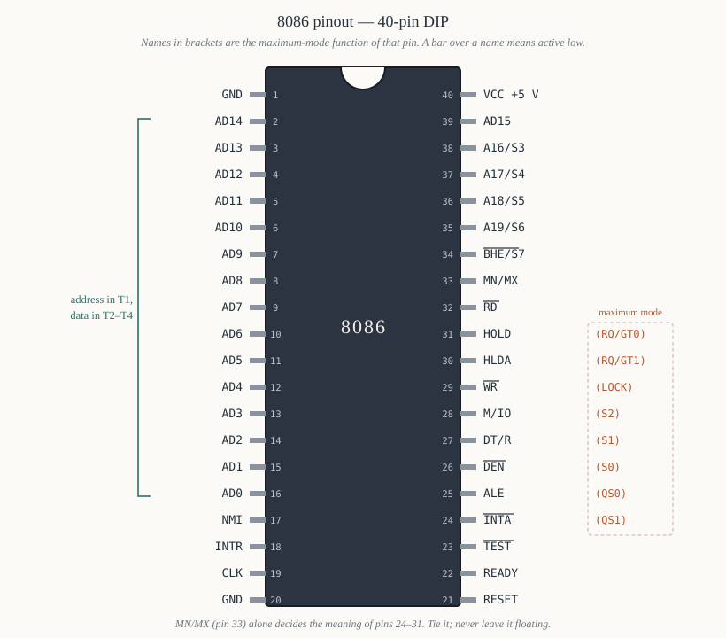

# Chapter 11 — The pin diagram

[← Memory organisation](10-memory-organisation.md) · [Contents](README.md) · [Next: Clock, reset and the 8284A →](12-clock-reset-8284.md)

---

## Goal

Account for all forty pins. For each one: what it is called, which direction it goes, what it does,
when it is active, and what it is connected to in a real system. Eight of the pins change meaning
depending on one input, so the chapter is organised around that split.

This is a reference chapter as much as a narrative one. Chapters 13–17 assume you can look up any pin
here.

---

## 1. The package and the constraint

The 8086 comes in a **40-pin dual in-line package**, 0.6 inches wide, with pins on 0.1-inch centres.

Count what it needs:

```
   20  address lines A19–A0
   16  data lines D15–D0
    2  power and ground
    1  clock
    1  reset
   ~8  control signals
   ──
   48  minimum
```

Forty pins available; forty-eight needed. Something has to give, and two things did:

**The address and data buses share sixteen pins.** `AD15`–`AD0` carry address bits `A15`–`A0` during
the first clock period of a bus cycle and data bits `D15`–`D0` during the rest. This is *time-division
multiplexing*, and the external latch of Chapter 3 §6.1 undoes it.

**The top four address lines share with status outputs.** `A19/S6` … `A16/S3` carry address during T1
and status during T2–T4.

**Eight control pins have two personalities**, chosen by the `MN/MX#` pin (§7).

So the pin count works out, at the cost of every 8086 system needing latches. That cost is the single
biggest structural difference between an 8086 board and, say, a 68000 board.

---

## 2. The pinout



```
                     ┌──────∪──────┐
             GND  1 ─┤             ├─ 40  VCC  (+5 V)
            AD14  2 ─┤             ├─ 39  AD15
            AD13  3 ─┤             ├─ 38  A16/S3
            AD12  4 ─┤             ├─ 37  A17/S4
            AD11  5 ─┤             ├─ 36  A18/S5
            AD10  6 ─┤             ├─ 35  A19/S6
             AD9  7 ─┤             ├─ 34  BHE/S7
             AD8  8 ─┤             ├─ 33  MN/MX
             AD7  9 ─┤    8086     ├─ 32  RD
             AD6 10 ─┤             ├─ 31  HOLD      (RQ/GT0)
             AD5 11 ─┤             ├─ 30  HLDA      (RQ/GT1)
             AD4 12 ─┤             ├─ 29  WR        (LOCK)
             AD3 13 ─┤             ├─ 28  M/IO      (S2)
             AD2 14 ─┤             ├─ 27  DT/R      (S1)
             AD1 15 ─┤             ├─ 26  DEN       (S0)
             AD0 16 ─┤             ├─ 25  ALE       (QS0)
             NMI 17 ─┤             ├─ 24  INTA      (QS1)
            INTR 18 ─┤             ├─ 23  TEST
             CLK 19 ─┤             ├─ 22  READY
             GND 20 ─┤             ├─ 21  RESET
                     └─────────────┘

   Names in (brackets) are the maximum-mode function of that pin.
   Overbars omitted here; §9 lists which signals are active-low.
```

---

## 3. The multiplexed address/data bus — pins 2–16, 39

**`AD15`–`AD0`** — bidirectional, tri-state.

| Time | Carries |
|------|---------|
| T1 | address bits `A15`–`A0` |
| T2, T3, Tw, T4 | data bits `D15`–`D0` |
| when the bus is not in use | high impedance |
| during an interrupt acknowledge cycle | the interrupt type number arrives on `AD7`–`AD0` |
| during `HOLD` acknowledge | high impedance — the bus belongs to someone else |

The pins are scattered across the package in an order that looks random (`AD14` at pin 2, `AD15` at
pin 39, `AD0` at pin 16). That ordering was chosen to make PCB routing tidy, not to make the diagram
readable.

**In a real system** these connect to:

- three 74LS373 / 8282 latches, clocked by `ALE`, producing the demultiplexed address bus;
- two 74LS245 / 8286 transceivers, controlled by `DT/R#` and `DEN#`, producing the buffered data bus.

Chapter 14 shows the wiring.

---

## 4. The upper address/status lines — pins 35–38

**`A19/S6`, `A18/S5`, `A17/S4`, `A16/S3`** — output, tri-state.

During **T1** they carry address bits `A19`–`A16`. During **T2–T4** they carry status:

| Pin | Status meaning during T2–T4 |
|-----|------------------------------|
| `S6` | always 0 on the 8086 |
| `S5` | the current state of the interrupt enable flag, `IF` |
| `S4`, `S3` | which segment register is being used for this cycle |

The `S4`/`S3` encoding:

| `S4` | `S3` | Segment register in use |
|------|------|------------------------|
| 0 | 0 | `ES` |
| 0 | 1 | `SS` |
| 1 | 0 | `CS`, or none (an I/O or interrupt-acknowledge cycle) |
| 1 | 1 | `DS` |

These status bits are for **bus monitors and logic analysers** — they let external hardware see what
the processor is doing without decoding instructions. A memory-management unit could use `S4`/`S3` to
apply different protection to stack accesses than to data. Almost no 8086 system used them; they
matter because you will see them on the pin diagram and be asked what they are.

`S5` is genuinely useful for debugging: it shows the interrupt flag on a pin, every cycle.

Like `AD15`–`AD0`, these are latched by `ALE`, so a real system's `A19`–`A16` come out of a latch.

---

## 5. `BHE#/S7` — pin 34

**Output, tri-state, active low.**

During **T1**: `BHE#` (Bus High Enable), which with `A0` selects the memory bank — see Chapter 10 §2.

| `BHE#` | `A0` | Transfer |
|--------|------|----------|
| 0 | 0 | word, even address |
| 0 | 1 | byte, odd address, on `D15`–`D8` |
| 1 | 0 | byte, even address, on `D7`–`D0` |
| 1 | 1 | none |

During **T2–T4**: `S7`, which the 8086 datasheet describes as having no defined meaning. It reads as
1. Do not use it.

`BHE#` must be latched along with the address, because memory needs it for the whole cycle. In
practice you latch it in the *third* 74LS373 alongside `A19`–`A16` — that latch has 8 inputs of which
you use 5.

---

## 6. Power, ground and clock

**Pin 40 — `VCC`.** +5 V ±10%. The 8086 draws up to 360 mA, so a decoupling capacitor (0.1 µF
ceramic) directly across pins 40 and 20 is mandatory, not optional.

**Pins 1 and 20 — `GND`.** *Both* must be connected. This catches people: two ground pins on opposite
corners, and leaving one floating produces intermittent failures that look like software bugs.

**Pin 19 — `CLK`.** Input. The system clock, supplied by an 8284A (Chapter 12). Requirements:

- **33% duty cycle** — high for one third of the period, low for two thirds. Not 50%. The 8284A
  produces this by dividing a crystal by three.
- MOS-level, not TTL-level: `VIH` ≥ 3.9 V, which ordinary TTL cannot guarantee — another reason for
  the 8284A.
- 5 MHz for the standard part, 8 MHz for the 8086-2, 10 MHz for the 8086-1. There is also a **minimum**
  frequency of 2 MHz: the 8086 uses dynamic internal storage and stops working if clocked too slowly.
  You cannot single-step an 8086 by stopping its clock.

---

## 7. `MN/MX#` — pin 33, the mode selector

**Input.** This one pin changes the meaning of eight others.

| `MN/MX#` | Mode | Pins 24–31 provide |
|----------|------|--------------------|
| tied to **+5 V** | **minimum** | `INTA#`, `ALE`, `DEN#`, `DT/R#`, `M/IO#`, `WR#`, `HLDA`, `HOLD` |
| tied to **GND** | **maximum** | `QS1`, `QS0`, `S0#`, `S1#`, `S2#`, `LOCK#`, `RQ/GT1#`, `RQ/GT0#` |

**Minimum mode** is for a small single-processor system. The 8086 generates all its own bus control
signals. Cheaper — no 8288 — and simpler.

**Maximum mode** is for systems with a coprocessor (the 8087) or multiple bus masters. The 8086 emits
*status* codes instead of control signals, and an **8288 bus controller** decodes them into
`MEMR#`, `MEMW#`, `IOR#`, `IOW#`, `INTA#` and `ALE`. Chapter 15.

**Tie this pin, do not leave it floating.** It is sampled continuously, not just at reset.

The IBM PC used maximum mode, because it had a socket for an 8087.

---

## 8. Minimum-mode pins, one at a time

These are pins 24–31 when `MN/MX#` is high.

### 8.1 `ALE` — pin 25, Address Latch Enable

**Output, active high.** Pulses high during **T1** of every bus cycle, falling at the end of T1.

This is the signal that makes the whole multiplexed scheme work. The external latches are transparent
while `ALE` is high and hold when it falls — capturing the address exactly as the 8086 stops driving
it and prepares to use the same pins for data.

`ALE` is **never tri-stated**, even during a `HOLD`. That is deliberate: it is the one signal that
must remain deterministic.

### 8.2 `M/IO#` — pin 28

**Output, tri-state.** High for a **memory** access, low for an **I/O** access.

Every memory or I/O decoder must include this in its decode, or an `IN` from port `0x0100` will also
read memory address `0x00100`.

Note the polarity: high = memory. On the **8088** this pin is `IO/M#` — *inverted* — which is a
classic trap when porting a design. Chapter 18 §4.

It is valid from T1 through T4 and floats during `HOLD`.

### 8.3 `RD#` — pin 32, Read

**Output, tri-state, active low.** Asserted during **T2, T3 and Tw**, released in T4.

`RD#` low means "the addressed device should drive the data bus now". Combined with `M/IO#` it
distinguishes a memory read from an I/O read:

```
   M/IO# = 1, RD# = 0   ->  memory read
   M/IO# = 0, RD# = 0   ->  I/O read
```

Note pin 32 is `RD#` in **both** modes — it is not one of the eight that switch.

### 8.4 `WR#` — pin 29, Write

**Output, tri-state, active low.** Asserted during **T2, T3 and Tw**.

```
   M/IO# = 1, WR# = 0   ->  memory write
   M/IO# = 0, WR# = 0   ->  I/O write
```

In maximum mode this pin becomes `LOCK#` instead, and the write signals come from the 8288.

### 8.5 `DT/R#` — pin 27, Data Transmit/Receive

**Output, tri-state.** Drives the `DIR` pin of the data bus transceivers.

```
   DT/R# = 1  ->  the 8086 is TRANSMITTING (writing); data flows CPU -> memory
   DT/R# = 0  ->  the 8086 is RECEIVING (reading); data flows memory -> CPU
```

Valid from T1, so the transceiver's direction is set before any data moves.

### 8.6 `DEN#` — pin 26, Data Enable

**Output, tri-state, active low.** Drives the transceivers' output enable.

Asserted during the *data* portion of the cycle only — roughly the middle of T2 to the middle of T4 —
so the transceivers are switched off while the address is on the bus. Without this, the transceiver
would fight the latch during T1.

`DT/R#` says *which way*; `DEN#` says *when*.

### 8.7 `INTA#` — pin 24, Interrupt Acknowledge

**Output, active low.** Asserted during the two special bus cycles the 8086 runs when it accepts a
maskable interrupt.

The sequence (Chapter 31 §5, Chapter 49 §6):

1. A device raises `INTR`.
2. If `IF = 1`, the 8086 finishes the current instruction and runs **two** `INTA#` cycles.
3. During the first, the 8259A (or whatever) prepares.
4. During the second, the interrupting device puts an **8-bit interrupt type number** on `AD7`–`AD0`.
5. The 8086 multiplies it by four and fetches the handler address from the vector table.

Two cycles, not one, because the 8259A needs the first to resolve priority.

### 8.8 `HOLD` and `HLDA` — pins 31 and 30

**`HOLD`: input, active high. `HLDA`: output, active high.**

The DMA handshake:

1. A DMA controller (Chapter 51) asserts `HOLD`.
2. The 8086 finishes the current bus cycle, floats `AD15–AD0`, `A19/S6–A16/S3`, `BHE#`, `M/IO#`,
   `RD#`, `WR#`, `DT/R#` and `DEN#`, and asserts `HLDA`.
3. The DMA controller now owns the bus and does its transfers.
4. It releases `HOLD`; the 8086 drops `HLDA` and resumes.

`HOLD` is sampled every clock, so the response takes at most one bus cycle plus a little. The CPU is
completely stopped while `HLDA` is asserted — it cannot even prefetch.

`HOLD` has a pull-down requirement: if nothing drives it, it must be tied low, or a floating input
will randomly stop your processor.

---

## 9. Maximum-mode pins

When `MN/MX#` is grounded, pins 24–31 change.

### 9.1 `S2#`, `S1#`, `S0#` — pins 28, 27, 26

**Outputs, tri-state, active low.** The bus status code, decoded by the 8288:

| `S2#` | `S1#` | `S0#` | Bus cycle | 8288 output |
|-------|-------|-------|-----------|-------------|
| 0 | 0 | 0 | interrupt acknowledge | `INTA#` |
| 0 | 0 | 1 | read I/O port | `IORC#` |
| 0 | 1 | 0 | write I/O port | `IOWC#`, `AIOWC#` |
| 0 | 1 | 1 | halt | — |
| 1 | 0 | 0 | instruction fetch | `MRDC#` |
| 1 | 0 | 1 | read memory | `MRDC#` |
| 1 | 1 | 0 | write memory | `MWTC#`, `AMWC#` |
| 1 | 1 | 1 | passive — no bus cycle | none |

The all-ones state is the idle one. Transitions *out* of it are what tell the 8288 a cycle is
starting.

Notice that maximum mode distinguishes an **instruction fetch** (`100`) from a **data read** (`101`),
which minimum mode cannot. That is exactly what an 8087 coprocessor needs in order to watch for its
own opcodes on the bus. Chapter 54.

### 9.2 `LOCK#` — pin 29

**Output, active low.** Asserted when the `LOCK` instruction prefix is in effect, telling other bus
masters (via the 8289 arbiter) not to take the bus.

Used for read-modify-write atomicity in multiprocessor systems:

```asm
        lock xchg [semaphore], al
```

Chapter 30 §8.

### 9.3 `RQ/GT0#` and `RQ/GT1#` — pins 31 and 30

**Bidirectional, active low.** Maximum mode's replacement for `HOLD`/`HLDA`, compressed onto one wire
each so that two masters fit in two pins instead of four.

The protocol is a three-pulse handshake on a single line:

1. The requester pulses the line low for one clock — *request*.
2. The 8086 pulses it low for one clock — *grant*; it has released the bus.
3. When finished, the requester pulses it low again — *release*.

`RQ/GT0#` has higher priority than `RQ/GT1#`. The 8087 connects to one of them.

### 9.4 `QS1` and `QS0` — pins 24 and 25, Queue Status

**Outputs.** Report what the instruction queue did on the previous clock:

| `QS1` | `QS0` | Meaning |
|-------|-------|---------|
| 0 | 0 | no operation |
| 0 | 1 | first byte of an opcode taken from the queue |
| 1 | 0 | queue emptied (a jump occurred) |
| 1 | 1 | a subsequent byte taken from the queue |

These exist for the **8087**, which must track the 8086's instruction stream to know when one of its
own `ESC` instructions is being executed. They are also the only way to observe the queue from
outside, which makes them useful for a logic analyser.

---

## 10. The remaining inputs

### 10.1 `RESET` — pin 21

**Input, active high.** Must be high for at least **four clock periods** (50 µs at power-on, to let
the supply and the clock stabilise).

On the falling edge, the 8086:

```
   CS    <- 0xFFFF          DS, SS, ES <- 0x0000
   IP    <- 0x0000          FLAGS      <- 0x0000  (so IF = 0, interrupts off)
   queue <- empty
```

and begins fetching from physical `0xFFFF0`. See Chapter 10 §6.2 and Chapter 12 §5.

The 8284A generates a clean, synchronised `RESET` from an RC network — the 8086's `RESET` input must
change synchronously with the clock, and a bare pushbutton cannot do that.

### 10.2 `READY` — pin 22

**Input, active high.** The wait-state mechanism.

The 8086 samples `READY` near the end of **T3**. If it is high, the cycle completes in T4 as usual.
If it is **low**, the 8086 inserts a wait state `Tw` — a whole extra clock period — and samples again.
It will wait indefinitely.

This is how slow memory is accommodated: the decoder asserts "not ready" for a slow device, and the
processor stretches the cycle. Chapter 13 §7 and Chapter 16 §6 do the timing arithmetic.

`READY` must be **synchronised to the clock**, which is another 8284A job — it has `RDY1`/`RDY2`
inputs and a `READY` output that is properly timed.

If nothing in your system is slow, tie `READY` high through the 8284A. Do not leave it floating: a
floating `READY` read as low stops the processor dead in T3, which looks exactly like "the board is
completely dead".

### 10.3 `NMI` — pin 17, Non-Maskable Interrupt

**Input, positive edge triggered.** A low-to-high transition causes **interrupt type 2** at the end
of the current instruction.

- **Cannot be disabled.** `CLI` has no effect on it. That is the entire point.
- Edge triggered, so it needs only a pulse — minimum 2 clock periods high.
- Used for catastrophic events: memory parity error, power failure imminent, watchdog.

On the IBM PC, `NMI` carried memory parity errors and the 8087's exception line. There is an external
mask register at I/O port `0xA0` — an admission that a genuinely unmaskable interrupt is
inconvenient.

If unused, **tie it low**. A floating `NMI` picks up noise and your program will occasionally vanish
into a handler that does not exist.

### 10.4 `INTR` — pin 18, Interrupt Request

**Input, level triggered, active high.** Sampled during the **last clock period of each
instruction**.

- Recognised only if `IF = 1`.
- Level triggered, so the device must hold it high until acknowledged — a pulse can be missed.
- Acknowledged with the two `INTA#` cycles of §8.7.

Normally driven by an 8259A's `INT` output (Chapter 49).

### 10.5 `TEST#` — pin 23

**Input, active low.** Examined *only* by the `WAIT` instruction.

`WAIT` suspends the processor until `TEST#` goes low, checking every five clocks. It is how the 8086
waits for the 8087 to finish a long floating-point operation: the 8087's `BUSY` output connects to
the 8086's `TEST#`, and the assembler inserts a `WAIT` before any instruction that reads the 8087's
result.

If you have no coprocessor, **tie `TEST#` low**, or a stray `WAIT` will hang forever.

---

## 11. Which pins float, and when

Knowing this matters for DMA design and for debugging a dead board.

| Condition | Pins that go high impedance |
|-----------|----------------------------|
| `HLDA` asserted (bus granted) | `AD15–AD0`, `A19/S6–A16/S3`, `BHE#/S7`, `M/IO#`, `RD#`, `WR#`, `DT/R#`, `DEN#` |
| `HALT` state | `AD15–AD0` after the halt cycle |
| Never float | `ALE`, `HLDA`, `CLK` inputs, `INTA#` (min mode) |

`ALE` staying driven during `HOLD` is important: it guarantees the latches do not accidentally reopen
while the DMA controller owns the bus.

---

## 12. Active levels, collected

| Active **low** | Active **high** |
|----------------|-----------------|
| `RD#`, `WR#`, `BHE#`, `DEN#`, `INTA#`, `LOCK#`, `TEST#`, `S0#`, `S1#`, `S2#`, `RQ/GT0#`, `RQ/GT1#` | `ALE`, `HOLD`, `HLDA`, `RESET`, `READY`, `INTR`, `NMI`, `QS0`, `QS1` |

`M/IO#` and `DT/R#` are dual-level: each level means something, so "active" is not a useful word for
them.

---

## 13. A minimal connection checklist

To make an 8086 run at all, these must be right:

- [ ] `VCC` (40) to +5 V, **both** `GND` pins (1, 20) to ground
- [ ] 0.1 µF decoupling capacitor across pins 40 and 20, as close as possible
- [ ] `CLK` (19) driven by an 8284A at 33% duty cycle, ≥ 2 MHz
- [ ] `MN/MX#` (33) tied to +5 V or GND — never floating
- [ ] `RESET` (21) from the 8284A, held high ≥ 4 clocks after power is stable
- [ ] `READY` (22) tied high via the 8284A if nothing is slow
- [ ] `NMI` (17) tied **low** if unused
- [ ] `INTR` (18) tied **low** if unused
- [ ] `TEST#` (23) tied **low** if there is no 8087
- [ ] `HOLD` (31) tied **low** if there is no DMA (minimum mode)
- [ ] `ALE` (25) wired to the latches' enable inputs
- [ ] Valid code at physical `0xFFFF0`

Nine of those twelve are "tie an unused input to a defined level". Floating inputs are the commonest
cause of a board that almost works.

---

## 14. Summary

```
  AD15-AD0    (2-16,39)  address in T1, data in T2-T4, tri-state
  A19/S6-A16/S3 (35-38)  address in T1, status in T2-T4
  BHE/S7      (34)       high-bank select in T1
  MN/MX       (33)       +5 V = minimum mode, GND = maximum mode
  RD          (32)       read strobe, T2-T3, both modes

  minimum mode                        maximum mode
  --------------                      --------------
  31 HOLD      in                     RQ/GT0   bidirectional
  30 HLDA      out                    RQ/GT1   bidirectional
  29 WR        out                    LOCK     out
  28 M/IO      out                    S2       out
  27 DT/R      out                    S1       out
  26 DEN       out                    S0       out
  25 ALE       out                    QS0      out
  24 INTA      out                    QS1      out

  CLK   (19) 33% duty, 2-10 MHz       RESET (21) >= 4 clocks high
  READY (22) low inserts wait states  NMI   (17) edge, unmaskable, type 2
  INTR  (18) level, needs IF=1        TEST  (23) polled only by WAIT
  VCC   (40) +5 V                     GND   (1, 20) both required
```

---

## Exercises

**11.1** How many pins does the 8086 need for a non-multiplexed 20-bit address bus, 16-bit data bus,
power, ground and clock? How many does it have? What did Intel do about the difference?

**11.2** What appears on pins 2–16 and 39 during T1? During T3?

**11.3** `S4 = 1`, `S3 = 1` during T3 of a bus cycle. Which segment register is in use?

**11.4** `BHE# = 0` and `A0 = 1`. What kind of transfer is this, and which data lines carry the data?

**11.5** State what each of pins 24–31 does when `MN/MX#` is (a) tied high, (b) tied low.

**11.6** Why does `ALE` remain driven during a `HOLD` acknowledge when almost every other output
floats?

**11.7** A designer leaves `TEST#` unconnected in a system with no 8087. What symptom might appear,
and under what circumstances?

**11.8** Why must `READY` be synchronised to the clock rather than simply wired from a decoder
output?

**11.9** Explain the difference between `INTR` and `NMI` in four respects: maskability, triggering,
vector number, and typical use.

**11.10** During an interrupt acknowledge, where does the 8086 get the interrupt type number from,
and how many bus cycles does the sequence take?

**11.11** What is the minimum clock frequency of an 8086, and why does a minimum exist at all?

**11.12** In maximum mode, `S2# S1# S0#` = `100`. What is the processor doing, and what does the
8288 assert? How does this differ from `101`, and why does the distinction matter?

**11.13** A board's 8086 does nothing at all after power-up. List five pin-level causes, in the order
you would check them.

Answers in [Appendix H](H-exercise-solutions.md#chapter-11).

---

[← Memory organisation](10-memory-organisation.md) · [Contents](README.md) · [Next: Clock, reset and the 8284A →](12-clock-reset-8284.md)
