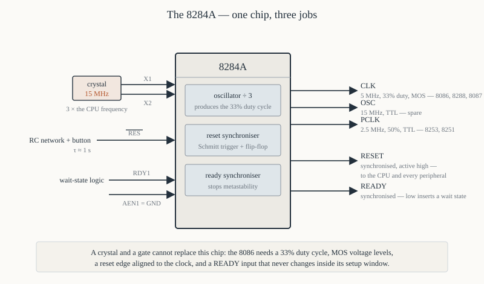
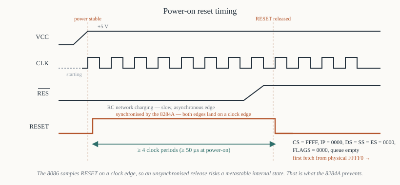

# Chapter 12 — Clock, reset and the 8284A

[← The pin diagram](11-pin-diagram.md) · [Contents](README.md) · [Next: Bus cycles and timing →](13-bus-cycles-timing.md)

---

## Goal

Cover the three things that must be right before an 8086 executes a single instruction: a clock of
the correct frequency, duty cycle and voltage; a reset pulse of the correct length, synchronised to
that clock; and a `READY` input that is stable when the processor samples it.

All three come from one chip, the **8284A**, and this chapter explains why each one cannot simply be
done with a crystal and a resistor.

---

## 1. Why the clock cannot be a simple oscillator

The 8086's `CLK` input has three requirements that an ordinary TTL oscillator does not meet.

### 1.1 The 33% duty cycle

The 8086 does internal work on **both** clock edges, and the amount of work differs. Intel specified
a clock that is **high for one third of the period and low for two thirds**:

```
        ┌───┐         ┌───┐         ┌───┐
   CLK  │   │         │   │         │   │
     ───┘   └─────────┘   └─────────┘   └───────

        |<->|<------->|
         1/3    2/3
         high   low
```

At 5 MHz the period is 200 ns, so high for ~69 ns and low for ~131 ns. The datasheet's limits are
`tCH` ≥ 69 ns and `tCL` ≥ 118 ns.

A 50% square wave at 5 MHz violates this. The chip may work, at one temperature, on one Tuesday.

The 8284A produces the 33% duty cycle by taking a crystal at **three times** the CPU frequency and
dividing by three, asymmetrically. This is why a 5 MHz 8086 uses a **15 MHz** crystal.

### 1.2 MOS voltage levels

`CLK` is not a TTL input. Its thresholds are:

```
   VIL(max) = 0.6 V           (TTL guarantees only 0.8 V)
   VIH(min) = 3.9 V           (TTL guarantees only 2.4 V)
```

A standard 74LS gate driving `CLK` would spend its life in the forbidden band. The 8284A's `CLK`
output swings properly for a MOS input; this is a real electrical reason, not a licensing one.

### 1.3 Minimum frequency

**2 MHz.** The 8086 uses dynamic storage internally — charge on capacitances that leaks away — so it
must be clocked continuously above that rate or it loses state.

Consequences you should know:

- **You cannot single-step an 8086 by stopping the clock.** Single-stepping is done with the trap
  flag (Chapter 8 §8.3), in software.
- **You cannot "slow the clock down to watch it on a scope"** below 2 MHz.
- You cannot save power by halting the oscillator. `HLT` stops execution but the clock keeps running.

The fully static CMOS version, the **80C86**, removed this limit and could be clocked down to DC.

---

## 2. The 8284A



An 18-pin chip that does three jobs: **clock generation**, **reset synchronisation** and **READY
synchronisation**.

### 2.1 Pinout

```
                  ┌────∪────┐
          CSYNC 1 ─┤         ├─ 18  VCC
           PCLK 2 ─┤         ├─ 17  X1
       AEN1 3 ─────┤         ├─ 16  X2
       RDY1 4 ─────┤  8284A  ├─ 15  ASYNC
    READY 5 ───────┤         ├─ 14  EFI
       RDY2 6 ─────┤         ├─ 13  F/C
       AEN2 7 ─────┤         ├─ 12  OSC
          CLK 8 ───┤         ├─ 11  RES
            GND 9 ─┤         ├─ 10  RESET
                  └─────────┘
```

| Pin | Name | Direction | Purpose |
|-----|------|-----------|---------|
| 17, 16 | `X1`, `X2` | in | crystal connections — 3 × the CPU frequency |
| 13 | `F/C#` | in | 1 = use `EFI`, 0 = use the crystal |
| 14 | `EFI` | in | External Frequency Input, if you'd rather supply a clock |
| 8 | `CLK` | out | the processor clock — ÷3, 33% duty, MOS levels |
| 12 | `OSC` | out | the raw crystal frequency, TTL levels (use it for other chips) |
| 2 | `PCLK` | out | peripheral clock — ÷6 of the crystal, 50% duty, TTL levels |
| 11 | `RES#` | in | raw reset, from an RC network or a button |
| 10 | `RESET` | out | clean, synchronised reset for the 8086 |
| 4, 6 | `RDY1`, `RDY2` | in | two ready inputs, for two bus "sides" |
| 3, 7 | `AEN1#`, `AEN2#` | in | qualify `RDY1`/`RDY2` — address enable |
| 5 | `READY` | out | synchronised ready for the 8086 |
| 15 | `ASYNC#` | in | selects one-stage or two-stage ready synchronisation |
| 1 | `CSYNC` | in | clock synchronisation for multiple 8284As |

### 2.2 The three output clocks

One crystal, three useful frequencies:

| Output | Frequency | Duty | Levels | Typical use |
|--------|-----------|------|--------|-------------|
| `OSC` | crystal (15 MHz) | ~50% | TTL | a second 8284A, or a timer input |
| `CLK` | crystal ÷ 3 (5 MHz) | **33%** | MOS | the 8086's `CLK` pin, the 8288, the 8087 |
| `PCLK` | crystal ÷ 6 (2.5 MHz) | 50% | TTL | peripherals such as the 8253 or 8251 |

The relationship is fixed. If you want a 5 MHz CPU you use a 15 MHz crystal and you get 2.5 MHz
`PCLK`, whether that suits your 8253 or not. Chapter 48 works around it.

**Everything that must be synchronous with the CPU takes `CLK`** — that includes the 8288 bus
controller, the 8087 coprocessor, and the 8089 I/O processor, all of which must see exactly the same
clock edges as the 8086.

### 2.3 The crystal circuit

```
                     ┌──────────┐
          X1  ───────┤          │
                     │ crystal  │        15 MHz, parallel resonant
          X2  ───────┤  15 MHz  │        fundamental mode
                     └──────────┘
                 │              │
               ═══ 12 pF      ═══ 12 pF     (loading capacitors)
                 │              │
                GND            GND
```

Tie `F/C#` low to select the crystal. The capacitors are the crystal's specified load capacitance,
typically 10–20 pF; getting them wrong shifts the frequency by a few hundred ppm, which matters for
serial baud rates (Chapter 50) and not at all for anything else.

To use an external oscillator module instead, tie `F/C#` **high** and feed the module's output into
`EFI`. This is what you do when several boards must share one clock.

---

## 3. Reset

### 3.1 What the 8086 requires

- `RESET` high for at least **four clock periods** during normal operation.
- `RESET` high for at least **50 µs** after power is first applied, to let the supply and the
  crystal oscillator stabilise.
- The falling edge must be **synchronous with the clock** — the 8086 samples `RESET` on the falling
  edge of `CLK`, and an asynchronous release risks a metastable internal state.

A pushbutton meets none of these. Contacts bounce for milliseconds and release whenever they feel
like it.

### 3.2 What the 8284A does

The `RES#` input goes to a **Schmitt trigger**, so slow RC edges become clean ones, and the result is
then clocked into a flip-flop by `CLK`. The `RESET` output therefore changes only on a clock edge.

```
         +5 V
          │
          ├────────┐
          │        │
         ┌┴┐      ─┴─  push-button
      R  │ │      ─┬─  (optional, to ground)
     100k└┬┘       │
          ├────────┴────────► RES#  (pin 11)
          │
        ═══ C
       22 µF
          │
         GND
```

At power-on, C is discharged, so `RES#` is at 0 V — asserted (it is active low). C charges through R
with time constant τ = RC = 100 kΩ × 22 µF = 2.2 s, and `RES#` releases when the voltage crosses the
Schmitt threshold, around 1.5 V — roughly 0.4τ ≈ 0.9 s.

Nearly a second is far longer than the required 50 µs, which is deliberate: it guarantees that slow
peripherals and the crystal oscillator are all up before the processor starts.

Pressing the button discharges C again, giving a manual reset with the same guaranteed length. (A
resistor of a few hundred ohms in series with the button limits the discharge current and saves the
capacitor.)

### 3.3 What reset does to the processor

| Register | Value after reset |
|----------|-------------------|
| `CS` | `0xFFFF` |
| `IP` | `0x0000` |
| `DS` | `0x0000` |
| `SS` | `0x0000` |
| `ES` | `0x0000` |
| `FLAGS` | `0x0000` |
| queue | empty |

Everything else — `AX` through `DI` — is **undefined**. Do not assume registers are zero.

`FLAGS = 0` means `IF = 0`, so **interrupts are disabled**, and `DF = 0`, so string instructions
count upwards. `TF = 0`, so no single-stepping.

Reset also forces `ALE`, `RD#`, `WR#`, `DEN#`, `HLDA` and `INTA#` to their inactive states, and
floats `AD15–AD0`.

---

## 4. The first instruction

`CS:IP` = `FFFF:0000` → physical address:

```
   0xFFFF × 16 + 0x0000  =  0xFFFF0
```

Sixteen bytes from the top of the 1 MiB space. Everything above `0xFFFF0` is `0xFFFF1` … `0xFFFFF`
— fifteen more bytes, and then the address space ends.

Sixteen bytes is not enough for an initialisation routine, so **the only thing ever placed there is a
far jump**:

```asm
        ; at physical 0xFFFF0
        jmp  0xF000:0xE05B          ; EA 5B E0 00 F0    — 5 bytes
```

`EA` is the far-jump opcode; the four bytes after it are the offset then the segment, low byte first
(Chapter 2 §7). That takes the processor to `0xFE05B`, where the real BIOS lives, with 64 KiB of ROM
available.

The remaining eleven bytes at the top were used, on the IBM PC, for the BIOS release date in ASCII
and a one-byte model identifier — which is how software used to identify which PC it was running on.

### 4.1 This memory must be ROM

There is no bootstrap loader, no firmware download, nothing. The processor fetches from `0xFFFF0`
immediately, so valid instructions must be present the microsecond power comes up. That means
non-volatile memory — a 27256 EPROM or a flash device — decoded to the top of the address space.
Chapter 16 §5 designs that decoding.

---

## 5. Reset timing, drawn



```
              power stable
                   │
   VCC   __________│───────────────────────────────────────────
                   │
   CLK   ░░░░░░░░░░│┐ ┌┐ ┌┐ ┌┐ ┌┐ ┌┐ ┌┐ ┌┐ ┌┐ ┌┐ ┌┐ ┌┐ ┌┐ ┌─
         (starting)│└─┘└─┘└─┘└─┘└─┘└─┘└─┘└─┘└─┘└─┘└─┘└─┘└─┘
                   │
   RES#  ──────────│________________________________┌─────────
                   │        (RC charging)           │
                   │                                │
   RESET ──────────│────────┌───────────────────────┴─┐
                   │        │  >= 4 clock periods      └───────
                   │        │                          │
                   │        └── synchronised rise      └── synchronised fall
                   │                                       CS=FFFF, IP=0000
                                                           fetch from FFFF0 ──►
```

Two details worth naming:

**The 8284A's `RESET` output is the *inverse* of `RES#`,** and synchronised. `RES#` is active low;
`RESET` is active high, because that is what the 8086 wants.

**The first bus cycle begins about 7 clock periods after `RESET` falls.** The 8086 needs a few clocks
to reinitialise internally before fetching.

---

## 6. `READY` and wait-state generation

### 6.1 The problem

At 5 MHz, a bus cycle is four clock periods = 800 ns, of which memory has roughly 460 ns from address
valid to data required (Chapter 13 §6 does the arithmetic). A 450 ns EPROM just about makes it; a
slower device does not.

Rather than slow the whole system down, the 8086 lets an individual device **stretch its own cycle**
by pulling `READY` low.

### 6.2 How it works

The 8086 samples `READY` **at the end of T3**:

- `READY` **high** → proceed to T4, cycle completes normally.
- `READY` **low** → insert a wait state `Tw`, an entire extra clock period, then sample again.

Wait states are inserted indefinitely until `READY` goes high, so a device can take as long as it
likes. Chapter 13 §7 draws the waveform.

### 6.3 Why it must be synchronised

`READY` has a **setup time** requirement relative to the clock — `tRYHCH` = 35 ns before the falling
edge of `CLK` in T3. A decoder output, which changes whenever the address changes, cannot meet that
reliably, and if `READY` changes during the sampling window the internal flip-flop can go
*metastable*: it settles to an unpredictable value some nanoseconds later, and the processor either
hangs or continues with corrupt state.

The 8284A solves it with a flip-flop clocked by `CLK`, so the `READY` the 8086 sees always changes on
a clock edge and always meets setup.

### 6.4 The `RDY`/`AEN` inputs

The 8284A has **two** ready inputs, each with an enable:

```
   READY =  (RDY1 AND NOT AEN1#)  OR  (RDY2 AND NOT AEN2#)
```

The two pairs exist for **multi-master systems** (Multibus, in Intel's world): one pair for the local
bus, one for the system bus, with `AEN` from the arbiter saying which bus this cycle is using.

In a single-master design you use one pair and disable the other:

```
   RDY1 = your wait-state logic
   AEN1# = GND        (enabled)
   RDY2 = GND
   AEN2# = +5 V       (disabled)
```

If you want **no wait states at all**, tie `RDY1` high and `AEN1#` low. Do not leave `RDY1`
floating; it will be read as low sooner or later and the processor will stop in T3 forever, which
presents as a completely dead board with a running clock.

### 6.5 `ASYNC#`

Selects how many synchronising stages the ready input passes through:

- `ASYNC#` **low** (two stages): for a `RDY` signal that is not synchronised to `CLK` at all. Safer,
  and costs a little setup margin.
- `ASYNC#` **high** (one stage): for a `RDY` already synchronous with `CLK`.

When in doubt, tie it low.

### 6.6 A one-wait-state generator

The simplest useful wait-state circuit: a shift register clocked by `CLK` that delays `READY` by one
period whenever a slow device is selected.

```
                    ┌──────────┐        ┌──────────┐
   slow device  ──► │ D      Q ├──────► │ D      Q ├──────►  to RDY1
   chip select      │          │        │          │
   (active high)    │ 74LS74   │        │ 74LS74   │
        CLK    ───► │>         │   ┌──► │>         │
                    └──────────┘   │    └──────────┘
        CLK  ──────────────────────┘
```

Each flip-flop delays by one clock, so *n* flip-flops give *n* wait states. In practice you build
this from a 74LS164 shift register with a tap selected by a jumper, so the board can be adjusted for
whatever EPROM is fitted.

---

## 7. Putting it together

The complete clock and reset section of an 8086 board:

```
      15 MHz xtal
          ║
        ┌─╨─┐
   ┌────┤X1 X2├────┐
   │    │         │
   │    │  8284A  │
   │    │         │
   │    │   CLK   ├──────────────┬──────────► 8086 pin 19 (CLK)
   │    │         │              ├──────────► 8288 CLK    (max mode)
   │    │         │              └──────────► 8087 CLK    (if fitted)
   │    │   PCLK  ├────────────────────────► 8253, 8251 clocks
   │    │   OSC   ├────────────────────────► (spare)
   │    │         │
   │    │  RESET  ├────────────────────────► 8086 pin 21 (RESET)
   │    │         │                          and every peripheral's reset
   │    │  READY  ├────────────────────────► 8086 pin 22 (READY)
   │    │         │
   └────┤RES#  RDY1├◄─── wait-state logic
        │     AEN1#│◄─── GND
        │   F/C#   │◄─── GND (use the crystal)
        │  ASYNC#  │◄─── GND
        └──────────┘
          ▲
          │
     RC network + button
```

Note that `RESET` goes to *everything*, not just the CPU. The 8255, 8253, 8259A and 8251 all have
reset inputs and all must be reset with the processor, or they come up in an undefined state and the
initialisation code writes control words into a chip that is mid-sequence.

---

## 8. Frequencies in the real machines

| Machine | CPU | Crystal | CPU clock | Why |
|---------|-----|---------|-----------|-----|
| Intel SDK-86 | 8086 | 14.7456 MHz | 4.9152 MHz | divides exactly to standard baud rates |
| IBM PC 5150 | 8088 | 14.31818 MHz | 4.77 MHz | it is 4 × the NTSC colour subcarrier — cheap crystals |
| IBM PC/XT | 8088 | 14.31818 MHz | 4.77 MHz | same |
| Typical trainer board | 8086 | 15 MHz | 5 MHz | round numbers |

The IBM PC's famous 4.77 MHz is not a design target; it is what you get from dividing a television
crystal by three, because those crystals cost a few cents. The same crystal also fed the CGA video
timing, which is why it was chosen.

`14.7456 MHz ÷ 3 = 4.9152 MHz`, and `4.9152 MHz ÷ 16 ÷ 2 = 153,600` — which divides evenly to 9600,
4800, 2400, 1200 and 300 baud. If your design does serial I/O, choose the crystal for the baud rate
and accept the odd CPU frequency. Chapter 50 §5.

---

## 9. Summary

```
  CLK must be:  33% duty cycle (high 1/3, low 2/3)
                MOS levels (VIH >= 3.9 V)
                between 2 MHz and the part's rating
                => you need an 8284A; a crystal and a gate will not do

  8284A:  crystal at 3x CPU frequency on X1/X2, F/C# low
          CLK  = xtal / 3, 33%, MOS   -> 8086, 8288, 8087
          PCLK = xtal / 6, 50%, TTL   -> peripherals
          OSC  = xtal,     50%, TTL

  RESET:  RES# from an RC network (tau ~ 1 s) through a Schmitt trigger
          8284A synchronises it; falling edge must be on a clock edge
          >= 4 clocks normally, >= 50 us at power-on
          After reset: CS=FFFF IP=0000 DS=SS=ES=0000 FLAGS=0000, queue empty
          First fetch from physical FFFF0 -> must be ROM -> always a far jump

  READY:  sampled at the END OF T3; low inserts a whole wait state Tw
          must be synchronised or the internal flip-flop can go metastable
          tie RDY1 high / AEN1# low for a no-wait-state system
```

---

## Exercises

**12.1** An 8086 is to run at 8 MHz. What crystal frequency does its 8284A need? What will `PCLK`
be?

**12.2** Why is a 50% duty-cycle clock not acceptable to an 8086? Give the datasheet quantity
involved.

**12.3** At 5 MHz, how long is the high phase of `CLK` and how long is the low phase?

**12.4** What is the minimum clock frequency of an 8086, and what physical property of the chip
imposes it? Name one debugging technique this rules out.

**12.5** An RC reset network uses R = 47 kΩ and C = 10 µF. Estimate the time for which `RES#` is
held asserted at power-up, and say whether it satisfies the 8086's requirement.

**12.6** List the contents of `CS`, `IP`, `DS`, `SS`, `ES` and `FLAGS` immediately after reset. What
is in `AX`?

**12.7** What physical address does the 8086 fetch its first instruction from? How many bytes are
available there, and what is always put in them?

**12.8** Decode the five bytes `EA 5B E0 00 F0` as an instruction, and give the physical address it
transfers control to.

**12.9** A board has a 450 ns EPROM and a 5 MHz 8086. Roughly 460 ns is available from address valid
to data needed with no wait states. Would you insert a wait state? Justify the margin you would want.

**12.10** Why can a decoder output not be connected directly to the 8086's `READY` pin? Name the
failure mode.

**12.11** `RDY1` is left floating on a prototype board. Describe the symptom.

**12.12** Why must the 8284A's `RESET` output go to the peripheral chips as well as the CPU?

**12.13** The IBM PC runs at 4.77 MHz. Where does that number come from, and why was it chosen?

Answers in [Appendix H](H-exercise-solutions.md#chapter-12).

---

[← The pin diagram](11-pin-diagram.md) · [Contents](README.md) · [Next: Bus cycles and timing →](13-bus-cycles-timing.md)
