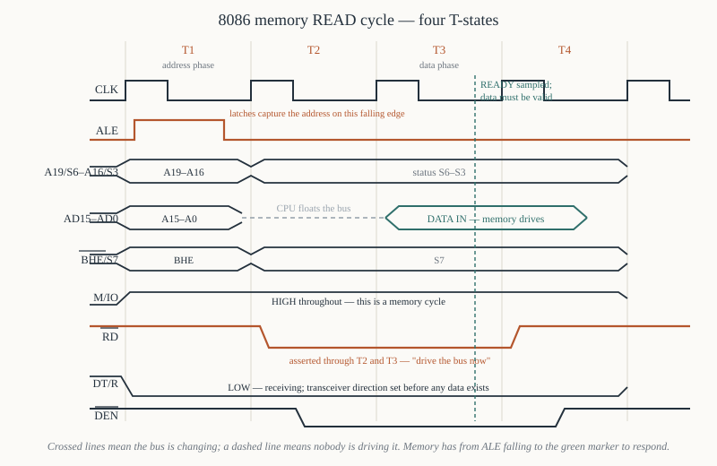
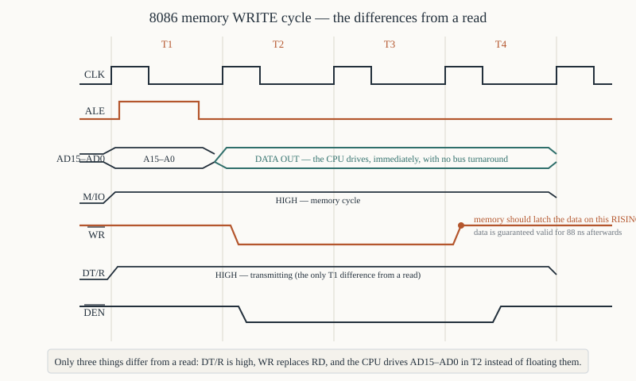
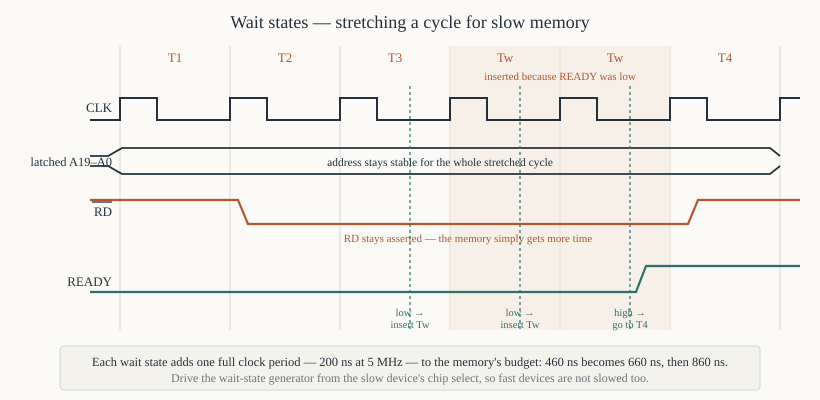

# Chapter 13 — Bus cycles and timing

[← Clock, reset and the 8284A](12-clock-reset-8284.md) · [Contents](README.md) · [Next: Minimum mode systems →](14-minimum-mode.md)

---

## Goal

Take one memory read and one memory write apart, clock edge by clock edge, naming every signal
transition and saying what it is for. Then add wait states, then do the arithmetic that decides
whether a given memory chip is fast enough.

This is the hardest chapter in Part II and the one Chapters 14–17 and all of Part V depend on. Go
slowly. Take one signal, follow it left to right, say out loud what it is doing; then take the next.

---

## 1. Vocabulary

**T-state.** One clock period. At 5 MHz, 200 ns. Written T1, T2, T3, T4.

**Bus cycle** (also *machine cycle*). One complete transaction on the bus — a memory read, a memory
write, an I/O read, an I/O write, an interrupt acknowledge or a halt. **Four T-states**, plus wait
states.

**Wait state, `Tw`.** An extra clock period inserted between T3 and T4 when `READY` is low. Any
number, including none.

**Idle state, `Ti`.** A clock period during which the BIU runs no bus cycle at all — the queue is
full and the EU needs nothing. The bus sits inactive.

A processor that is executing `ADD AX, BX` repeatedly, with a full queue, produces a stream of `Ti`
states and no bus activity whatsoever.

---

## 2. What happens in each T-state, in one table

The shape of every bus cycle:

| T-state | What the 8086 does |
|---------|--------------------|
| **T1** | Drives the address on `AD15–AD0` and `A19/S6–A16/S3`; drives `BHE#`; pulses `ALE` high then low; sets `M/IO#` and `DT/R#` |
| **T2** | Stops driving the address; for a **read**, floats `AD15–AD0` and asserts `RD#`; for a **write**, drives the data and asserts `WR#`; upper lines switch to status `S7–S3`; asserts `DEN#` |
| **T3** | The addressed device is expected to have responded. `READY` is sampled. Data is on the bus (from memory on a read, from the CPU on a write) |
| **Tw** | Inserted only if `READY` was low. Everything holds still. `READY` sampled again |
| **T4** | `RD#`/`WR#` released; data latched into the CPU on a read; `DEN#` released. The cycle ends |

Notice the division of labour: **T1 is the address phase and T2–T4 are the data phase.** That split
is what the multiplexing of Chapter 11 §1 forces, and `ALE` is the boundary marker.

---

## 3. The read cycle, transition by transition



Take `mov ax, [0x0250]` with `DS = 0x1000`, so the physical address is `0x10250`.

### T1 — the address phase

**At the start of T1** (falling edge of `CLK`):

1. **`M/IO#` goes high** (memory, not I/O). It stays valid until T4. A decoder can use it from this
   moment.
2. **`DT/R#` goes low** (Receive — the 8086 is reading). The data transceivers' direction is set now,
   before any data exists.
3. **The address appears** on `AD15–AD0` = `0x0250` and on `A19/S6–A16/S3` = `0x1` (the top four bits
   of `0x10250`). Valid within `tCLAV` = 110 ns of the clock edge.
4. **`BHE#` goes low.** The address is even and the access is a word, so both banks are enabled —
   `BHE# = 0`, `A0 = 0` (Chapter 10 §2.1).

**During T1, `ALE` pulses high and then falls** near the end of T1. The 74LS373 latches are
transparent while it is high; when it falls they capture and hold the address. From this instant the
demultiplexed address bus `A19–A0` is stable and will stay stable for the rest of the cycle, no
matter what the `AD` pins do.

**This is the single most important event in an 8086 system.** Everything downstream — decoders, chip
selects, memory address inputs — works from the latched address, not the pins.

### T2 — handover

1. **The 8086 stops driving `AD15–AD0`** and floats them, so memory can drive them. The address is
   safe in the latches.
2. **The upper lines switch from address to status**: `A19/S6–A16/S3` now carry `S6–S3`, and
   `BHE#/S7` carries `S7`. Their address content is also safe in a latch.
3. **`RD#` goes low.** This is the strobe that tells the selected device "drive the bus now".
4. **`DEN#` goes low**, enabling the data transceivers — but only now, after the address phase is
   over, so the transceivers never fight the latches.

### T3 — the data must arrive

Memory has had from the address being valid in T1 until partway through T3 to produce data. That
window is the number that decides whether your memory chip works, and §6 computes it.

**`READY` is sampled during T3.** If high, the cycle finishes in T4. If low, wait states are
inserted (§7).

The data appears on `D15–D0` some time during T3 and must be stable before the sampling point.

### T4 — capture and release

1. **The 8086 latches the data** on the falling edge of `CLK` at the start of T4 — strictly, it
   samples at the end of T3 / start of T4, requiring `tDVCL` = 30 ns of setup and `tCLDX` = 10 ns of
   hold.
2. **`RD#` goes high**, releasing the memory.
3. **`DEN#` goes high**, switching off the transceivers.
4. The status lines return to their passive state.

The next T-state is either T1 of another bus cycle, or `Ti`.

### 3.1 The whole read cycle as a picture

```
          T1          T2          T3          T4
       ┌────┐      ┌────┐      ┌────┐      ┌────┐
 CLK ──┘    └──────┘    └──────┘    └──────┘    └────

 ALE  ───┌──┐─────────────────────────────────────────
      ───┘  └─────────────────────────────────────────
             ▲ latches capture the address here

 A19-16  ───<  ADDR  ><══════ S6-S3 ═══════════>──────

 AD15-0  ───<  ADDR  >──ZZZZ──<═══ DATA IN ═══>───────
                        float   memory drives

 BHE     ───<  BHE   ><══════ S7 ══════════════>──────

 M/IO    ───<════════ HIGH for memory ═════════>──────

 RD      ──────────────┐                      ┌───────
                       └──────────────────────┘

 DT/R    ───<═══════ LOW — receiving ══════════>──────

 DEN     ─────────────────┐                ┌──────────
                          └────────────────┘

 READY                            ↑ sampled here
```

---

## 4. The write cycle



Take `mov [0x0250], ax`. The differences from a read are few but each one matters.

### T1 — identical, except `DT/R#`

Everything is the same as §3, **except `DT/R# goes high`** — Transmit; the 8086 is sending. The
transceivers are pointed outwards before any data appears.

### T2 — the CPU drives the data immediately

The crucial difference: on a read, the 8086 *floats* `AD15–AD0` in T2 and waits; on a write it
**drives the data onto them straight away**. There is no turnaround, because the bus never changes
owner.

**`WR#` goes low** in T2 and stays low through T3 and any wait states.

### T3 and T4

The data is already valid and stays valid. Memory captures it — and here is the important subtlety:

> **Memory should latch the data on the *rising* edge of `WR#`, not on its falling edge.**

`WR#` rises at the start of T4, and the 8086 guarantees data hold time `tWHDX` = 88 ns after that.
Latching on the trailing edge gives memory the longest possible setup and a guaranteed hold. Nearly
every static RAM is designed this way.

### 4.1 Write cycle picture

```
          T1          T2          T3          T4
       ┌────┐      ┌────┐      ┌────┐      ┌────┐
 CLK ──┘    └──────┘    └──────┘    └──────┘    └────

 ALE  ───┌──┐─────────────────────────────────────────
      ───┘  └─────────────────────────────────────────

 AD15-0  ───<  ADDR  ><═════ DATA OUT ═════════>──────
                       CPU drives, no float, no turnaround

 M/IO    ───<════════ HIGH for memory ═════════>──────

 WR      ──────────────┐                      ┌───────
                       └──────────────────────┘
                                              ▲
                                     memory latches here

 DT/R    ───<═══════ HIGH — transmitting ══════>──────

 DEN     ─────────────────┐                ┌──────────
                          └────────────────┘
```

### 4.2 Read versus write, side by side

| | Read | Write |
|---|------|-------|
| `DT/R#` | 0 (receive) | 1 (transmit) |
| Strobe | `RD#` low in T2–T3 | `WR#` low in T2–T3 |
| `AD15–AD0` in T2 | **floated** by the CPU | **driven** by the CPU |
| Who drives the data | the memory | the CPU |
| Critical timing | memory's access time vs the window | data setup before `WR#` rises |
| Data captured | by the CPU, end of T3 | by the memory, rising edge of `WR#` |

---

## 5. I/O cycles and the other cycle types

### 5.1 I/O read and write

**Identical to memory cycles except that `M/IO#` is low.** Same four T-states, same `RD#`/`WR#`, same
`ALE`, same everything.

Two differences in the address:

- Only `A15–A0` are meaningful — the I/O space is 64 KiB, so `A19–A16` are driven to 0.
- For `IN AL, 0x60` (the immediate form) the address is `0x0060`; for `IN AL, DX` it is whatever is
  in `DX`.

The 8088 always inserts **one automatic wait state** into I/O cycles; the 8086 does not. Chapter 17
§7.

### 5.2 Interrupt acknowledge

**Two back-to-back bus cycles**, each four T-states, with `INTA#` low instead of `RD#` and `M/IO#`
low:

```
   cycle 1:  INTA# low.  AD bus floats. The 8259A uses this to resolve priority.
   idle:     3 idle clocks between the two cycles
   cycle 2:  INTA# low.  The interrupting device drives the 8-bit type number on AD7-AD0.
```

`LOCK#` is asserted across both in maximum mode, so no other master can steal the bus between them.
Chapter 31 §5, Chapter 49 §6.

### 5.3 Halt

`HLT` produces one bus cycle with `ALE` pulsed and no `RD#` or `WR#`, after which the processor
stops. In maximum mode the status code `S2#S1#S0#` = `011` tells the 8288 it is a halt. The bus goes
idle and stays idle until an interrupt or reset.

---

## 6. Is my memory fast enough?

The calculation that decides whether a design works. At 5 MHz, `TCLCL` = 200 ns.

### 6.1 Access time from address valid

The memory sees a valid address when the latches settle, which is shortly after `ALE` falls. It must
supply data before the 8086 samples, near the end of T3.

```
   Time from CLK edge at the start of T1 to data sampled:   3 × TCLCL   = 600 ns
   minus  address valid delay from that edge   (tCLAV)      =  110 ns
   minus  data setup required before sampling  (tDVCL)      =   30 ns
                                                              ───────
   Time available for the memory                            =  460 ns
```

From that 460 ns you must subtract the real delays of the glue between the CPU and the memory:

```
   74LS373 latch propagation                        ~ 30 ns
   74LS138 address decoder                          ~ 30 ns
   74LS245 transceiver (data direction)             ~ 12 ns
   board trace and connector delays                 ~  5 ns
                                                      ──────
   total overhead                                   ~ 77 ns

   memory access time must be <= 460 - 77           = 383 ns
```

So with no wait states at 5 MHz you need memory rated **at or under about 380 ns**.

| Device | Typical access time | Works at 5 MHz with no waits? |
|--------|--------------------|-------------------------------|
| 6116 SRAM (−12) | 120 ns | comfortably |
| 6264 SRAM (−15) | 150 ns | comfortably |
| 2764 EPROM (−25) | 250 ns | yes, with margin |
| 2764 EPROM (−45) | 450 ns | **no** — needs one wait state |
| 27256 EPROM (−30) | 300 ns | yes, just |

EPROMs are the usual problem. They are slow, and they are exactly what you need at power-on. A very
common arrangement is: **no wait states for RAM, one wait state for ROM**, with the wait-state
generator triggered by the ROM's chip select.

### 6.2 Access time from `RD#`

Some memories specify an output-enable access time as well, measured from `OE#` (which you drive from
`RD#`) rather than from the address. That window is shorter:

```
   RD# is low for about 2 × TCLCL − 75 ns          = 325 ns
   minus data setup (tDVCL)                        =  30 ns
                                                     ──────
   available from RD# low                          = 295 ns
```

A chip must satisfy **both** constraints. In practice the address-access number is the binding one
for EPROMs and the `OE#` number is the binding one for fast SRAMs.

### 6.3 At 8 and 10 MHz

`TCLCL` shrinks to 125 ns and 100 ns respectively, so:

| Clock | `TCLCL` | 3 × `TCLCL` | Available (approx, after overheads) |
|-------|---------|-------------|--------------------------------------|
| 5 MHz | 200 ns | 600 ns | ~383 ns |
| 8 MHz | 125 ns | 375 ns | ~200 ns |
| 10 MHz | 100 ns | 300 ns | ~135 ns |

At 10 MHz almost nothing in 1980 was fast enough, which is why fast 8086 systems used wait states
routinely and why cache memory was invented.

---

## 7. Wait states



### 7.1 The mechanism

The 8086 samples `READY` during T3. If low:

```
   ... T2 ── T3 ── Tw ── Tw ── Tw ── T4 ...
                    ▲     ▲     ▲
                    READY sampled again in each one
```

Everything freezes: the address stays latched, `RD#` or `WR#` stays asserted, `DEN#` stays asserted.
The only thing that happens is time passing. The processor will wait for ever.

Each wait state adds one full clock period — 200 ns at 5 MHz — to the memory's budget:

```
   no wait states :  460 ns available
   one wait state :  660 ns
   two wait states:  860 ns
```

### 7.2 The cost

A bus cycle goes from 4 clocks to 4 + *n*. Since typical code spends a large fraction of its time on
bus cycles, one wait state costs roughly **20–25% of total performance**, and it costs it on *every*
access to that device, whether or not the device is the bottleneck.

The rule: put wait states on the slow device only, not globally. That means the wait-state generator
must be driven by the slow device's chip select, not by a timer.

### 7.3 A practical generator

From Chapter 12 §6.6, with the input being the ROM's chip select:

```
   ROM_CS# ──►│ inverter │──► D of FF1 ──► Q1 ──► D of FF2 ──► Q2
                                 CLK             CLK

   RDY1 = NOT( ROM_selected AND NOT Q1 )
```

One flip-flop delays `READY` by one clock, giving exactly one wait state for accesses to the ROM and
none for anything else.

---

## 8. Reading a real timing diagram

Every parameter in a datasheet has a name of the form `tXXYY` meaning "from X to Y". Once you can
decode the names, the tables read themselves.

```
   t CL AV     =  from CLock Low to Address Valid
   t CL AX     =  from CLock Low to Address invalid (X = don't care)
   t CL RL     =  from CLock Low to RD Low
   t RL RH     =  from RD Low to RD High  (the pulse width)
   t DV CL     =  from Data Valid to CLock Low  (a setup requirement)
   t CL DX     =  from CLock Low to Data invalid (a hold requirement)
   t CH LL     =  from Clock High to aLe Low
   t WH DX     =  from WR High to Data invalid
```

Two kinds of number appear:

**Maximums are promises the 8086 makes.** `tCLAV` (max) = 110 ns means "the address will be valid no
later than 110 ns after the edge". You design assuming the worst.

**Minimums are requirements the 8086 imposes.** `tDVCL` (min) = 30 ns means "you must present data at
least 30 ns before I sample". You design to exceed it.

Mixing those two up is the commonest error in timing analysis. When in doubt: if the signal is an
8086 *output*, the number is a promise; if it is an 8086 *input*, the number is a demand.

### 8.1 The numbers you will use most (5 MHz 8086)

| Parameter | Min | Max | Meaning |
|-----------|-----|-----|---------|
| `TCLCL` | 200 | 500 | clock period |
| `TCLCH` | 118 | — | clock **low** time (CLK low to CLK high) |
| `TCHCL` | 69 | — | clock **high** time (CLK high to CLK low) |
| `TCLAV` | 10 | 110 | clock low → address valid |
| `TCLAX` | 10 | — | address hold after clock low |
| `TLHLL` | 67 | — | `ALE` pulse width |
| `TAVAL` | 60 | — | address valid before `ALE` falls |
| `TCLRL` | 10 | 165 | clock low → `RD#` low |
| `TRLRH` | 325 | — | `RD#` pulse width |
| `TCLRH` | 10 | 150 | clock low → `RD#` high |
| `TDVCL` | 30 | — | **data setup** before the sampling clock edge |
| `TCLDX` | 10 | — | **data hold** after it |
| `TCVCTV` | 10 | 110 | clock → control signal valid |
| `TWHDX` | 88 | — | data hold after `WR#` rises |
| `TRYHCH` | 118 | — | **`READY` setup** before the clock edge in T3 |

Full table in [Appendix F](F-timing-electrical.md).

---

## 9. A complete worked timing analysis

**Design:** 5 MHz 8086, minimum mode, 2764 EPROM (−25, 250 ns) at the top of memory, 6264 SRAM
(−15, 150 ns) below it. Address latched by 74LS373 (30 ns), decoded by 74LS138 (30 ns), data buffered
by 74LS245 (12 ns).

**Question:** does either need a wait state?

**Step 1 — total window.** 3 × 200 = 600 ns from the T1 clock edge to the sampling point.

**Step 2 — subtract the CPU's own delays.**
```
   600 − tCLAV(110) − tDVCL(30)  =  460 ns
```

**Step 3 — subtract the glue.** The critical path is: `AD` pins → latch → decoder → chip select →
memory; and then memory → transceiver → `AD` pins.

```
   latch propagation                30 ns
   decoder propagation              30 ns
   transceiver propagation (return) 12 ns
   board delays                      5 ns
                                    ─────
                                    77 ns

   available to the memory chip  =  460 − 77  =  383 ns
```

**Step 4 — compare.**

```
   6264 SRAM  150 ns  <=  383 ns    ✔  no wait states
   2764 EPROM 250 ns  <=  383 ns    ✔  no wait states, 133 ns of margin
```

Both fit. Note that the EPROM's margin is 133 ns — about 35%. That is comfortable. With a 450 ns
EPROM the sum would be 450 > 383 and one wait state would be mandatory, giving
`660 − 77 = 583 ns` available and a large margin.

**Step 5 — check the `OE#` path too.** `RD#` is low for 325 ns; subtract 30 ns of setup and 12 ns for
the transceiver → 283 ns from `OE#`. A 2764's `tOE` is typically 100 ns. ✔

**Conclusion:** no wait states needed. Tie `RDY1` high.

---

## 10. Summary

```
  bus cycle = T1 T2 T3 [Tw...] T4        at 5 MHz, one T = 200 ns

  T1  address on AD15-AD0 and A19-A16; BHE valid; M/IO valid; DT/R set
      ALE pulses HIGH then falls -> external latches capture the address
  T2  address removed. READ: AD floats, RD goes low.
                       WRITE: CPU drives data, WR goes low.
      upper lines switch to status S7-S3. DEN asserted.
  T3  data expected on the bus. READY sampled.
  Tw  inserted while READY is low. Everything holds.
  T4  data captured (read) or memory latches on WR's RISING edge (write).
      RD/WR and DEN released.

  read vs write:  DT/R = 0 vs 1;  AD floats vs is driven in T2
  I/O cycle    :  identical but M/IO = 0, only A15-A0 meaningful
  INTA         :  TWO cycles; type number arrives on AD7-AD0 in the second

  memory budget at 5 MHz, no waits:
      3 x 200 - 110 (tCLAV) - 30 (tDVCL)  =  460 ns
      minus latch + decoder + transceiver ~ 77 ns  =  383 ns
  each wait state adds one full 200 ns
```

---

## Exercises

**13.1** How many T-states are in an 8086 bus cycle with no wait states? How long is that at 5 MHz?
At 8 MHz?

**13.2** In which T-state does `ALE` pulse, and what does the pulse accomplish?

**13.3** During T2 of a *read* cycle, who is driving `AD15–AD0`? During T2 of a *write* cycle?

**13.4** Why does the 8086 set `DT/R#` in T1 rather than in T2 when the data actually moves?

**13.5** Why is `DEN#` asserted only from partway through T2 rather than from the start of T1?

**13.6** On which edge of `WR#` should a memory chip capture write data, and why?

**13.7** An 8086 runs at 5 MHz. Compute the time available for memory access with (a) no wait states,
(b) one wait state, (c) three wait states, ignoring glue delays.

**13.8** A design has a 74LS373 (30 ns), a 74LS138 (25 ns) and a 74LS245 (12 ns) in the critical
path. At 5 MHz with no wait states, what is the slowest EPROM that can be used? Show the arithmetic.

**13.9** The same design is to run at 8 MHz. How many wait states are now needed for a 250 ns EPROM?

**13.10** `READY` is sampled during T3. What happens if it is low? For how long will the processor
wait?

**13.11** Explain the difference between a `Tw` state and a `Ti` state.

**13.12** Decode the parameter names `tCLAV`, `tDVCL`, `tRLRH` and `tWHDX`. For each, say whether it
is a promise the 8086 makes or a requirement it imposes.

**13.13** An interrupt acknowledge sequence takes how many bus cycles? Where does the type number
appear, and on which cycle?

**13.14** A board works at 5 MHz but fails intermittently at 8 MHz, always on reads from EPROM and
never on reads from RAM. Give the most likely cause and the cheapest fix.

Answers in [Appendix H](H-exercise-solutions.md#chapter-13).

---

[← Clock, reset and the 8284A](12-clock-reset-8284.md) · [Contents](README.md) · [Next: Minimum mode systems →](14-minimum-mode.md)
