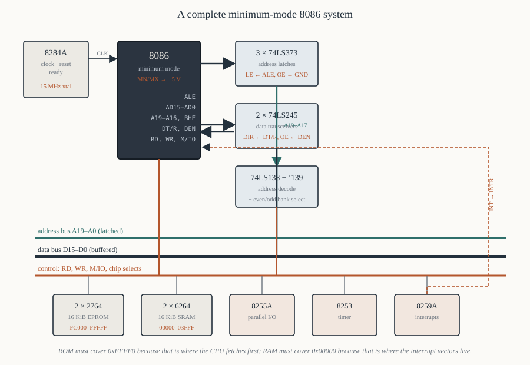

# Chapter 14 — Minimum mode systems

[← Bus cycles and timing](13-bus-cycles-timing.md) · [Contents](README.md) · [Next: Maximum mode and the 8288 →](15-maximum-mode-8288.md)

---

## Goal

Build a complete, working 8086 system on paper: clock, reset, address latches, data transceivers,
address decoding, memory, and one peripheral. Every connection specified. By the end you should be
able to look at any 8086 schematic and know what each chip is doing there.

This chapter is the payoff for Chapters 11, 12 and 13.

---

## 1. What "minimum mode" means

`MN/MX#` (pin 33) tied to **+5 V**. The 8086 generates its own bus control signals — `ALE`, `RD#`,
`WR#`, `M/IO#`, `DT/R#`, `DEN#`, `INTA#`, `HOLD`, `HLDA` — instead of emitting status codes for an
external bus controller.

Use it when:

- there is **one** bus master (plus possibly a DMA controller using `HOLD`/`HLDA`);
- there is **no 8087** coprocessor;
- you want the lowest chip count.

Do not use it when you need an 8087, multiple processors, or a Multibus-style system bus. Those need
maximum mode (Chapter 15).

Almost every 8086 trainer board and every simple embedded design used minimum mode. The IBM PC did
not, because it had an 8087 socket.

---

## 2. The system, in blocks



```
       ┌──────────┐
       │  8284A   │───── CLK ────┬──────────────────────────────┐
       │  clock   │───── RESET ──┼──────────────┬───────┐       │
       │          │───── READY ──┤              │       │       │
       └──────────┘              │              │       │       │
                                 ▼              ▼       ▼       ▼
                           ┌──────────┐    ┌────────┐ ┌─────┐ ┌─────┐
                           │   8086   │    │ memory │ │8255 │ │8253 │
                           │ min mode │    │        │ │     │ │     │
                           └────┬─────┘    └────────┘ └─────┘ └─────┘
                    ALE ────────┤              ▲  ▲       ▲      ▲
                                │              │  │       │      │
        AD15-AD0 ───────┬───────┤              │  │       │      │
                        │       │              │  │       │      │
                        ▼       ▼              │  │       │      │
               ┌─────────────┐ ┌────────────┐  │  │       │      │
               │ 3 × 74LS373 │ │ 2 × 74LS245│  │  │       │      │
               │   latches   │ │transceivers│  │  │       │      │
               └──────┬──────┘ └─────┬──────┘  │  │       │      │
                      │              │         │  │       │      │
              A19-A0  ▼              ▼ D15-D0  │  │       │      │
              ════════╪══════════════╪═════════╪══╪═══════╪══════╪═══
                      │                                          
                      ▼
               ┌─────────────┐
               │  74LS138    │───── chip selects ──────────────────►
               │  decoder    │
               └─────────────┘
```

Six chip types beyond the CPU: a clock generator, three latches, two transceivers, a decoder, the
memory, and the peripherals. That is the minimum viable 8086 computer.

---

## 3. Demultiplexing the address — the three latches

The 8086's `AD15–AD0`, `A19/S6–A16/S3` and `BHE#/S7` all carry address only during T1. To get a
stable address bus you latch 21 signals: `A19`–`A0` and `BHE#`.

Twenty-one signals, eight bits per latch → three 74LS373s (or Intel 8282s).

### 3.1 The wiring

```
   LATCH 1 (low address)                LATCH 2 (mid address)
   ┌───────────────────┐                ┌───────────────────┐
   │ D0 ◄─ AD0     Q0 ─┼─► A0           │ D0 ◄─ AD8    Q0 ──┼─► A8
   │ D1 ◄─ AD1     Q1 ─┼─► A1           │ D1 ◄─ AD9    Q1 ──┼─► A9
   │ D2 ◄─ AD2     Q2 ─┼─► A2           │ D2 ◄─ AD10   Q2 ──┼─► A10
   │ D3 ◄─ AD3     Q3 ─┼─► A3           │ D3 ◄─ AD11   Q3 ──┼─► A11
   │ D4 ◄─ AD4     Q4 ─┼─► A4           │ D4 ◄─ AD12   Q4 ──┼─► A12
   │ D5 ◄─ AD5     Q5 ─┼─► A5           │ D5 ◄─ AD13   Q5 ──┼─► A13
   │ D6 ◄─ AD6     Q6 ─┼─► A6           │ D6 ◄─ AD14   Q6 ──┼─► A14
   │ D7 ◄─ AD7     Q7 ─┼─► A7           │ D7 ◄─ AD15   Q7 ──┼─► A15
   │ LE ◄─ ALE         │                │ LE ◄─ ALE         │
   │ OE ◄─ GND         │                │ OE ◄─ GND         │
   └───────────────────┘                └───────────────────┘

   LATCH 3 (high address + BHE)
   ┌───────────────────┐
   │ D0 ◄─ A16/S3  Q0 ─┼─► A16
   │ D1 ◄─ A17/S4  Q1 ─┼─► A17
   │ D2 ◄─ A18/S5  Q2 ─┼─► A18
   │ D3 ◄─ A19/S6  Q3 ─┼─► A19
   │ D4 ◄─ BHE/S7  Q4 ─┼─► BHE   (latched)
   │ D5 D6 D7 ─ unused │
   │ LE ◄─ ALE         │
   │ OE ◄─ GND         │
   └───────────────────┘
```

### 3.2 Why each connection is what it is

**`LE` ← `ALE`.** The 373 is transparent while `LE` is high and holds when it falls. `ALE` is high
exactly while the address is valid on the pins (Chapter 13 §3), so the falling edge captures it.

**`OE#` ← GND.** The latch outputs are permanently enabled. There is no reason to tri-state the
address bus in a single-master system — and if there is DMA, the DMA controller drives the bus through
its *own* buffers, so these latches still stay enabled. Some designs tie `OE#` to `HLDA` inverted;
most do not bother.

**`BHE#` goes through a latch.** It must be, because the pin carries `S7` from T2 onwards but memory
needs bank selection for the entire cycle. Forgetting this is a real and common design error: the
symptom is that word writes corrupt one byte, intermittently.

**Latch 3 has three unused inputs.** Tie them low; do not leave them floating.

---

## 4. Buffering the data — the two transceivers

Sixteen data lines, eight bits per transceiver → two 74LS245s (or Intel 8286s).

```
   ┌──────────────────────┐
   │ A0-A7 ◄──► AD0-AD7   │   ◄──►  D0-D7    (to memory, peripherals)
   │ DIR   ◄── DT/R       │
   │ OE    ◄── DEN        │
   └──────────────────────┘
   ┌──────────────────────┐
   │ A0-A7 ◄──► AD8-AD15  │   ◄──►  D8-D15
   │ DIR   ◄── DT/R       │
   │ OE    ◄── DEN        │
   └──────────────────────┘
```

**`DIR` ← `DT/R#`.** `DT/R# = 1` (transmit, a write) makes the 245 pass from the `A` side (CPU) to
the `B` side (memory). `DT/R# = 0` (receive, a read) reverses it. Check your 245's convention:
`DIR = 1` means A→B on a 74LS245. `DT/R# = 1` means CPU→memory. They match directly.

**`OE#` ← `DEN#`.** Both active low. `DEN#` is asserted only during the data phase, so the
transceivers are off during T1 when the address is on the same pins — which is exactly what stops the
transceiver from fighting the latch.

### 4.1 Do you actually need the transceivers?

In a very small system — one EPROM, one SRAM, one peripheral — you can connect `AD15–AD0` straight to
the data pins, *provided* the total load stays inside the 8086's drive capability:

```
   8086 output drive:  2.0 mA sink,  400 µA source,  100 pF load
   one 74LS input:     0.4 mA,  ~5 pF
   one MOS memory:     ~10 µA,  ~10 pF
```

The current is rarely the limit; the **capacitance** is. Four or five MOS devices plus the PCB traces
will reach 100 pF, and beyond that the edges slow down and your timing analysis (Chapter 13 §9)
loses its margin.

The honest rule: **buffer it**. Two chips is cheap insurance, and every commercial design did.

---

## 5. Address decoding

The decoder's job: turn the 20-bit address plus `M/IO#` into one chip-select per device.

### 5.1 A worked memory map

Design target:

| Device | Size | Address range | Why there |
|--------|------|---------------|-----------|
| EPROM (2 × 2764) | 16 KiB | `0xFC000` – `0xFFFFF` | must contain the reset vector at `0xFFFF0` |
| SRAM (2 × 6264) | 16 KiB | `0x00000` – `0x03FFF` | must contain the interrupt vector table at `0x00000` |

Both constraints are non-negotiable (Chapter 10 §6).

### 5.2 Decoding the EPROM

`0xFC000` – `0xFFFFF` is 16 KiB. In binary:

```
   0xFC000 = 1111 1100 0000 0000 0000
   0xFFFFF = 1111 1111 1111 1111 1111
             └────┬───┘ └──────┬─────┘
             A19-A14 fixed     A13-A0 vary
             = 111111
```

So: **the EPROM is selected when `A19`–`A14` are all 1.** Fourteen address lines `A13`–`A0` go to the
chips, addressing 16 KiB — but remember the bank split of Chapter 10: each 2764 is 8 KiB × 8, and the
pair covers 16 KiB of byte addresses using `A13`–`A1` as the chip address plus `A0`/`BHE#` for bank
select.

```
   ROM_SEL# = NOT( A19 · A18 · A17 · A16 · A15 · A14 · M/IO )
```

A 6-input AND plus `M/IO#`. In practice:

```
   74LS30 (8-input NAND):  inputs A19 A18 A17 A16 A15 A14 M/IO +5V
                           output = ROM_SEL#   (active low)   ✔ one chip
```

The 74LS30 is an 8-input NAND — exactly the right shape. Tie the eighth input high.

### 5.3 Decoding the SRAM

`0x00000` – `0x03FFF`: `A19`–`A14` all **zero**.

```
   RAM_SEL# = NOT( NOT A19 · NOT A18 · ... · NOT A14 · M/IO )
```

which is the same NAND with six inverters in front — a 74LS04 plus a 74LS30. Or, more economically,
use a **74LS138** and get eight ranges for one chip:

```
   74LS138:  C B A  ◄─  A19 A18 A17
             G1     ◄─  M/IO       (high = memory)
             G2A    ◄─  GND
             G2B    ◄─  GND

   Y0 -> 0x00000-0x1FFFF   (128 KiB block)   -> RAM  (aliased, see §5.4)
   Y7 -> 0xE0000-0xFFFFF   (128 KiB block)   -> ROM  (aliased)
```

One chip, eight 128 KiB blocks. Coarse, but for a small board it is exactly right.

### 5.4 Aliasing, deliberately

With only `A19`–`A17` decoded, a 16 KiB RAM inside a 128 KiB block responds to **eight** different
address ranges:

```
   0x00000-0x03FFF   the one you meant
   0x04000-0x07FFF   alias
   0x08000-0x0BFFF   alias
   ...
   0x1C000-0x1FFFF   alias
```

because `A16`–`A14` are ignored. The RAM cannot tell those addresses apart.

**Is that a problem?** Only if you later want to put something else in `0x04000`. For a board that
will never grow, coarse decoding saves chips and nobody notices. For a board that might, decode fully.

The software-visible symptom of aliasing, and the way to detect it:

```asm
; Write a marker at 0x00000 and see whether it appears at 0x04000.
        xor  ax, ax
        mov  ds, ax
        mov  word [0x0000], 0x1234
        mov  ax, [0x4000]
        cmp  ax, 0x1234
        je   aliased            ; the same physical cell, seen twice
```

Chapter 17 §5 uses this to map an unknown board.

### 5.5 Splitting the chip select into banks

From Chapter 10 §5, each range's select must be split for the even and odd banks:

```
   even bank CS#  =  RAM_SEL#  OR  A0
   odd  bank CS#  =  RAM_SEL#  OR  BHE#
```

Two 2-input OR gates (half a 74LS32) per memory range. Or a 74LS139 dual 2-to-4 decoder with `A0`
and `BHE#` on its select inputs and `RAM_SEL#` on its enable, which gives you both banks plus a
spare.

---

## 6. Connecting the memory chips

### 6.1 A 6264 SRAM pair (8 KiB × 8 each → 16 KiB)

```
              EVEN 6264                      ODD 6264
   A12-A0  ◄─ A13-A1 (latched)      A12-A0  ◄─ A13-A1 (latched)
   D7-D0   ◄─► D7-D0                D7-D0   ◄─► D15-D8
   CS1#    ◄─ even bank select      CS1#    ◄─ odd bank select
   CS2     ◄─ +5 V                  CS2     ◄─ +5 V
   OE#     ◄─ RD#                   OE#     ◄─ RD#
   WE#     ◄─ WR#                   WE#     ◄─ WR#
```

**Note `A13–A1`, not `A13–A0`.** Address line `A0` is a bank select, not an address (Chapter 10 §2).
The chip's own `A0` gets the system's `A1`. Every address line shifts down by one. Getting this wrong
means the memory works for bytes and fails for words, or appears to be half its size.

**`OE#` ← `RD#` and `WE#` ← `WR#`** directly. Both active low; polarities match. Good design.

### 6.2 A 2764 EPROM pair (8 KiB × 8 each → 16 KiB)

```
   A12-A0  ◄─ A13-A1 (latched)
   D7-D0   ──► D7-D0  (even) / D15-D8 (odd)
   CE#     ◄─ bank select
   OE#     ◄─ RD#
   PGM#    ◄─ +5 V    (not programming)
   VPP     ◄─ +5 V    (not programming)
```

No `WE#`, obviously. Note `VPP` and `PGM#` must be tied high in normal operation — leaving `VPP`
floating on an EPROM can corrupt it over time.

### 6.3 Why memory always comes in pairs

Because of the bank split. One chip gives you every *other* byte. If you fit one 6264 to the even
bank and nothing to the odd bank, then:

- `mov al, [0x0000]` works.
- `mov al, [0x0001]` reads floating bus — garbage.
- `mov ax, [0x0000]` returns garbage in `AH`.

It "half works", which is worse than not working, because it takes an hour to diagnose.

---

## 7. Connecting an I/O device

Peripherals are 8-bit and go on the **low half** of the data bus (`D7–D0`), which means they live at
**even** I/O addresses only. This is why the 8255's four registers in a 16-bit system are at, say,
`0x00`, `0x02`, `0x04`, `0x06` rather than `0x00`–`0x03`.

```
   8255A
   D7-D0  ◄─► D7-D0            (low half)
   A1 A0  ◄─  A2 A1            (shifted, so the ports land on even addresses)
   CS#    ◄─  I/O decode
   RD#    ◄─  RD#
   WR#    ◄─  WR#
   RESET  ◄─  RESET
```

and the I/O decode must include `M/IO# = 0`:

```
   8255_CS#  =  NOT( NOT M/IO · NOT A7 · NOT A6 · ... )
```

Chapter 17 does I/O decoding properly, and Chapter 47 programs this 8255.

---

## 8. The complete schematic, chip by chip

| Ref | Part | Function | Key connections |
|-----|------|----------|-----------------|
| U1 | 8086 | CPU | `MN/MX#` → +5 V |
| U2 | 8284A | clock, reset, ready | 15 MHz crystal; `CLK`→U1.19; `RESET`→U1.21; `READY`→U1.22 |
| U3–U5 | 74LS373 | address latches | `LE`←`ALE`; `OE#`←GND |
| U6–U7 | 74LS245 | data transceivers | `DIR`←`DT/R#`; `OE#`←`DEN#` |
| U8 | 74LS138 | memory decode | `CBA`←`A19 A18 A17`; `G1`←`M/IO#`; `G2A#`,`G2B#`←GND |
| U9 | 74LS139 | bank select | `A`←`A0`, `B`←`BHE#` |
| U10 | 74LS138 | I/O decode | `G1`←inverted `M/IO#` |
| U11–U12 | 6264 | 16 KiB SRAM at `0x00000` | `A12–A0`←`A13–A1` |
| U13–U14 | 2764 | 16 KiB EPROM at `0xFC000` | `A12–A0`←`A13–A1` |
| U15 | 8255A | parallel I/O | `A1 A0`←`A2 A1` |
| U16 | 8253 | timer | |
| U17 | 8259A | interrupt controller | `INT`→U1.18 (`INTR`) |

### 8.1 The tie-offs that must not be forgotten

```
   MN/MX#  (33) → +5 V          minimum mode
   NMI     (17) → GND           unless used
   TEST#   (23) → GND           no 8087
   HOLD    (31) → GND           no DMA
   INTR    (18) → 8259A INT, or GND
   READY        → from 8284A, with RDY1 high and AEN1# low
   unused 74LS inputs → tied high or low
   EPROM VPP, PGM# → +5 V
```

Every one of those is a floating input if you forget it, and floating inputs make a board that works
on the bench and fails in the field.

---

## 9. Bring-up order

When a board like this is built for the first time, check in this order. Each step depends on the
previous one.

1. **Power.** +5 V at every `VCC` pin, 0 V at every `GND` pin. Current draw roughly 1–2 A for a full
   board.
2. **Clock.** Scope on 8086 pin 19. Should be 5 MHz, 33% duty, swinging 0 to ~4.5 V. If it is 50%
   duty you have wired an oscillator directly instead of through the 8284A.
3. **Reset.** Scope on pin 21. Should pulse high for ~1 s at power-on. If it is stuck high, the RC
   is wrong or `RES#` is grounded.
4. **`ALE`.** Scope on pin 25. Should show bursts of pulses. **If `ALE` is dead, the CPU is not
   fetching** — check `READY` (stuck low stalls in T3 and `ALE` stops after one cycle), `MN/MX#`,
   and that the EPROM contains something.
5. **Address activity.** Latched `A19`–`A0` should be changing. Put a scope on `A19`: after reset it
   should be high, because the first fetch is from `0xFFFF0`.
6. **ROM chip select.** Should pulse. If not, the decoder is wrong.
7. **Run a known program.** The simplest useful one:

```asm
; The bring-up program. Toggle every bit of an output port forever.
; At 0xFFFF0, the reset vector:
        org  0
        jmp  0xFC00:0x0000

; At 0xFC000, the real code:
        org  0
start:  mov  al, 0x80
        out  0x06, al           ; 8255 control word: all ports output
loop1:  mov  al, 0xFF
        out  0x00, al           ; port A all high
        mov  cx, 0xFFFF
        loop $                  ; crude delay
        mov  al, 0x00
        out  0x00, al           ; port A all low
        mov  cx, 0xFFFF
        loop $
        jmp  loop1
```

An LED on port A blinking is the moment a board becomes a computer. If it does not blink, the fault
is in the decoding, and a logic analyser on the latched address bus will show which address the CPU
is actually reaching for.

---

## 10. Summary

```
  minimum mode = MN/MX# tied to +5 V; the CPU makes its own bus control signals

  three 74LS373 latches, clocked by ALE, demultiplex A19-A0 and BHE
      LE <- ALE,  OE# <- GND
      BHE MUST be latched too
  two 74LS245 transceivers buffer D15-D0
      DIR <- DT/R#,  OE# <- DEN#
  a 74LS138 turns high address bits + M/IO into chip selects
  each chip select splits into even/odd bank selects with A0 and BHE

  memory chips get A13-A1, not A13-A0 — A0 is a bank select
  memory comes in PAIRS; one chip gives you every other byte
  8-bit peripherals sit on D7-D0 and therefore at EVEN I/O addresses

  ROM must cover 0xFFFF0 (reset), RAM must cover 0x00000 (vectors)

  tie: MN/MX# high, NMI low, TEST# low, HOLD low, READY high
```

---

## Exercises

**14.1** Why are three 74LS373s needed rather than two? List every signal that passes through the
third one.

**14.2** What would happen if `BHE#` were connected directly to memory instead of through a latch?
Describe the symptom in software terms.

**14.3** A 74LS245's `DIR` is connected to `DT/R#` and its `OE#` to `DEN#`. During a memory *write*,
what are the levels on those two pins and which way does data flow?

**14.4** Why is the transceiver's `OE#` driven from `DEN#` rather than simply tied low?

**14.5** Design the decoding for a 32 KiB EPROM at `0xF8000`–`0xFFFFF`. Which address lines are
fixed, which vary, and what gate would you use?

**14.6** A 74LS138 has `A19 A18 A17` on `C B A`, `G1` on `M/IO#`, and both `G2` inputs grounded.
Which output is asserted for physical address `0xA4000`? What range does that output cover?

**14.7** A 6264 SRAM (8 KiB × 8) is fitted to the even bank at `0x00000`. Which system address lines
connect to its `A12`–`A0` pins? What is the physical address of the byte stored in its internal
location 0?

**14.8** A designer connects the system's `A0` to a memory chip's `A0` pin. Describe exactly what
the software sees.

**14.9** Why do 8-bit peripherals appear at even I/O addresses in a 16-bit 8086 system? What would
you connect to an 8255's `A1` and `A0` pins?

**14.10** A newly built board shows a good clock and a good reset, but `ALE` pulses once and then
stops. Give the two most likely causes.

**14.11** List every 8086 input that must be tied to a defined level in a minimum-mode system with
no 8087, no DMA and no interrupts.

**14.12** Estimate whether four MOS memory chips plus 15 cm of PCB trace would exceed the 8086's
100 pF drive limit, and say what you would do about it.

Answers in [Appendix H](H-exercise-solutions.md#chapter-14).

---

[← Bus cycles and timing](13-bus-cycles-timing.md) · [Contents](README.md) · [Next: Maximum mode and the 8288 →](15-maximum-mode-8288.md)
