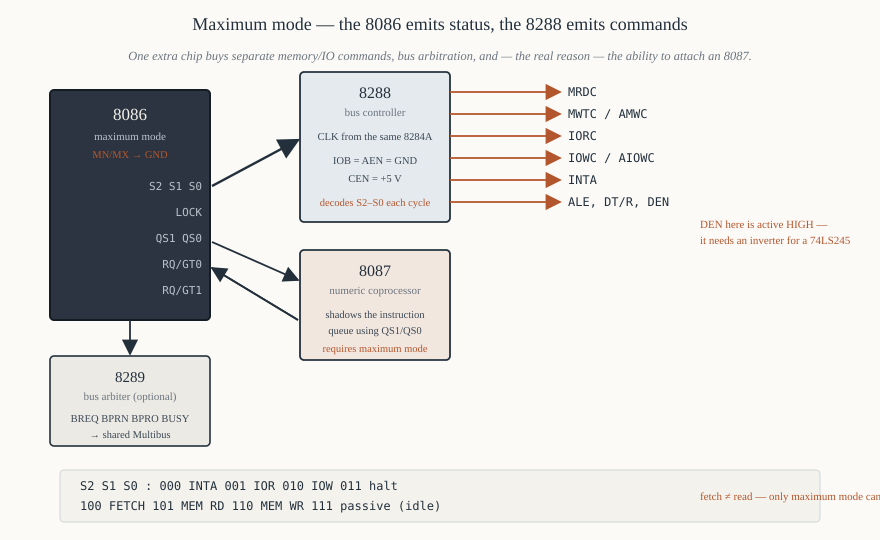

# Chapter 15 — Maximum mode and the 8288

[← Minimum mode systems](14-minimum-mode.md) · [Contents](README.md) · [Next: Memory interfacing →](16-memory-interfacing.md)

---

## Goal

Explain what changes when `MN/MX#` is grounded: the status code interface, the 8288 bus controller
that decodes it, the 8289 arbiter, the `RQ/GT` protocol, and why any system with an 8087 or a second
processor must work this way.

---

## 1. The trade

In **minimum mode** the 8086 says *what to do*: `RD#`, `WR#`, `M/IO#`. Simple, but it can only
describe one bus master's intentions, and it cannot distinguish an instruction fetch from a data
read.

In **maximum mode** the 8086 says *what kind of cycle this is*, as a three-bit status code on
`S2#`, `S1#`, `S0#`, and an external **8288 Bus Controller** turns that into control signals. This
costs a chip and buys four things:

1. **Separate command lines for memory and I/O.** `MRDC#`, `MWTC#`, `IORC#`, `IOWC#` instead of
   `RD#`/`WR#` + `M/IO#`. Decoders get simpler — no `M/IO#` term.
2. **Advanced write commands.** `AMWC#` and `AIOWC#` assert one clock period *earlier* than the
   normal write commands, giving slow peripherals extra setup time.
3. **Instruction fetches are distinguishable** (status `100`) from data reads (`101`). The 8087
   needs this to track the instruction stream.
4. **Bus arbitration.** With an 8289, several masters can share one bus properly, with `LOCK#`
   enforcing atomicity.

The IBM PC used maximum mode, entirely because of the 8087 socket.

---

## 2. The status codes

`S2#`, `S1#`, `S0#` appear on pins 28, 27 and 26 from T4 of the previous cycle through T2 of this
one, then go passive.

| `S2#` | `S1#` | `S0#` | Cycle type | 8288 asserts |
|-------|-------|-------|------------|--------------|
| 0 | 0 | 0 | interrupt acknowledge | `INTA#` |
| 0 | 0 | 1 | read I/O port | `IORC#` |
| 0 | 1 | 0 | write I/O port | `IOWC#` and `AIOWC#` |
| 0 | 1 | 1 | halt | nothing |
| 1 | 0 | 0 | **instruction fetch** | `MRDC#` |
| 1 | 0 | 1 | **read memory** | `MRDC#` |
| 1 | 1 | 0 | write memory | `MWTC#` and `AMWC#` |
| 1 | 1 | 1 | passive — no cycle | nothing |

Two observations.

**`111` is idle.** A *transition out of* `111` is what tells the 8288 a cycle is beginning. The
8288 is edge-sensitive to that change, which is why it needs the same `CLK` as the CPU.

**Rows 4 and 5 both produce `MRDC#`.** The 8288 treats fetches and data reads identically — the
memory does not care. The distinction exists purely for *observers*: the 8087, a bus analyser, or a
memory-protection unit.

---

## 3. The 8288 bus controller



A 20-pin chip. Inputs: the status lines, `CLK`, and a few configuration pins. Outputs: everything a
minimum-mode 8086 would have generated itself, and more.

### 3.1 Pins

| Pin | Name | Dir | Function |
|-----|------|-----|----------|
| 19, 18, 3 | `S0#`, `S1#`, `S2#` | in | status from the 8086 |
| 2 | `CLK` | in | must be the same `CLK` the 8086 sees |
| 5 | `ALE` | out | address latch enable — same job as minimum mode |
| 16 | `DEN` | out | data enable — note: **active HIGH** here, unlike the CPU's `DEN#` |
| 4 | `DT/R#` | out | data direction |
| 7 | `MRDC#` | out | memory read command |
| 9 | `MWTC#` | out | memory write command |
| 8 | `AMWC#` | out | advanced memory write command |
| 13 | `IORC#` | out | I/O read command |
| 11 | `IOWC#` | out | I/O write command |
| 12 | `AIOWC#` | out | advanced I/O write command |
| 14 | `INTA#` | out | interrupt acknowledge |
| 15 | `MCE/PDEN#` | out | master cascade enable / peripheral data enable |
| 6 | `AEN#` | in | address enable — qualifies the command outputs |
| 17 | `CEN` | in | command enable — gates all commands |
| 1 | `IOB` | in | I/O bus mode select |

### 3.2 `IOB` and `AEN#` — the three system configurations

The 8288 supports three arrangements, selected by `IOB` and `AEN#`:

| `IOB` | `AEN#` | Configuration |
|-------|--------|---------------|
| 0 | 0 | **system bus** — commands enabled, used with an 8289 arbiter |
| 0 | 1 | commands disabled (another master owns the bus) |
| 1 | × | **I/O bus mode** — the processor has a private I/O bus |

For a single-master maximum-mode system (the common case, e.g. an 8086 + 8087):

```
   IOB  → GND      (system bus mode)
   AEN# → GND      (always enabled)
   CEN  → +5 V     (commands always enabled)
```

### 3.3 `DEN` polarity — the trap

The 8086's minimum-mode `DEN#` is **active low**. The 8288's `DEN` is **active high**.

This is not a typo in the datasheet; it is a genuine difference, and it means a 74LS245's `OE#`
cannot be driven directly from the 8288 — you need an inverter, or you use an Intel 8286 transceiver,
whose enable polarity matches. Converting a minimum-mode design to maximum mode and forgetting this
produces a board on which the data bus is enabled exactly when it should not be.

```
   minimum mode:   74LS245 OE#  ←  8086 DEN#      (direct)
   maximum mode:   74LS245 OE#  ←  NOT(8288 DEN)  (needs an inverter)
```

### 3.4 Advanced write commands

`MWTC#` asserts at the start of T3. `AMWC#` asserts one clock earlier, at the start of T2.

```
              T1      T2      T3      T4
   MWTC                       ┌───────┐
        ───────────────────────┘       └────

   AMWC              ┌───────────────┐
        ──────────────┘               └────
```

Why have both? Some peripherals latch on the *leading* edge of write and need a long pulse; some
need extra time between chip select and write. `AMWC#` gives an extra 200 ns of write pulse at
5 MHz, at the cost of asserting write before the data is guaranteed valid — so it is safe only for
devices that latch on the trailing edge.

**Use `MWTC#` unless a datasheet tells you otherwise.** `AMWC#` exists for specific slow peripherals,
and using it carelessly writes garbage.

---

## 4. `LOCK#` and atomicity

In maximum mode, pin 29 is `LOCK#` instead of `WR#`.

`LOCK#` is asserted while the `LOCK` instruction prefix is in effect and for the duration of the
instruction it precedes. It tells the 8289 arbiter (and any other master) not to take the bus.

```asm
        lock xchg [semaphore], al
```

`XCHG` with a memory operand is a read *and* a write. Without `LOCK`, another processor could read
the semaphore between our read and our write, and two processors would both think they had acquired
it. With `LOCK#` asserted across the whole instruction, the sequence is atomic.

The 8086 also asserts `LOCK#` automatically across the **two interrupt-acknowledge cycles**, because
another master grabbing the bus between them would break the vector fetch.

Chapter 30 §8 covers the `LOCK` prefix from the software side.

---

## 5. `RQ/GT0#` and `RQ/GT1#`

Maximum mode replaces the two-wire `HOLD`/`HLDA` handshake with a **one-wire bidirectional** protocol
per requester, so two requesters fit in two pins.

### 5.1 The three-pulse sequence

Each pulse is one clock period wide, driven low then released (the line is open-drain with a pull-up):

```
   1. REQUEST   the requester pulses the line low
                       ┐   ┌
                       └───┘

   2. GRANT     the 8086 pulses it low, one clock later at the earliest.
                From this point the 8086 has floated the bus.
                       ┐   ┌
                       └───┘

   3. RELEASE   the requester pulses it low when finished; the 8086 resumes.
                       ┐   ┌
                       └───┘
```

### 5.2 Priority

`RQ/GT0#` has higher priority than `RQ/GT1#`. If both request simultaneously, `RQ/GT0#` is granted
first.

The 8087 is normally connected to `RQ/GT0#` (it needs the bus to fetch its own operands) and a DMA
controller or second processor to `RQ/GT1#`.

### 5.3 Compared with `HOLD`/`HLDA`

| | Minimum mode | Maximum mode |
|---|---|---|
| Signals | `HOLD` in, `HLDA` out — two pins, one requester | `RQ/GT0#`, `RQ/GT1#` — two pins, two requesters |
| Protocol | level: hold high, release low | three one-clock pulses on one wire |
| Priority | none needed | `RQ/GT0#` > `RQ/GT1#` |

---

## 6. `QS1` and `QS0` — queue status

Pins 24 and 25 in maximum mode report what the instruction queue did during the *previous* clock:

| `QS1` | `QS0` | Meaning |
|-------|-------|---------|
| 0 | 0 | no queue operation |
| 0 | 1 | **first byte of an opcode** taken from the queue |
| 1 | 0 | **queue emptied** — a control transfer happened |
| 1 | 1 | a **subsequent byte** of the current instruction taken from the queue |

### 6.1 Why the 8087 needs this

The 8087 has no instruction pointer of its own. It watches the 8086's bus, sees the same instruction
bytes, and maintains its own copy of the queue. When it recognises an `ESC` opcode (Chapter 54 §3) it
executes it.

For that to work, the 8087 must know *exactly* when the 8086 takes a byte out of the queue, so that
its shadow copy stays in step. `QS1`/`QS0` provide precisely that. Status `10` (queue emptied) tells
the 8087 to throw its copy away too.

This is why **an 8087 requires maximum mode**. There is no way to make it work otherwise.

### 6.2 For debugging

A logic analyser connected to `QS1`/`QS0` plus the address bus can reconstruct exactly which
instructions executed, distinguishing them from prefetched-but-discarded bytes. No other 8086 signal
gives you that.

---

## 7. The 8289 bus arbiter

When two or more processors share a system bus (Intel's Multibus), something must decide who gets it
each cycle. The **8289** does that.

Each processor has its own 8288 and 8289. The 8289 watches its processor's status lines, requests
the shared bus when a cycle needs it, and asserts `AEN#` to its 8288 only when the bus has been
granted. Until then the 8288's commands stay inactive and the cycle is stretched by `READY`.

```
        ┌────────┐   S2-S0   ┌────────┐
        │  8086  ├──────┬───►│  8288  ├──► MRDC, MWTC, IORC, IOWC …
        │ max    │      │    └────▲───┘
        └────────┘      │         │ AEN
                        │    ┌────┴───┐
                        └───►│  8289  │◄──► BREQ, BPRN, BPRO, BUSY, CBRQ
                             └────────┘         (the shared bus arbitration lines)
```

Arbitration modes include serial priority (a daisy chain through `BPRN`/`BPRO`), parallel priority
(an external priority encoder), and rotating priority. This is where Intel expected 8086 systems to
go — multiprocessor Multibus machines — and it is largely why maximum mode exists at all.

In practice the personal-computer world used one processor, and the elaborate arbitration machinery
went mostly unused outside industrial systems.

---

## 8. A maximum-mode system, connection by connection

```
   8086 (MN/MX# → GND)
     S2#, S1#, S0#  ───────────────►  8288 S2#, S1#, S0#
     CLK            ───────────────►  8288 CLK        (same 8284A output)
     LOCK#          ───────────────►  8289 LOCK#      (if fitted)
     QS1, QS0       ───────────────►  8087 QS1, QS0
     RQ/GT0#        ◄─────────────►   8087 RQ/GT0#
     RQ/GT1#        ◄─────────────►   DMA controller  (if fitted)
     AD15–AD0       ───────────────►  latches and transceivers, as minimum mode
     A19/S6–A16/S3  ───────────────►  third latch
     BHE#/S7        ───────────────►  third latch
     READY          ◄───────────────  8284A
     RESET          ◄───────────────  8284A

   8288
     ALE            ───────────────►  the three 74LS373 latches
     DT/R#          ───────────────►  74LS245 DIR
     DEN            ──[inverter]──►   74LS245 OE#      ← note the inversion
     MRDC#          ───────────────►  memory OE#
     MWTC#          ───────────────►  memory WE#
     IORC#          ───────────────►  peripheral RD#
     IOWC#          ───────────────►  peripheral WR#
     INTA#          ───────────────►  8259A INTA#
     IOB, AEN#      ◄─── GND
     CEN            ◄─── +5 V
```

### 8.1 What got simpler

Address decoding. In minimum mode, every memory chip select needed `M/IO#` in its decode, and every
I/O select needed its inverse. In maximum mode the commands are already separate:

```
   minimum mode:   RAM_CS# = NOT( decode · M/IO )          and  RD#/WR# separately
   maximum mode:   RAM_CS# = decode                        with MRDC#/MWTC# doing the rest
```

The `M/IO#` term disappears because `MRDC#` only ever asserts for memory. One fewer gate input on
every decoder, and one fewer chance to get the polarity wrong.

### 8.2 What got more complicated

An extra chip, a `DEN` polarity trap, and a status interface that is harder to probe with a scope —
three lines that must be decoded mentally rather than read directly.

---

## 9. Choosing between the modes

| Requirement | Mode |
|-------------|------|
| Simplest possible board | **minimum** |
| 8087 coprocessor | **maximum** (mandatory) |
| Two or more CPUs on one bus | **maximum** |
| DMA controller only | either — minimum mode's `HOLD`/`HLDA` is enough |
| Separate memory and I/O command lines | maximum (or generate them from `RD#`/`WR#`/`M/IO#` with two gates) |
| Observe the instruction queue | maximum |
| Lowest chip count | **minimum** |

You can generate `MEMR#`, `MEMW#`, `IOR#` and `IOW#` in minimum mode with four gates:

```
   MEMR# = RD#  OR  NOT M/IO#
   MEMW# = WR#  OR  NOT M/IO#
   IOR#  = RD#  OR  M/IO#
   IOW#  = WR#  OR  M/IO#
```

so that reason alone does not justify an 8288. The 8087 does.

---

## 10. Summary

```
  maximum mode = MN/MX# tied to GND

  pins 24-31 change:
     28,27,26  S2 S1 S0   status code, decoded by the 8288
     29        LOCK       bus lock for atomic operations
     31,30     RQ/GT0/1   bidirectional three-pulse bus request
     25,24     QS0 QS1    instruction queue status, for the 8087

  status codes:  000 INTA   001 IOR    010 IOW    011 halt
                 100 fetch  101 memrd  110 memwr  111 passive/idle

  8288 outputs:  ALE  DT/R  DEN(active HIGH!)  MRDC MWTC AMWC IORC IOWC AIOWC INTA
  for a single-master system:  IOB=GND, AEN#=GND, CEN=+5V

  8087 requires maximum mode, because it needs QS1/QS0 to shadow the queue
  and RQ/GT0# to take the bus for its own operand fetches
```

---

## Exercises

**15.1** What single pin selects minimum or maximum mode, and to what must it be connected for each?

**15.2** Give the status code `S2# S1# S0#` for: an instruction fetch, an I/O write, a memory write,
an interrupt acknowledge, and an idle bus.

**15.3** The 8288 produces two different read commands and four different write commands. Name them
and say when each is used.

**15.4** Why does the 8288's `DEN` output need an inverter before a 74LS245's `OE#`, when the 8086's
minimum-mode `DEN#` does not?

**15.5** What is the difference in timing between `MWTC#` and `AMWC#`, and when would you use the
advanced form?

**15.6** Both minimum-mode `MRDC#`-equivalent signals (`RD#` with `M/IO#` high) and maximum-mode
`MRDC#` mean "read memory". State one thing maximum mode can distinguish that minimum mode cannot,
and name the chip that needs that distinction.

**15.7** Describe the three-pulse `RQ/GT` protocol. Which of the two `RQ/GT` pins has higher
priority?

**15.8** Decode `QS1 QS0` = `10`. What has just happened inside the 8086?

**15.9** Write the four gate equations that generate `MEMR#`, `MEMW#`, `IOR#` and `IOW#` from a
minimum-mode 8086's `RD#`, `WR#` and `M/IO#`.

**15.10** Why does the 8086 assert `LOCK#` automatically during interrupt acknowledge?

**15.11** A design has an 8086, 32 KiB of RAM, 16 KiB of ROM, an 8255 and an 8253. It needs no
coprocessor and no second CPU. Which mode would you choose, and give two reasons.

**15.12** In maximum mode, address decoding for memory does not need `M/IO#`. Explain why.

Answers in [Appendix H](H-exercise-solutions.md#chapter-15).

---

[← Minimum mode systems](14-minimum-mode.md) · [Contents](README.md) · [Next: Memory interfacing →](16-memory-interfacing.md)
