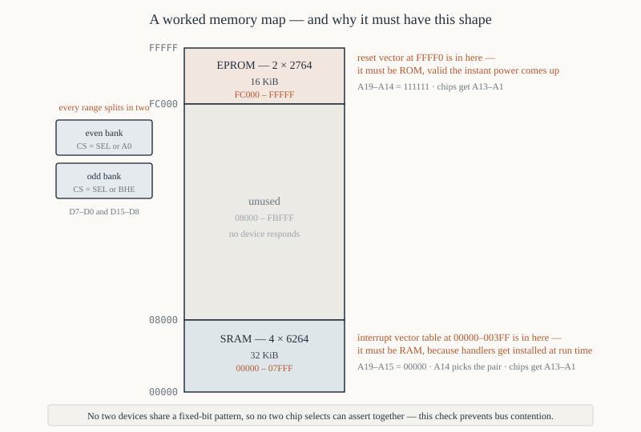

# Chapter 16 — Memory interfacing

[← Maximum mode and the 8288](15-maximum-mode-8288.md) · [Contents](README.md) · [Next: I/O interfacing →](17-io-interfacing.md)

---

## Goal

Design memory subsystems from scratch: choose the chips, work out the decoding, draw the map, split
the banks, and verify the timing. Four complete worked designs, each harder than the last, with the
arithmetic shown.

---

## 1. The memory devices

### 1.1 What you can buy (in 1982, and still on eBay now)

| Part | Type | Organisation | Capacity | Access time | Pins |
|------|------|--------------|----------|-------------|------|
| 2716 | EPROM | 2 K × 8 | 2 KiB | 350–450 ns | 24 |
| 2732 | EPROM | 4 K × 8 | 4 KiB | 250–450 ns | 24 |
| 2764 | EPROM | 8 K × 8 | 8 KiB | 200–450 ns | 28 |
| 27128 | EPROM | 16 K × 8 | 16 KiB | 200–300 ns | 28 |
| 27256 | EPROM | 32 K × 8 | 32 KiB | 200–300 ns | 28 |
| 6116 | SRAM | 2 K × 8 | 2 KiB | 100–200 ns | 24 |
| 6264 | SRAM | 8 K × 8 | 8 KiB | 100–200 ns | 28 |
| 62256 | SRAM | 32 K × 8 | 32 KiB | 70–150 ns | 28 |
| 4164 | DRAM | 64 K × 1 | 8 KiB per chip | 120–200 ns | 16 |
| 41256 | DRAM | 256 K × 1 | 32 KiB per chip | 100–150 ns | 16 |

**SRAM** needs no refresh, is fast, and is simple to interface — one chip select, one output enable,
one write enable. It is also expensive per bit.

**DRAM** is much denser and cheaper, but needs **refresh**: every row must be read at least every
2–4 ms or the charge leaks away. That requires a refresh controller and steals bus cycles, and the
address must be multiplexed into row and column halves with `RAS#`/`CAS#`. Because a 64 K × 1 chip
gives one *bit*, you need eight of them for a byte, sixteen for a 16-bit word.

**This chapter uses SRAM and EPROM.** DRAM is covered in §8 as a sketch, because every real machine
used it and you should know why it is harder.

### 1.2 The standard pinout

Nearly all these parts share a pin arrangement (the JEDEC standard), so a 2764, a 27128, a 27256 and
a 6264 are almost pin-compatible — a board can take several sizes with a jumper.

```
   28-pin JEDEC (2764 / 27128 / 27256 / 6264 / 62256)

         VPP/A14  1 ─┐   ┌─ 28  VCC
             A12  2 ─┤   ├─ 27  WE / A13 / PGM
              A7  3 ─┤   ├─ 26  A13 / CS2 / NC
              A6  4 ─┤   ├─ 25  A8
              A5  5 ─┤   ├─ 24  A9
              A4  6 ─┤   ├─ 23  A11
              A3  7 ─┤   ├─ 22  OE
              A2  8 ─┤   ├─ 21  A10
              A1  9 ─┤   ├─ 20  CE / CS1
              A0 10 ─┤   ├─ 19  D7
              D0 11 ─┤   ├─ 18  D6
              D1 12 ─┤   ├─ 17  D5
              D2 13 ─┤   ├─ 16  D4
             GND 14 ─┘   └─ 15  D3
```

The three control pins are what matter:

| Pin | SRAM | EPROM |
|-----|------|-------|
| `CE#` / `CS1#` | chip select | chip enable |
| `OE#` | output enable | output enable |
| `WE#` | write enable | (none — it is `PGM#`, tied high) |

**`CE#` versus `OE#`.** `CE#` powers the chip up; `OE#` turns on its output drivers. On an EPROM,
`CE#` has a long access time (the whole chip must wake) and `OE#` a short one. The efficient
arrangement is therefore: **drive `CE#` from the address decode** (which is available early, from
T1) **and `OE#` from `RD#`** (which comes later, in T2). Doing it the other way round wastes the
EPROM's `CE#` access time and can cost you a wait state.

---

## 2. The five steps of any memory design

1. **Decide the map.** What goes where, and why.
2. **Count the chips.** Remember the even/odd bank split — always pairs.
3. **Work out which address lines go to the chips** and which are left for decoding.
4. **Design the decoder**, including `M/IO#` and the bank split.
5. **Check the timing** against Chapter 13 §6.

Everything below is these five steps, repeated.

---

## 3. Design 1 — 16 KiB of EPROM at the top of memory

**Requirement.** The reset vector is at `0xFFFF0`, so ROM must cover it.

### Step 1 — the map

```
   0xFC000 – 0xFFFFF        16 KiB      EPROM
```

### Step 2 — the chips

16 KiB of 16-bit-wide memory = two 2764s (8 KiB × 8 each): one for the even bank, one for the odd.

### Step 3 — address lines

16 KiB = 2¹⁴ bytes, so 14 address bits vary: `A13`–`A0`.

But `A0` is a bank select, not an address. Each chip sees 8 KiB = 2¹³ locations, addressed by
**`A13`–`A1`**, which connect to the chip's `A12`–`A0`.

The remaining lines `A19`–`A14` are fixed, and they are all 1:

```
   0xFC000 = 1111 1100 0000 0000 0000
             ‾‾‾‾‾‾              A19..A14 = 111111
   0xFFFFF = 1111 1111 1111 1111 1111
```

### Step 4 — the decoder

```
   ROM_SEL# = NOT( A19 · A18 · A17 · A16 · A15 · A14 · M/IO# )
```

A 74LS30 8-input NAND does it in one chip:

```
   74LS30 inputs:  A19 A18 A17 A16 A15 A14 M/IO# +5V
   74LS30 output:  ROM_SEL#     (low when all inputs high)
```

Then split the banks:

```
   even_ROM_CE#  =  ROM_SEL#  OR  A0        ; asserted when ROM_SEL#=0 AND A0=0
   odd_ROM_CE#   =  ROM_SEL#  OR  BHE#      ; asserted when ROM_SEL#=0 AND BHE#=0
```

Two gates from a 74LS32.

### Step 5 — connections

```
                    EVEN 2764                  ODD 2764
   A12–A0      ◄──  A13–A1                ◄──  A13–A1
   D7–D0       ──►  D7–D0                 ──►  D15–D8
   CE#         ◄──  even_ROM_CE#          ◄──  odd_ROM_CE#
   OE#         ◄──  RD#                   ◄──  RD#
   PGM#        ◄──  +5 V                  ◄──  +5 V
   VPP         ◄──  +5 V                  ◄──  +5 V
```

### Verification

Physical `0xFFFF0`: `A19`–`A14` = `111111` ✔ selects the ROM. `A13`–`A1` = `1111111111000`
= `0x1FF8`, so the byte comes from internal location `0x1FF8` of the even chip (`A0` = 0). ✔

And it is 16 bytes from the top, which is where the far jump must live.

---

## 4. Design 2 — 32 KiB of SRAM at the bottom

**Requirement.** The interrupt vector table is at `0x00000`–`0x003FF`, so RAM must cover it.

### The map

```
   0x00000 – 0x07FFF        32 KiB      SRAM
```

### The chips

Two 62256s (32 K × 8)? No — that would give 64 KiB. Two **6264s** (8 K × 8) give 16 KiB. For 32 KiB
we need **four** 6264s: two pairs.

Or, more simply, **two 62256 chips using only half their capacity** — wasteful. Let us do four 6264s
properly, because it teaches the general case.

```
   Pair 1:  0x00000 – 0x03FFF     (16 KiB)
   Pair 2:  0x04000 – 0x07FFF     (16 KiB)
```

### Address lines

32 KiB = 2¹⁵, so `A14`–`A0` vary. Each 6264 is 8 KiB = 2¹³, addressed by `A13`–`A1`. That leaves
**`A14`** to choose between the two pairs, and `A19`–`A15` fixed at 0.

### The decoder

```
   RAM_SEL#  =  NOT( NOT A19 · NOT A18 · NOT A17 · NOT A16 · NOT A15 · M/IO# )
```

Rather than six inverters plus a NAND, use a **74LS138**:

```
   74LS138:   C B A   ◄─  A17 A16 A15
              G1      ◄─  M/IO#         (high for memory)
              G2A#    ◄─  A19
              G2B#    ◄─  A18

   Y0 asserted when A19=0, A18=0, A17=A16=A15=0, M/IO#=1
      -> the range 0x00000 – 0x07FFF        ✔ exactly what we want
   Y1 -> 0x08000 – 0x0FFFF
   Y2 -> 0x10000 – 0x17FFF
   ...
   Y7 -> 0x38000 – 0x3FFFF
```

Elegant: `A19` and `A18` go to the active-low enables, so the decoder is only active in the bottom
256 KiB, and `A17`–`A15` select one of eight 32 KiB blocks within it.

Now split `Y0#` by `A14` and then by bank. A **74LS139** (dual 2-to-4 decoder) does the bank split
for both pairs:

```
   Half 1:  enable ◄─ Y0# OR A14         (pair 1: A14 = 0)
            A ◄─ A0,  B ◄─ BHE#
            outputs -> pair 1 even CS, pair 1 odd CS

   Half 2:  enable ◄─ Y0# OR NOT A14     (pair 2: A14 = 1)
            A ◄─ A0,  B ◄─ BHE#
            outputs -> pair 2 even CS, pair 2 odd CS
```

### Connections

```
                    each 6264
   A12–A0     ◄──   A13–A1
   D7–D0      ◄─►   D7–D0 (even chips)  /  D15–D8 (odd chips)
   CS1#       ◄──   its bank select from the 74LS139
   CS2        ◄──   +5 V
   OE#        ◄──   RD#
   WE#        ◄──   WR#
```

---

## 5. Design 3 — the full memory map of a small system

Put Designs 1 and 2 together, plus room to grow.

| Range | Size | Contents | Decode |
|-------|------|----------|--------|
| `0x00000` – `0x07FFF` | 32 KiB | SRAM | `A19`–`A15` = `00000` |
| `0x08000` – `0xFBFFF` | — | unused | — |
| `0xFC000` – `0xFFFFF` | 16 KiB | EPROM | `A19`–`A14` = `111111` |



### 5.1 Why both ends

Because the 8086 forces it:

- **Bottom**: the interrupt vector table at `0x00000`. It must be *writable* — DOS and any interrupt
  handler installation writes to it. So the bottom must be RAM.
- **Top**: the reset vector at `0xFFFF0`. It must be valid at power-on, before any software has run.
  So the top must be ROM.

A memory map with RAM at the bottom and ROM at the top is not a convention; it is the only
arrangement that works.

### 5.2 The address decoding table

Write it out and check every line. This is the step people skip and then spend a day debugging.

| Device | `A19` | `A18` | `A17` | `A16` | `A15` | `A14` | `A13`–`A1` | `A0` |
|--------|-------|-------|-------|-------|-------|-------|------------|------|
| SRAM pair 1 | 0 | 0 | 0 | 0 | 0 | 0 | to chips | bank |
| SRAM pair 2 | 0 | 0 | 0 | 0 | 0 | 1 | to chips | bank |
| EPROM | 1 | 1 | 1 | 1 | 1 | 1 | to chips | bank |

Read down the columns: no two rows are identical in their fixed bits, so no two devices can be
selected at once. That check — **no overlapping decode** — is the one that prevents bus contention.

---

## 6. Timing verification

From Chapter 13 §6, at 5 MHz with no wait states:

```
   3 × TCLCL                             600 ns
   − tCLAV (address valid delay)        −110 ns
   − tDVCL (data setup at the CPU)      − 30 ns
                                         ──────
   available end to end                  460 ns
```

Now subtract the path from the `AD` pins to the memory's address pins and back:

```
   74LS373 latch                          30 ns
   74LS138 decoder                        30 ns
   74LS32 gate (bank split)               15 ns
   74LS245 transceiver (return path)      12 ns
   PCB                                     5 ns
                                          ─────
                                          92 ns

   available to the memory chip  =  460 − 92  =  368 ns
```

| Device | Access time | Verdict |
|--------|-------------|---------|
| 6264−15 SRAM | 150 ns | ✔ 218 ns of margin |
| 2764−25 EPROM | 250 ns | ✔ 118 ns of margin |
| 2764−45 EPROM | 450 ns | ✘ needs one wait state |

With a −45 EPROM, one wait state gives `660 − 92 = 568 ns` — comfortable.

### 6.1 The `OE#` path

`RD#` is low for at least 325 ns. Subtract the transceiver (12 ns) and the CPU's data setup (30 ns):

```
   available from OE# low  =  325 − 12 − 30  =  283 ns
```

A 2764's `tOE` is typically 100 ns and a 6264's is 70 ns. ✔ Not the binding constraint, as expected.

### 6.2 The write path

Data is valid well before `WR#` rises, and holds for 88 ns after. Check the SRAM's requirements:

```
   6264 tDW (data setup before WE# rises)   =  60 ns   ✔ (we have >200 ns)
   6264 tDH (data hold after WE# rises)     =   0 ns   ✔ (we have 88 ns)
   6264 tWP (write pulse width)             =  90 ns   ✔ (WR# is low ~325 ns)
```

All comfortable.

---

## 7. Common mistakes, and their symptoms

| Mistake | Symptom in software |
|---------|--------------------|
| Chip's `A0` wired to system `A0` | memory appears half-size and doubled; every other byte wrong |
| `BHE#` not latched | word writes corrupt one byte intermittently |
| Only one chip of a pair fitted | byte reads at even addresses work; odd addresses and all words return garbage |
| Two devices decoded to the same range | reads return garbage; chips get hot; sometimes works when only one is accessed |
| `M/IO#` omitted from the decode | `IN`/`OUT` corrupt memory, or memory reads return port values |
| `OE#` tied low instead of to `RD#` | bus contention on every write; data corruption |
| `CE#` from `RD#` and `OE#` from decode | works, but slowly — may need a wait state it shouldn't |
| Address lines swapped | data appears at the wrong addresses, consistently and reproducibly |

That last one is worth a note: **swapped address lines are harmless to the hardware and invisible to
a simple test.** A memory test that writes value *N* to address *N* and reads it back will pass
perfectly, because the scrambling is consistent. It is only when code is loaded — which assumes
sequential addresses — that it fails. A proper test writes a *pattern* dependent on address bits;
see Exercise 16.10.

---

## 8. DRAM, in outline

Every real machine used DRAM. It is harder in four ways.

**Multiplexed addresses.** A 41256 (256 K × 1) has only 9 address pins for 18 address bits. You
present the row address, strobe `RAS#`, present the column address, strobe `CAS#`. That needs a
multiplexer (two 74LS157s) and a state machine to sequence the strobes.

**Refresh.** Every row must be accessed every 4 ms or so. A 256-row device needs 256 refresh cycles
per 4 ms — one every 15.6 µs. Something must generate them: on the IBM PC, channel 0 of the 8253
timer triggered DMA channel 0 to do a dummy read every 15 µs, which is why those two devices are
permanently occupied on a PC.

**Refresh steals cycles.** Each refresh cycle is a bus cycle the CPU does not get. On the PC that
cost about 5% of available bandwidth.

**Bit-wide organisation.** 64 K × 1 means you need 8 chips for a byte and 16 for a 16-bit word, plus
one or two more for parity. A 128 KiB DRAM bank is 16 chips.

The upside is decisive: in 1982, 64 KiB of DRAM cost roughly what 8 KiB of SRAM did.

Modern practice for a hobby 8086 board is to use a single 62256 or 628128 SRAM per bank and avoid
all of the above.

---

## 9. Design 4 — a flexible board

A design that can be populated several ways, which is what real trainer boards did.

```
   Socket pair A:  2764 / 27128 / 27256   EPROM     jumper selects size
   Socket pair B:  6264 / 62256           SRAM      jumper selects size

   74LS138 decodes A19-A17 with G2A#=A19... (as §4)
   jumpers route A14 / A15 either to the chip or to the decoder
```

The principle: **the boundary between "address lines that go to the chip" and "address lines that
get decoded" moves as the chip size changes.** A 2764 takes `A13`–`A1`; a 27256 takes `A15`–`A1`. So
`A14` and `A15` are either chip address inputs or decode inputs, and a jumper chooses.

```
   2764   (8 KiB) : chip gets A13-A1;  decode uses A19-A14   (6 lines)
   27128 (16 KiB) : chip gets A14-A1;  decode uses A19-A15   (5 lines)
   27256 (32 KiB) : chip gets A15-A1;  decode uses A19-A16   (4 lines)
```

Note that as the chip gets bigger, *fewer* lines are available for decoding, so the number of
distinct devices you can place shrinks. That trade — capacity versus address-space granularity — is
the core of every memory map.

---

## 10. Summary

```
  five steps:  map -> chips -> address lines -> decoder -> timing

  memory always comes in PAIRS (even bank D7-D0, odd bank D15-D8)
  chip address inputs get A(n)-A1, never A0 — A0 is a bank select
  a 2^k-byte device uses A(k-1)-A1 on the chips and leaves A19-A(k) to decode

  CE# from the address decode (available early)
  OE# from RD#                (available later, and fast on the chip)
  WE# from WR#

  bank split:   even CS# = SEL# OR A0
                odd  CS# = SEL# OR BHE#

  RAM must cover 0x00000 (interrupt vectors, and they must be writable)
  ROM must cover 0xFFFF0 (reset vector, valid at power-on)

  timing at 5 MHz, no waits:  460 ns end to end, ~370 ns after glue
```

---

## Exercises

**16.1** How many 2764 EPROMs are needed for 32 KiB of 16-bit-accessible memory? Give the address
lines that go to each chip.

**16.2** Design the decoding for 8 KiB of SRAM at `0x10000`–`0x11FFF`. State which address lines are
fixed, at what values, which go to the chips, and what gates you would use.

**16.3** A 74LS138 has `C B A` ← `A17 A16 A15`, `G1` ← `M/IO#`, `G2A#` ← `A19`, `G2B#` ← `A18`.
Which output is asserted for address `0x1A000`? What range does each output cover?

**16.4** Why should `CE#` come from the address decoder and `OE#` from `RD#`, rather than the other
way round?

**16.5** A designer ties an EPROM's `OE#` permanently low and drives only `CE#`. What goes wrong,
and when?

**16.6** Compute the memory access time available at 8 MHz with no wait states, allowing 90 ns for
glue logic. Which of the devices in §1.1 would work?

**16.7** A board has a 27256 (300 ns) at 10 MHz. How many wait states are needed? Show the
arithmetic.

**16.8** Explain the symptom produced by fitting only the even-bank chip of a pair, in terms of what
`mov al, [0x2000]`, `mov al, [0x2001]` and `mov ax, [0x2000]` each return.

**16.9** Two devices are accidentally decoded so that both respond to `0x40000`. Describe what
happens on a read, and what happens on a write.

**16.10** A memory test writes value *N* to address *N* for all *N*, then reads it all back, and
passes. Explain why this does not detect swapped address lines, and design a test that does.

**16.11** A 4164 DRAM is 64 K × 1. How many chips are needed for 128 KiB of 16-bit memory, ignoring
parity? How many for the same capacity in 6264 SRAM?

**16.12** Why must DRAM be refreshed, how often, and what did the IBM PC use to do it?

**16.13** As an EPROM gets larger, the number of address lines available for decoding shrinks.
Explain what this costs, with a concrete example.

Answers in [Appendix H](H-exercise-solutions.md#chapter-16).

---

[← Maximum mode and the 8288](15-maximum-mode-8288.md) · [Contents](README.md) · [Next: I/O interfacing →](17-io-interfacing.md)
