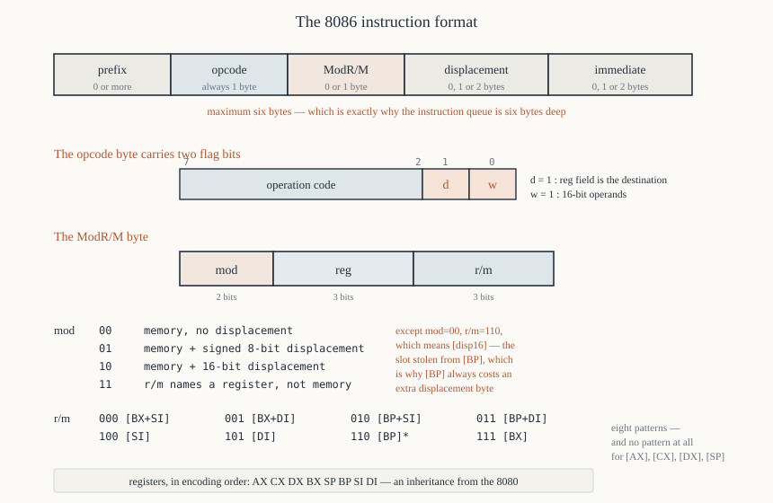

# Chapter 20 — Machine code encoding

[← Addressing modes](19-addressing-modes.md) · [Contents](README.md) · [Next: Data transfer →](21-data-transfer.md)

---

## Goal

Assemble 8086 instructions to bytes **by hand**, and disassemble bytes back to instructions. This is
the chapter that converts assembly language from "a text format" into "a description of specific
bytes in memory", and everything afterwards is easier for having done it.

It is also where the arbitrary-looking rules of Chapters 7 and 19 stop being arbitrary. Why can't
you write `[AX]`? Because there is no bit pattern for it. Why does `[BP]` need a displacement byte?
Because its encoding is taken. You will see all of it here.

---

## 1. The shape of an instruction

An 8086 instruction is one to six bytes, in this order:



```
  ┌─────────┬────────┬────────┬──────────────┬─────────────┐
  │ prefix  │ opcode │ ModR/M │ displacement │  immediate  │
  │ 0-4 by  │ 1 byte │ 0 or 1 │   0, 1 or 2  │  0, 1 or 2  │
  └─────────┴────────┴────────┴──────────────┴─────────────┘
```

| Field | When present | What it says |
|-------|--------------|--------------|
| **Prefix** | optional | segment override, `LOCK`, `REP` |
| **Opcode** | always | which operation, and two flag bits `d` and `w` |
| **ModR/M** | when an operand can be a register *or* memory | which register, which addressing mode |
| **Displacement** | when the addressing mode needs one | the constant added to the EA |
| **Immediate** | when an operand is a constant | the constant itself |

Maximum: 1 prefix (or more) + 1 opcode + 1 ModR/M + 2 displacement + 2 immediate = **6 bytes**.

> The queue is 6 bytes for exactly this reason: one complete instruction always fits.

---

## 2. The opcode byte, and the `d` and `w` bits

Most arithmetic and logic opcodes have this shape:

```
   7  6  5  4  3  2  1  0
  ┌──┬──┬──┬──┬──┬──┬──┬──┐
  │  operation code  │ d│ w│
  └──┴──┴──┴──┴──┴──┴──┴──┘
```

**`w` — width.**

```
   w = 0   ->  8-bit operands  (AL, BL, CL, DL, AH, BH, CH, DH, or a byte in memory)
   w = 1   ->  16-bit operands (AX, BX, CX, DX, SP, BP, SI, DI, or a word in memory)
```

**`d` — direction.** Only meaningful when a ModR/M byte follows.

```
   d = 0   ->  the REG field is the SOURCE;       R/M is the destination
   d = 1   ->  the REG field is the DESTINATION;  R/M is the source
```

### 2.1 `ADD` as the worked example

`ADD` occupies opcodes `0x00`–`0x03`:

| Opcode | Binary | `d` | `w` | Meaning |
|--------|--------|-----|-----|---------|
| `0x00` | `0000 0000` | 0 | 0 | `ADD r/m8, r8` |
| `0x01` | `0000 0001` | 0 | 1 | `ADD r/m16, r16` |
| `0x02` | `0000 0010` | 1 | 0 | `ADD r8, r/m8` |
| `0x03` | `0000 0011` | 1 | 1 | `ADD r16, r/m16` |

This pattern repeats for `OR` (`0x08`–`0x0B`), `ADC` (`0x10`–`0x13`), `SBB` (`0x18`–`0x1B`),
`AND` (`0x20`–`0x23`), `SUB` (`0x28`–`0x2B`), `XOR` (`0x30`–`0x33`) and `CMP` (`0x38`–`0x3B`).

Notice the arithmetic: each operation's base opcode is 8 higher than the previous. `ADD` = 0,
`OR` = 8, `ADC` = 0x10, `SBB` = 0x18, `AND` = 0x20, `SUB` = 0x28, `XOR` = 0x30, `CMP` = 0x38. The
opcode map is not random; it has structure, and Appendix B lays all of it out.

---

## 3. The ModR/M byte

The single most important byte in the encoding.

```
   7  6  5  4  3  2  1  0
  ┌──┬──┬──┬──┬──┬──┬──┬──┐
  │ mod │  reg   │  r/m   │
  └──┴──┴──┴──┴──┴──┴──┴──┘
     2      3        3
```

- **`mod`** (2 bits) — how to interpret `r/m`, and how many displacement bytes follow
- **`reg`** (3 bits) — a register, *or* an opcode extension for single-operand instructions
- **`r/m`** (3 bits) — a register or a memory addressing mode

### 3.1 The `reg` field

| `reg` | `w = 1` (16-bit) | `w = 0` (8-bit) |
|-------|------------------|-----------------|
| `000` | `AX` | `AL` |
| `001` | `CX` | `CL` |
| `010` | `DX` | `DL` |
| `011` | `BX` | `BL` |
| `100` | `SP` | `AH` |
| `101` | `BP` | `CH` |
| `110` | `SI` | `DH` |
| `111` | `DI` | `BH` |

**Memorise the order: AX CX DX BX SP BP SI DI.** Not alphabetical, not the order you learned the
registers in. It is `A`, `C`, `D`, `B` — and that ordering comes straight from the 8080's register
encoding.

The 8-bit column is the same order but as `AL CL DL BL AH CH DH BH` — all four low halves, then all
four high halves.

### 3.2 The `mod` field

| `mod` | Meaning |
|-------|---------|
| `00` | memory operand, **no displacement** — *except* `r/m = 110`, which means direct `[disp16]` |
| `01` | memory operand, **8-bit signed displacement** follows |
| `10` | memory operand, **16-bit displacement** follows |
| `11` | **`r/m` is a register**, not memory |

### 3.3 The `r/m` field, when `mod ≠ 11`

| `r/m` | Effective address |
|-------|-------------------|
| `000` | `[BX + SI]` |
| `001` | `[BX + DI]` |
| `010` | `[BP + SI]` |
| `011` | `[BP + DI]` |
| `100` | `[SI]` |
| `101` | `[DI]` |
| `110` | `[BP]` — **or `[disp16]` if `mod = 00`** |
| `111` | `[BX]` |

**There it is.** Eight patterns, and they are exactly the seventeen addressing forms of Chapter 19
§6.1 (eight base forms × four `mod` values, minus the duplicates). There is no bit pattern for
`[AX]`, `[CX]`, `[DX]` or `[SP]`, which is why those addressing modes do not exist.

### 3.4 The `[BP]` anomaly, explained

`mod = 00, r/m = 110` is used for the direct address `[disp16]` — a mode that would otherwise have no
encoding, since all eight `r/m` patterns are register-based.

Intel had to steal one, and they stole `[BP]` with no displacement, on the grounds that `BP` is
almost always used *with* a displacement (it points at a stack frame; you want `[BP+4]`, not `[BP]`).

So to encode `[BP]` you must use `mod = 01` with a displacement of zero:

```
   mov ax, [bx]     ->  8B 07        mod=00 reg=000 r/m=111      2 bytes
   mov ax, [bp]     ->  8B 46 00     mod=01 reg=000 r/m=110 d8=0 3 bytes
```

One wasted byte, forever, on every `[BP]` reference. That is the cost of squeezing a direct
addressing mode into a table with no free slots.

### 3.5 When `mod = 11`, `r/m` is a register

Using the same table as `reg`:

| `r/m` | `w = 1` | `w = 0` |
|-------|---------|---------|
| `000` | `AX` | `AL` |
| `001` | `CX` | `CL` |
| `010` | `DX` | `DL` |
| `011` | `BX` | `BL` |
| `100` | `SP` | `AH` |
| `101` | `BP` | `CH` |
| `110` | `SI` | `DH` |
| `111` | `DI` | `BH` |

---

## 4. Hand-assembly, step by step

### Example 1 — `ADD AX, BX`

**Step 1: choose the opcode.** Both operands are registers, both 16-bit. Either `0x01`
(`ADD r/m16, r16`) or `0x03` (`ADD r16, r/m16`) can express it. Assemblers conventionally pick
`d = 0` for register-to-register, so **`0x01`**.

**Step 2: build the ModR/M byte.**
- `mod = 11` — `r/m` is a register.
- `d = 0`, so `reg` is the **source** = `BX` = `011`.
- `r/m` is the **destination** = `AX` = `000`.

```
   mod  reg  r/m
   11   011  000   =  1101 1000  =  0xD8
```

**Result: `01 D8`.**

> NASM will emit `01 D8` for `add ax, bx`. If you write it the other way and let the assembler pick
> `d = 1`, you would get `03 C3` — a different encoding of *the same instruction*. Both are valid and
> both execute identically. Disassemblers show whichever bytes are actually there.

### Example 2 — `MOV AL, [BX]`

**Step 1: opcode.** `MOV r/m, r` family is `0x88`–`0x8B`:

| Opcode | `d` | `w` | Meaning |
|--------|-----|-----|---------|
| `0x88` | 0 | 0 | `MOV r/m8, r8` |
| `0x89` | 0 | 1 | `MOV r/m16, r16` |
| `0x8A` | 1 | 0 | `MOV r8, r/m8` |
| `0x8B` | 1 | 1 | `MOV r16, r/m16` |

Destination is a register (`AL`), source is memory, 8-bit → `d = 1`, `w = 0` → **`0x8A`**.

**Step 2: ModR/M.**
- `r/m` = `[BX]` = `111`, `mod = 00` (no displacement).
- `reg` = `AL` = `000`.

```
   mod  reg  r/m
   00   000  111   =  0000 0111  =  0x07
```

**Result: `8A 07`.**

### Example 3 — `MOV [BX+SI+4], CX`

**Step 1: opcode.** Destination memory, source register, 16-bit → `d = 0`, `w = 1` → **`0x89`**.

**Step 2: ModR/M.**
- `r/m` = `[BX+SI]` = `000`.
- Displacement is 4, which fits in a signed byte → `mod = 01`.
- `reg` = `CX` = `001`.

```
   mod  reg  r/m
   01   001  000   =  0100 1000  =  0x48
```

**Step 3: displacement.** One byte: `0x04`.

**Result: `89 48 04`.**

### Example 4 — `MOV AX, [0x1234]`

Two encodings exist.

**General form:** `d = 1`, `w = 1` → `0x8B`. `mod = 00`, `r/m = 110` (direct), `reg = 000` (`AX`).

```
   mod  reg  r/m
   00   000  110   =  0x06
   displacement (16-bit, low byte first): 34 12

   8B 06 34 12      4 bytes
```

**Accumulator short form:** `MOV AX, moffs16` has its own opcode `0xA1` with no ModR/M:

```
   A1 34 12         3 bytes
```

NASM emits the short form. This is why `MOV AX, [addr]` is one byte shorter than `MOV BX, [addr]`
(Chapter 19 §4.1).

### Example 5 — `ADD [BP+DI+0x1234], AX`

**Opcode:** memory destination, register source, 16-bit → `d = 0`, `w = 1` → **`0x01`**.

**ModR/M:**
- `r/m` = `[BP+DI]` = `011`.
- Displacement `0x1234` needs 16 bits → `mod = 10`.
- `reg` = `AX` = `000`.

```
   mod  reg  r/m
   10   000  011   =  1000 0011  =  0x83
```

**Displacement:** `34 12` (low byte first).

**Result: `01 83 34 12`.**

### Example 6 — `MOV word [ES:BX+2], 0x00FF`

Now with a prefix and an immediate.

**Prefix:** `ES:` override = **`0x26`**.

**Opcode:** immediate to memory, 16-bit → `MOV r/m16, imm16` = **`0xC7`**. Note: for this form the
`reg` field of ModR/M is an *opcode extension*, and it must be `000`.

**ModR/M:**
- `r/m` = `[BX]` = `111`.
- Displacement 2 fits a byte → `mod = 01`.
- `reg` = `000` (extension).

```
   mod  reg  r/m
   01   000  111   =  0100 0111  =  0x47
```

**Displacement:** `02`.
**Immediate:** `FF 00` (low byte first).

**Result: `26 C7 47 02 FF 00`** — six bytes, the maximum.

---

## 5. Opcode extensions — when `reg` is not a register

Single-operand instructions have nothing to put in `reg`, so Intel used it as three extra opcode
bits. These are the **instruction groups**.

### 5.1 Group 1 — immediate arithmetic (`0x80`–`0x83`)

| Opcode | Meaning |
|--------|---------|
| `0x80` | `op r/m8, imm8` |
| `0x81` | `op r/m16, imm16` |
| `0x82` | `op r/m8, imm8` (sign-extended; rarely used, aliases `0x80`) |
| `0x83` | `op r/m16, imm8` — **sign-extended** to 16 bits |

and the operation comes from `reg`:

| `reg` | Operation |
|-------|-----------|
| `000` | `ADD` |
| `001` | `OR` |
| `010` | `ADC` |
| `011` | `SBB` |
| `100` | `AND` |
| `101` | `SUB` |
| `110` | `XOR` |
| `111` | `CMP` |

Same order as the base opcodes of §2.1. So:

```
   add bx, 5       ->  83 C3 05
                       83 = op r/m16, imm8 sign-extended
                       C3 = mod 11, reg 000 (ADD), r/m 011 (BX)
                       05 = the immediate

   cmp bx, 5       ->  83 FB 05
                       FB = mod 11, reg 111 (CMP), r/m 011 (BX)
```

The only difference between `ADD BX, 5` and `CMP BX, 5` is three bits in the middle of the second
byte.

### 5.2 Group 2 — shifts and rotates (`0xD0`–`0xD3`)

| Opcode | Meaning |
|--------|---------|
| `0xD0` | `op r/m8, 1` |
| `0xD1` | `op r/m16, 1` |
| `0xD2` | `op r/m8, CL` |
| `0xD3` | `op r/m16, CL` |

| `reg` | Operation |
|-------|-----------|
| `000` | `ROL` |
| `001` | `ROR` |
| `010` | `RCL` |
| `011` | `RCR` |
| `100` | `SHL` / `SAL` |
| `101` | `SHR` |
| `110` | (not used) |
| `111` | `SAR` |

Note that **there is no immediate count other than 1** on the 8086 — that is why `shl ax, 4` is an
80186 instruction. The 80186 added opcodes `0xC0` and `0xC1` for it.

```
   shl ax, 1       ->  D1 E0      (mod 11, reg 100 = SHL, r/m 000 = AX)
   shr bl, cl      ->  D2 EB      (mod 11, reg 101 = SHR, r/m 011 = BL)
```

### 5.3 Group 3 — `TEST`/`NOT`/`NEG`/`MUL`/`DIV` (`0xF6`, `0xF7`)

| `reg` | Operation |
|-------|-----------|
| `000` | `TEST r/m, imm` |
| `001` | (not used) |
| `010` | `NOT` |
| `011` | `NEG` |
| `100` | `MUL` |
| `101` | `IMUL` |
| `110` | `DIV` |
| `111` | `IDIV` |

```
   mul bx          ->  F7 E3      (F7 = group 3, 16-bit; E3 = mod 11, reg 100 = MUL, r/m 011 = BX)
   neg al          ->  F6 D8      (F6 = 8-bit; D8 = mod 11, reg 011 = NEG, r/m 000 = AL)
```

### 5.4 Group 4 and 5 — `INC`/`DEC`/`CALL`/`JMP`/`PUSH` (`0xFE`, `0xFF`)

| `reg` | `0xFE` (8-bit) | `0xFF` (16-bit) |
|-------|----------------|------------------|
| `000` | `INC r/m8` | `INC r/m16` |
| `001` | `DEC r/m8` | `DEC r/m16` |
| `010` | — | `CALL near r/m16` |
| `011` | — | `CALL far m32` |
| `100` | — | `JMP near r/m16` |
| `101` | — | `JMP far m32` |
| `110` | — | `PUSH r/m16` |
| `111` | — | — |

```
   inc word [bx]   ->  FF 07
   call [bx]       ->  FF 17      (reg 010 = near indirect call)
   push [bx]       ->  FF 37      (reg 110)
```

Note that `INC AX` has *two* encodings: the group form `FF C0`, and the dedicated one-byte
`0x40`+reg. Assemblers use the short one.

---

## 6. The one-byte opcodes worth knowing

Some instructions pack the register number into the opcode itself, saving the ModR/M byte entirely.

| Pattern | Instructions | Encoding |
|---------|--------------|----------|
| `0x40 + reg` | `INC AX`…`INC DI` | `40 41 42 43 44 45 46 47` |
| `0x48 + reg` | `DEC AX`…`DEC DI` | `48 49 4A 4B 4C 4D 4E 4F` |
| `0x50 + reg` | `PUSH AX`…`PUSH DI` | `50 51 52 53 54 55 56 57` |
| `0x58 + reg` | `POP AX`…`POP DI` | `58 59 5A 5B 5C 5D 5E 5F` |
| `0x90 + reg` | `XCHG AX, reg` | `90 91 … 97` (`0x90` = `XCHG AX,AX` = `NOP`) |
| `0xB0 + reg` | `MOV r8, imm8` | `B0 B1 … B7` |
| `0xB8 + reg` | `MOV r16, imm16` | `B8 B9 … BF` |

The register order is always `AX CX DX BX SP BP SI DI` (or the 8-bit equivalents).

This explains Chapter 1's hex dump:

```
   B4 09     mov ah, 0x09      B0 + 100 (AH) = B4
   B0 00     mov al, 0x00      B0 + 000 (AL) = B0
```

`B4` and `B0` differ by 4 because `AH` is register 100 and `AL` is register 000 (Chapter 1 §5.3).

And `0x90` being `NOP` is not a special case — it is `XCHG AX, AX`, which does nothing.

---

## 7. Segment register encoding

`MOV` to and from segment registers uses a 2-bit field in `reg`:

| `reg` | Segment register |
|-------|------------------|
| `00` | `ES` |
| `01` | `CS` |
| `10` | `SS` |
| `11` | `DS` |

```
   8E = MOV sreg, r/m16
   8C = MOV r/m16, sreg

   mov ds, ax      ->  8E D8      (mod 11, reg 011 = DS, r/m 000 = AX)
   mov es, ax      ->  8E C0      (mod 11, reg 000 = ES, r/m 000 = AX)
   mov ax, ds      ->  8C D8
```

The `PUSH`/`POP` segment forms are single bytes with the same field:

```
   PUSH ES = 06     PUSH CS = 0E     PUSH SS = 16     PUSH DS = 1E
   POP  ES = 07     POP  CS = 0F*    POP  SS = 17     POP  DS = 1F
```

\* `POP CS` (`0x0F`) exists on the 8086 and does something catastrophic and useless. On the 80286
and later, `0x0F` became the two-byte-opcode escape prefix, which is where every instruction added
since lives.

---

## 8. Prefix bytes

| Byte | Prefix |
|------|--------|
| `0x26` | `ES:` segment override |
| `0x2E` | `CS:` segment override |
| `0x36` | `SS:` segment override |
| `0x3E` | `DS:` segment override |
| `0xF0` | `LOCK` |
| `0xF2` | `REPNE` / `REPNZ` |
| `0xF3` | `REP` / `REPE` / `REPZ` |

Each costs one byte and two clocks. The segment overrides have a memorable pattern: `00`, `01`,
`10`, `11` in bits 4–3 of `001xx110`.

---

## 9. Disassembling by hand

The reverse process. Given bytes, work left to right.

### Example — decode `26 8B 47 06`

**Byte 1: `26`.** In the prefix table → `ES:` segment override. Note it and continue.

**Byte 2: `8B`.** `1000 1011`. From the `MOV` table, `0x8B` = `MOV r16, r/m16`, so `d = 1`, `w = 1`.
A ModR/M byte follows.

**Byte 3: `47`.** `0100 0111`:
```
   mod = 01   -> memory, 8-bit displacement follows
   reg = 000  -> AX (w=1)
   r/m = 111  -> [BX]
```
`d = 1`, so `reg` is the destination: `AX`. `r/m` is the source: `[BX + disp8]`.

**Byte 4: `06`.** The displacement, +6.

**Result: `MOV AX, [ES:BX+6]`.**

### Example — decode `F7 74 FE`

**`F7`** → Group 3, 16-bit.

**`74`** = `0111 0100`:
```
   mod = 01   -> memory + disp8
   reg = 110  -> DIV      (from the Group 3 table)
   r/m = 100  -> [SI]
```

**`FE`** = the displacement, as a *signed* byte = −2.

**Result: `DIV word [SI-2]`.**

### Example — decode the whole of Chapter 1's program

```
   B4 09        B0+100 -> MOV AH, imm8;  imm = 09        ->  mov ah, 0x09
   BA 0D 01     B8+010 -> MOV DX, imm16; imm = 0x010D    ->  mov dx, 0x010D
   CD 21        CD = INT imm8; imm = 0x21                ->  int 0x21
   B4 4C                                                 ->  mov ah, 0x4C
   B0 00        B0+000 -> MOV AL, imm8                   ->  mov al, 0
   CD 21                                                 ->  int 0x21
```

Every byte accounted for, with no reference to the source.

---

## 10. Reading a NASM listing as a check

Always verify hand-assembly against the assembler. Build with `-l`:

```
nasm -f bin test.asm -o test.com -l test.lst
```

```
     1                          org 0x100
     2 00000000 01D8            add ax, bx
     3 00000002 8A07            mov al, [bx]
     4 00000004 894804          mov [bx+si+4], cx
     5 00000007 A13412          mov ax, [0x1234]
     6 0000000A 01833412        add [bp+di+0x1234], ax
     7 0000000E 26C74702FF00    mov word [es:bx+2], 0x00FF
```

Every example from §4 confirmed.

**Make this a habit.** Write the bytes you expect, assemble, compare. Ten minutes of that is worth a
chapter of reading.

---

## 11. Why encoding knowledge pays off

**You can read a disassembly of anything**, including code with no source.

**You understand the restrictions.** `[AX]` has no bit pattern. Immediate-to-segment has no opcode.
Shift-by-4 has no encoding on an 8086. These stop being rules to memorise.

**You can count bytes**, which matters for `.COM` size, for jump ranges (Chapter 27 §3), and for
self-relative addressing.

**You can patch binaries**, which is how debuggers set breakpoints (`0xCC` = `INT 3`) and how every
DOS-era patch worked.

**You can spot the assembler's choices.** When NASM picks `83 C3 05` over `81 C3 05 00`, you know
why, and you know it saved a byte.

---

## 12. Summary

```
  [prefix] opcode [ModR/M] [disp 0-2] [imm 0-2]      max 6 bytes

  opcode low bits:   d = direction (1: reg is destination)
                     w = width     (1: 16-bit)

  ModR/M = mod(2) reg(3) rm(3)

  mod  00 memory, no disp   (rm=110 means [disp16], NOT [BP])
       01 memory + disp8 (signed)
       10 memory + disp16
       11 rm is a register

  reg/rm registers (w=1):  000 AX  001 CX  010 DX  011 BX
                           100 SP  101 BP  110 SI  111 DI
         (w=0):            000 AL  001 CL  010 DL  011 BL
                           100 AH  101 CH  110 DH  111 BH

  rm memory (mod != 11):   000 [BX+SI]  001 [BX+DI]  010 [BP+SI]  011 [BP+DI]
                           100 [SI]     101 [DI]     110 [BP]*    111 [BX]

  groups: reg field is an opcode extension
     80-83 ADD OR ADC SBB AND SUB XOR CMP      (reg 000..111)
     D0-D3 ROL ROR RCL RCR SHL SHR -   SAR
     F6-F7 TEST - NOT NEG MUL IMUL DIV IDIV
     FE-FF INC DEC CALL CALLF JMP JMPF PUSH -

  short forms: 40+r INC · 48+r DEC · 50+r PUSH · 58+r POP
               B0+r MOV r8,imm8 · B8+r MOV r16,imm16 · 90+r XCHG AX,r

  prefixes: 26 ES  2E CS  36 SS  3E DS  F0 LOCK  F2 REPNE  F3 REP
```

---

## Exercises

Hand-assemble each of these, showing the opcode, the ModR/M breakdown and any displacement or
immediate bytes. Then verify with NASM.

**20.1** `ADD BX, CX`
**20.2** `MOV DL, [SI]`
**20.3** `SUB AX, [BX+DI]`
**20.4** `MOV [BP+6], AX`
**20.5** `CMP byte [DI+0x100], 0x20`
**20.6** `MOV word [0x0300], 0x1234`
**20.7** `AND AL, [ES:BX+SI+4]`
**20.8** `MUL word [BP+2]`
**20.9** `SHR DX, CL`
**20.10** `INC SI` — give both the short form and the group form, and say which NASM emits.

Now disassemble these byte sequences:

**20.11** `8B 5E FE`
**20.12** `F6 27`
**20.13** `81 C6 00 01`
**20.14** `2E 8A 07`
**20.15** `C6 46 FF 00`
**20.16** `D3 E8`

**20.17** Explain why `MOV AX, [BP]` is three bytes while `MOV AX, [BX]` is two.

**20.18** `ADD BX, 5` and `CMP BX, 5` differ by how many bits, and which ones?

**20.19** Why does the 8086 have no encoding for `SHL AX, 4`? Which processor added one, and at
which opcode?

**20.20** The instruction queue is exactly 6 bytes. Explain the connection to the instruction format.

Answers in [Appendix H](H-exercise-solutions.md#chapter-20).

---

[← Addressing modes](19-addressing-modes.md) · [Contents](README.md) · [Next: Data transfer →](21-data-transfer.md)
