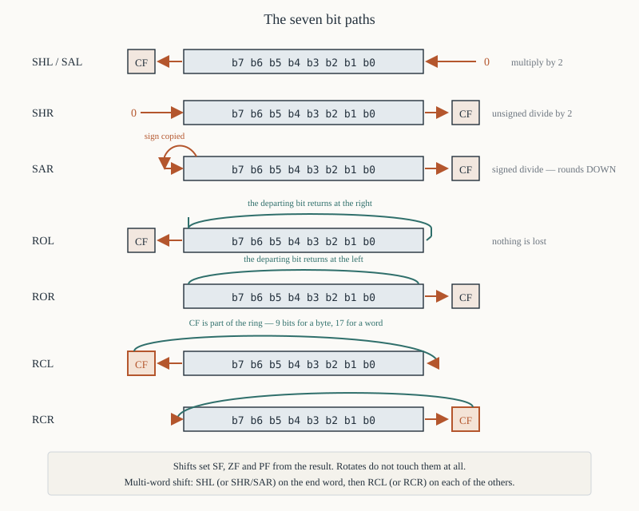

# Chapter 26 — Shifts and rotates

[← Logical instructions](25-logical.md) · [Contents](README.md) · [Next: Jumps and loops →](27-jumps-and-loops.md)

---

## Goal

Eight instructions: `SHL`, `SAL`, `SHR`, `SAR`, `ROL`, `ROR`, `RCL`, `RCR`. Each moves bits sideways;
they differ only in what comes in at one end and what happens to the bit that falls off the other.

Get the picture of each one's bit path right and the rest is bookkeeping.

---

## 1. The 8086's restriction

```asm
        shl  ax, 1              ; ✔ count of exactly 1
        mov  cl, 4
        shl  ax, cl             ; ✔ count in CL
        shl  ax, 4              ; ✘ NOT an 8086 instruction — 80186 and later only
```

**The count is either the literal 1 or the register `CL`.** Nothing else. Chapter 20 §5.2 shows why:
opcodes `D0`–`D3` provide exactly those two forms, and the immediate-count opcodes `C0`/`C1` were
added by the 80186.

The count must be in `CL`, not `CX`. And the 8086 does **not** mask the count — `shl ax, cl` with
`CL = 200` really does execute 200 shift steps, taking about 800 clocks and leaving zero. (The 80286
and later mask the count to 5 bits, so they behave differently. This is one of the few genuine
behavioural differences between an 8086 and its successors.)

### 1.1 Clock counts

| Form | Clocks |
|------|--------|
| `shift reg, 1` | **2** |
| `shift mem, 1` | 15 + EA |
| `shift reg, CL` | **8 + 4 per bit** |
| `shift mem, CL` | 20 + EA + 4 per bit |

So:

```asm
        shl  ax, 1              ;  2 clocks
        shl  ax, 1              ;  4 total
        shl  ax, 1              ;  6
        shl  ax, 1              ;  8 total for a shift of 4

        mov  cl, 4              ;  4 clocks
        shl  ax, cl             ;  8 + 16 = 24;  28 total
```

**Repeated single shifts beat `CL` for counts up to about 6.** Past that, `CL` wins. Most hand-written
8086 code shifts by 1 several times for exactly this reason.

---

## 2. The eight bit paths



```
  SHL / SAL   CF ◄── [ b7 b6 b5 b4 b3 b2 b1 b0 ] ◄── 0
              shift left, zero in at the right

  SHR         0 ──► [ b7 b6 b5 b4 b3 b2 b1 b0 ] ──► CF
              shift right, zero in at the left

  SAR      ┌─► [ b7 b6 b5 b4 b3 b2 b1 b0 ] ──► CF
           └────┘  sign bit copied into itself — arithmetic right shift

  ROL         CF ◄─┬─ [ b7 b6 b5 b4 b3 b2 b1 b0 ] ◄─┐
                   └──────────────────────────────────┘
              rotate left; the bit that leaves also enters at the right AND goes to CF

  ROR       ┌─► [ b7 b6 b5 b4 b3 b2 b1 b0 ] ─┬─► CF
            └─────────────────────────────────┘
              rotate right

  RCL         ┌─ CF ◄── [ b7 ... b0 ] ◄─┐
              └───────────────────────────┘
              rotate left THROUGH carry — CF is a 9th (or 17th) bit

  RCR         ┌─► [ b7 ... b0 ] ──► CF ─┐
              └────────────────────────────┘
              rotate right through carry
```

The distinction that matters:

- **Shifts** discard the bit that leaves (after copying it to `CF`) and bring in a new bit — 0, or a
  copy of the sign.
- **Rotates** bring the departing bit back in at the other end. Nothing is lost.
- **Rotates through carry** include `CF` in the ring, making it 9 bits wide for a byte or 17 for a
  word.

---

## 3. `SHL` and `SAL` — shift left

```asm
        shl  ax, 1              ; D1 E0
        sal  ax, 1              ; D1 E0 — the SAME instruction
```

`SHL` and `SAL` are two names for one opcode (group 2, `reg = 100`). Shifting left is identical for
signed and unsigned values, so no distinction is needed.

```
   before:  AL = 1011 0110      CF = ?
   shl al,1
   after:   AL = 0110 1100      CF = 1  (the bit that fell off the left)
```

### 3.1 It multiplies by 2

Each left shift doubles the value:

```asm
        mov  al, 5              ; 0000 0101
        shl  al, 1              ; 0000 1010 = 10
        shl  al, 1              ; 0001 0100 = 20
```

Shifting left *n* times multiplies by 2ⁿ — at 2 clocks each against `MUL`'s 70+.

### 3.2 Flags

- `CF` = the bit shifted out of the top.
- `ZF`, `SF`, `PF` from the result.
- `AF` undefined.
- **`OF`** is defined **only for a shift count of 1**: it is set if the sign bit *changed* — i.e.
  `OF = CF XOR (new bit 7)`. That tells you a signed overflow occurred.

```asm
        mov  al, 0x40           ; +64
        shl  al, 1              ; AL = 0x80 = −128.  CF = 0, but OF = 1 — sign changed
```

For multi-bit counts `OF` is undefined.

---

## 4. `SHR` — logical shift right

```asm
        shr  ax, 1              ; D1 E8
```

```
   before:  AL = 1011 0110
   shr al,1
   after:   AL = 0101 1011      CF = 0  (the bit that fell off the right)
```

A **zero** always enters at the top.

### 4.1 It divides unsigned by 2

```asm
        mov  al, 20             ; 0001 0100
        shr  al, 1              ; 0000 1010 = 10
        shr  al, 1              ; 0000 0101 = 5
        shr  al, 1              ; 0000 0010 = 2   — the remainder is discarded
```

Truncation, with the discarded bit landing in `CF`. That gives you rounding for free:

```asm
        shr  ax, 1
        adc  ax, 0              ; add the discarded bit back -> round to nearest
```

### 4.2 It is wrong for signed values

```asm
        mov  al, -8             ; 1111 1000
        shr  al, 1              ; 0111 1100 = +124.  ✘ not −4
```

The zero entering at the top destroys the sign. Use `SAR`.

### 4.3 Flags

`CF` = the bit shifted out. `SF` = 0 always (a zero came in at the top). `ZF`, `PF` from the result.
`OF` for a count of 1 = the original most significant bit.

---

## 5. `SAR` — arithmetic shift right

```asm
        sar  ax, 1              ; D1 F8
```

The sign bit is **copied into itself** as well as moving right, so the sign is preserved.

```
   before:  AL = 1111 1000      (−8)
   sar al,1
   after:   AL = 1111 1100      (−4)   CF = 0

   before:  AL = 0111 1000      (+120)
   sar al,1
   after:   AL = 0011 1100      (+60)  CF = 0
```

### 5.1 The rounding difference from `IDIV`

**`SAR` rounds toward negative infinity. `IDIV` truncates toward zero.** They differ for negative odd
numbers:

```asm
        mov  al, -7             ; 1111 1001
        sar  al, 1              ; 1111 1100 = −4      (IDIV would give −3)
```

Chapter 23 §7.4 gives the three-instruction correction.

### 5.2 `SAR` by 15 gives a sign mask

```asm
        mov  cl, 15
        sar  ax, cl             ; AX = 0x0000 if it was positive, 0xFFFF if negative
```

That is the same thing `CWD` puts in `DX`, and `CWD` is one byte and 5 clocks against this
sequence's 3 bytes and 72 clocks. Use `CWD`.

---

## 6. `ROL` and `ROR` — rotate

Nothing is lost; the bits circulate.

```asm
        rol  al, 1              ; D0 C0
        ror  al, 1              ; D0 C8
```

```
   ROL:  AL = 1011 0110  ->  0110 1101   CF = 1
                              ^ the departing bit 7 came back in at bit 0
                                and also went to CF

   ROR:  AL = 1011 0110  ->  0101 1011   CF = 0
                              ^ the departing bit 0 came back in at bit 7
```

### 6.1 Uses

**Examining every bit without destroying the value.** Rotate 8 (or 16) times and you are back where
you started:

```asm
        mov  cx, 8
.next:  rol  al, 1              ; the next bit lands in CF
        jc   .bit_was_set
        ; ...
.bit_was_set:
        loop .next              ; after 8 rotations AL is unchanged
```

**Moving a nibble.** Four `ROL`s bring the high nibble down:

```asm
        rol  al, 1
        rol  al, 1
        rol  al, 1
        rol  al, 1              ; AL's nibbles are swapped
        and  al, 0x0F           ; keep the one you want
```

The hex-printing routine in Chapter 22 §9 uses exactly this.

**Byte swapping a word:**

```asm
        mov  cl, 8
        rol  ax, cl             ; AX = 0x1234 -> 0x3412
```

though `xchg al, ah` does the same in one byte and 3 clocks.

### 6.2 Flags

`CF` = the bit that wrapped round. **`ZF`, `SF`, `PF` and `AF` are NOT affected** — rotates do not
touch them at all. `OF` is defined only for a count of 1, and means "the sign bit changed".

This is an important difference from shifts: after a rotate you cannot test `ZF`.

---

## 7. `RCL` and `RCR` — rotate through carry

The carry flag joins the ring, making it 9 bits (byte) or 17 bits (word).

```asm
        rcl  al, 1              ; D0 D0
        rcr  al, 1              ; D0 D8
```

```
   CF = 1,  AL = 1011 0110
   rcl al,1
   CF = 1 (the old bit 7),  AL = 0110 1101
                                        ^ the OLD CF entered here
```

### 7.1 Multi-precision shifts — the real use

To shift a 32-bit value in `DX:AX` left by one bit, the bit leaving `AX` must enter `DX`:

```asm
        shl  ax, 1              ; bit 15 of AX -> CF
        rcl  dx, 1              ; CF -> bit 0 of DX, and DX's bit 15 -> CF
```

Two instructions, and it extends to any width:

```asm
; shift a 64-bit value in [q] (four words, low first) left by one bit
        shl  word [q], 1
        rcl  word [q+2], 1
        rcl  word [q+4], 1
        rcl  word [q+6], 1
```

Right shifts go the other way, starting from the **high** word:

```asm
        shr  word [q+6], 1      ; or SAR for a signed value
        rcr  word [q+4], 1
        rcr  word [q+2], 1
        rcr  word [q], 1
```

**This is the only way to do multi-precision shifts on an 8086**, and it is the reason `RCL` and
`RCR` exist.

### 7.2 Testing a bit into carry and back

```asm
        rcr  al, 1              ; bottom bit -> CF, old CF -> bit 7
        jc   .was_set
        rcl  al, 1              ; put it back exactly
```

Rarely worth it; `TEST` is clearer.

---

## 8. Flag summary for all eight

| Instruction | `CF` | `OF` (count = 1 only) | `SF` `ZF` `PF` | `AF` |
|-------------|------|----------------------|----------------|------|
| `SHL`/`SAL` | bit shifted out of the top | set if the sign changed | **set** from result | undefined |
| `SHR` | bit shifted out of the bottom | = the original MSB | **set** (`SF` always 0) | undefined |
| `SAR` | bit shifted out of the bottom | always 0 | **set** | undefined |
| `ROL` | the bit that wrapped | set if the sign changed | **unchanged** | unchanged |
| `ROR` | the bit that wrapped | set if the sign changed | **unchanged** | unchanged |
| `RCL` | the bit shifted out | set if the sign changed | **unchanged** | unchanged |
| `RCR` | the bit shifted out | set if the sign changed | **unchanged** | unchanged |

**Shifts set `SF`/`ZF`/`PF`; rotates do not.** That one line is the most-tested fact in this chapter.

---

## 9. Worked program — binary display of a word

```asm
; showbin.asm — print a 16-bit value in binary
; nasm -f bin showbin.asm -o showbin.com
;
;   BX -> the value being displayed
;   CX -> bit counter
;   DL -> the character to print
        org  0x100

start:
        mov  dx, prefix
        mov  ah, 0x09
        int  0x21

        mov  bx, [value]
        mov  cx, 16

.next:
        rol  bx, 1              ; the top bit moves into CF — and back into bit 0,
                                ;   so BX is unchanged after all 16 rotations
        mov  dl, '0'
        jnc  .emit
        mov  dl, '1'
.emit:
        mov  ah, 0x02
        int  0x21               ; DOS: print the character in DL

        ; insert a space every four bits for readability
        mov  ax, cx
        dec  ax
        and  ax, 3              ; zero on iterations 13, 9, 5, 1
        jnz  .skip
        cmp  cx, 1              ; but not after the very last bit
        je   .skip
        mov  dl, ' '
        mov  ah, 0x02
        int  0x21
.skip:
        loop .next

        mov  dx, crlf
        mov  ah, 0x09
        int  0x21

        mov  ax, 0x4C00
        int  0x21

value:  dw   0xB6D3
prefix: db   'Binary: $'
crlf:   db   0x0D, 0x0A, '$'
```

**Output:** `Binary: 1011 0110 1101 0011`

### 9.1 Notes

**`ROL` rather than `SHL`.** After 16 rotations `BX` holds its original value, so the program could
print it again without reloading. With `SHL` it would be zero. Nothing here needs that, but it is
free, and it is the reason `ROL` is the conventional choice in a bit-display loop.

**`jnc` immediately after `rol`.** The rotate puts the departing bit in `CF`, so the branch reads it
directly — no masking, no comparison.

**The spacing logic** uses `CX`, which counts 16 down to 1. Spaces go after iterations where
`(CX−1) mod 4 == 0`, i.e. `CX` = 13, 9, 5 — and we suppress the one at `CX` = 1.

**`mov ah, 0x02` inside the loop.** DOS function 02h destroys `AL` (it returns the last character
written), so `AX` must be reloaded each time. It does not destroy `DL`, `CX` or `BX`.

---

## 10. Choosing the right one

| Task | Instruction |
|------|-------------|
| Multiply unsigned or signed by 2ⁿ | `SHL` × *n* |
| Divide **unsigned** by 2ⁿ | `SHR` × *n* |
| Divide **signed** by 2ⁿ (rounding down) | `SAR` × *n* |
| Divide signed by 2ⁿ, matching `IDIV` | `CWD` / `SUB AX,DX` / `SAR` |
| Extract a bit into `CF` | `SHL`/`SHR`/`ROL`/`ROR` by 1 |
| Examine all bits without destroying the value | `ROL` in a loop |
| Swap the nibbles of a byte | four `ROL`s (or `ROR`s) |
| Swap the bytes of a word | `XCHG AL, AH` |
| Shift a multi-word value | `SHL`/`SHR` on one end, `RCL`/`RCR` on the rest |
| Move a bit-field into position | `SHL`/`SHR` by `CL`, then `AND` |

---

## 11. Summary

```
  count is 1 or CL only on an 8086. `shl ax, 4` is an 80186 instruction.
  the 8086 does NOT mask the count; 80286+ masks it to 5 bits.

  reg,1 = 2 clocks · reg,CL = 8 + 4n clocks
     -> repeated single shifts beat CL for n up to about 6

  SHL/SAL  0 in at the right, top bit -> CF        multiply by 2
  SHR      0 in at the left,  bottom bit -> CF     unsigned divide by 2
  SAR      sign copied in,    bottom bit -> CF     signed divide (rounds DOWN)
  ROL      departing bit returns at the right, and goes to CF
  ROR      departing bit returns at the left,  and goes to CF
  RCL      CF joins the ring: 9 bits (byte) or 17 (word)
  RCR      the same, rightwards

  SHIFTS set SF, ZF, PF.  ROTATES DO NOT.
  OF is meaningful only for a count of 1, and means "the sign changed".

  multi-word shift left :  SHL low, then RCL each higher word
  multi-word shift right:  SHR/SAR high, then RCR each lower word
```

---

## Exercises

**26.1** `AL = 1100 1010`. Give `AL` and `CF` after each of (starting from that value each time):
`shl al,1`, `shr al,1`, `sar al,1`, `rol al,1`, `ror al,1`.

**26.2** `AL = 0x35`, `CF = 1`. Give `AL` and `CF` after `rcl al, 1`. Then after `rcr al, 1` from the
original state.

**26.3** Write the instructions that multiply `AX` by 8 using shifts. How many clocks? Compare with
`MUL`.

**26.4** Write the instructions that multiply `AX` by 40 using shifts and one addition.

**26.5** Why does `shr al, 1` give the wrong answer for `AL = −8`? What is the right instruction?

**26.6** `AX = −9`. What does `sar ax, 1` give? What would `IDIV` by 2 give? Explain the difference.

**26.7** Write the two instructions that shift the 32-bit value in `DX:AX` left by one bit.

**26.8** Write the four instructions that shift a 64-bit value at `[q]` right by one bit, treating it
as unsigned.

**26.9** After `rol al, 1`, can you use `jz` to test whether `AL` is now zero? Explain.

**26.10** Write a loop that counts the number of 1 bits in `AX` using `ROL` and `JC`, leaving `AX`
unchanged at the end.

**26.11** Write the code that extracts bits 4–7 of `AL` into the low nibble of `AL`, leaving the
rest zero. Give two versions: one using `CL`, one using repeated single shifts, and compare clocks.

**26.12** On an 8086, `mov cl, 33` / `shl ax, cl` does what? What does the same code do on an 80286?

**26.13** Why is `xchg al, ah` preferable to `mov cl,8` / `rol ax, cl` for byte swapping?

Answers in [Appendix H](H-exercise-solutions.md#chapter-26).

---

[← Logical instructions](25-logical.md) · [Contents](README.md) · [Next: Jumps and loops →](27-jumps-and-loops.md)
