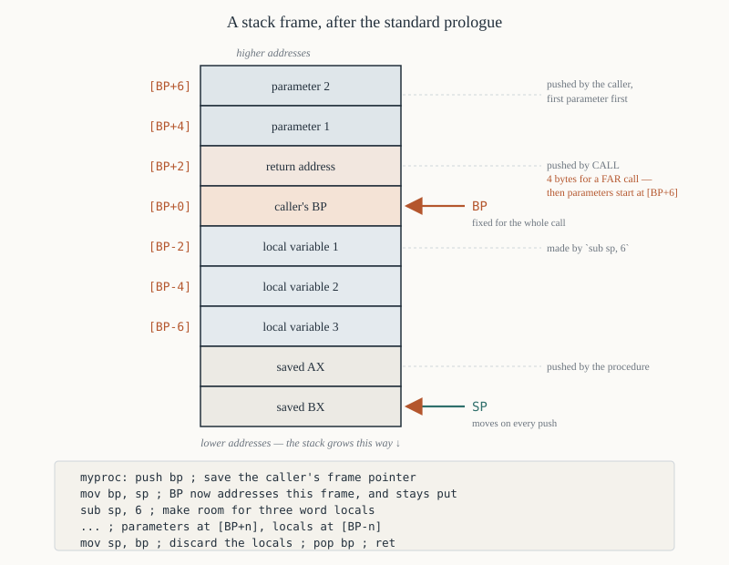

# Chapter 28 — Procedures and the stack

[← Jumps and loops](27-jumps-and-loops.md) · [Contents](README.md) · [Next: String instructions →](29-string-instructions.md)

---

## Goal

`CALL` and `RET` in all their forms, and the thing built on them: the **stack frame**. By the end
you should be able to write a procedure that takes parameters, allocates local variables, preserves
the caller's registers, and can call itself recursively — and to draw the stack at any point inside
it.

---

## 1. `CALL` and `RET`

### 1.1 What `CALL` does

```
   CALL near label :   push IP              ;  IP <- target
   CALL far  label :   push CS ; push IP    ;  CS:IP <- target
```

The pushed `IP` is the address of the instruction **after** the `CALL` — the return address.

### 1.2 What `RET` does

```
   RET near :   pop IP
   RET far  :   pop IP ; pop CS
```

**The `RET` must match the `CALL`.** A near `CALL` followed by a far `RET` pops two words instead of
one, taking a garbage `CS` and leaving the stack unbalanced. NASM gets this right automatically when
you use `call`/`ret` consistently within one file; it becomes your problem when you write far
procedures (§7).

### 1.3 The forms

| Instruction | Opcode | Bytes | Clocks |
|-------------|--------|-------|--------|
| `CALL near label` | `E8 cw` | 3 | 19 |
| `CALL far seg:off` | `9A cd` | 5 | 28 |
| `CALL near r16` | `FF /2` | 2 | 16 |
| `CALL near [mem]` | `FF /2` | 2–4 | 21 + EA |
| `CALL far [mem]` | `FF /3` | 2–4 | 37 + EA |
| `RET` (near) | `C3` | 1 | 16 |
| `RET n` (near, pop n) | `C2 iw` | 3 | 20 |
| `RETF` | `CB` | 1 | 26 |
| `RETF n` | `CA iw` | 3 | 25 |

Note there is **no short `CALL`** — the shortest is three bytes. And `CALL near label` is always
relative, so procedures are position-independent within a segment.

### 1.4 A minimal example

```asm
        org  0x100
start:
        mov  al, 'X'
        call putchar            ; push 0x0106, jump to putchar
        mov  ax, 0x4C00         ; <- 0x0106, the return address
        int  0x21

putchar:
        mov  dl, al
        mov  ah, 0x02
        int  0x21
        ret                     ; pop 0x0106 into IP
```

Trace the stack:

```
   before CALL:   SP = 0xFFFE
   during CALL:   SP = 0xFFFC, [SS:FFFC] = 0x0106
   during RET:    IP = 0x0106, SP = 0xFFFE
```

---

## 2. Why a stack

Three jobs, all of which need last-in-first-out storage:

**Return addresses**, so procedures can nest and recurse.

**Saved registers**, so a procedure can use registers the caller needed.

**Local variables and parameters**, so each invocation gets its own copy.

The 8086's stack lives in `SS:SP`, grows **downwards**, and moves in units of 2 bytes.

### 2.1 Setting it up

For a `.COM` program, DOS does it for you: `SS` = your segment, `SP` = `0xFFFE`. You get most of a
64 KiB segment of stack, which is far more than you need.

For an `.EXE`, the header declares the stack segment and size, and DOS sets `SS:SP` from it
(Chapter 35 §4).

For bare-metal code you do it yourself:

```asm
        cli                     ; belt and braces — see Chapter 7 §4.2
        mov  ax, stack_seg
        mov  ss, ax
        mov  sp, stack_top      ; these two must be adjacent
        sti
```

### 2.2 How much stack

Each near `CALL` costs 2 bytes. Each far `CALL` costs 4. Each `PUSH` costs 2. Each hardware
interrupt costs 6 (flags, `CS`, `IP`).

A reasonable budget: 256 bytes for a simple program, 1–2 KiB if you use DOS heavily (DOS uses your
stack for some calls), more if you recurse.

**Stack overflow is silent.** `SP` wraps past 0 to `0xFFFE` and starts overwriting the top of your
segment. There is no protection whatsoever on an 8086. Recursion with no depth limit corrupts
memory rather than raising an error.

---

## 3. Preserving registers

A procedure that destroys a register the caller was using is a bug that shows up far from its cause.

### 3.1 The convention this book uses

**A procedure preserves every register except those it explicitly returns values in.**

```asm
; strlen — return the length of the $-terminated string at DS:SI in CX.
;   Preserves: everything except CX and the flags.
strlen:
        push ax
        push si

        xor  cx, cx
.next:
        lodsb                   ; AL <- [SI], SI++
        cmp  al, '$'
        je   .done
        inc  cx
        jmp  .next
.done:
        pop  si
        pop  ax
        ret
```

**Pop in the reverse order of the pushes.** Getting that wrong swaps two registers silently.

### 3.2 Preserving flags too

```asm
myproc: pushf
        push ax
        ; ...
        pop  ax
        popf
        ret
```

Only do this if the caller genuinely depends on the flags. Usually it does not, and `PUSHF`/`POPF`
costs 18 clocks.

### 3.3 Document it

Every procedure in Part IV of this book carries a header like:

```asm
; ---------------------------------------------------------------
; print_dec — print the unsigned value in AX as decimal
;
;   In:        AX = the value
;   Out:       nothing
;   Destroys:  nothing (all registers preserved)
;   Uses:      DOS INT 21h function 02h
; ---------------------------------------------------------------
```

That comment is worth more than any amount of clever code.

---

## 4. Passing parameters

Four methods, in increasing order of generality.

### 4.1 In registers — fastest, and the usual choice

```asm
        mov  al, 'X'
        call putchar
```

**Advantages:** no memory traffic, no setup, no cleanup.
**Limits:** eight registers, and they run out fast. Also makes recursion awkward.

Use this for one to three parameters, which covers most procedures.

### 4.2 In global variables — simple, but not reentrant

```asm
        mov  [param1], ax
        mov  [param2], bx
        call myproc
```

**Never reentrant.** If `myproc` is called from an interrupt handler while the main program is
partway through setting up the parameters, the values are corrupted. Avoid except in small programs.

### 4.3 On the stack — the general method

This is what every high-level language does, and §5 covers it in full.

```asm
        push ax                 ; parameter 2
        push bx                 ; parameter 1
        call myproc
        add  sp, 4              ; the CALLER cleans up (C convention)
```

### 4.4 In a parameter block — for many parameters

Pass a pointer to a structure:

```asm
        mov  si, params
        call myproc
```

Used by DOS and BIOS for calls with many arguments.

---

## 5. Stack frames

The mechanism that makes stack parameters and local variables work.



### 5.1 The standard prologue and epilogue

```asm
myproc:
        push bp                 ; save the caller's frame pointer
        mov  bp, sp             ; BP = our frame pointer, fixed for the call
        sub  sp, 6              ; allocate 6 bytes of local variables
        push ax                 ; save whatever registers we will use
        push bx
        ; ... body ...
        pop  bx
        pop  ax
        mov  sp, bp             ; deallocate the locals
        pop  bp                 ; restore the caller's frame pointer
        ret
```

(The 80186 compressed the prologue into `ENTER` and the epilogue into `LEAVE`. On an 8086 you write
them out.)

### 5.2 Why `BP` and not `SP`

**`SP` moves.** Every `PUSH` inside the procedure changes it, so `[SP+4]` means different things at
different points.

**`BP` is fixed** for the duration of the call, so `[BP+4]` always means the same thing.

**And `[SP]` is not even a legal addressing mode** on the 8086 (Chapter 7 §9). `BP` is the only way
to read the stack without popping.

**Remember `[BP]` defaults to `SS`** — which is exactly right here, because the frame is in the stack
segment. That is why `BP` exists.

### 5.3 The frame, drawn

After the prologue, with two parameters pushed by the caller:

```
   higher addresses
                    ┌──────────────────┐
   [BP+6]           │   parameter 2    │   pushed first by the caller
                    ├──────────────────┤
   [BP+4]           │   parameter 1    │   pushed second
                    ├──────────────────┤
   [BP+2]           │  return address  │   pushed by CALL
                    ├──────────────────┤
   [BP+0]  ◄── BP   │  caller's BP     │   pushed by our prologue
                    ├──────────────────┤
   [BP-2]           │  local variable  │
                    ├──────────────────┤
   [BP-4]           │  local variable  │
                    ├──────────────────┤
   [BP-6]           │  local variable  │   SP after `sub sp, 6`
                    ├──────────────────┤
                    │  saved AX        │
                    ├──────────────────┤
                    │  saved BX        │   ◄── SP
                    └──────────────────┘
   lower addresses
```

**Parameters are at positive offsets from `BP`. Locals are at negative offsets.** That is the rule,
and the offsets follow mechanically:

```
   [BP+2]  = return address (near call)
   [BP+4]  = the LAST parameter pushed
   [BP+6]  = the one before it
   ...
   [BP-2]  = the first local
   [BP-4]  = the second local
```

For a **far** call the return address is 4 bytes, so parameters start at `[BP+6]`.

### 5.4 A complete example

```asm
; ---------------------------------------------------------------
; add_and_double(a, b)  ->  (a + b) * 2
;
;   Parameters on the stack, pushed left to right by the caller.
;   Result in AX. Caller cleans up.
; ---------------------------------------------------------------
add_and_double:
        push bp
        mov  bp, sp
        sub  sp, 2              ; one local: the sum

        push bx                 ; preserve what we use

        mov  ax, [bp+6]         ; a  (pushed first, so further up)
        mov  bx, [bp+4]         ; b  (pushed second)
        add  ax, bx
        mov  [bp-2], ax         ; store in the local
        mov  ax, [bp-2]
        shl  ax, 1              ; double it

        pop  bx
        mov  sp, bp             ; discard the local
        pop  bp
        ret

; --- calling it ---
        push word [a]           ; parameter 1
        push word [b]           ; parameter 2
        call add_and_double
        add  sp, 4              ; caller removes the two parameters
        mov  [result], ax
```

The local variable here is pointless — it is written and immediately read — but it shows the
mechanism. Real procedures use locals for arrays and for values that must survive a nested call.

---

## 6. Who cleans up the parameters

Two conventions, and you must pick one and be consistent.

### 6.1 Caller cleans up (the C convention)

```asm
        push ax
        push bx
        call myproc
        add  sp, 4              ; the caller removes them
...
myproc: ...
        ret                     ; plain RET
```

**Advantage:** supports a variable number of parameters, because only the caller knows how many were
pushed. This is why C uses it, and why `printf` is possible.

### 6.2 Callee cleans up (the Pascal convention)

```asm
        push ax
        push bx
        call myproc             ; nothing after the call
...
myproc: ...
        ret  4                  ; RET pops 4 extra bytes
```

`RET n` pops the return address *and then adds n to `SP`*.

**Advantage:** three bytes saved at every call site, which matters when a procedure is called from
many places.
**Limit:** the parameter count must be fixed.

### 6.3 Mixing them is a disaster

If the caller expects to clean up and the callee also cleans up, `SP` drifts by 4 bytes on every
call. After a few hundred calls the stack pointer has wandered into your data. The symptom is a
program that works for a while and then behaves impossibly.

**Write the convention in every procedure's header comment.**

---

## 7. Near versus far procedures

| | Near | Far |
|---|------|-----|
| `CALL` pushes | `IP` (2 bytes) | `CS` and `IP` (4 bytes) |
| Return instruction | `RET` (`C3`) | `RETF` (`CB`) |
| Reach | within the current 64 KiB code segment | anywhere in 1 MiB |
| `CALL` bytes / clocks | 3 / 19 | 5 / 28 |
| First parameter at | `[BP+4]` | **`[BP+6]`** |

Use near procedures unless your code exceeds 64 KiB. A `.COM` program cannot exceed it by
definition, so everything in Part IV is near.

### 7.1 Writing a far procedure in NASM

```asm
far_proc:
        push bp
        mov  bp, sp
        mov  ax, [bp+6]         ; NOTE: +6, because CS was pushed too
        pop  bp
        retf                    ; NOT ret

; calling it
        call far [fptr]
fptr:   dw   far_proc           ; offset
        dw   0                  ; segment — filled in at run time
```

Interrupt handlers are effectively far procedures, but they return with `IRET`, which pops the flags
as well (Chapter 31 §4).

---

## 8. Recursion

A procedure that calls itself. It works on the 8086 because each invocation gets its own stack frame.

### 8.1 Factorial

```asm
; ---------------------------------------------------------------
; factorial(n) -> n!
;
;   In:        the parameter n on the stack at [BP+4]
;   Out:       AX = n!
;   Destroys:  AX, flags. Everything else preserved.
;   Cleanup:   caller
;
;   n! = 1               if n <= 1
;      = n * (n-1)!      otherwise
; ---------------------------------------------------------------
factorial:
        push bp
        mov  bp, sp
        push bx

        mov  ax, [bp+4]         ; n
        cmp  ax, 1
        jbe  .base              ; n <= 1 -> return 1

        dec  ax
        push ax                 ; push n-1
        call factorial          ; AX = (n-1)!
        add  sp, 2              ; clean up the parameter

        mov  bx, [bp+4]         ; n again
        mul  bx                 ; DX:AX = n * (n-1)!
        jmp  .done

.base:
        mov  ax, 1

.done:
        pop  bx
        pop  bp
        ret
```

### 8.2 The stack during `factorial(3)`

```
   call factorial(3)
       [BP+4] = 3, frame A
       call factorial(2)
           [BP+4] = 2, frame B
           call factorial(1)
               [BP+4] = 1, frame C  -> returns AX = 1
           AX = 1;  1 * 2 = 2
       AX = 2;  2 * 3 = 6
   AX = 6
```

Three frames live at once. Each is 6 bytes (parameter + return address + saved `BP`) plus the saved
`BX` — 8 bytes. Depth *n* costs 8*n* bytes of stack.

**Recursion depth is limited only by stack size, and exceeding it corrupts memory silently.**
`factorial(10000)` would consume 80 KiB, wrap `SP`, and destroy the program. Always bound your
recursion.

### 8.3 When not to recurse

`factorial` is better written as a loop:

```asm
        mov  ax, 1
        mov  cx, [n]
        jcxz .done
.next:  mul  cx
        loop .next
.done:
```

Four instructions, no stack, no `CALL` overhead. Recursion earns its keep for genuinely recursive
structures — trees, parsers, quicksort — not for anything a loop expresses naturally.

---

## 9. Common bugs

| Bug | Symptom |
|-----|---------|
| Pops in the wrong order | two registers silently swapped |
| Missing `pop` before `ret` | `RET` jumps to a saved register value — instant crash |
| Extra `push` before `ret` | same |
| `RET` when the `CALL` was far | garbage in `CS`, jump into nowhere |
| `RETF` when the `CALL` was near | `SP` off by 2, next `RET` goes wrong |
| Both caller and callee clean up | `SP` drifts 4 bytes per call |
| Neither cleans up | stack grows until it wraps |
| Using `[BP+4]` in a far procedure | you read the caller's `CS` instead of the parameter |
| Forgetting `[BP]` defaults to `SS` | works — until you override it and break it |
| Inner loop destroys `CX` | outer loop runs the wrong number of times |

### 9.1 The debugging technique

When a `RET` crashes, put a breakpoint on it and look at `SP` and `[SS:SP]`. If `[SS:SP]` is not a
plausible code offset, something pushed and did not pop. Count the pushes and pops in the procedure
— they must balance on every path, including the early-exit paths.

```asm
; WRONG — the early exit leaks a push
myproc: push bx
        cmp  ax, 0
        je   .done              ; ✘ jumps past the pop
        ; ...
        pop  bx
.done:  ret                     ; on the early path, RET pops BX as the return address
```

---

## 10. Worked program — procedures with stack parameters

```asm
; maxproc.asm — find the larger of two values using a stack-parameter procedure
; nasm -f bin maxproc.asm -o maxproc.com
        org  0x100

start:
        push word [val1]        ; parameter 1
        push word [val2]        ; parameter 2
        call max16
        add  sp, 4              ; caller cleans up

        call print_dec          ; AX holds the result

        mov  ax, 0x4C00
        int  0x21

; ---------------------------------------------------------------
; max16(a, b) -> the larger, treating both as SIGNED
;
;   In:        a at [BP+6], b at [BP+4]
;   Out:       AX
;   Destroys:  AX, flags
;   Cleanup:   caller
; ---------------------------------------------------------------
max16:
        push bp
        mov  bp, sp

        mov  ax, [bp+6]         ; a
        cmp  ax, [bp+4]         ; compare with b
        jge  .done              ; signed comparison — a >= b, keep a
        mov  ax, [bp+4]         ; otherwise take b
.done:
        pop  bp
        ret

; ---------------------------------------------------------------
; print_dec — print the SIGNED value in AX as decimal, then CR LF
;
;   In:        AX
;   Destroys:  nothing
; ---------------------------------------------------------------
print_dec:
        push ax
        push bx
        push cx
        push dx

        or   ax, ax
        jns  .positive
        push ax                 ; remember that it was negative
        mov  dl, '-'
        mov  ah, 0x02
        int  0x21
        pop  ax
        neg  ax
.positive:
        mov  bx, 10
        xor  cx, cx
.divide:
        xor  dx, dx
        div  bx
        push dx
        inc  cx
        or   ax, ax
        jnz  .divide
.output:
        pop  dx
        add  dl, '0'
        mov  ah, 0x02
        int  0x21
        loop .output

        mov  dl, 0x0D
        mov  ah, 0x02
        int  0x21
        mov  dl, 0x0A
        mov  ah, 0x02
        int  0x21

        pop  dx
        pop  cx
        pop  bx
        pop  ax
        ret

val1:   dw   -500
val2:   dw   1234
```

**Output:** `1234`

Change `val2` to `-9999` and the output becomes `-500`, because `max16` uses `JGE` — a signed
comparison. Change it to `JAE` and the answer becomes `-500` in the first case too, because
`0xFE0C` (−500) is 65036 unsigned. That one-letter difference is Chapter 27 §4.4 in practice.

---

## 11. Summary

```
  CALL near  push IP           RET   pop IP            3 bytes, 19 clocks
  CALL far   push CS, push IP  RETF  pop IP, pop CS    5 bytes, 28 clocks
  RET n      pops n extra bytes — the callee-cleans-up convention

  the stack lives at SS:SP, grows DOWN, moves 2 bytes at a time
  PUSH: SP -= 2 then store.  POP: load then SP += 2.

  stack frame:
        push bp
        mov  bp, sp
        sub  sp, <locals>
        ...
        mov  sp, bp
        pop  bp
        ret

     [BP+4]  first parameter   (near call)   [BP+6] for a FAR call
     [BP+2]  return address
     [BP+0]  caller's BP
     [BP-2]  first local

  BP is used because SP moves and because [SP] is not a legal address form.
  [BP] defaults to SS, which is exactly what a stack frame needs.

  preserve every register you use; pop in reverse order of the pushes
  pushes and pops must balance on EVERY path, including early exits
  pick one cleanup convention and document it in the procedure header
  recursion costs one frame per level, and overflow is SILENT
```

---

## Exercises

**28.1** What does a near `CALL` push? What does a far `CALL` push? How many bytes each?

**28.2** `SP = 0x0800` before `call myproc`. What is `SP` immediately after the `CALL`, and what is
stored where?

**28.3** Why must `RET` match the `CALL`'s distance? Describe what happens if a near `CALL` is
matched with `RETF`.

**28.4** Write a procedure `swapregs` that exchanges `AX` and `BX` and preserves everything else.

**28.5** Draw the stack frame for a near procedure with three word parameters and two word locals.
Give the `[BP±n]` offset of each.

**28.6** Repeat for a *far* procedure. What changes?

**28.7** Why is `BP` used as the frame pointer rather than `SP`? Give two reasons.

**28.8** A procedure uses stack parameters and ends with `ret 6`. How many parameters did it take,
and which cleanup convention is it using?

**28.9** Find the bug:

```asm
myproc: push ax
        push bx
        ; ...
        pop  ax
        pop  bx
        ret
```

**28.10** Find the bug:

```asm
myproc: push cx
        cmp  ax, 0
        jz   .exit
        mov  cx, 10
        ; ...
        pop  cx
.exit:  ret
```

**28.11** Write `sum_array(ptr, count)` taking both parameters on the stack, returning the sum in
`AX`, with the caller cleaning up.

**28.12** Write a recursive procedure that computes the *n*th Fibonacci number. How much stack does
it use for *n* = 10? Why is the iterative version enormously better?

**28.13** A program calls a procedure a million times. The caller pushes two parameters and does
`add sp, 4` afterwards; the procedure ends with `ret 4`. Describe precisely what goes wrong and after
roughly how many calls.

**28.14** In the `max16` procedure of §10, change `jge` to `jae` and state what the program prints
for `val1 = -500`, `val2 = 1234`. Explain.

Answers in [Appendix H](H-exercise-solutions.md#chapter-28).

---

[← Jumps and loops](27-jumps-and-loops.md) · [Contents](README.md) · [Next: String instructions →](29-string-instructions.md)
