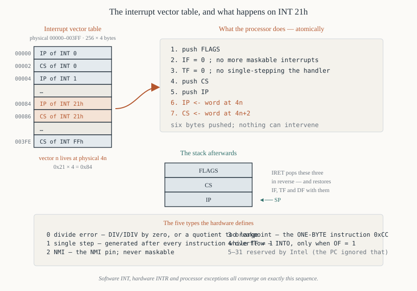

# Chapter 31 — Interrupts

[← Processor control](30-processor-control.md) · [Contents](README.md) · [Next: Instruction timing →](32-instruction-timing.md)

---

## Goal

The complete interrupt mechanism: the vector table, what the processor does when an interrupt
occurs, the five hardware-defined types, `INT`, `INT 3`, `INTO` and `IRET`, `NMI` versus `INTR`,
priority, latency, and how to write and install a handler.

Everything DOS and the BIOS offer you arrives through this mechanism, so Part IV depends on it.

---

## 1. What an interrupt is

A forced call to a procedure whose address comes from a table, triggered by something other than the
instruction stream.

Three sources:

**Hardware interrupts** — a device asserts `INTR` or `NMI`. Asynchronous; they can happen between
any two instructions.

**Software interrupts** — the `INT n` instruction. Synchronous; you asked for it. This is how DOS
and BIOS services are called.

**Exceptions** — the processor itself detects a problem: divide by zero, single-step, overflow with
`INTO`. Synchronous, and caused by the instruction being executed.

All three converge on exactly the same mechanism.

---

## 2. The interrupt vector table



**256 vectors, 4 bytes each, at physical addresses `0x00000`–`0x003FF`.** Fixed by the hardware; it
cannot be moved on an 8086.

```
   vector n  is at physical address  4 × n

   4n     :  IP of the handler  (low byte first)
   4n+2   :  CS of the handler  (low byte first)
```

So:

| Interrupt | Vector address | Contents |
|-----------|----------------|----------|
| `INT 0` | `0x00000`–`0x00003` | `IP` then `CS` |
| `INT 1` | `0x00004`–`0x00007` | |
| `INT 3` | `0x0000C`–`0x0000F` | |
| `INT 10h` | `0x00040`–`0x00043` | BIOS video |
| `INT 13h` | `0x0004C`–`0x0004F` | BIOS disk |
| `INT 16h` | `0x00058`–`0x0005B` | BIOS keyboard |
| `INT 21h` | `0x00084`–`0x00087` | DOS services |
| `INT FFh` | `0x003FC`–`0x003FF` | |

To find a vector's address: **multiply the interrupt number by 4**. `0x21 × 4 = 0x84`.

### 2.1 The reserved types

| Type | Name | Cause |
|------|------|-------|
| **0** | Divide error | `DIV` or `IDIV` with a zero divisor or an oversized quotient |
| **1** | Single step | `TF = 1` — generated after *every* instruction |
| **2** | NMI | the `NMI` pin went high |
| **3** | Breakpoint | the one-byte `INT 3` instruction (`0xCC`) |
| **4** | Overflow | the `INTO` instruction, when `OF = 1` |
| 5–31 | reserved | Intel reserved these for future processors |
| 32–255 | available | for you, the OS and devices |

**The IBM PC ignored the reservation** and put BIOS services at `INT 10h`–`INT 1Fh`, squarely inside
Intel's reserved range. When the 80286 defined exceptions there (`INT 0Dh` general protection,
`INT 0Eh` page fault on the 386), the collision caused real trouble — which is why protected-mode
operating systems have to remap the PIC.

---

## 3. What the processor does

When an interrupt of type *n* is accepted, the 8086 performs this sequence **atomically** — nothing
can intervene:

```
   1.  push FLAGS
   2.  IF = 0        ; disable further maskable interrupts
   3.  TF = 0        ; disable single-stepping
   4.  push CS
   5.  push IP
   6.  IP <- word at physical 4n
   7.  CS <- word at physical 4n+2
```

Then execution continues at the new `CS:IP`.

**Six bytes are pushed**: flags, `CS`, `IP`. That is the stack cost of every interrupt, and it is why
a stack-depth budget must allow for interrupts arriving at the deepest point of your call chain.

### 3.1 Why `IF` and `TF` are cleared

**`IF = 0`** so that a handler is not immediately re-entered by the same device before it has
established its own state. If a handler wants to be interruptible, it executes `STI` once it is
safe — typically after saving registers and telling the interrupt controller it is being serviced.

**`TF = 0`** so that a single-step debugger's handler does not single-step itself, which would
recurse until the stack filled.

Both are restored by `IRET`, because it pops the flags word that was pushed at step 1.

### 3.2 `IRET`

```asm
        iret                    ; CF — one byte, 24 clocks
```

```
   1.  pop IP
   2.  pop CS
   3.  pop FLAGS
```

Exactly the reverse. Note it restores the **whole flag word**, including `IF`, `TF`, `DF` and every
status flag — so a handler cannot return a result in the flags.

**Never use `RETF` to return from an interrupt.** It would leave the flags word on the stack, and
`SP` would be wrong by 2 for the rest of the program's life.

---

## 4. The software interrupt instructions

| Instruction | Opcode | Bytes | Clocks | Effect |
|-------------|--------|-------|--------|--------|
| `INT n` | `CD ib` | 2 | 51 | interrupt type *n* |
| `INT 3` | `CC` | **1** | 52 | interrupt type 3 |
| `INTO` | `CE` | 1 | 53 taken / 4 not | type 4, only if `OF = 1` |
| `IRET` | `CF` | 1 | 24 | return |

### 4.1 `INT 3` is one byte — and that is the point

`INT 3` has a dedicated one-byte opcode, `0xCC`, distinct from the two-byte `CD 03`.

**This is how every debugger sets a breakpoint.** To break at an address, the debugger:

1. saves the byte currently there;
2. writes `0xCC` over it;
3. runs the program;
4. when `INT 3` fires, restores the original byte, backs `IP` up by one, and reports the breakpoint.

It has to be one byte because a breakpoint must be settable on *any* instruction, including a
one-byte one. A two-byte breakpoint would overwrite the start of the following instruction.

Chapter 46 §3 uses this.

### 4.2 `INT n` is slow

**51 clocks** — over 10 µs at 5 MHz, before the handler has executed a single instruction. Add the
handler's own prologue and a DOS call costs a meaningful fraction of a millisecond.

That is why tight loops avoid DOS calls. Printing a 2000-character screen with `INT 21h` function
02h costs 2000 × (51 + handler) clocks; writing it directly to `0xB8000` with `REP STOSW` costs
about 20,000.

### 4.3 `INTO`

```asm
        add  ax, bx
        into                    ; if OF = 1, generate INT 4
```

Turns a signed overflow into an exception. Four clocks when `OF = 0`, so it is cheap to leave in.

Almost nobody used it, because the default `INT 4` handler on a PC simply returns, so it does
nothing unless you install a handler. But it is the only way to get automatic overflow checking, and
a language implementation with overflow-checked arithmetic would emit it after every signed
operation.

---

## 5. Hardware interrupts

### 5.1 `INTR` — the maskable input

**Level triggered, active high, sampled during the last clock period of each instruction.**

The full acknowledge sequence (Chapter 11 §8.7):

1. A device raises `INTR` and holds it high.
2. At the end of the current instruction, if `IF = 1`, the 8086 accepts it.
3. The 8086 runs **two `INTA#` bus cycles**.
4. During the second, the interrupting device (normally an 8259A) puts an **8-bit type number** on
   `AD7`–`AD0`.
5. The 8086 multiplies it by 4 and performs the §3 sequence.

**Two cycles, not one**, because the 8259A needs the first to resolve priority among its eight
inputs. `LOCK#` is asserted across both so no other master can interfere.

**Level triggered** means the device must *hold* `INTR` high until acknowledged. A brief pulse can
be missed if it falls between samplings.

### 5.2 `NMI` — the non-maskable input

**Edge triggered (rising), always accepted, always type 2.**

- `CLI` has no effect on it.
- No acknowledge cycle — the type number is hard-wired to 2, so no device needs to supply one.
- Needs only a pulse of at least 2 clock periods.

Used for catastrophic events: memory parity error, imminent power failure, watchdog timeout. On the
IBM PC it carried memory parity errors and the 8087's exception line, with an external mask register
at port `0xA0` — an admission that a genuinely unmaskable interrupt is inconvenient.

### 5.3 The PC's IRQ map

The 8259A (Chapter 49) maps its eight inputs to types `0x08`–`0x0F`:

| IRQ | Type | Device |
|-----|------|--------|
| IRQ0 | `0x08` | **timer — 18.2 Hz** |
| IRQ1 | `0x09` | **keyboard** |
| IRQ2 | `0x0A` | cascade to the second PIC (AT) |
| IRQ3 | `0x0B` | COM2 |
| IRQ4 | `0x0C` | COM1 |
| IRQ5 | `0x0D` | hard disk (XT) / LPT2 (AT) |
| IRQ6 | `0x0E` | floppy disk |
| IRQ7 | `0x0F` | LPT1 |

---

## 6. Priority

When several interrupt conditions are pending at the same instruction boundary, the 8086 services
them in this order:

| Priority | Source |
|----------|--------|
| **Highest** | Divide error, `INT n`, `INTO` |
| | NMI |
| | INTR |
| **Lowest** | Single step (`TF`) |

Two things worth noting.

**Single step is lowest.** That is deliberate: it means that when you single-step an instruction
that triggers a hardware interrupt, the *hardware* handler runs first, and the debugger sees the
step afterwards. Without that ordering, stepping would be unusable.

**Software interrupts are highest**, but that is nearly vacuous — an `INT` instruction *is* the
instruction being completed, so there is nothing to contend with.

### 6.1 The single-step trap

If `TF = 1` and a hardware interrupt occurs, the 8086's `INT` sequence clears `TF` *before* the
handler runs — so the hardware handler runs at full speed, and stepping resumes when `IRET` restores
the flags. A debugger therefore does not step through interrupt handlers unless it wants to.

---

## 7. Writing an interrupt handler

### 7.1 The rules

**Save every register you touch.** The interrupted code has no idea you ran.

**`CLD` if you use string instructions.** You do not know what `DF` was (Chapter 29 §1.2).

**Set up `DS` if you access your own data.** `DS` belongs to whatever was interrupted.

**Be short.** Every clock is stolen from the foreground.

**Do not call DOS.** DOS is not reentrant. An interrupt arriving while the foreground is inside
`INT 21h` will corrupt DOS's internal state if the handler calls `INT 21h` too. (The proper solution
is the DOS "InDOS flag", which is beyond this book; the practical rule is: set a flag and let the
foreground do the work.)

**End with `IRET`, not `RET`.**

**Send an EOI to the 8259A** if it is a hardware interrupt (Chapter 49 §5).

### 7.2 The skeleton

```asm
; ---------------------------------------------------------------
; A hardware interrupt handler.
; ---------------------------------------------------------------
my_handler:
        push ax                 ; save EVERY register used
        push bx
        push cx
        push dx
        push si
        push di
        push ds
        push es

        mov  ax, cs             ; point DS at our own data
        mov  ds, ax             ;   (works for a .COM, where CS = data segment)
        cld                     ; we do not know what DF was

        ; ---- the actual work, kept short ----
        inc  word [tick_count]
        ; -------------------------------------

        mov  al, 0x20           ; EOI — end of interrupt
        out  0x20, al           ;   tell the 8259A we are done

        pop  es
        pop  ds
        pop  di
        pop  si
        pop  dx
        pop  cx
        pop  bx
        pop  ax
        iret                    ; NOT ret, NOT retf
```

---

## 8. Installing a handler

### 8.1 The wrong way

```asm
; DON'T do this
        cli
        xor  ax, ax
        mov  es, ax
        mov  word [es:0x1C*4],   my_handler
        mov  word [es:0x1C*4+2], cs
        sti
```

It works, but it writes the vector table directly, which bypasses anything DOS or a TSR has done,
and is not portable to a protected-mode environment.

### 8.2 The right way — ask DOS

```asm
; Get the current vector (so we can restore it):
        mov  ah, 0x35           ; DOS: get interrupt vector
        mov  al, 0x1C           ; which one
        int  0x21               ; -> ES:BX = the current handler
        mov  [old_off], bx
        mov  [old_seg], es

; Install ours:
        push ds
        mov  ah, 0x25           ; DOS: set interrupt vector
        mov  al, 0x1C
        mov  dx, my_handler     ; DS:DX = the new handler
        mov  bx, cs
        mov  ds, bx
        int  0x21
        pop  ds

; ... program runs ...

; Restore before exiting — ESSENTIAL:
        push ds
        mov  ah, 0x25
        mov  al, 0x1C
        mov  dx, [old_off]
        mov  ds, [old_seg]
        int  0x21
        pop  ds
```

**Restoring the old vector before exit is not optional.** A `.COM` program that installs a handler
and exits leaves the vector pointing into memory DOS has reused. The next interrupt jumps into
whatever program loaded there. The machine crashes some seconds later, apparently at random, and the
cause is very hard to find.

### 8.3 Chaining

To *add* behaviour without replacing the existing handler, call the old one:

```asm
my_handler:
        pushf                   ; simulate what an INT would have pushed
        call far [cs:old_vector]    ; call the original handler
        ; ... our additional work ...
        iret

old_vector: dw 0, 0             ; offset, segment
```

`PUSHF` then a far `CALL` pushes flags, `CS`, `IP` — exactly what `INT` pushes — so the old
handler's `IRET` returns here correctly.

---

## 9. Worked program — a timer-tick counter

Installs a handler on `INT 1Ch`, the BIOS timer tick "user hook", which the BIOS calls 18.2 times a
second from its own `INT 08h` handler. Using `1Ch` rather than `08h` means the BIOS keeps doing its
own work and we do not have to send an EOI.

```asm
; ticker.asm — count timer ticks for five seconds, then report
; nasm -f bin ticker.asm -o ticker.com
        org  0x100

start:
        ; --- save the old INT 1Ch vector ---
        mov  ah, 0x35
        mov  al, 0x1C
        int  0x21               ; ES:BX = old handler
        mov  [old_off], bx
        mov  [old_seg], es

        ; --- install ours ---
        push ds
        mov  ah, 0x25
        mov  al, 0x1C
        mov  dx, tick_handler
        push cs
        pop  ds                 ; DS = CS, so DS:DX is our handler
        int  0x21
        pop  ds

        ; --- wait until 91 ticks have accumulated (about 5 seconds) ---
.wait:
        mov  ax, [ticks]        ; the handler updates this
        cmp  ax, 91             ; 18.2 ticks/s × 5 s
        jb   .wait

        ; --- restore the old vector BEFORE doing anything else ---
        push ds
        mov  dx, [old_off]      ; read both while DS still addresses our data
        mov  ax, [old_seg]
        mov  ds, ax             ; DS:DX = the original handler
        mov  ax, 0x251C         ; AH = 25h (set vector), AL = 1Ch
        int  0x21               ;   — set AX AFTER loading DS, or it gets clobbered
        pop  ds

        ; --- report ---
        mov  dx, donemsg
        mov  ah, 0x09
        int  0x21
        mov  ax, [ticks]
        call print_dec

        mov  ax, 0x4C00
        int  0x21

; ---------------------------------------------------------------
; tick_handler — called 18.2 times a second by the BIOS.
;   Must be short, must preserve everything, must IRET.
;   No EOI needed: INT 1Ch is called by the BIOS's own INT 08h
;   handler, which sends the EOI itself.
; ---------------------------------------------------------------
tick_handler:
        push ax
        push ds

        push cs
        pop  ds                 ; our data segment
        inc  word [ticks]

        pop  ds
        pop  ax
        iret

; ---------------------------------------------------------------
print_dec:
        push ax
        push bx
        push cx
        push dx
        mov  bx, 10
        xor  cx, cx
.divide:
        xor  dx, dx
        div  bx
        push dx
        inc  cx
        or   ax, ax
        jnz  .divide
.output:
        pop  dx
        add  dl, '0'
        mov  ah, 0x02
        int  0x21
        loop .output
        mov  dl, 0x0D
        mov  ah, 0x02
        int  0x21
        mov  dl, 0x0A
        mov  ah, 0x02
        int  0x21
        pop  dx
        pop  cx
        pop  bx
        pop  ax
        ret

; ---------------------------------------------------------------
ticks:    dw   0
old_off:  dw   0
old_seg:  dw   0
donemsg:  db   'Ticks counted: $'
```

**Output after about five seconds:** `Ticks counted: 91`

### 9.1 Notes

**`push cs` / `pop ds`** is the two-byte way to set `DS = CS`. In a `.COM` program they are equal
anyway, but the handler can be entered with any `DS` at all, so it must establish its own.

**`inc word [ticks]`** is the entire body. Two bytes of work; everything else is bookkeeping. That
is the correct proportion for an interrupt handler.

**The busy-wait loop** reads `[ticks]` repeatedly. This is a 16-bit read of a value the handler
updates atomically with a single `INC`, so no `CLI` is needed — one instruction cannot be
interrupted partway. If `ticks` were 32 bits it would need the treatment of Chapter 30 §11.

**Restoring the vector** happens before printing, so that even if printing somehow fails, the vector
is safe.

---

## 10. Interrupt latency

How long from the device asserting `INTR` to the handler's first instruction?

```
   worst-case remaining instruction    up to 162 clocks   (a DIV in progress)
   two INTA bus cycles                          ~11 clocks
   the INT sequence itself                       51 clocks
                                               ───────────
   worst case                                  ~224 clocks  =  45 µs at 5 MHz
```

Plus, if the foreground has interrupts disabled, the whole length of its `CLI` region. That is why
Chapter 30 §4.3 insists on keeping those short.

**`REP MOVSB` is interruptible** between elements, so a 1000-byte copy does not add 17,000 clocks of
latency — the 8086 checks for interrupts between repetitions. (This is also what makes the prefix
erratum of Chapter 29 §8 possible.)

---

## 11. Summary

```
  256 vectors at physical 0x00000-0x003FF, four bytes each
     vector n is at 4n:   IP at 4n, CS at 4n+2

  on an interrupt:  push FLAGS ; IF=0 ; TF=0 ; push CS ; push IP ;
                    IP <- [4n] ; CS <- [4n+2]
  IRET:             pop IP ; pop CS ; pop FLAGS

  type 0  divide error      type 1  single step (TF)
  type 2  NMI               type 3  breakpoint — ONE BYTE, 0xCC
  type 4  INTO overflow     5-31 reserved by Intel (the PC used them anyway)

  INT n   CD ib   2 bytes  51 clocks
  INT 3   CC      1 byte   52 clocks   <- how debuggers set breakpoints
  INTO    CE      1 byte   53 / 4
  IRET    CF      1 byte   24 clocks

  INTR  level triggered, maskable by CLI, two INTA cycles, type from the device
  NMI   edge triggered, NOT maskable, always type 2, no acknowledge cycle

  priority: divide/INT/INTO > NMI > INTR > single step

  a handler must: save every register, CLD, set up DS, stay short,
                  not call DOS, send EOI if hardware, and end with IRET
  install with INT 21h AH=25h; read with AH=35h;
  ALWAYS restore the old vector before exiting
```

---

## Exercises

**31.1** At what physical address is the vector for `INT 21h`? For `INT 1Ch`? Show the arithmetic.

**31.2** List, in order, the seven things the 8086 does when an interrupt is accepted.

**31.3** How many bytes does an interrupt push on the stack? What are they?

**31.4** Why does the interrupt sequence clear `IF` and `TF`? What restores them?

**31.5** Why is `INT 3` a one-byte instruction when `INT n` is two? What depends on this?

**31.6** Explain why `IRET` must be used rather than `RETF` to return from a handler.

**31.7** What is the difference between `NMI` and `INTR` in respect of: maskability, triggering, how
the type number is obtained, and the number of bus cycles?

**31.8** An `INT n` costs 51 clocks. A program prints 2000 characters using `INT 21h` function 02h.
Estimate the overhead in clocks and in milliseconds at 5 MHz, ignoring the handler itself.

**31.9** Write an interrupt handler skeleton that preserves all registers, sets `DS = CS`, clears
`DF`, and returns correctly.

**31.10** Write the DOS calls that save the current `INT 09h` vector and install a new handler.

**31.11** A program installs a handler on `INT 1Ch` and exits without restoring it. Describe what
happens, and roughly when.

**31.12** Explain the `pushf` / `call far` idiom used to chain to a previous handler. Why `PUSHF`
specifically?

**31.13** Why is single step the *lowest* priority interrupt? What would go wrong if it were the
highest?

**31.14** Compute the worst-case interrupt latency at 8 MHz, assuming a `DIV` (162 clocks) is in
progress and interrupts are enabled.

**31.15** Why must an interrupt handler not call DOS functions?

Answers in [Appendix H](H-exercise-solutions.md#chapter-31).

---

[← Processor control](30-processor-control.md) · [Contents](README.md) · [Next: Instruction timing →](32-instruction-timing.md)
