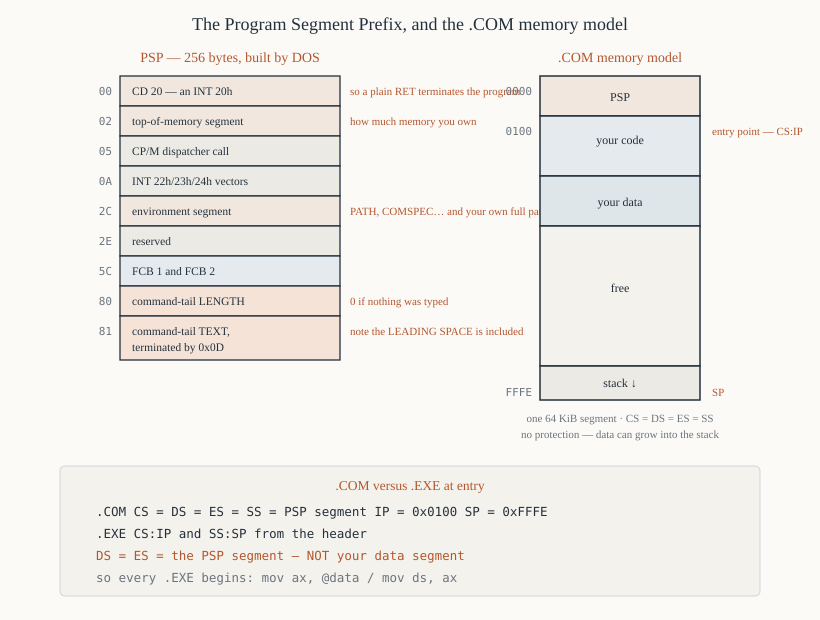

# Chapter 35 — `.COM` versus `.EXE`

[← Your first program, byte by byte](34-first-program-byte-by-byte.md) · [Contents](README.md) · [Next: DOS services →](36-dos-int21.md)

---

## Goal

The two DOS executable formats: what is in each file, how DOS loads them, what the registers hold at
entry, the Program Segment Prefix field by field, and when you need the more complicated one.

---

## 1. The two formats compared

| | `.COM` | `.EXE` |
|---|--------|--------|
| File contents | **raw memory image** — nothing else | a header, then the image, then a relocation table |
| Header | none | 28 bytes minimum, usually 512 |
| Maximum size | **65,280 bytes** (64 KiB − PSP) | limited only by memory |
| Segments | **one**, for code + data + stack | separate code, data and stack segments |
| At entry | `CS = DS = ES = SS` | `CS`, `SS` from the header; `DS = ES =` **PSP** |
| Entry point | always offset `0x100` | from the header |
| Relocation | **none needed** | a table of addresses to fix up |
| Stack | top of the segment, set by DOS | declared in the header |
| `org` | `org 0x100` | none (the linker handles it) |
| Build | `nasm -f bin` | `nasm -f obj` + a linker |
| Load speed | faster — no fixups | slower |

**Use `.COM` for everything in this book.** Everything fits in 64 KiB, the model is simpler, and the
file is exactly the bytes you wrote. `.EXE` is covered here because you will meet it, and because
Chapter 38's multi-file programs need it.

---

## 2. The `.COM` format

### 2.1 There is no format

A `.COM` file is **the exact bytes that will be in memory**, nothing more. Twenty-eight bytes of file
become twenty-eight bytes in memory. There is no header, no magic number, no metadata.

DOS decides a file is a `.COM` by its extension. If you rename an `.EXE` to `.COM`, DOS will load it
as a raw image and jump to offset `0x100`, which lands in the middle of the EXE header. It crashes.

### 2.2 The load procedure

1. DOS finds a free memory block big enough for the file **plus 256 bytes plus a stack**. In
   practice DOS allocates *all* remaining memory to a `.COM` program.
2. It builds a 256-byte PSP at the start of the block.
3. It reads the whole file to offset `0x100`.
4. It sets `CS = DS = ES = SS` = the PSP segment.
5. It sets `SP = 0xFFFE` (or lower, if less than 64 KiB was available) and pushes a zero word.
6. It jumps to `CS:0100`.

### 2.3 The one-segment model

```
   offset
   0x0000  ┌──────────────────────────┐
           │  PSP (256 bytes)         │
   0x0100  ├──────────────────────────┤  <- entry point, CS:IP
           │  your code               │
           ├──────────────────────────┤
           │  your data               │
           ├──────────────────────────┤
           │                          │
           │  free                    │
           │                          │
           │             ↓ stack      │
   0xFFFE  └──────────────────────────┘  <- SP
```

**Code, data and stack share one 64 KiB segment.** Nothing stops your data from growing into your
stack or vice versa; there is no protection. A program with a large buffer and deep recursion will
silently corrupt itself.

### 2.4 Why the 64 KiB limit

The program's addresses are all 16-bit offsets within one segment, and `SP` starts at the top of
that segment. There is no room for a second segment because all four segment registers hold the same
value — and the program cannot change that without abandoning the model.

The practical limit is `0xFF00` = 65,280 bytes of file, because the PSP takes the first 256.

### 2.5 Exiting

Three ways, in order of preference:

```asm
        mov  ax, 0x4C00         ; DOS function 4Ch — the right way
        int  0x21               ; AL = exit code

        int  0x20               ; the old CP/M way — works, no exit code

        ret                     ; jumps to PSP offset 0, which holds INT 20h
                                ;   — works only because DOS pushed a zero word
```

**Use `INT 21h`/`4Ch`.** It is the only one that returns an exit code, which batch files test with
`ERRORLEVEL`.

The `ret` route works because of the zero word DOS pushed at `SP` (Chapter 34 §5.3): `RET` pops it
into `IP`, so execution continues at `CS:0000`, which is PSP offset 0, which DOS filled with the two
bytes `CD 20` — an `INT 20h`. A neat piece of CP/M compatibility.

---

## 3. The Program Segment Prefix

256 bytes that DOS builds in front of every program. Most fields you can ignore; four matter.



| Offset | Size | Contents |
|--------|------|----------|
| `0x00` | 2 | `CD 20` — an `INT 20h` instruction (terminate) |
| `0x02` | 2 | segment of the first byte **past** this program's memory |
| `0x04` | 1 | reserved |
| `0x05` | 5 | a far `CALL` to DOS's function dispatcher (CP/M compatibility) |
| `0x0A` | 4 | `INT 22h` vector — terminate address |
| `0x0E` | 4 | `INT 23h` vector — Ctrl-Break address |
| `0x12` | 4 | `INT 24h` vector — critical error address |
| `0x16` | 22 | reserved (parent PSP, and internal DOS data) |
| `0x2C` | 2 | **segment of the environment block** |
| `0x2E` | 34 | reserved |
| `0x50` | 3 | `CD 21 CB` — `INT 21h` / `RETF` (another CP/M relic) |
| `0x53` | 9 | reserved |
| `0x5C` | 16 | **FCB 1** — a parsed first command-line argument |
| `0x6C` | 20 | **FCB 2** — a parsed second argument |
| `0x80` | 1 | **length of the command tail** |
| `0x81` | 127 | **the command tail text**, terminated by `0x0D` |

### 3.1 Reading the command line

Offset `0x80` holds the number of characters typed after the program name, and `0x81` onwards holds
them, including the leading space.

```asm
; Print the command tail.
        mov  si, 0x80
        mov  cl, [si]           ; length
        xor  ch, ch
        jcxz .no_args
        inc  si                 ; SI -> the text
.next:
        mov  dl, [si]
        mov  ah, 0x02
        int  0x21
        inc  si
        loop .next
.no_args:
```

Typing `hello.com world` gives `[0x80] = 6` and `[0x81..0x86] = ' world'` followed by `0x0D`.

**Note the leading space.** DOS includes it. Skip it if you are parsing arguments.

### 3.2 The environment block

`[0x2C]` holds the *segment* of a block containing the environment strings:

```
   PATH=C:\DOS;C:\BIN 00
   COMSPEC=C:\COMMAND.COM 00
   PROMPT=$p$g 00
   00                              <- a zero byte ends the list
   01 00                           <- a word count
   C:\HELLO.COM 00                 <- the full path of this program
```

The program's own full path after the double terminator is how a program finds out where it was
loaded from. Chapter 36 §9 has a routine that reads it.

### 3.3 The "top of memory" word

`[0x02]` is the paragraph just past your memory block. So:

```asm
        mov  ax, [0x02]         ; segment past the end of our block
        mov  bx, cs
        sub  ax, bx             ; paragraphs available to us
        ; AX × 16 = bytes
```

A `.COM` program normally owns all of memory, so this tells you how much there is. To leave room for
loading another program you must first shrink your block — `INT 21h`, `AH = 4Ah` (Chapter 36 §8).

### 3.4 The `AX` value at entry

DOS puts a validity code in `AL` and `AH`:

```
   AL = 0x00   the first  FCB drive letter was valid
   AL = 0xFF   it was not
   AH = 0x00   the second FCB drive letter was valid
   AH = 0xFF   it was not
```

This is the only meaningful register content at entry besides `CX` (the file size) and the segment
registers. In practice nobody uses it.

---

## 4. The `.EXE` format

### 4.1 The header

The first 28 bytes of the file:

| Offset | Size | Field | Meaning |
|--------|------|-------|---------|
| `0x00` | 2 | signature | `'MZ'` (`4D 5A`) — Mark Zbikowski's initials |
| `0x02` | 2 | bytes in the last page | file size mod 512 |
| `0x04` | 2 | pages in file | file size / 512, rounded up |
| `0x06` | 2 | relocation entries | how many fixups |
| `0x08` | 2 | header paragraphs | header size / 16 |
| `0x0A` | 2 | minimum extra paragraphs | BSS requirement |
| `0x0C` | 2 | maximum extra paragraphs | usually `0xFFFF` = "all of it" |
| `0x0E` | 2 | initial `SS` | **relative to the load segment** |
| `0x10` | 2 | initial `SP` | |
| `0x12` | 2 | checksum | usually ignored |
| `0x14` | 2 | initial `IP` | |
| `0x16` | 2 | initial `CS` | **relative to the load segment** |
| `0x18` | 2 | relocation table offset | |
| `0x1A` | 2 | overlay number | 0 for the main program |

### 4.2 Relocation

The problem `.EXE` solves: a multi-segment program contains instructions like

```asm
        mov  ax, DATA_SEGMENT
        mov  ds, ax
```

and the assembler cannot know what `DATA_SEGMENT` will be, because that depends on where DOS loads
the program.

**The relocation table** is a list of `segment:offset` pairs, each pointing at a word in the image
that holds a segment value. At load time, DOS adds the actual load segment to each of them.

```
   in the file:   B8 00 00        mov ax, 0      (placeholder)
   after loading: B8 32 12        mov ax, 0x1232 (the real data segment)
```

A `.COM` program needs none of this, because it contains no segment values at all — which is exactly
why it is relocatable for free (Chapter 9 §8).

### 4.3 Registers at entry

| Register | Value |
|----------|-------|
| `CS:IP` | from the header, relocated |
| `SS:SP` | from the header, relocated |
| **`DS`** | **the PSP segment** — *not* your data segment |
| **`ES`** | **the PSP segment** |
| `AX` | the same FCB validity codes as `.COM` |

**`DS` does not point at your data.** That is the single most important difference, and it is why
every MASM `.EXE` program starts with:

```asm
        mov  ax, @data
        mov  ds, ax
```

Forget it and every memory reference reads the PSP.

---

## 5. Writing an `.EXE` with NASM

### 5.1 With a linker

```asm
; prog.asm — an .EXE program
; nasm -f obj prog.asm -o prog.obj
; wlink file prog.obj format dos name prog.exe
        cpu  8086

        segment code
..start:                        ; NASM's special entry-point label
        mov  ax, data
        mov  ds, ax             ; MUST do this
        mov  ax, stack
        mov  ss, ax
        mov  sp, stacktop

        mov  dx, msg
        mov  ah, 0x09
        int  0x21

        mov  ax, 0x4C00
        int  0x21

        segment data
msg:    db   'Hello from an EXE!', 0x0D, 0x0A, '$'

        segment stack stack
        resb 256
stacktop:
```

Link with Open Watcom's `wlink`, JWlink, or `alink`:

```
wlink file prog.obj format dos name prog.exe
```

`..start:` is NASM's marker for the entry point in `obj` format. The `segment stack stack` line
declares a segment of *class* `stack`, which tells the linker to put its address in the header's
`SS` field.

### 5.2 Building an `.EXE` header by hand

For completeness — you can construct the header yourself with `-f bin`, which is occasionally useful
for boot loaders and never useful otherwise. Chapter 38 §9 shows it.

---

## 6. Which to use

| Situation | Format |
|-----------|--------|
| Anything under 64 KiB total | **`.COM`** |
| Everything in this book | **`.COM`** |
| A TSR (terminate and stay resident) | `.COM` — smaller resident footprint |
| A boot sector | neither — a raw 512-byte image |
| Code and data together exceeding 64 KiB | `.EXE` |
| Multiple source files linked together | `.EXE` (or one `.COM` with `%include`) |
| A program written in C | `.EXE` |

### 6.1 The `%include` alternative

For multi-file `.COM` programs, NASM's `%include` avoids the linker entirely:

```asm
; main.asm
        cpu  8086
        org  0x100
start:
        call print_string
        mov  ax, 0x4C00
        int  0x21

%include "strings.inc"
%include "math.inc"

msg:    db   'Hello$'
```

The preprocessor pastes the files together and assembles the result as one unit. No linker, no
relocation, no `.EXE`. Chapter 38 §5 covers this properly — it is how the larger programs in Part V
are organised.

---

## 7. Worked program — reading the command line

```asm
; args.asm — print the command-line arguments
; nasm -f bin args.asm -o args.com
;
; Run as:   args.com hello world
        cpu  8086
        org  0x100

start:
        mov  cl, [0x80]         ; length of the command tail
        xor  ch, ch
        jcxz .none              ; nothing typed after the program name

        mov  dx, tailmsg
        mov  ah, 0x09
        int  0x21

        mov  si, 0x81           ; the text starts here
.next:
        mov  dl, [si]
        mov  ah, 0x02           ; DOS: print the character in DL
        int  0x21
        inc  si
        loop .next

        mov  dx, crlf
        mov  ah, 0x09
        int  0x21
        jmp  .size

.none:
        mov  dx, nonemsg
        mov  ah, 0x09
        int  0x21

.size:
        ; --- report how much memory we own ---
        mov  dx, memmsg
        mov  ah, 0x09
        int  0x21

        mov  ax, [0x02]         ; segment past our block
        mov  bx, cs
        sub  ax, bx             ; paragraphs we own
        mov  cl, 4
        shr  ax, cl             ; ÷16 -> KiB  (paragraphs × 16 / 1024 = ÷ 64)
        shr  ax, 1
        shr  ax, 1              ; total ÷ 64
        call print_dec

        mov  dx, kbmsg
        mov  ah, 0x09
        int  0x21

        mov  ax, 0x4C00
        int  0x21

; ---------------------------------------------------------------
print_dec:
        push ax
        push bx
        push cx
        push dx
        mov  bx, 10
        xor  cx, cx
.divide:
        xor  dx, dx
        div  bx
        push dx
        inc  cx
        or   ax, ax
        jnz  .divide
.output:
        pop  dx
        add  dl, '0'
        mov  ah, 0x02
        int  0x21
        loop .output
        pop  dx
        pop  cx
        pop  bx
        pop  ax
        ret

; ---------------------------------------------------------------
tailmsg:  db   'Command tail:$'
nonemsg:  db   'No arguments given.', 0x0D, 0x0A, '$'
memmsg:   db   'Memory owned: $'
kbmsg:    db   ' KiB', 0x0D, 0x0A, '$'
crlf:     db   0x0D, 0x0A, '$'
```

Running `args.com hello world`:

```
Command tail: hello world
Memory owned: 638 KiB
```

The exact KiB figure depends on how much conventional memory is free.

### 7.1 Notes

**`mov cl, [0x80]`** reads the tail length directly. `DS` already points at the PSP for a `.COM`
program, so `[0x80]` is `DS:0080` = the right place.

**`jcxz`** guards the loop, because a tail length of zero would make `LOOP` run 65,536 times
(Chapter 27 §5).

**The leading space** is printed — `[0x81]` is the space between the program name and the first
argument. Real argument parsing skips it.

**The `shr` chain** divides by 64: paragraphs × 16 bytes ÷ 1024 = paragraphs ÷ 64. Three shifts by
various amounts, because `shr ax, 6` is not an 8086 instruction.

---

## 8. Summary

```
  .COM   the raw memory image. No header. Loaded at offset 0x100.
         CS = DS = ES = SS = the PSP segment.  SP = 0xFFFE.
         One 64 KiB segment for code, data AND stack. Max 65,280 bytes.
         Needs `org 0x100`. Build: nasm -f bin.
         Relocatable for free, because it contains no segment values.

  .EXE   'MZ' header + image + relocation table.
         CS:IP and SS:SP from the header.
         DS AND ES POINT AT THE PSP, NOT YOUR DATA — you must load DS.
         Needs a linker. Any size.

  PSP — 256 bytes before every program:
     0x00  CD 20     INT 20h  (so a RET terminates)
     0x02  word      segment past the end of our memory block
     0x2C  word      segment of the environment block
     0x5C  FCB 1     parsed first argument
     0x80  byte      length of the command tail
     0x81  ...       the command tail, ending with 0x0D

  exit:  mov ax, 0x4C00 / int 0x21      — the right way, returns a code
         int 0x20                        — the old way
         ret                             — works via the word DOS pushed

  for multi-file .COM programs use %include, not a linker
```

---

## Exercises

**35.1** How many bytes of header does a `.COM` file have? What is the maximum size of one, and
why?

**35.2** Name the four segment registers' values at entry to a `.COM` program. Which of those is
different for an `.EXE`, and what breaks if you forget?

**35.3** What is at PSP offset `0x00`, and what makes `ret` a valid way to exit a `.COM` program?

**35.4** A program is run as `myprog.com -v file.txt`. What is in `[0x80]`, and what are the first
three bytes at `[0x81]`?

**35.5** Write the code that prints the command tail, correctly skipping the leading space.

**35.6** Why does a `.COM` program need no relocation table while an `.EXE` does? Give an example of
an instruction that would need fixing up.

**35.7** Read the "top of memory" word and compute how many kilobytes the program owns.

**35.8** What are the three ways to exit a `.COM` program? Which returns an exit code?

**35.9** An `.EXE` file is renamed to `.COM` and run. Describe what happens and why.

**35.10** What is the `'MZ'` signature, and where does it come from?

**35.11** Why does `mov ax, @data` / `mov ds, ax` appear at the start of every MASM `.EXE` program
but never in a `.COM` program?

**35.12** You have a program of 40 KiB of code and 30 KiB of data. Which format must you use, and
why?

**35.13** Give two reasons to prefer `%include` over a linker for a multi-file `.COM` program.

Answers in [Appendix H](H-exercise-solutions.md#chapter-35).

---

[← Your first program, byte by byte](34-first-program-byte-by-byte.md) · [Contents](README.md) · [Next: DOS services →](36-dos-int21.md)
