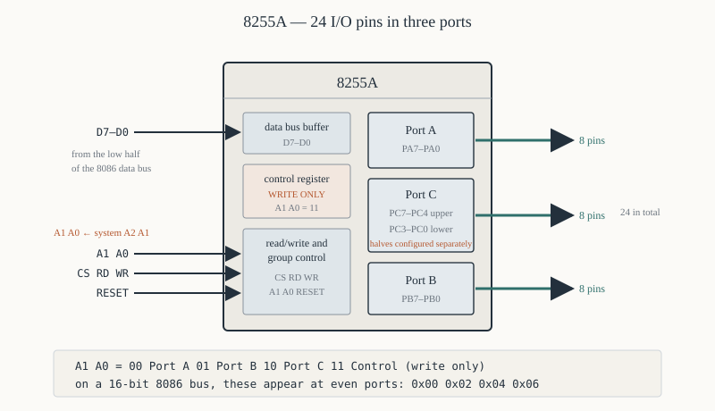
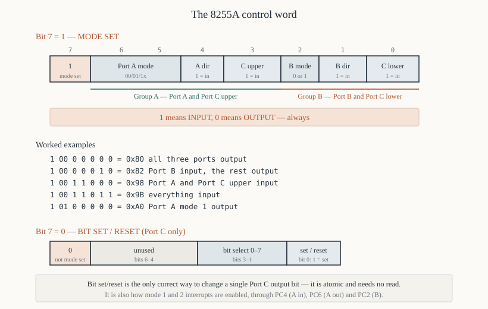

# Chapter 47 — The 8255A Programmable Peripheral Interface

[← Debugging](46-debugging.md) · [Contents](README.md) · [Next: 8253/8254 timer →](48-8253-8254-timer.md)

---

## Goal

The 8255A: 24 general-purpose I/O pins in three ports, configurable as inputs or outputs in several
modes. It is the chip that gives an 8086 something to connect to the outside world, and it is the
first peripheral in every microprocessor lab course.

Cover the pinout, derive the control word bit by bit, and write programs for LEDs, switches,
handshaking and a seven-segment display.

> **Does this run under DOSBox?** The programs here assume a trainer board with an 8255 at ports
> `0x00`–`0x06`. DOSBox has no such chip. §9 gives a PC-compatible variant of the LED program that
> uses the parallel port instead, which *does* run.

---

## 1. What it provides



```
   24 I/O pins, in three 8-bit ports:

      Port A   PA7-PA0    8 pins
      Port B   PB7-PB0    8 pins
      Port C   PC7-PC0    8 pins, splittable into two 4-bit halves:
                            PC7-PC4  "Port C upper"
                            PC3-PC0  "Port C lower"
```

Each port can be an input or an output, and Port C's two halves can differ. That gives a lot of
arrangements from one chip, which is the point.

### 1.1 Pinout

```
                     ┌──────∪──────┐
             PA3  1 ─┤             ├─ 40  PA4
             PA2  2 ─┤             ├─ 39  PA5
             PA1  3 ─┤             ├─ 38  PA6
             PA0  4 ─┤             ├─ 37  PA7
              RD  5 ─┤             ├─ 36  WR
              CS  6 ─┤             ├─ 35  RESET
             GND  7 ─┤             ├─ 34  D0
              A1  8 ─┤             ├─ 33  D1
              A0  9 ─┤    8255A    ├─ 32  D2
             PC7 10 ─┤             ├─ 31  D3
             PC6 11 ─┤             ├─ 30  D4
             PC5 12 ─┤             ├─ 29  D5
             PC4 13 ─┤             ├─ 28  D6
             PC0 14 ─┤             ├─ 27  D7
             PC1 15 ─┤             ├─ 26  VCC
             PC2 16 ─┤             ├─ 25  PB7
             PC3 17 ─┤             ├─ 24  PB6
             PB0 18 ─┤             ├─ 23  PB5
             PB1 19 ─┤             ├─ 22  PB4
             PB2 20 ─┤             ├─ 21  PB3
                     └─────────────┘
```

### 1.2 The four registers

`A1` and `A0` select one of four registers:

| `A1` | `A0` | Register | Read? | Write? |
|------|------|----------|-------|--------|
| 0 | 0 | Port A | yes | yes |
| 0 | 1 | Port B | yes | yes |
| 1 | 0 | Port C | yes | yes |
| 1 | 1 | **Control** | **no** | yes |

**The control register is write-only.** You cannot read back the configuration; if your program
needs to know it, keep a copy in memory.

---

## 2. Connecting it to an 8086

From Chapter 17 §3: an 8-bit peripheral sits on `D7`–`D0` and therefore answers **even** port
addresses only. Its `A1` and `A0` connect to the system's `A2` and `A1`.

```
   8255A pin          connects to
   ───────────        ──────────────────────────────
   D7-D0              system D7-D0 (the low half)
   A0                 system A1
   A1                 system A2
   CS#                the I/O address decoder
   RD#                IOR#   ( = RD# OR M/IO# )
   WR#                IOW#   ( = WR# OR M/IO# )
   RESET              the 8284A's RESET output
   VCC, GND           +5 V, 0 V
```

With the decoder of Chapter 17 §4.1 selecting ports `0x00`–`0x07`:

| Register | System port |
|----------|-------------|
| Port A | `0x00` |
| Port B | `0x02` |
| Port C | `0x04` |
| Control | `0x06` |

```asm
PORTA   equ  0x00
PORTB   equ  0x02
PORTC   equ  0x04
CTRL    equ  0x06
```

**On a PC (8-bit bus), the same chip would be at `0x00`–`0x03`.** That is the difference Chapter 17
§3.1 warns about.

---

## 3. The control word



**Bit 7 selects which kind of control word this is:**

```
   bit 7 = 1   ->  MODE SET: configure the ports
   bit 7 = 0   ->  BIT SET/RESET: set or clear one bit of Port C
```

### 3.1 Mode-set format (bit 7 = 1)

```
    7    6   5    4     3     2    1     0
  ┌────┬────────┬────┬──────┬────┬────┬──────┐
  │ 1  │ A mode │ A  │ C up │ B  │ B  │C low │
  │    │  D6 D5 │dir │ dir  │mode│dir │ dir  │
  └────┴────────┴────┴──────┴────┴────┴──────┘
       └── Group A ──────────┘└── Group B ───┘
```

| Bit | Field | 0 means | 1 means |
|-----|-------|---------|---------|
| 7 | mode-set flag | (bit set/reset mode) | **configure ports** |
| 6,5 | Port A mode | `00` = mode 0 | `01` = mode 1, `1x` = mode 2 |
| 4 | Port A direction | **output** | **input** |
| 3 | Port C upper direction | output | input |
| 2 | Port B mode | mode 0 | mode 1 |
| 1 | Port B direction | output | input |
| 0 | Port C lower direction | output | input |

**Remember: 1 means input, 0 means output.** The mnemonic that sticks: *Input = 1, like the letter
I standing up.*

### 3.2 Worked control words

**All three ports output, mode 0:**

```
   bit 7 = 1     mode set
   bits 6,5 = 00 Port A mode 0
   bit 4 = 0     Port A output
   bit 3 = 0     Port C upper output
   bit 2 = 0     Port B mode 0
   bit 1 = 0     Port B output
   bit 0 = 0     Port C lower output

   = 1000 0000 = 0x80
```

**Port A output, Port B input, Port C output, all mode 0:**

```
   1 00 0 0 0 1 0  =  1000 0010  =  0x82
                ^
                bit 1: Port B is an input
```

**Port A input, Port B output, Port C upper input, Port C lower output:**

```
   1 00 1 1 0 0 0  =  1001 1000  =  0x98
       ^ ^
       │ └ bit 3: Port C upper input
       └── bit 4: Port A input
```

**All ports input:**

```
   1 00 1 1 0 1 1  =  1001 1011  =  0x9B
```

### 3.3 Building it in code

Rather than memorising hex values, build the word from named constants:

```asm
; --- 8255 control word bits ---
MODE_SET    equ  0x80           ; bit 7
A_MODE_0    equ  0x00           ; bits 6,5
A_MODE_1    equ  0x20
A_MODE_2    equ  0x40
A_IN        equ  0x10           ; bit 4
A_OUT       equ  0x00
CU_IN       equ  0x08           ; bit 3
CU_OUT      equ  0x00
B_MODE_0    equ  0x00           ; bit 2
B_MODE_1    equ  0x04
B_IN        equ  0x02           ; bit 1
B_OUT       equ  0x00
CL_IN       equ  0x01           ; bit 0
CL_OUT      equ  0x00

; --- Port A out, Port B in, Port C out ---
        mov  al, MODE_SET | A_MODE_0 | A_OUT | CU_OUT | B_MODE_0 | B_IN | CL_OUT
        out  CTRL, al           ; the assembler computes 0x82
```

**The assembler computes the value**, and the source says what it means. Use this form.

### 3.4 What a mode-set does to the ports

**Writing a mode-set control word clears all the output latches to zero.** So immediately after
configuration, every output pin is low. If that would be harmful — a motor driver, a relay — arrange
the external hardware so that low is the safe state.

---

## 4. Mode 0 — simple I/O

The mode you will use nearly always. No handshaking, no interrupts: the ports are just latches.

- Outputs are **latched** — write a value and the pins hold it.
- Inputs are **not latched** — reading gives whatever the pins are at that instant.

That asymmetry matters: a brief pulse on an input pin can be missed entirely. Mode 1 exists to fix
it.

### Program 47.1 — Mirror switches onto LEDs

```asm
; leds.asm — read eight switches on Port B, show them on eight LEDs on Port A
; nasm -f bin leds.asm -o leds.com
;
; Hardware: 8255 at ports 0x00-0x06.
;   PA7-PA0 -> LEDs through 330-ohm resistors to ground (1 = lit)
;   PB7-PB0 <- switches to ground, with 10k pull-ups (closed = 0)
        cpu  8086
        org  0x100
%include "macros.inc"

PORTA   equ  0x00
PORTB   equ  0x02
PORTC   equ  0x04
CTRL    equ  0x06

start:
        ; --- configure: A output, B input, C output, all mode 0 ---
        mov  al, 0x82
        out  CTRL, al

.loop:
        in   al, PORTB          ; read the switches
        not  al                 ; switches pull LOW when closed, so invert
        out  PORTA, al          ; drive the LEDs

        ; --- quit if a key has been pressed ---
        mov  ah, 0x0B           ; DOS: check the keyboard without waiting
        int  0x21
        or   al, al
        jz   .loop

        ; --- turn the LEDs off before leaving ---
        xor  al, al
        out  PORTA, al
        exit 0
```

**`not al`** because the switches are wired active-low: a closed switch pulls the pin to ground, so
a closed switch reads as 0 but should light an LED.

**Turning the LEDs off before exiting** is good manners on a lab board — the next program starts from
a known state.

### Program 47.2 — A running light

```asm
; runlight.asm — a single lit LED running back and forth
        cpu  8086
        org  0x100
%include "macros.inc"

PORTA   equ  0x00
CTRL    equ  0x06

start:
        mov  al, 0x80           ; all ports output
        out  CTRL, al

        mov  al, 0x01           ; start with PA0 lit
.right:
        out  PORTA, al
        call delay
        shl  al, 1              ; move the bit left
        jnc  .right             ; CF = 1 when the bit falls off the top

        mov  al, 0x80           ; start again from PA7
.left:
        out  PORTA, al
        call delay
        shr  al, 1
        jnc  .left

        ; --- quit on a key, otherwise repeat ---
        mov  ah, 0x0B
        int  0x21
        or   al, al
        jnz  .done
        mov  al, 0x01
        jmp  .right

.done:
        xor  al, al
        out  PORTA, al
        exit 0

; ---------------------------------------------------------------
; delay — a crude software delay of roughly 0.1 s at 5 MHz.
;   Nested loops: 200 × 65536 iterations × ~4 clocks.
;   Chapter 48 does this properly with a hardware timer.
; ---------------------------------------------------------------
delay:
        push ax
        push cx
        push dx
        mov  dx, 8
.outer:
        xor  cx, cx             ; 65536 iterations
.inner:
        loop .inner
        dec  dx
        jnz  .outer
        pop  dx
        pop  cx
        pop  ax
        ret
```

**`shl al, 1` / `jnc`** is the whole animation: the carry flag tells you when the bit has left the
register (Chapter 26 §3).

**The software delay is bad practice** — it depends on the clock frequency and blocks everything
else. Chapter 48 replaces it with an 8253.

### Program 47.3 — Read a hex keypad

A 4×4 matrix keypad: four rows driven by Port A, four columns read on Port B.

```asm
; keypad.asm — scan a 4x4 matrix keypad
;
; Hardware: PA3-PA0 drive the rows (active low, open-drain or via
;           resistors), PB3-PB0 read the columns with pull-ups.
        cpu  8086
        org  0x100
%include "macros.inc"
%include "io.inc"

PORTA   equ  0x00
PORTB   equ  0x02
CTRL    equ  0x06

start:
        mov  al, 0x82           ; A output, B input
        out  CTRL, al

.loop:
        call scan_keypad
        jc   .no_key            ; CF = 1 means nothing pressed

        ; AL = 0-15; print it as a hex digit
        mov  bx, hextab
        xlat
        mov  dl, al
        mov  ah, 0x02
        int  0x21
        call debounce

.no_key:
        mov  ah, 0x0B
        int  0x21
        or   al, al
        jz   .loop
        exit 0

; ---------------------------------------------------------------
; scan_keypad — scan the 4x4 matrix.
;
;   Out:       CF = 0 and AL = the key code 0-15, or CF = 1
;   Destroys:  AH, BX, CX
;
;   Method: drive one row low at a time, read the columns. A pressed
;   key connects its row to its column, pulling that column low.
; ---------------------------------------------------------------
scan_keypad:
        mov  cl, 0              ; CL = the row number
        mov  ch, 0xFE           ; CH = the row pattern: one bit low
.row:
        mov  al, ch
        out  PORTA, al          ; drive this row low
        call short_delay        ; let the lines settle

        in   al, PORTB
        and  al, 0x0F           ; only the four column bits
        cmp  al, 0x0F
        jne  .pressed           ; some column went low -> a key in this row

        rol  ch, 1              ; move the low bit to the next row
        inc  cl
        cmp  cl, 4
        jb   .row

        stc                     ; nothing pressed
        ret

.pressed:
        ; --- work out which column ---
        mov  ah, 0              ; AH = the column number
.findcol:
        test al, 1
        jz   .gotcol            ; this bit is low -> this column
        shr  al, 1
        inc  ah
        cmp  ah, 4
        jb   .findcol
        stc
        ret

.gotcol:
        ; key code = row × 4 + column
        mov  al, cl
        shl  al, 1
        shl  al, 1              ; × 4
        add  al, ah
        clc
        ret

short_delay:
        push cx
        mov  cx, 100
.wait:  loop .wait
        pop  cx
        ret

; ---------------------------------------------------------------
; debounce — wait until no key is pressed, then pause.
;   Without this, one press registers dozens of times.
; ---------------------------------------------------------------
debounce:
        push ax
.wait_release:
        call scan_keypad
        jnc  .wait_release      ; still pressed
        call short_delay
        call short_delay
        pop  ax
        ret

hextab: db   '0123456789ABCDEF'
```

### Explanation

**Matrix scanning** turns 16 keys into 8 pins. Drive one row low; if any column reads low, a key in
that row is pressed, and which column tells you which key.

**`rol ch, 1`** walks the low bit through the four row positions: `0xFE` → `0xFD` → `0xFB` → `0xF7`.

**Debouncing is not optional.** A mechanical switch bounces for 5–20 ms, so one press produces dozens
of transitions. Waiting for release plus a short delay is the simplest cure.

**`XLAT` converts 0–15 to a hex character** in one instruction (Chapter 21 §8.1).

---

## 5. Bit set/reset mode

With bit 7 of the control word **clear**, the word instead sets or clears **one bit of Port C**:

```
    7    6  5  4    3   2   1    0
  ┌────┬─────────┬───────────┬──────┐
  │ 0  │ unused  │ bit select│ S/R  │
  └────┴─────────┴───────────┴──────┘
                   D3 D2 D1    D0
```

| Bits 3–1 | Port C bit |
|----------|-----------|
| `000` | PC0 |
| `001` | PC1 |
| … | … |
| `111` | PC7 |

Bit 0: `1` = set the bit, `0` = clear it.

```asm
; Set PC3
        mov  al, 0000_0111b     ; bit7=0, bits3-1=011 (PC3), bit0=1 (set)
        out  CTRL, al

; Clear PC3
        mov  al, 0000_0110b     ; bit0=0 (reset)
        out  CTRL, al
```

### 5.1 Why it exists

Without it, changing one Port C bit means read-modify-write:

```asm
        in   al, PORTC          ; ✘ Port C inputs are not latched, and
        or   al, 0x08           ;   reading an OUTPUT port may not give
        out  PORTC, al          ;   what you last wrote
```

Bit set/reset changes exactly one bit, atomically, with no read. **It is the only correct way to
toggle a single Port C output.**

```asm
; ---------------------------------------------------------------
; setpc — set or clear one Port C bit.
;   In:  BL = the bit number 0-7, BH = 1 to set, 0 to clear
; ---------------------------------------------------------------
setpc:
        push ax
        mov  al, bl
        shl  al, 1              ; the bit number goes in bits 3-1
        and  al, 0x0E
        or   al, bh             ; bit 0 = set/reset
        and  al, 0x0F           ; bit 7 = 0 -> bit set/reset mode
        out  CTRL, al
        pop  ax
        ret
```

---

## 6. Mode 1 — strobed I/O with handshaking

Mode 0's problem: with no handshaking, how does the 8086 know when a peripheral has fresh data, or
when it is ready for more? Polling the port works only if you poll fast enough.

**Mode 1 dedicates some Port C pins to handshake signals.**

### 6.1 Mode 1 input (Port A)

| Port C pin | Signal | Direction | Meaning |
|-----------|--------|-----------|---------|
| PC4 | `STB_A#` | in | the peripheral strobes data in |
| PC5 | `IBF_A` | out | Input Buffer Full — the 8255 has data for you |
| PC3 | `INTR_A` | out | interrupt request |

The sequence:

1. The peripheral puts data on PA7–PA0 and pulses `STB#` low.
2. The 8255 **latches** the data and raises `IBF`.
3. If interrupts are enabled, `INTR` goes high.
4. The 8086 reads Port A.
5. The 8255 drops `IBF`, telling the peripheral it may send more.

**The data is latched**, so a brief pulse is not lost — which is exactly what mode 0 could not do.

### 6.2 Mode 1 output (Port A)

| Port C pin | Signal | Direction | Meaning |
|-----------|--------|-----------|---------|
| PC7 | `OBF_A#` | out | Output Buffer Full — data is ready for you |
| PC6 | `ACK_A#` | in | the peripheral acknowledges |
| PC3 | `INTR_A` | out | interrupt request |

1. The 8086 writes Port A.
2. `OBF#` goes low: "data is waiting".
3. The peripheral reads it and pulses `ACK#`.
4. `OBF#` goes high and `INTR` requests more data.

### 6.3 Enabling the interrupt

The `INTE` (interrupt enable) flags are not in the control word — they are **set through bit
set/reset mode** on specific Port C bits:

| Port | Mode | `INTE` controlled by |
|------|------|---------------------|
| A | input | PC4 |
| A | output | PC6 |
| B | either | PC2 |

```asm
; Enable the Port A input interrupt: set PC4 via bit set/reset
        mov  al, 0000_1001b     ; bits3-1 = 100 (PC4), bit0 = 1 (set)
        out  CTRL, al
```

This is genuinely confusing the first time: you set an *input* pin's bit to enable an interrupt. The
8255 uses the bit-set/reset path as a back door to an internal flip-flop that has nothing to do with
the pin.

### Program 47.4 — Mode 1 printer interface

```asm
; printer.asm — send a string to a printer using mode 1 handshaking
;
; Port A = data out, mode 1.
;   PC7 = OBF# -> the printer's STROBE# (inverted externally)
;   PC6 = ACK# <- the printer's ACK#
        cpu  8086
        org  0x100
%include "macros.inc"

PORTA   equ  0x00
PORTC   equ  0x04
CTRL    equ  0x06

start:
        ; --- Port A mode 1 output, Port B mode 0 output ---
        ;   bit7=1, bits6,5=01 (A mode 1), bit4=0 (A output),
        ;   bit3=0, bit2=0, bit1=0, bit0=0
        mov  al, 1010_0000b     ; 0xA0
        out  CTRL, al

        mov  si, message
.next:
        lodsb
        or   al, al
        jz   .done

        call send_byte
        jmp  .next

.done:
        exit 0

; ---------------------------------------------------------------
; send_byte — write AL to Port A and wait for the acknowledgement.
;
;   Polls OBF# (PC7). While it is LOW the previous byte has not been
;   acknowledged; when it goes HIGH the 8255 is ready for more.
; ---------------------------------------------------------------
send_byte:
        push ax
.wait:
        in   al, PORTC
        test al, 0x80           ; PC7 = OBF#
        jz   .wait              ; still low -> the printer has not taken it
        pop  ax
        out  PORTA, al          ; writing Port A drives OBF# low again
        ret

message: db 'Hello, printer!', 0x0D, 0x0A, 0
```

**The polling loop reads Port C**, which in mode 1 reports the handshake status even though those
pins are not general-purpose I/O any more. That is what makes polled mode-1 operation possible
without interrupts.

---

## 7. Mode 2 — bidirectional

**Port A only.** The same eight pins carry data in *both* directions, with five Port C pins
(PC7–PC3) used for handshaking: `OBF#`, `ACK#`, `STB#`, `IBF` and `INTR`.

```asm
        mov  al, 1100_0000b     ; bits 6,5 = 1x -> Port A mode 2
        out  CTRL, al
```

It exists for connecting two processors over one eight-bit bus, or to a device like a floppy
controller that both sends and receives. It is rarely used, and for a first design it is almost
always the wrong answer — two mode-1 ports are clearer.

When Port A is in mode 2, Port B can still be in mode 0 or mode 1, and only PC2–PC0 remain as
general I/O.

---

## 8. A seven-segment display

```asm
; sevenseg.asm — drive four multiplexed seven-segment digits
;
; Hardware:
;   Port A = the segment pattern (a-g and the decimal point)
;   Port B bits 3-0 = the digit enables (common cathode, active low)
;
;   Multiplexing: light one digit at a time, cycling fast enough
;   that persistence of vision makes all four look continuous.
        cpu  8086
        org  0x100
%include "macros.inc"

PORTA   equ  0x00
PORTB   equ  0x02
CTRL    equ  0x06

start:
        mov  al, 0x80           ; all ports output
        out  CTRL, al

        mov  word [value], 1234

.refresh:
        call show_number

        mov  ah, 0x0B
        int  0x21
        or   al, al
        jz   .refresh

        xor  al, al
        out  PORTA, al
        mov  al, 0x0F
        out  PORTB, al          ; all digits off
        exit 0

; ---------------------------------------------------------------
; show_number — display [value] on four digits, once.
;
;   Splits the value into four decimal digits, then lights each in
;   turn for about 2 ms. Call it repeatedly to keep the display lit.
; ---------------------------------------------------------------
show_number:
        push ax
        push bx
        push cx
        push dx

        ; --- split into digits, least significant first ---
        mov  ax, [value]
        mov  bx, 10
        mov  di, digits
        mov  cx, 4
.split:
        xor  dx, dx
        div  bx                 ; DX = this digit, AX = the rest
        mov  [di], dl
        inc  di
        loop .split

        ; --- light each digit in turn ---
        mov  cx, 4
        mov  si, digits
        mov  bl, 1110b          ; digit 0 enable, active low
.digit:
        ; blank first, to avoid ghosting between digits
        mov  al, 0
        out  PORTA, al
        mov  al, bl
        out  PORTB, al          ; select this digit

        mov  al, [si]           ; the digit value 0-9
        push bx
        mov  bx, segtab
        xlat                    ; AL = the segment pattern
        pop  bx
        out  PORTA, al          ; light it

        call digit_delay

        inc  si
        rol  bl, 1              ; move the low bit to the next digit
        loop .digit

        pop  dx
        pop  cx
        pop  bx
        pop  ax
        ret

digit_delay:
        push cx
        mov  cx, 2000           ; roughly 2 ms at 5 MHz
.wait:  loop .wait
        pop  cx
        ret

; ---------------------------------------------------------------
; Segment patterns for a COMMON-CATHODE display.
;   bit 0 = a, 1 = b, 2 = c, 3 = d, 4 = e, 5 = f, 6 = g, 7 = dp
;   A 1 lights the segment.
;
;        a
;      ─────
;    f│     │b
;     │  g  │
;      ─────
;    e│     │c
;     │     │
;      ─────   • dp
;        d
; ---------------------------------------------------------------
segtab: db   0x3F    ; 0 = a b c d e f
        db   0x06    ; 1 = b c
        db   0x5B    ; 2 = a b d e g
        db   0x4F    ; 3 = a b c d g
        db   0x66    ; 4 = b c f g
        db   0x6D    ; 5 = a c d f g
        db   0x7D    ; 6 = a c d e f g
        db   0x07    ; 7 = a b c
        db   0x7F    ; 8 = all
        db   0x6F    ; 9 = a b c d f g

value:  dw   0
digits: times 4 db 0
```

### Explanation

**Multiplexing** uses 8 + 4 = 12 pins for four digits instead of 32. Each digit is lit for about 2 ms
in a 8 ms cycle — 125 Hz refresh, well above the flicker threshold.

**Blanking between digits** prevents ghosting: without it, the old segment pattern is briefly visible
on the new digit while the enable changes.

**Common cathode versus common anode.** With a common *anode* display the patterns must be inverted
(`not al` after the `XLAT`), because a 0 lights the segment.

**Each digit is lit only 25% of the time**, so it looks dimmer than a statically driven one. Real
designs compensate with a higher current during the on time.

---

## 9. A version that runs on a PC

Everything above needs a trainer board. The PC's **parallel port** is close enough to an 8255 to
demonstrate the same ideas, and it works under DOSBox (though nothing is physically connected).

```asm
; lpt.asm — write patterns to the LPT1 data register
;
; LPT1 at 0x378:
;   0x378  data register     (8 output bits — like Port A)
;   0x379  status register   (5 input bits — like Port B)
;   0x37A  control register  (4 bidirectional bits)
        cpu  8086
        org  0x100
%include "macros.inc"
%include "io.inc"

LPT_DATA    equ  0x378
LPT_STATUS  equ  0x379
LPT_CTRL    equ  0x37A

start:
        ; --- a running light on the data pins ---
        mov  cx, 8
        mov  al, 1
.next:
        push ax
        mov  dx, LPT_DATA
        out  dx, al             ; the 16-bit port needs DX

        print pmsg
        pop  ax
        push ax
        xor  ah, ah
        call print_hex16
        newline

        call delay
        pop  ax
        shl  al, 1
        loop .next

        ; --- read the status register ---
        print smsg
        mov  dx, LPT_STATUS
        in   al, dx
        xor  ah, ah
        call print_hex16
        newline

        xor  al, al
        mov  dx, LPT_DATA
        out  dx, al
        exit 0

delay:
        push cx
        push dx
        mov  dx, 4
.outer: xor  cx, cx
.inner: loop .inner
        dec  dx
        jnz  .outer
        pop  dx
        pop  cx
        ret

pmsg:   db   'Data pins: 0x$'
smsg:   db   'Status:    0x$'
```

**`mov dx, LPT_DATA` / `out dx, al`** because `0x378` is above 255 and the immediate form of `OUT`
cannot reach it (Chapter 17 §2.1).

---

## 10. Summary

```
  8255A: 24 I/O pins as Port A (8), Port B (8), Port C (8, splittable 4+4)

  registers, selected by A1 A0:
     00 Port A · 01 Port B · 10 Port C · 11 Control (WRITE ONLY)
  on a 16-bit 8086 bus these land at even ports: 0x00 0x02 0x04 0x06

  CONTROL WORD, bit 7 = 1 (mode set):
     7   1
     6,5 Port A mode   00 = 0, 01 = 1, 1x = 2
     4   Port A dir    1 = INPUT
     3   Port C upper  1 = INPUT
     2   Port B mode   0 or 1
     1   Port B dir    1 = INPUT
     0   Port C lower  1 = INPUT
  1 = INPUT, 0 = OUTPUT, always.
     0x80 = all output · 0x82 = B input · 0x9B = all input

  CONTROL WORD, bit 7 = 0 (bit set/reset):
     bits 3-1 = which Port C bit, bit 0 = 1 to set / 0 to clear
     the ONLY correct way to change a single Port C output bit
     also how mode 1/2 interrupts are enabled (PC4 / PC6 / PC2)

  mode 0  simple I/O. Outputs latched, inputs NOT latched.
  mode 1  strobed I/O with handshaking; data IS latched.
          input  A: PC4 STB#, PC5 IBF, PC3 INTR
          output A: PC7 OBF#, PC6 ACK#, PC3 INTR
  mode 2  bidirectional, Port A only, five Port C pins for handshaking

  a mode-set control word CLEARS all output latches
```

---

## Exercises

**47.1** Give the control word for: Port A input, Port B output, Port C upper output, Port C lower
input, all mode 0.

**47.2** Give the control word for all three ports as inputs in mode 0.

**47.3** `0x92` is written to the control register. Describe the resulting configuration.

**47.4** An 8255 is decoded to system ports `0x40`–`0x47`, with its `A1 A0` from system `A2 A1`. Give
the port number of each of its four registers.

**47.5** Write the code that sets PC5 and then clears PC2, using bit set/reset mode.

**47.6** Why can a single Port C output bit not be changed safely with a read-modify-write sequence?

**47.7** Modify Program 47.1 so that the LEDs show the switch pattern shifted left by one.

**47.8** Modify Program 47.2 so that two LEDs run in opposite directions simultaneously.

**47.9** In Program 47.3, why is `rol ch, 1` used to select the next row rather than `shl`?

**47.10** Explain why debouncing is necessary and what happens without it.

**47.11** Write the segment table for a **common-anode** seven-segment display.

**47.12** Program 47.8 lights each digit for 2 ms. What is the refresh rate, and what would happen
if it were 20 ms instead?

**47.13** In mode 1 input, what does `IBF` mean and who drives it? What does `STB#` mean and who
drives it?

**47.14** Why are the mode 1 interrupt-enable flags set through bit set/reset mode rather than
through the control word?

**47.15** Design the complete interface — decoding and connections — for an 8255 at system ports
`0x20`–`0x27` in a minimum-mode 8086 system.

Answers in [Appendix H](H-exercise-solutions.md#chapter-47).

---

[← Debugging](46-debugging.md) · [Contents](README.md) · [Next: 8253/8254 timer →](48-8253-8254-timer.md)
