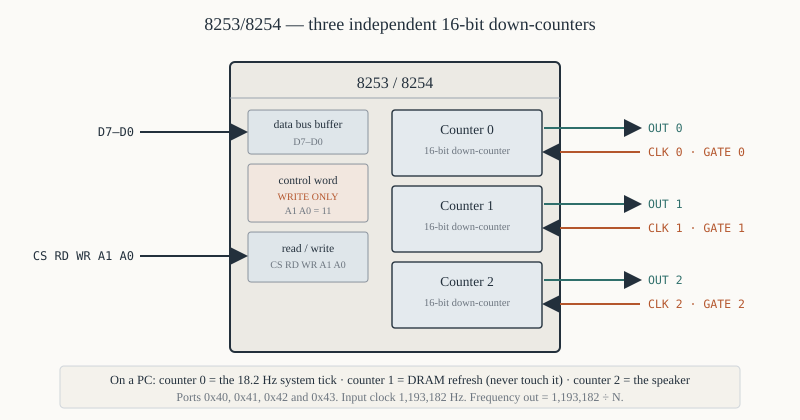
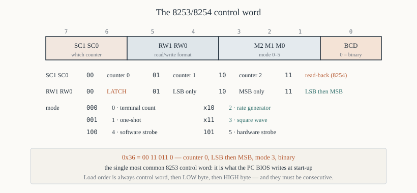
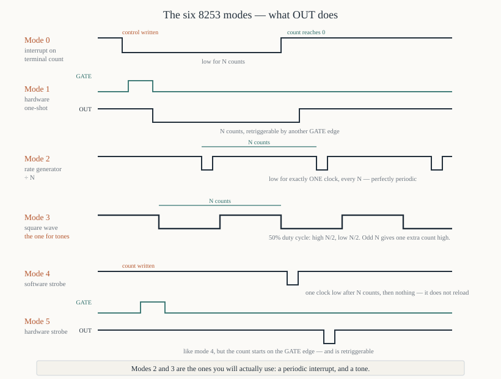

# Chapter 48 — The 8253/8254 programmable timer

[← 8255A PPI](47-8255-ppi.md) · [Contents](README.md) · [Next: 8259A interrupt controller →](49-8259a-pic.md)

---

## Goal

Three independent 16-bit counters, six operating modes, one control register. The 8253 is how a
microprocessor measures time without wasting clock cycles on delay loops, and it is what makes the
PC's system clock, memory refresh and speaker work.

> **Does this run under DOSBox?** Yes. DOSBox emulates the PC's 8253 at ports `0x40`–`0x43`, so the
> speaker and delay programs in §7 and §8 work as written.

---

## 1. What it provides



```
   Three independent counters, each with:

      CLK n    input   the clock to count
      GATE n   input   enable / trigger, depending on the mode
      OUT n    output  the result — a pulse, a square wave, a strobe
```

Each counter is a **16-bit down-counter**. You load it with a value; it counts down on each `CLK`
pulse; `OUT` changes when it reaches zero. What "changes" means is the mode.

### 1.1 8253 versus 8254

| | 8253 | 8254 |
|---|------|------|
| Maximum clock | 2.6 MHz | **10 MHz** |
| Read-back command | no | **yes** — read the count *and* the status |
| Counter latch | yes | yes |
| Otherwise | identical | identical |

The 8254 is a strict superset. Everything here applies to both; §6 covers the read-back command,
which is 8254-only.

### 1.2 Registers

| `A1` | `A0` | Register |
|------|------|----------|
| 0 | 0 | Counter 0 |
| 0 | 1 | Counter 1 |
| 1 | 0 | Counter 2 |
| 1 | 1 | **Control word** (write only) |

On the IBM PC (8-bit bus) these are ports `0x40`, `0x41`, `0x42`, `0x43`. On a 16-bit 8086 trainer
board with `A1 A0` from system `A2 A1`, they would be at four consecutive **even** addresses.

---

## 2. The control word



```
    7    6     5    4     3   2   1     0
  ┌─────────┬──────────┬───────────┬───────┐
  │ counter │  R/W     │   mode    │  BCD  │
  │ SC1 SC0 │ RW1 RW0  │ M2 M1 M0  │       │
  └─────────┴──────────┴───────────┴───────┘
```

### 2.1 Bits 7–6: which counter

| `SC1` | `SC0` | Counter |
|-------|-------|---------|
| 0 | 0 | 0 |
| 0 | 1 | 1 |
| 1 | 0 | 2 |
| 1 | 1 | read-back command (8254) / illegal (8253) |

### 2.2 Bits 5–4: read/write format

| `RW1` | `RW0` | Meaning |
|-------|-------|---------|
| 0 | 0 | **counter latch command** — freeze the count for reading |
| 0 | 1 | read/write the **low byte only** |
| 1 | 0 | read/write the **high byte only** |
| 1 | 1 | read/write **low byte then high byte** |

`11` is what you want almost always: write the low byte, then the high byte, to load a 16-bit value.

**The two writes must be consecutive.** The 8253 has an internal flip-flop tracking which byte is
next; an interrupt that writes to the same counter in between will desynchronise it and the counter
loads garbage. Wrap the pair in `CLI`/`STI` if an interrupt handler touches the same counter.

### 2.3 Bits 3–1: the mode

| `M2` | `M1` | `M0` | Mode | Name |
|------|------|------|------|------|
| 0 | 0 | 0 | **0** | interrupt on terminal count |
| 0 | 0 | 1 | **1** | hardware retriggerable one-shot |
| x | 1 | 0 | **2** | rate generator (divide by N) |
| x | 1 | 1 | **3** | square-wave generator |
| 1 | 0 | 0 | **4** | software-triggered strobe |
| 1 | 0 | 1 | **5** | hardware-triggered strobe |

### 2.4 Bit 0: counting base

```
   0 = binary       count 0000-FFFF, i.e. 65536 values
   1 = BCD          count 0000-9999 decimal
```

**Use binary.** BCD mode exists for building clocks that display directly, and costs you 35% of the
range.

### 2.5 Building a control word

```asm
; --- 8253 control word bits ---
SC0         equ  0x00           ; counter select
SC1         equ  0x40
SC2         equ  0x80
LATCH       equ  0x00           ; read/write format
RW_LSB      equ  0x10
RW_MSB      equ  0x20
RW_BOTH     equ  0x30
MODE0       equ  0x00
MODE1       equ  0x02
MODE2       equ  0x04
MODE3       equ  0x06
MODE4       equ  0x08
MODE5       equ  0x0A
BINARY      equ  0x00
BCD         equ  0x01

; Counter 0, low then high byte, mode 3, binary:
        mov  al, SC0 | RW_BOTH | MODE3 | BINARY      ; = 0x36
        out  0x43, al
```

`0x36` is the single most common 8253 control word in existence — it is what the PC BIOS writes to
counter 0 at start-up.

---

## 3. The six modes



### Mode 0 — interrupt on terminal count

`OUT` goes **low** when the control word is written, and **high** when the count reaches zero. It
stays high until the counter is reloaded.

```
   write control:  OUT ──┐
                          └──────────────────┐
   load count N:          |<─── N clocks ───>│
                                             └──── OUT goes HIGH
```

**Use:** a one-shot event notification — "tell me when N clock pulses have passed". Connect `OUT` to
an interrupt controller and you have a programmable alarm.

`GATE` must be high to count. Taking `GATE` low pauses the count.

### Mode 1 — hardware retriggerable one-shot

`OUT` goes low on the **rising edge of `GATE`**, stays low for N counts, then goes high.

```
   GATE ──┐   ┌───────────────────
          └───┘
   OUT  ────────┐
                └────────────┐
                 |< N counts>│
                             └────
```

**Retriggerable:** another `GATE` rising edge restarts the full N counts, even mid-pulse.

**Use:** a hardware-triggered pulse of a precise width — a camera shutter, a strobe, a watchdog
reset pulse.

### Mode 2 — rate generator

`OUT` is high for N−1 counts, then **low for one count**, then reloads and repeats — forever.

```
   OUT  ─────────────┐ ┌─────────────┐ ┌─────────────
                     └─┘             └─┘
                     |<──── N counts ──>|
```

**Frequency = input clock ÷ N.**

**Use:** generating a periodic interrupt, or a clock for another device. It is a divide-by-N
counter, and the output pulse is only one clock wide — narrow, but perfectly periodic.

### Mode 3 — square-wave generator

Like mode 2 but the output is **symmetric**: high for N/2, low for N/2.

```
   OUT  ────────┐        ┌────────┐        ┌───
                └────────┘        └────────┘
                |< N/2 >|< N/2 >|
```

**Frequency = input clock ÷ N**, same as mode 2, but with a 50% duty cycle.

For an **odd** N the high period is (N+1)/2 and the low period is (N−1)/2 — one count longer high.

**Use:** tone generation, baud-rate clocks, anything that wants a symmetric waveform. This is the
mode for the PC speaker.

### Mode 4 — software-triggered strobe

`OUT` is high; when the count reaches zero it goes **low for exactly one clock**, then high again.
The count starts when the value is written.

```
   load count:  OUT ─────────────┐ ┌──────────
                                 └─┘
                |<─── N counts ──>|
```

**One-shot**, not periodic: it does not reload.

**Use:** a precisely delayed single strobe pulse under software control.

### Mode 5 — hardware-triggered strobe

Like mode 4, but the count starts on the **rising edge of `GATE`** instead of on the write.
Retriggerable.

**Use:** a delayed pulse in response to an external event.

### 3.1 Choosing a mode

| Requirement | Mode |
|-------------|------|
| "Interrupt me after N ticks" | **0** |
| A precise pulse width, triggered by hardware | **1** |
| A periodic interrupt or clock divider | **2** |
| A tone, or a symmetric clock | **3** |
| A delayed strobe under software control | 4 |
| A delayed strobe triggered by hardware | 5 |

**Modes 2 and 3 are the ones you will actually use.**

---

## 4. Loading a counter

```asm
; Load counter 0 with 1000, mode 3, binary.
        mov  al, 0x36           ; counter 0, LSB then MSB, mode 3, binary
        out  0x43, al

        mov  ax, 1000
        out  0x40, al           ; LOW byte first
        mov  al, ah
        out  0x40, al           ; then the HIGH byte
```

**Low byte then high byte, always** (when `RW1 RW0 = 11`). The counter does not start until both
bytes are written.

### 4.1 Loading zero means 65,536

```asm
        xor  ax, ax
        out  0x40, al
        out  0x40, al           ; counter = 65536, not 0
```

A count of 0 wraps to the maximum, because the counter decrements *then* tests. That is why the
PC's counter 0 is loaded with 0 to get the longest possible period.

### 4.2 The frequency arithmetic

```
   output frequency  =  input clock frequency  ÷  N
   output period     =  N  ÷  input clock frequency
```

On a PC, the timer input is **1,193,182 Hz** (the 14.31818 MHz crystal divided by 12).

| N | Frequency | Period |
|---|-----------|--------|
| 1 | 1,193,182 Hz | 0.838 µs |
| 1,000 | 1,193 Hz | 838 µs |
| 11,932 | 100 Hz | 10 ms |
| 65,536 (N=0) | **18.2065 Hz** | **54.925 ms** |

**18.2 Hz is the PC's system tick**, and it comes from exactly this: 1,193,182 ÷ 65,536.

To get a required frequency:

```
   N  =  1,193,182  ÷  desired frequency
```

For 1 kHz: N = 1,193,182 ÷ 1000 = 1193.

---

## 5. Reading a counter

The count changes continuously, so reading the two bytes separately can catch it mid-decrement —
you might read a low byte of `0x00` and then a high byte that has already decremented.

**The counter latch command freezes a copy** for you to read at leisure.

```asm
; ---------------------------------------------------------------
; read_counter0 — read counter 0's current value into AX.
; ---------------------------------------------------------------
read_counter0:
        push dx
        cli                     ; the two reads must not be separated
        mov  al, 0x00           ; SC = 00 (counter 0), RW = 00 (LATCH)
        out  0x43, al           ; freeze a copy

        in   al, 0x40           ; low byte
        mov  dl, al
        in   al, 0x40           ; high byte
        mov  ah, al
        mov  al, dl             ; AX = the latched count
        sti
        pop  dx
        ret
```

**The latch command is `RW1 RW0 = 00`** with the counter selected and the mode bits ignored. It does
not disturb the count — the counter keeps running while you read the frozen copy.

**Counter 0 counts DOWN**, so elapsed time is `before − after`.

---

## 6. The 8254 read-back command

The 8254 adds a command that reads the count *and* the mode/status of several counters at once.

```
    7   6   5     4      3    2    1    0
  ┌───────┬─────┬──────┬────┬────┬────┬───┐
  │ 1   1 │COUNT│STATUS│CNT2│CNT1│CNT0│ 0 │
  └───────┴─────┴──────┴────┴────┴────┴───┘
```

Bits 5 and 4 are **active low**: 0 means "latch this". Bits 3–1 select which counters.

```asm
; Read back the status of counter 0
        mov  al, 1110_0010b     ; 11, COUNT#=1 (no), STATUS#=0 (yes), CNT0=1
        out  0x43, al
        in   al, 0x40           ; AL = the status byte
```

The status byte:

| Bit | Meaning |
|-----|---------|
| 7 | the current state of the `OUT` pin |
| 6 | **null count** — 1 means the loaded value has not reached the counter yet |
| 5–4 | the programmed read/write format |
| 3–1 | the programmed mode |
| 0 | BCD flag |

**Bit 7 lets you read the `OUT` pin from software**, which is otherwise impossible. Bit 6 tells you
whether a value you just wrote has taken effect.

---

## 7. Worked program — a precise delay

Replaces the software delay loops of Chapter 47 with something calibrated in real time.

```asm
; delay.asm — a delay measured with the hardware timer
; nasm -f bin delay.asm -o delay.com
;
; Runs under DOSBox. Uses the BIOS tick counter at 0040:006C, which
; the timer's counter 0 drives at 18.2065 Hz.
        cpu  8086
        org  0x100
%include "macros.inc"
%include "io.inc"

start:
        print startmsg

        mov  ax, 5
        call delay_seconds

        print donemsg
        exit 0

; ---------------------------------------------------------------
; delay_seconds — wait AX seconds.
;
;   The BIOS tick counter at 0040:006C increments 18.2065 times a
;   second. Ticks needed = seconds × 18.2065, approximated as
;   seconds × 1193 / 65.536 ... in integer terms, × 18 plus a
;   correction. Good to about 1%.
;
;   Destroys:  nothing
; ---------------------------------------------------------------
delay_seconds:
        push ax
        push bx
        push cx
        push dx
        push es

        ; --- ticks = seconds × 18.2065, done as (seconds × 1165) / 64 ---
        mov  bx, 1165
        mul  bx                 ; DX:AX = seconds × 1165
        mov  cl, 6
        shr  ax, cl             ; ÷ 64   (DX is zero for sane inputs)
        mov  cx, ax             ; CX = the tick count to wait

        ; --- read the starting tick ---
        mov  ax, 0x0040
        mov  es, ax
        cli
        mov  bx, [es:0x6C]      ; the low word is enough for short waits
        sti

.wait:
        cli
        mov  ax, [es:0x6C]
        sti
        sub  ax, bx             ; elapsed ticks (wraps correctly)
        cmp  ax, cx
        jb   .wait

        pop  es
        pop  dx
        pop  cx
        pop  bx
        pop  ax
        ret

startmsg: db 'Waiting five seconds...', 0x0D, 0x0A, '$'
donemsg:  db 'Done.', 0x0D, 0x0A, '$'
```

### Explanation

**`(seconds × 1165) / 64`** approximates `× 18.2065`: 1165 ÷ 64 = 18.2031, an error of 0.02%. Integer
scaling like this is how you do fractional arithmetic without a coprocessor.

**`sub ax, bx` handles wrap-around correctly.** If the counter wraps from `0xFFFF` to `0x0000`, the
subtraction still gives the right elapsed count, because 16-bit arithmetic is modular.

**`CLI` around the two-byte read** — the tick counter is 32 bits and an interrupt between the reads
could catch it mid-update (Chapter 30 §4.2). Here we read only the low word, so strictly it is not
needed; it is there because the habit is right.

---

## 8. Worked program — the PC speaker

```asm
; tone.asm — play tones on the PC speaker using counter 2
; nasm -f bin tone.asm -o tone.com
;
; Counter 2's OUT drives the speaker, gated by port 0x61 bits 0 and 1.
;   bit 0 = counter 2 GATE
;   bit 1 = speaker data enable
        cpu  8086
        org  0x100
%include "macros.inc"
%include "io.inc"

TIMER0  equ  0x40
TIMER2  equ  0x42
TCTRL   equ  0x43
SPKPORT equ  0x61

start:
        print msg

        ; --- a scale ---
        mov  si, notes
.next:
        lodsw                   ; AX = the frequency
        or   ax, ax
        jz   .done
        call play_note
        jmp  .next

.done:
        call speaker_off
        print donemsg
        exit 0

; ---------------------------------------------------------------
; play_note — sound AX Hz for about a quarter of a second.
;   Destroys:  nothing
; ---------------------------------------------------------------
play_note:
        push ax
        push bx
        push cx
        push dx

        ; --- N = 1193182 / frequency ---
        mov  bx, ax
        mov  dx, 0x0012         ; DX:AX = 1,193,182 = 0x1234DE
        mov  ax, 0x34DE
        div  bx                 ; AX = the divisor N
        mov  bx, ax             ; keep it

        ; --- programme counter 2, mode 3 (square wave), binary ---
        mov  al, 1011_0110b     ; SC=10 (counter 2), RW=11, mode 3, binary
        out  TCTRL, al
        mov  ax, bx
        out  TIMER2, al         ; low byte
        mov  al, ah
        out  TIMER2, al         ; high byte

        ; --- turn the speaker on ---
        in   al, SPKPORT
        or   al, 0x03           ; set bits 0 and 1
        out  SPKPORT, al

        mov  ax, 250
        call delay_ms

        pop  dx
        pop  cx
        pop  bx
        pop  ax
        ret

; ---------------------------------------------------------------
; speaker_off — disconnect the speaker.
; ---------------------------------------------------------------
speaker_off:
        push ax
        in   al, SPKPORT
        and  al, 0xFC           ; clear bits 0 and 1
        out  SPKPORT, al
        pop  ax
        ret

; ---------------------------------------------------------------
; delay_ms — wait roughly AX milliseconds using the BIOS tick.
;   Resolution is 55 ms, so anything shorter rounds up to one tick.
; ---------------------------------------------------------------
delay_ms:
        push ax
        push bx
        push cx
        push es
        mov  bx, 55
        xor  dx, dx
        div  bx                 ; AX = ticks (rounded down)
        or   ax, ax
        jnz  .have_ticks
        mov  ax, 1              ; always wait at least one tick
.have_ticks:
        mov  cx, ax

        mov  ax, 0x0040
        mov  es, ax
        mov  bx, [es:0x6C]
.wait:
        mov  ax, [es:0x6C]
        sub  ax, bx
        cmp  ax, cx
        jb   .wait

        pop  es
        pop  cx
        pop  bx
        pop  ax
        ret

; --- a C major scale, in Hz, terminated by zero ---
notes:  dw   262, 294, 330, 349, 392, 440, 494, 523, 0

msg:      db 'Playing a scale...', 0x0D, 0x0A, '$'
donemsg:  db 'Done.', 0x0D, 0x0A, '$'
```

### Explanation

**`0x1234DE` = 1,193,182.** Loading it as `DX:AX` gives a 32-bit dividend, and `div bx` produces the
16-bit divisor N. For 262 Hz, N = 1,193,182 ÷ 262 = 4554.

**Mode 3, not mode 2**, because a speaker wants a symmetric square wave. Mode 2's one-clock-wide
pulse would produce a much quieter, buzzier sound.

**Port `0x61` bits 0 and 1 must both be set.** Bit 0 enables counter 2's gate (so it counts at all);
bit 1 connects its output to the speaker amplifier. Setting only one gives silence.

**Read-modify-write on port `0x61`.** The other bits of that port control memory parity checking and
other things; clobbering them is a real fault. `in` / `or` / `out` preserves them.

---

## 9. The PC's three counters

| Counter | Frequency | `OUT` goes to | Purpose |
|---------|-----------|---------------|---------|
| **0** | 18.2065 Hz (N = 65536) | IRQ0 | the system tick, mode 3 |
| **1** | 66,288 Hz (N = 18) | DMA request | **DRAM refresh**, mode 2 |
| **2** | variable | the speaker | tone generation, mode 3 |

**Counter 1 must not be reprogrammed.** It triggers a DMA cycle every 15 µs that refreshes the
system DRAM (Chapter 16 §8). Changing it corrupts memory within milliseconds — one of the few ways
to destroy a running PC from software.

### 9.1 Changing the system tick rate

Counter 0's rate can be raised for finer timing, but the BIOS's `INT 08h` handler counts ticks and
updates the time of day assuming 18.2 Hz. The standard approach:

1. Reprogram counter 0 to, say, 1000 Hz.
2. Install your own `INT 08h` handler.
3. Count your ticks; every 55th one, chain to the original BIOS handler so the clock stays right.

```asm
; Reprogram counter 0 to 1000 Hz
        mov  al, 0x36           ; counter 0, LSB/MSB, mode 3, binary
        out  0x43, al
        mov  ax, 1193           ; 1,193,182 / 1000
        out  0x40, al
        mov  al, ah
        out  0x40, al
```

**Restore it before exiting** — `mov ax, 0` and reload, giving 65,536 again. A program that leaves
the tick at 1000 Hz makes the system clock run 55 times fast.

---

## 10. Summary

```
  three independent 16-bit DOWN-counters; each has CLK, GATE and OUT
  8254 = 8253 + 10 MHz + the read-back command

  registers: A1A0 = 00 counter 0 · 01 counter 1 · 10 counter 2 · 11 control
  PC ports:  0x40  0x41  0x42  0x43

  CONTROL WORD:
     7,6  counter select   00/01/10, 11 = read-back (8254)
     5,4  read/write       00 = LATCH, 01 = LSB, 10 = MSB, 11 = LSB then MSB
     3-1  mode 0-5
     0    0 = binary, 1 = BCD

     0x36 = counter 0, LSB/MSB, mode 3, binary — the PC's system tick

  modes:  0 interrupt on terminal count      1 hardware one-shot
          2 rate generator (÷N, 1 clock low) 3 SQUARE WAVE (÷N, 50%)
          4 software strobe                  5 hardware strobe

  loading: control word, then LOW byte, then HIGH byte — consecutively
  a count of 0 means 65536
  frequency = input clock / N;  PC input clock = 1,193,182 Hz
     N = 65536 -> 18.2065 Hz, the PC system tick

  reading: write the LATCH command (RW = 00) first, then read low, high

  PC counters: 0 = system tick · 1 = DRAM REFRESH (never touch) · 2 = speaker
  speaker: programme counter 2 mode 3, then set bits 0 and 1 of port 0x61
```

---

## Exercises

**48.1** Give the control word for counter 1, read/write both bytes, mode 2, binary.

**48.2** Decode the control word `0xB6`.

**48.3** Write the code that loads counter 0 with 5000.

**48.4** What value of N gives a 2 kHz square wave from a 1,193,182 Hz input? Show the arithmetic.

**48.5** What frequency results from N = 2048?

**48.6** Why does loading a counter with 0 give the longest possible period, and what is that period
on a PC?

**48.7** What is the difference between mode 2 and mode 3? Which would you use for a tone, and why?

**48.8** Write the code that reads counter 0's current value safely, and explain why the latch
command is necessary.

**48.9** Why must the low and high bytes be written consecutively? What could go wrong?

**48.10** Write a routine that produces a 440 Hz tone for one second on the PC speaker.

**48.11** What does counter 1 do on a PC, and what happens if you reprogram it?

**48.12** Write the code that changes the system tick to 100 Hz, and describe what else must be done
so the time of day stays correct.

**48.13** Using the 8254 read-back command, write code that determines the current state of counter
2's `OUT` pin.

**48.14** A 2 MHz clock feeds counter 0 in mode 2. What value of N gives an interrupt every
millisecond?

**48.15** Design a circuit and the software to generate a 50 Hz, 20% duty-cycle waveform. Which mode,
and what additional hardware would you need?

Answers in [Appendix H](H-exercise-solutions.md#chapter-48).

---

[← 8255A PPI](47-8255-ppi.md) · [Contents](README.md) · [Next: 8259A interrupt controller →](49-8259a-pic.md)
