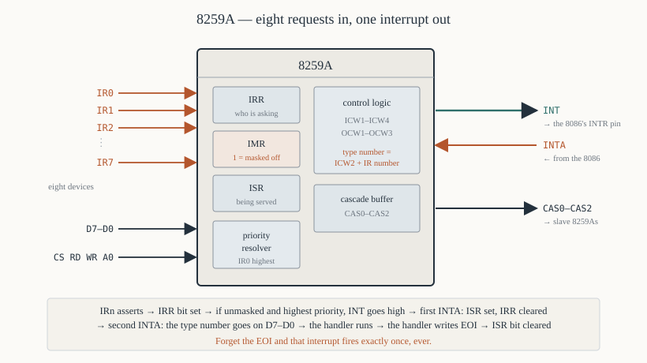
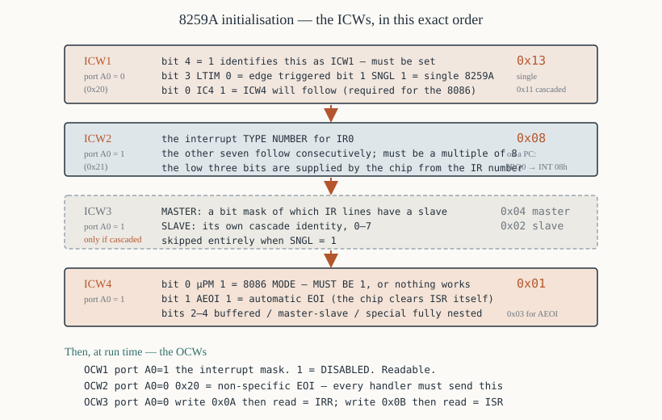

# Chapter 49 — The 8259A interrupt controller

[← 8253/8254 timer](48-8253-8254-timer.md) · [Contents](README.md) · [Next: 8251A USART →](50-8251a-usart.md)

---

## Goal

The 8086 has **one** maskable interrupt pin. A real system has eight or more interrupting devices.
The 8259A resolves that: it takes eight requests, prioritises them, supplies the interrupt type
number, and lets software mask individual sources.

> **Does this run under DOSBox?** Partly. DOSBox emulates the PC's 8259A at ports `0x20`–`0x21`, so
> the masking and EOI examples work. Re-initialising it (§4) will break DOS, so do that only on real
> hardware or in a virtual machine you can reboot.

---

## 1. The problem it solves

Without a controller:

```
   keyboard ──┐
   timer    ──┼──► INTR   ... and then what?
   disk     ──┘
```

Three problems:

1. **The 8086 has one `INTR` pin.** Wiring three devices to it with an OR gate means you cannot tell
   which one asked.
2. **Something must supply the type number** during the second `INTA#` cycle (Chapter 31 §5.1). A
   plain device has no idea what type number it has been assigned.
3. **Priority.** If the timer and the keyboard interrupt at the same instant, which is served first?

The 8259A does all three.

---

## 2. What it provides



```
   IR0 - IR7    eight interrupt request inputs
   INT          to the 8086's INTR pin
   INTA#        from the 8086's INTA# pin
   D7 - D0      to the data bus — this is how the type number is delivered
   A0           register select
   CS#, RD#, WR#
   CAS0-CAS2    cascade lines, for connecting slave 8259As
   SP#/EN#      master/slave select
```

### 2.1 The three internal registers

| Register | What it holds |
|----------|---------------|
| **IRR** — Interrupt Request Register | which inputs are currently asserting |
| **ISR** — In-Service Register | which interrupts are currently being handled |
| **IMR** — Interrupt Mask Register | which inputs are **disabled** (1 = masked off) |

Plus a **priority resolver** that decides which pending request wins.

### 2.2 The sequence

1. A device raises `IRn`. The corresponding **IRR** bit is set.
2. If that bit is not masked in **IMR**, and its priority beats anything already in **ISR**, the
   8259A raises `INT`.
3. The 8086 (if `IF = 1`) finishes the current instruction and runs the first `INTA#` cycle.
4. The 8259A sets the **ISR** bit and clears the **IRR** bit.
5. On the second `INTA#` cycle, the 8259A puts the **type number** on `D7`–`D0`.
6. The 8086 fetches the handler address from the vector table.
7. The handler runs and, before returning, writes an **EOI** — End Of Interrupt — which clears the
   **ISR** bit.

**Step 7 is the one people forget**, and the symptom is that the interrupt fires exactly once and
never again.

---

## 3. Initialisation — the ICWs

The 8259A is set up by writing two to four **Initialisation Command Words** in a fixed order. Writing
ICW1 starts the sequence; the chip then expects the others.



### 3.1 ICW1 — written to port A0 = 0

```
    7   6   5   4    3    2    1    0
  ┌───────────┬───┬────┬────┬─────┬────┐
  │  unused   │ 1 │LTIM│ADI │SNGL │IC4 │
  └───────────┴───┴────┴────┴─────┴────┘
```

| Bit | Name | Meaning |
|-----|------|---------|
| 4 | — | **must be 1** — this is what identifies the byte as ICW1 |
| 3 | `LTIM` | 0 = **edge** triggered, 1 = level triggered |
| 2 | `ADI` | call address interval; ignored on an 8086 |
| 1 | `SNGL` | **1 = single** 8259A, 0 = cascaded |
| 0 | `IC4` | **1 = ICW4 will follow** (required for 8086 mode) |

**For an 8086 system: `ICW1 = 0x13`** — edge triggered, single, ICW4 needed.

Cascaded (as in a PC/AT): `0x11`.

### 3.2 ICW2 — written to port A0 = 1

**The interrupt type number for IR0.** The other seven follow consecutively.

```asm
        mov  al, 0x08           ; IR0 -> INT 08h, IR1 -> INT 09h, ... IR7 -> INT 0Fh
        out  0x21, al
```

Only the top five bits matter; the bottom three are supplied by the 8259A from the IR number. So
the base must be a multiple of 8.

**The PC uses `0x08`**, which is why IRQ0 is `INT 08h` and IRQ1 is `INT 09h` (Chapter 31 §5.3).

### 3.3 ICW3 — only if cascaded (`SNGL = 0`)

**On a master:** a bit mask of which IR lines have a slave attached.

```asm
        mov  al, 0x04           ; a slave on IR2 — the PC/AT arrangement
        out  0x21, al
```

**On a slave:** its own cascade identity, 0–7.

```asm
        mov  al, 0x02           ; "I am the slave on the master's IR2"
        out  0xA1, al
```

### 3.4 ICW4 — written to port A0 = 1

```
    7  6  5   4     3     2     1     0
  ┌────────┬─────┬─────┬─────┬─────┬─────┐
  │  0 0 0 │SFNM │BUF  │M/S  │AEOI │µPM  │
  └────────┴─────┴─────┴─────┴─────┴─────┘
```

| Bit | Name | Meaning |
|-----|------|---------|
| 4 | `SFNM` | special fully nested mode |
| 3 | `BUF` | buffered mode |
| 2 | `M/S` | master/slave, when buffered |
| 1 | `AEOI` | **1 = automatic EOI** — the chip clears ISR itself |
| 0 | `µPM` | **1 = 8086/8088 mode**, 0 = 8080/8085 mode |

**For an 8086: `ICW4 = 0x01`** at minimum. Bit 0 *must* be 1, or the chip generates 8080-style `CALL`
instructions instead of interrupt type numbers, and nothing works.

**`AEOI` (`0x03`)** saves writing an EOI in every handler, but it clears the ISR bit before the
handler has finished, so a second interrupt from the same source can nest. Use it only when you know
that is safe.

### 3.5 The complete initialisation

```asm
; ---------------------------------------------------------------
; init_8259 — initialise a single 8259A at ports 0x20/0x21,
;             with IR0 mapped to INT 08h.
; ---------------------------------------------------------------
PIC_CMD  equ  0x20              ; A0 = 0
PIC_DATA equ  0x21              ; A0 = 1

init_8259:
        cli                     ; no interrupts during initialisation

        mov  al, 0x13           ; ICW1: edge, single, ICW4 needed
        out  PIC_CMD, al
        call io_delay

        mov  al, 0x08           ; ICW2: IR0 -> INT 08h
        out  PIC_DATA, al
        call io_delay

        ; (no ICW3 — SNGL = 1)

        mov  al, 0x01           ; ICW4: 8086 mode, normal EOI
        out  PIC_DATA, al
        call io_delay

        mov  al, 0xFF           ; OCW1: mask everything off for now
        out  PIC_DATA, al

        sti
        ret

; ---------------------------------------------------------------
; io_delay — the 8259A needs recovery time between writes.
;   `jmp $+2` flushes the prefetch queue, costing about 15 clocks,
;   which is enough. See Chapter 17 §7.
; ---------------------------------------------------------------
io_delay:
        jmp  short $+2
        jmp  short $+2
        ret
```

**The order is fixed and cannot be varied.** ICW1, then ICW2, then ICW3 if cascaded, then ICW4. The
chip counts the writes.

**`io_delay` between writes.** The 8259A's internal state machine needs time to settle. Without it,
initialisation fails intermittently on fast machines — the classic symptom being a system that works
on one PC and not another.

---

## 4. Operation — the OCWs

Once initialised, three **Operation Command Words** control the chip at run time.

### 4.1 OCW1 — the interrupt mask, port A0 = 1

**The register you will use most.** A 1 bit **disables** that input.

```asm
        mov  al, 0xFE           ; enable IR0 only (bit 0 clear)
        out  0x21, al

        mov  al, 0xFC           ; enable IR0 and IR1 (timer and keyboard)
        out  0x21, al

        mov  al, 0xFF           ; disable everything
        out  0x21, al
```

**Reading port `0x21` returns the current mask**, which makes read-modify-write safe:

```asm
; ---------------------------------------------------------------
; enable_irq — unmask IRQ number AL (0-7).
; ---------------------------------------------------------------
enable_irq:
        push ax
        push cx
        mov  cl, al
        mov  ah, 1
        shl  ah, cl             ; AH = the bit for this IRQ
        not  ah                 ; a 0 in that position
        in   al, PIC_DATA       ; the current mask
        and  al, ah             ; clear that bit -> enabled
        out  PIC_DATA, al
        pop  cx
        pop  ax
        ret

; ---------------------------------------------------------------
; disable_irq — mask IRQ number AL (0-7).
; ---------------------------------------------------------------
disable_irq:
        push ax
        push cx
        mov  cl, al
        mov  ah, 1
        shl  ah, cl
        in   al, PIC_DATA
        or   al, ah             ; set that bit -> disabled
        out  PIC_DATA, al
        pop  cx
        pop  ax
        ret
```

**`shl ah, cl`** — the variable shift count must be in `CL` (Chapter 26 §1).

### 4.2 OCW2 — EOI and priority, port A0 = 0

```
    7   6   5    4  3    2   1   0
  ┌───────────┬───────┬───────────┐
  │ R  SL EOI │ 0   0 │ L2 L1 L0  │
  └───────────┴───────┴───────────┘
```

| `R` | `SL` | `EOI` | Command |
|-----|------|-------|---------|
| 0 | 0 | 1 | **non-specific EOI** — clear the highest-priority ISR bit |
| 0 | 1 | 1 | **specific EOI** — clear the bit named by `L2 L1 L0` |
| 1 | 0 | 1 | rotate on non-specific EOI |
| 1 | 0 | 0 | automatic rotation off |
| 1 | 1 | 1 | rotate on specific EOI |
| 1 | 1 | 0 | set priority to `L2 L1 L0` |

**The one you need: `0x20` — non-specific EOI.**

```asm
        mov  al, 0x20
        out  0x20, al           ; end of interrupt
```

Every hardware interrupt handler must do this before `IRET`, or that IRQ never fires again.

For a specific EOI on IRQ3:

```asm
        mov  al, 0x63           ; 011 00 011 = specific EOI, level 3
        out  0x20, al
```

Use specific EOI when interrupts nest and you cannot be sure the highest-priority ISR bit is yours.

### 4.3 OCW3 — read IRR/ISR, and special mask, port A0 = 0

```asm
; Read the Interrupt Request Register
        mov  al, 0x0A           ; OCW3: read IRR
        out  0x20, al
        in   al, 0x20           ; AL = IRR

; Read the In-Service Register
        mov  al, 0x0B           ; OCW3: read ISR
        out  0x20, al
        in   al, 0x20           ; AL = ISR
```

**Reading the IRR tells you which devices are asking**, including masked ones — genuinely useful for
diagnosing a device that seems dead.

**Reading the ISR tells you which handler is currently active**, which matters for nested
interrupts.

---

## 5. Priority

### 5.1 Fully nested mode — the default

**IR0 has the highest priority, IR7 the lowest**, fixed.

While a handler for IRn runs (its ISR bit set), the 8259A will interrupt it only for a **higher**
priority request. Equal or lower requests wait in the IRR.

That is the right default: on a PC, the timer (IR0) beats the keyboard (IR1) beats the printer (IR7).

**But the 8086's `IF` is cleared by the interrupt sequence**, so nesting happens only if the handler
executes `STI`:

```asm
handler:
        push ax
        ; ... save everything ...
        sti                     ; ALLOW higher-priority interrupts to nest
        ; ... the long part of the work ...
        cli
        mov  al, 0x20
        out  0x20, al           ; EOI
        ; ... restore ...
        iret
```

**Only `STI` in a handler you have thought about.** A handler that enables interrupts and can be
re-entered by its *own* device needs a reentrancy guard.

### 5.2 Rotating priority

After an interrupt is serviced, its priority drops to lowest and everything else moves up. This
gives all eight devices equal long-run service — appropriate when they are peers, such as eight
identical serial channels.

```asm
        mov  al, 0xA0           ; rotate on non-specific EOI
        out  0x20, al           ; does the EOI *and* rotates
```

### 5.3 Specific priority

```asm
        mov  al, 0xC0 + 4       ; set IR4 as the LOWEST priority,
        out  0x20, al           ;   so IR5 becomes the highest
```

---

## 6. Cascading

One 8259A handles eight sources. Two handle fifteen: a **master** and a **slave**, with the slave's
`INT` output wired to one of the master's IR inputs.

```
                            ┌─────────────┐
   IR0-IR7 (slave) ────────►│   SLAVE     │
                            │   8259A     │
                            │  ports A0/A1│
                            └──────┬──────┘
                                   │ INT
                                   ▼
                            ┌─────────────┐
   IR0,IR1,IR3-IR7 ────────►│   MASTER    ├──► INTR (to the 8086)
                     IR2 ◄──┤   8259A     │
                            │ ports 20/21 │
                            └─────────────┘
                                CAS0-CAS2
```

**Fifteen sources, not sixteen**, because the master's IR2 is consumed by the cascade.

### 6.1 The PC/AT arrangement

| IRQ | Type | Device |
|-----|------|--------|
| 0 | `08h` | timer |
| 1 | `09h` | keyboard |
| **2** | `0Ah` | **cascade to the slave** |
| 3 | `0Bh` | COM2 |
| 4 | `0Ch` | COM1 |
| 5 | `0Dh` | LPT2 |
| 6 | `0Eh` | floppy |
| 7 | `0Fh` | LPT1 |
| 8 | `70h` | real-time clock |
| 9 | `71h` | redirected to IRQ2 |
| 10–12 | `72h`–`74h` | available |
| 13 | `75h` | coprocessor |
| 14 | `76h` | hard disk |
| 15 | `77h` | available |

**Slave interrupts need TWO EOIs** — one to the slave, one to the master:

```asm
; handler for IRQ 8-15
        mov  al, 0x20
        out  0xA0, al           ; EOI to the SLAVE first
        out  0x20, al           ; then to the MASTER
```

Sending only one leaves an ISR bit set somewhere, and that half of the system goes deaf.

### 6.2 The cascade handshake

1. A slave input asserts; the slave raises its `INT`, which is the master's IR2.
2. The master raises `INT` to the 8086.
3. During `INTA#`, the master puts the slave's ID on `CAS0`–`CAS2`.
4. The slave recognises its ID and supplies the type number instead of the master.

The `CAS` lines exist precisely so the master and slave can agree on who answers.

---

## 7. Worked program — a keyboard interrupt handler

Installs a handler on IRQ1 that counts keystrokes, chaining to the BIOS handler so the keyboard
still works.

```asm
; keyirq.asm — count keystrokes via an IRQ1 handler
; nasm -f bin keyirq.asm -o keyirq.com
;
; Chains to the BIOS INT 09h handler so normal keyboard processing
; continues. The BIOS handler sends the EOI, so ours must not.
        cpu  8086
        org  0x100
%include "macros.inc"
%include "io.inc"

start:
        ; --- save the old INT 09h vector ---
        mov  ax, 0x3509
        int  0x21               ; ES:BX = the old handler
        mov  [old_off], bx
        mov  [old_seg], es

        ; --- install ours ---
        push ds
        mov  dx, key_handler
        push cs
        pop  ds
        mov  ax, 0x2509
        int  0x21
        pop  ds

        print msg

        ; --- wait for 20 keystrokes ---
.wait:
        mov  ax, [count]
        cmp  ax, 20
        jb   .wait

        ; --- restore the old vector BEFORE anything else ---
        push ds
        mov  dx, [old_off]
        mov  ax, [old_seg]
        mov  ds, ax
        mov  ax, 0x2509
        int  0x21
        pop  ds

        print donemsg
        mov  ax, [count]
        call print_udec
        newline
        exit 0

; ---------------------------------------------------------------
; key_handler — called on every keyboard interrupt (IRQ1).
;
;   Increments a counter, then CHAINS to the original BIOS handler,
;   which reads the scan code, buffers it and sends the EOI.
;
;   Because we chain, we must NOT send an EOI ourselves.
; ---------------------------------------------------------------
key_handler:
        push ax
        push ds
        push cs
        pop  ds

        inc  word [count]

        pop  ds
        pop  ax

        ; --- chain: simulate an INT to the old handler ---
        pushf                   ; the old handler's IRET expects flags here
        call far [cs:old_vec]   ; ... then CS and IP, which CALL FAR pushes
        iret

; The old vector, as a far pointer for CALL FAR to use.
old_vec:
old_off:  dw  0
old_seg:  dw  0

count:    dw  0
msg:      db  'Press 20 keys...', 0x0D, 0x0A, '$'
donemsg:  db  'Keystrokes counted: $'
```

### Explanation

**`pushf` then `call far`** pushes flags, `CS`, `IP` — exactly what an `INT` pushes — so the old
handler's `IRET` returns to the instruction after the `CALL` (Chapter 31 §8.3).

**We do not send an EOI**, because the BIOS handler does. Sending a second one would clear an ISR
bit that belongs to something else.

**The handler is four instructions of real work.** Everything else is bookkeeping. That is the right
proportion.

**Restoring the vector before exiting is not optional** (Chapter 31 §8.2).

---

## 8. Worked program — masking interrupts

```asm
; mask.asm — demonstrate the interrupt mask register
; nasm -f bin mask.asm -o mask.com
;
; Reads and displays the PIC mask, then disables the keyboard for
; three seconds, then re-enables it. Type during the pause and
; nothing appears until it ends.
        cpu  8086
        org  0x100
%include "macros.inc"
%include "io.inc"

PIC_CMD  equ  0x20
PIC_DATA equ  0x21

start:
        ; --- show the current mask ---
        print maskmsg
        in   al, PIC_DATA
        mov  [saved], al
        xor  ah, ah
        call print_hex16
        newline
        call explain_mask

        ; --- disable the keyboard (IRQ1) ---
        print offmsg
        in   al, PIC_DATA
        or   al, 0000_0010b     ; set bit 1 -> IRQ1 masked
        out  PIC_DATA, al

        mov  ax, 3
        call delay_seconds

        ; --- restore ---
        mov  al, [saved]
        out  PIC_DATA, al
        print onmsg

        ; --- show the IRR and ISR ---
        print irrmsg
        mov  al, 0x0A           ; OCW3: read IRR
        out  PIC_CMD, al
        in   al, PIC_CMD
        xor  ah, ah
        call print_hex16
        newline

        print isrmsg
        mov  al, 0x0B           ; OCW3: read ISR
        out  PIC_CMD, al
        in   al, PIC_CMD
        xor  ah, ah
        call print_hex16
        newline
        exit 0

; ---------------------------------------------------------------
; explain_mask — print which IRQs are enabled, from AL.
; ---------------------------------------------------------------
explain_mask:
        push ax
        push bx
        push cx
        mov  bl, [saved]
        xor  cx, cx
.next:
        mov  al, bl
        mov  ah, cl
        push cx
        mov  cl, ah
        shr  al, cl
        pop  cx
        test al, 1
        jnz  .masked
        print enmsg
        mov  ax, cx
        call print_udec
        newline
.masked:
        inc  cx
        cmp  cx, 8
        jb   .next
        pop  cx
        pop  bx
        pop  ax
        ret

; ---------------------------------------------------------------
delay_seconds:
        push ax
        push bx
        push cx
        push es
        mov  bx, 1165
        mul  bx
        mov  cl, 6
        shr  ax, cl
        mov  cx, ax
        mov  ax, 0x0040
        mov  es, ax
        mov  bx, [es:0x6C]
.wait:
        mov  ax, [es:0x6C]
        sub  ax, bx
        cmp  ax, cx
        jb   .wait
        pop  es
        pop  cx
        pop  bx
        pop  ax
        ret

saved:    db  0
maskmsg:  db  'Current IMR: 0x$'
enmsg:    db  '  enabled: IRQ$'
offmsg:   db  'Keyboard disabled for three seconds — type now...', 0x0D, 0x0A, '$'
onmsg:    db  'Keyboard re-enabled.', 0x0D, 0x0A, '$'
irrmsg:   db  'IRR: 0x$'
isrmsg:   db  'ISR: 0x$'
```

**Typing during the pause does nothing visible**, and then — because the keyboard controller still
latched one scan code — one character may appear when the mask is lifted. That is the mask working:
the interrupt was pending in the IRR the whole time.

---

## 9. The rules for an interrupt handler

Collected from Chapter 31 §7 and this chapter:

```asm
my_handler:
        ; 1. save EVERY register you touch
        push ax
        push bx
        push cx
        push dx
        push si
        push di
        push ds
        push es

        ; 2. establish your own DS
        push cs
        pop  ds

        ; 3. CLD, if you use string instructions
        cld

        ; 4. do the work — and keep it SHORT

        ; 5. EOI to the 8259A (and to the slave first, for IRQ 8-15)
        mov  al, 0x20
        out  0x20, al

        ; 6. restore everything, in reverse
        pop  es
        pop  ds
        pop  di
        pop  si
        pop  dx
        pop  cx
        pop  bx
        pop  ax

        ; 7. IRET — never RET or RETF
        iret
```

**The four ways to get it wrong, in order of frequency:**

1. **No EOI** — the interrupt fires once and never again.
2. **A register not saved** — the foreground program corrupts at random.
3. **`RET` instead of `IRET`** — the flags word is left on the stack, and `SP` drifts.
4. **Calling DOS** — DOS is not reentrant (Chapter 31 §7.1).

---

## 10. Summary

```
  eight inputs IR0-IR7 -> one INT output -> the 8086's INTR
  supplies the type number during the SECOND INTA cycle
  IR0 = highest priority, IR7 = lowest (fully nested mode)

  three registers:  IRR who is asking · ISR who is being served · IMR who is masked

  INITIALISATION — in this exact order:
     ICW1  port A0=0   0x13 = edge, single, ICW4 follows   (0x11 if cascaded)
     ICW2  port A0=1   the type number for IR0 (a multiple of 8; the PC uses 0x08)
     ICW3  port A0=1   only if cascaded: master = slave bitmask, slave = its ID
     ICW4  port A0=1   0x01 = 8086 mode. BIT 0 MUST BE 1.
     put a short delay between the writes

  OPERATION:
     OCW1  port A0=1   the interrupt mask. 1 = DISABLED. Readable.
     OCW2  port A0=0   0x20 = non-specific EOI — EVERY handler must send this
                       0x60+n = specific EOI for level n
                       0xA0 = rotate on EOI
     OCW3  port A0=0   0x0A then read = IRR;  0x0B then read = ISR

  PC ports: master 0x20/0x21, slave 0xA0/0xA1
  IRQ0-7 -> INT 08h-0Fh;  IRQ8-15 -> INT 70h-77h
  master IR2 is consumed by the cascade -> 15 sources, not 16
  a SLAVE interrupt needs TWO EOIs: slave first, then master
```

---

## Exercises

**49.1** Why can eight devices not simply be wired to the 8086's `INTR` pin through an OR gate? Give
three reasons.

**49.2** Name the three internal registers of the 8259A and say what each holds.

**49.3** Give the four ICW values for a single 8259A in an 8086 system with IR0 mapped to `INT 40h`.

**49.4** Which ICW bit must be 1 for 8086 mode, and what happens if it is 0?

**49.5** Write the code that enables only IRQ0 and IRQ6, leaving the others masked.

**49.6** Write `enable_irq` so that it takes the IRQ number in `AL` and works for numbers 0–7.

**49.7** What does `out 0x20, 0x20` do, and why must every hardware interrupt handler do it?

**49.8** A handler for IRQ6 forgets the EOI. Describe exactly what happens.

**49.9** Write the code that reads the ISR and reports which interrupt is currently being serviced.

**49.10** In fully nested mode, IR5 is being serviced when IR2 asserts. What happens? What if IR7
asserts instead?

**49.11** Why does an interrupt handler have to execute `STI` for nesting to happen at all?

**49.12** Two cascaded 8259As give how many interrupt inputs? Why not sixteen?

**49.13** Write the EOI sequence for a handler serving IRQ12.

**49.14** Explain the `pushf` / `call far` chaining idiom, and say why the chained-to handler's
`IRET` returns to the right place.

**49.15** Design the initialisation for a master/slave pair where the slave is on the master's IR3,
the master's IR0 maps to `INT 20h` and the slave's IR0 maps to `INT 28h`.

Answers in [Appendix H](H-exercise-solutions.md#chapter-49).

---

[← 8253/8254 timer](48-8253-8254-timer.md) · [Contents](README.md) · [Next: 8251A USART →](50-8251a-usart.md)
