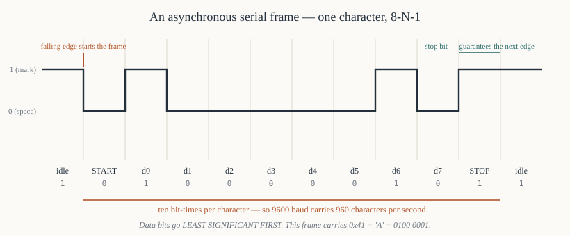
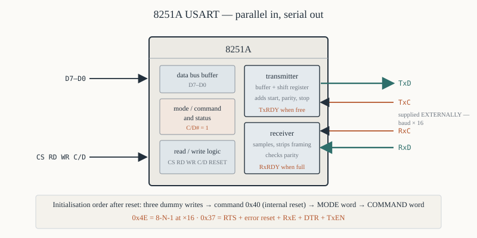
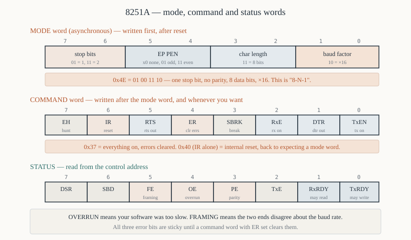

# Chapter 50 — The 8251A USART

[← 8259A interrupt controller](49-8259a-pic.md) · [Contents](README.md) · [Next: 8237 DMA controller →](51-8237-dma.md)

---

## Goal

Serial communication: sending a byte one bit at a time down a single wire. The 8251A handles the
shifting, the framing, the timing and the error detection. Cover the mode and command words, baud
rate generation, polled and interrupt-driven operation, and the RS-232 signals.

> **Does this run under DOSBox?** The 8251A programs assume a trainer board. §9 gives a version for
> the PC's 8250/16550 UART at `0x3F8`, which DOSBox emulates — though with nothing connected, you
> will see the loopback test rather than real traffic.

---

## 1. Why serial

**Parallel** sends eight bits at once on eight wires. Fast, but:

- eight wires plus a ground, plus handshaking — a thick, expensive cable;
- **skew** — the bits arrive at slightly different times, which limits the distance to a few metres;
- crosstalk between adjacent wires.

**Serial** sends one bit at a time on one wire. Slower per clock, but:

- two or three wires;
- no skew, so it works over hundreds of metres (and, with a modem, over a telephone line);
- the standard for terminals, modems, printers and instruments for forty years.

### 1.1 Asynchronous framing

There is no shared clock, so the receiver has to work out where each byte starts. The solution is a
**frame**:



```
   idle    start   d0  d1  d2  d3  d4  d5  d6  d7  parity  stop   idle
   ─────┐       ┌───┬───┬───┬───┬───┬───┬───┬───┬────────┬──────┬─────
        └───────┘   │   │   │   │   │   │   │   │        │      │
        │<─────── one character frame ──────────────────────────>│
```

- **The line idles high.**
- **The start bit is low**, and its falling edge tells the receiver a frame is beginning.
- **Data bits follow, least significant first.**
- **An optional parity bit.**
- **One or more stop bits, high**, guaranteeing a falling edge at the start of the next frame.

A frame carrying 8 data bits with no parity and 1 stop bit is 10 bits long, so **9600 baud gives 960
characters per second**.

---

## 2. The 8251A



### 2.1 Pins that matter

| Pin | Direction | Purpose |
|-----|-----------|---------|
| `D7`–`D0` | bidirectional | data bus |
| `C/D#` | in | 0 = data register, 1 = control/status |
| `RD#`, `WR#`, `CS#` | in | bus control |
| `CLK` | in | internal timing; at least 30× the baud rate |
| `RESET` | in | |
| `TxD` | out | **transmit data** |
| `RxD` | in | **receive data** |
| `TxC#` | in | transmit clock |
| `RxC#` | in | receive clock |
| `TxRDY` | out | the transmit buffer is empty — send more |
| `TxEMPTY` | out | the shift register is also empty |
| `RxRDY` | out | a character has been received |
| `DTR#`, `DSR#`, `RTS#`, `CTS#` | | modem control handshaking |

### 2.2 Two registers, one address bit

| `C/D#` | Write | Read |
|--------|-------|------|
| 0 | transmit data | receive data |
| 1 | mode / command word | status |

On a 16-bit 8086 bus with `C/D#` driven from system `A1`:

```asm
DATA    equ  0x00              ; C/D# = 0
CTRL    equ  0x02              ; C/D# = 1
```

---

## 3. Initialisation

**The order is fixed and the chip has no way to tell you it went wrong.**

```
   RESET
     │
     ▼
   MODE word          ("how the line is framed")
     │
     ▼
   [SYNC characters]  (only in synchronous mode)
     │
     ▼
   COMMAND word       ("start doing it")
     │
     ▼
   data transfer
```

After reset the chip expects a **mode** word. Everything written to the control address after that
is a **command** word, until another reset.

### 3.1 The mode word (asynchronous)



```
    7    6     5    4     3    2     1    0
  ┌──────────┬──────────┬──────────┬──────────┐
  │ stop bits│ EP   PEN │ char len │ baud rate│
  │  S2  S1  │          │  L2  L1  │  B2  B1  │
  └──────────┴──────────┴──────────┴──────────┘
```

**Bits 1–0: baud rate factor**

| `B2` | `B1` | Meaning |
|------|------|---------|
| 0 | 0 | **synchronous mode** |
| 0 | 1 | async, ×1 — the clock *is* the bit rate |
| 1 | 0 | async, **×16** |
| 1 | 1 | async, ×64 |

**Use ×16.** The receiver samples each bit sixteen times and takes the middle sample, which makes it
tolerant of clock mismatch. ×1 has no margin at all and is only for a clock recovered from the data.

**Bits 3–2: character length**

| `L2` | `L1` | Bits |
|------|------|------|
| 0 | 0 | 5 |
| 0 | 1 | 6 |
| 1 | 0 | 7 |
| 1 | 1 | **8** |

**Bits 5–4: parity**

| `EP` | `PEN` | Meaning |
|------|-------|---------|
| × | 0 | **no parity** |
| 0 | 1 | odd parity |
| 1 | 1 | even parity |

**Bits 7–6: stop bits**

| `S2` | `S1` | Stop bits |
|------|------|-----------|
| 0 | 0 | invalid |
| 0 | 1 | **1** |
| 1 | 0 | 1.5 |
| 1 | 1 | 2 |

### 3.2 The standard mode word

**8 data bits, no parity, 1 stop bit, ×16 clock:**

```
   01 00 11 10  =  0100 1110  =  0x4E
   ││ ││ ││ └┴── baud factor x16
   ││ ││ └┴───── 8 data bits
   ││ └┴──────── no parity
   └┴─────────── 1 stop bit
```

**`0x4E` is to the 8251A what `0x36` is to the 8253** — the one you will write nine times out of ten.
"8-N-1" in modern notation.

Other common ones:

| Mode word | Binary | Format |
|-----------|--------|--------|
| `0x4E` | `01 00 11 10` | 8-N-1, ×16 |
| `0xCE` | `11 00 11 10` | 8-N-2, ×16 |
| `0x5E` | `01 01 11 10` | 8-O-1, ×16 (odd parity) |
| `0x7E` | `01 11 11 10` | 8-E-1, ×16 (even parity) |
| `0x7A` | `01 11 10 10` | 7-E-1, ×16 (the classic teletype format) |
| `0xFA` | `11 11 10 10` | 7-E-2, ×16 |

Read each binary column left to right as **stop bits · parity · character length · baud factor**, and
you can build any of them without a table.

### 3.3 The command word

```
    7    6    5    4    3    2    1    0
  ┌────┬────┬────┬────┬────┬────┬────┬────┐
  │ EH │ IR │RTS │ ER │SBRK│RxE │DTR │TxEN│
  └────┴────┴────┴────┴────┴────┴────┴────┘
```

| Bit | Name | Meaning |
|-----|------|---------|
| 7 | `EH` | enter hunt mode (synchronous only) |
| 6 | `IR` | **internal reset** — return to expecting a mode word |
| 5 | `RTS` | assert `RTS#` |
| 4 | `ER` | **error reset** — clear the parity/overrun/framing flags |
| 3 | `SBRK` | send a break |
| 2 | `RxE` | **receive enable** |
| 1 | `DTR` | assert `DTR#` |
| 0 | `TxEN` | **transmit enable** |

**The standard command word: `0x37`** — `RTS`, `ER`, `RxE`, `DTR`, `TxEN`. Everything on, errors
cleared.

### 3.4 The initialisation sequence in code

```asm
; ---------------------------------------------------------------
; init_8251 — set up for 8-N-1 at the ×16 clock factor.
;
;   The chip's state after power-up is not reliably "expecting a
;   mode word", because it may be part-way through a previous
;   sequence. The cure is three dummy writes followed by an
;   internal reset, which puts it in a known state whatever it was
;   doing before.
; ---------------------------------------------------------------
init_8251:
        ; --- force a known state ---
        xor  al, al
        out  CTRL, al           ; three zero bytes are interpreted as
        call io_delay           ;   mode or sync characters, whatever
        out  CTRL, al           ;   state the chip was in
        call io_delay
        out  CTRL, al
        call io_delay

        mov  al, 0x40           ; command word with IR = 1: internal reset
        out  CTRL, al
        call io_delay

        ; --- now the chip is definitely expecting a MODE word ---
        mov  al, 0x4E           ; 8 data, no parity, 1 stop, x16
        out  CTRL, al
        call io_delay

        ; --- and now a COMMAND word ---
        mov  al, 0x37           ; RTS, error reset, RxE, DTR, TxEN
        out  CTRL, al
        ret

io_delay:
        jmp  short $+2
        jmp  short $+2
        ret
```

**The three-dummy-writes-then-reset dance is not optional** on real hardware. It is in every 8251A
driver ever written, and the reason is that the chip has no "what state are you in?" query.

---

## 4. The status register

Read from the control address:

```
    7     6    5    4    3     2      1     0
  ┌─────┬────┬────┬────┬────┬───────┬─────┬──────┐
  │ DSR │SBD │ FE │ OE │ PE │TxEMPTY│RxRDY│TxRDY │
  └─────┴────┴────┴────┴────┴───────┴─────┴──────┘
```

| Bit | Name | Meaning |
|-----|------|---------|
| 0 | `TxRDY` | **1 = the transmit buffer is empty — you may write** |
| 1 | `RxRDY` | **1 = a character has arrived — you may read** |
| 2 | `TxEMPTY` | the shift register is also empty; transmission is fully finished |
| 3 | `PE` | parity error |
| 4 | `OE` | **overrun error** — a character arrived before you read the last one |
| 5 | `FE` | **framing error** — the stop bit was not high |
| 6 | `SBD` | sync break detected |
| 7 | `DSR` | the state of the `DSR#` input |

### 4.1 The three errors and what they mean

**Parity error** — the received parity bit disagreed. One bit was corrupted, probably by noise.

**Overrun error** — you did not read the previous character before the next one arrived. **This is
a software fault, not a line fault**: your polling loop is too slow, or an interrupt handler is
blocking. It is the commonest serial bug.

**Framing error** — the stop bit was low when it should have been high. Almost always a **baud rate
mismatch**: if the two ends disagree, the receiver samples at the wrong times and the frame
boundary lands in the middle of a bit.

> A screenful of garbage with framing errors means the baud rates differ. A screenful of garbage
> *without* framing errors usually means the data bits or parity differ.

**Errors are sticky** — they stay set until cleared with a command word that has `ER` set:

```asm
        mov  al, 0x37           ; bit 4 (ER) resets the error flags
        out  CTRL, al
```

---

## 5. Baud rate

The 8251A does **not** generate its own baud rate. It needs `TxC#` and `RxC#` supplied externally,
and the mode word's factor relates that clock to the bit rate:

```
   baud rate  =  TxC frequency  ÷  baud factor
```

With the ×16 factor:

```
   TxC frequency  =  baud rate × 16
```

| Baud | `TxC` needed (×16) |
|------|-------------------|
| 300 | 4,800 Hz |
| 1,200 | 19,200 Hz |
| 2,400 | 38,400 Hz |
| 9,600 | 153,600 Hz |
| 19,200 | 307,200 Hz |

### 5.1 Generating it with an 8253

Chapter 48's timer in mode 3 is the standard source:

```asm
; Generate 153,600 Hz (9600 baud × 16) from a 1,843,200 Hz clock.
;   N = 1,843,200 / 153,600 = 12
        mov  al, 0x76           ; counter 1, LSB/MSB, mode 3, binary
        out  0x43, al
        mov  ax, 12
        out  0x41, al
        mov  al, ah
        out  0x41, al
```

### 5.2 Why 1.8432 MHz

That crystal frequency appears on every serial board, and the reason is arithmetic:

```
   1,843,200  ÷  16  =  115,200
   115,200  ÷  1   = 115200 baud
            ÷  2   =  57600
            ÷  6   =  19200
            ÷ 12   =   9600
            ÷ 48   =   2400
            ÷ 384  =    300
```

**Every standard baud rate is an exact integer division.** A round number like 2 MHz gives
fractional divisors and a rate error that accumulates across a frame until the stop bit is sampled
in the wrong place.

Chapter 12 §8 makes the same point about the SDK-86's 14.7456 MHz crystal — which is 1.8432 × 8.

### 5.3 How much error is tolerable

The receiver samples the stop bit 9.5 bit-times after the start edge. A cumulative error of half a
bit — about **5%** — puts that sample in the wrong bit. In practice keep the total error under 2%,
since both ends contribute.

---

## 6. Polled transmit and receive

```asm
; ---------------------------------------------------------------
; putc_serial — send AL. Waits for the transmitter to be free.
;   Destroys: nothing
; ---------------------------------------------------------------
putc_serial:
        push ax
        mov  ah, al             ; keep the character
.wait:
        in   al, CTRL           ; read the status
        test al, 0x01           ; TxRDY?
        jz   .wait              ;   not yet
        mov  al, ah
        out  DATA, al           ; send it
        pop  ax
        ret

; ---------------------------------------------------------------
; getc_serial — wait for and return a character in AL.
;   Out:  AL = the character, AH = the status byte (so the caller
;         can check for errors)
; ---------------------------------------------------------------
getc_serial:
.wait:
        in   al, CTRL
        test al, 0x02           ; RxRDY?
        jz   .wait
        mov  ah, al             ; keep the status
        in   al, DATA           ; read the character
        ret

; ---------------------------------------------------------------
; getc_ready — has a character arrived? Does NOT wait.
;   Out:  ZF = 1 if nothing waiting
; ---------------------------------------------------------------
getc_ready:
        in   al, CTRL
        test al, 0x02
        ret
```

**Always test `TxRDY` before writing.** Writing while the buffer is full overwrites the pending
character and it is lost silently.

**Always test `RxRDY` before reading.** Reading when nothing has arrived returns the previous
character again.

---

## 7. Worked program — a serial echo terminal

```asm
; serecho.asm — a simple serial terminal
; nasm -f bin serecho.asm -o serecho.com
;
; Characters typed on the keyboard go out of the serial port;
; characters arriving on the serial port appear on the screen.
; Esc quits.
;
; Hardware: 8251A at ports 0x00 (data) and 0x02 (control),
;           8253 counter 1 supplying TxC/RxC at baud × 16.
        cpu  8086
        org  0x100
%include "macros.inc"

DATA    equ  0x00
CTRL    equ  0x02
T_CTRL  equ  0x43
T_CNT1  equ  0x41

start:
        call init_baud
        call init_8251

        print banner

.loop:
        ; --- anything arrived on the serial line? ---
        in   al, CTRL
        test al, 0x02           ; RxRDY
        jz   .check_errors
        in   al, DATA
        mov  dl, al
        mov  ah, 0x02
        int  0x21               ; show it

.check_errors:
        in   al, CTRL
        test al, 0x38           ; PE | OE | FE
        jz   .check_key
        call report_error

.check_key:
        ; --- anything typed? ---
        mov  ah, 0x0B           ; DOS: check the keyboard, no wait
        int  0x21
        or   al, al
        jz   .loop

        mov  ah, 0x08           ; read it, no echo
        int  0x21
        cmp  al, 27             ; Esc?
        je   .done

        call putc_serial
        jmp  .loop

.done:
        print byemsg
        exit 0

; ---------------------------------------------------------------
; init_baud — 8253 counter 1, mode 3, for 9600 baud × 16
;             from a 1.8432 MHz input.
; ---------------------------------------------------------------
init_baud:
        mov  al, 0x76           ; counter 1, LSB/MSB, mode 3, binary
        out  T_CTRL, al
        mov  ax, 12             ; 1,843,200 / 153,600
        out  T_CNT1, al
        mov  al, ah
        out  T_CNT1, al
        ret

; ---------------------------------------------------------------
init_8251:
        xor  al, al
        out  CTRL, al
        call io_delay
        out  CTRL, al
        call io_delay
        out  CTRL, al
        call io_delay
        mov  al, 0x40           ; internal reset
        out  CTRL, al
        call io_delay
        mov  al, 0x4E           ; mode: 8-N-1, x16
        out  CTRL, al
        call io_delay
        mov  al, 0x37           ; command: RTS, ER, RxE, DTR, TxEN
        out  CTRL, al
        ret

; ---------------------------------------------------------------
putc_serial:
        push ax
        mov  ah, al
.wait:
        in   al, CTRL
        test al, 0x01           ; TxRDY
        jz   .wait
        mov  al, ah
        out  DATA, al
        pop  ax
        ret

; ---------------------------------------------------------------
; report_error — print which error, then clear it.
; ---------------------------------------------------------------
report_error:
        push ax
        push dx
        mov  ah, al             ; keep the status

        test ah, 0x08
        jz   .not_pe
        print pemsg
.not_pe:
        test ah, 0x10
        jz   .not_oe
        print oemsg
.not_oe:
        test ah, 0x20
        jz   .not_fe
        print femsg
.not_fe:
        mov  al, 0x37           ; a command word with ER set clears them
        out  CTRL, al
        pop  dx
        pop  ax
        ret

io_delay:
        jmp  short $+2
        jmp  short $+2
        ret

banner:  db  '8251A terminal — 9600 8-N-1. Esc to quit.', 0x0D, 0x0A, '$'
byemsg:  db  0x0D, 0x0A, 'Closed.', 0x0D, 0x0A, '$'
pemsg:   db  '[parity]$'
oemsg:   db  '[overrun]$'
femsg:   db  '[framing]$'
```

### Explanation

**The main loop polls three things**: the serial receiver, the error flags and the keyboard. Nothing
blocks, so characters arriving while you type are not lost.

**`test al, 0x38`** tests all three error bits at once — `PE`, `OE` and `FE` are bits 3, 4 and 5, so
the mask is `0011 1000` (Chapter 25 §6.2).

**An overrun here means the loop is too slow.** At 9600 baud a character arrives every 1.04 ms. The
loop must complete in less than that, and `INT 21h` function 02h takes hundreds of microseconds —
so it is marginal. §8 fixes it properly.

---

## 8. Interrupt-driven receive

Polling wastes the processor and loses characters. The right design uses `RxRDY` as an interrupt and
a circular buffer.

```asm
; ---------------------------------------------------------------
; A circular receive buffer, filled by the interrupt handler and
; emptied by the foreground.
;
;   head = where the handler writes
;   tail = where the foreground reads
;   empty when head == tail
;   full  when (head+1) mod SIZE == tail   (one slot always unused)
; ---------------------------------------------------------------
BUFSIZE equ  256                ; a power of two, so masking replaces division

rxbuf:  times BUFSIZE db 0
rxhead: dw   0
rxtail: dw   0
rxlost: dw   0                  ; count of characters dropped

; ---------------------------------------------------------------
; rx_handler — called when the 8251A asserts RxRDY.
; ---------------------------------------------------------------
rx_handler:
        push ax
        push bx
        push ds
        push cs
        pop  ds

        in   al, DATA           ; read the character — this clears RxRDY

        mov  bx, [rxhead]
        inc  bx
        and  bx, BUFSIZE - 1    ; wrap, because BUFSIZE is a power of two
        cmp  bx, [rxtail]
        je   .full              ; no room — drop it

        xchg bx, [rxhead]       ; BX = the old head, rxhead = the new one
        mov  [rxbuf + bx], al
        jmp  .done
.full:
        inc  word [rxlost]
.done:
        mov  al, 0x20           ; EOI to the 8259A
        out  0x20, al
        pop  ds
        pop  bx
        pop  ax
        iret

; ---------------------------------------------------------------
; buf_getc — take a character from the buffer.
;   Out:  CF = 0 and AL = the character, or CF = 1 if empty
; ---------------------------------------------------------------
buf_getc:
        push bx
        cli                     ; the handler must not change head mid-test
        mov  bx, [rxtail]
        cmp  bx, [rxhead]
        je   .empty
        mov  al, [rxbuf + bx]
        inc  bx
        and  bx, BUFSIZE - 1
        mov  [rxtail], bx
        sti
        clc
        pop  bx
        ret
.empty:
        sti
        stc
        pop  bx
        ret
```

### Explanation

**`and bx, BUFSIZE-1` replaces a division.** With `BUFSIZE` = 256 that is `and bx, 255`, three
clocks instead of `DIV`'s 144. **This is why circular buffers are always a power of two.**

**One slot is always left unused**, so that "head == tail" unambiguously means empty. The
alternative — a separate count — needs to be updated atomically by both the handler and the
foreground, which is harder to get right.

**`CLI` around the head/tail comparison** in `buf_getc`, because the handler can change `rxhead`
between the `mov` and the `cmp` (Chapter 30 §4.2).

**Dropped characters are counted**, not silently ignored. A non-zero `rxlost` tells you the
foreground is too slow.

---

## 9. The PC's UART

The IBM PC uses an **8250** (later a 16450, then a 16550 with a FIFO) rather than an 8251A. The
concepts are identical; the register layout differs.

| Port | Register |
|------|----------|
| `0x3F8` | data (read = receive, write = transmit) |
| `0x3F8` | divisor low byte, when `DLAB` = 1 |
| `0x3F9` | interrupt enable — or divisor high byte, when `DLAB` = 1 |
| `0x3FA` | interrupt identification |
| `0x3FB` | **line control** (includes `DLAB`, bit 7) |
| `0x3FC` | modem control |
| `0x3FD` | **line status** |
| `0x3FE` | modem status |

**The 8250 generates its own baud rate** from a divisor, which is its main improvement over the
8251A:

```
   divisor  =  115200  ÷  baud rate
```

```asm
; ---------------------------------------------------------------
; init_com1 — 9600 baud, 8-N-1, on the PC's COM1.
; ---------------------------------------------------------------
COM1    equ  0x3F8

init_com1:
        ; --- set DLAB to reach the divisor registers ---
        mov  dx, COM1 + 3       ; line control
        mov  al, 0x80           ; DLAB = 1
        out  dx, al

        mov  dx, COM1           ; divisor low
        mov  al, 12             ; 115200 / 9600 = 12
        out  dx, al
        mov  dx, COM1 + 1       ; divisor high
        xor  al, al
        out  dx, al

        ; --- clear DLAB and set the format ---
        mov  dx, COM1 + 3
        mov  al, 0x03           ; 8 data bits, no parity, 1 stop
        out  dx, al

        ; --- no interrupts, polled operation ---
        mov  dx, COM1 + 1
        xor  al, al
        out  dx, al

        ; --- DTR and RTS on ---
        mov  dx, COM1 + 4
        mov  al, 0x03
        out  dx, al
        ret

; ---------------------------------------------------------------
; putc_com1 — send AL.
; ---------------------------------------------------------------
putc_com1:
        push ax
        push dx
        mov  ah, al
        mov  dx, COM1 + 5       ; line status
.wait:
        in   al, dx
        test al, 0x20           ; transmitter holding register empty
        jz   .wait
        mov  dx, COM1
        mov  al, ah
        out  dx, al
        pop  dx
        pop  ax
        ret

; ---------------------------------------------------------------
; getc_com1 — CF = 0 and AL = a character, or CF = 1 if none.
; ---------------------------------------------------------------
getc_com1:
        push dx
        mov  dx, COM1 + 5
        in   al, dx
        test al, 0x01           ; data ready
        jz   .none
        mov  dx, COM1
        in   al, dx
        pop  dx
        clc
        ret
.none:
        pop  dx
        stc
        ret
```

**`DLAB` — the Divisor Latch Access Bit.** Setting bit 7 of the line control register makes ports
`0x3F8` and `0x3F9` address the divisor instead of the data and interrupt-enable registers. Forgetting
to clear it afterwards means every subsequent write goes to the divisor, and nothing is transmitted
— a classic and baffling failure.

---

## 10. RS-232 in brief

The electrical standard the 8251A's logic-level `TxD`/`RxD` are converted to, by a level shifter such
as the MAX232.

| Logic | RS-232 voltage |
|-------|---------------|
| 1 (mark) | **−3 V to −15 V** |
| 0 (space) | **+3 V to +15 V** |

**The polarity is inverted and the levels are bipolar.** That is what gives RS-232 its noise
immunity and its range — and why you cannot connect a TTL serial pin directly to a PC's serial port.

### 10.1 The signals

| Pin (DB-9) | Signal | Direction (from the PC) |
|-----------|--------|------------------------|
| 2 | `RxD` | in |
| 3 | `TxD` | out |
| 5 | `GND` | — |
| 7 | `RTS` | out |
| 8 | `CTS` | in |
| 4 | `DTR` | out |
| 6 | `DSR` | in |
| 1 | `DCD` | in |
| 9 | `RI` | in |

**A three-wire connection — `TxD`, `RxD`, `GND` — is enough** for most purposes, with the handshake
lines looped back at each end.

### 10.2 The null modem

To connect two computers rather than a computer and a modem, the transmit and receive lines must
cross:

```
   2 RxD  ────┐  ┌──── 2 RxD
              ╳
   3 TxD  ────┘  └──── 3 TxD
   5 GND  ──────────── 5 GND
   7 RTS  ────┐  ┌──── 7 RTS
              ╳
   8 CTS  ────┘  └──── 8 CTS
   4 DTR  ────┐  ┌──── 4 DTR
              ╳
   6 DSR  ────┘  └──── 6 DSR
```

### 10.3 A loopback test

Connect pin 2 to pin 3 on one connector. Everything sent comes straight back. If the loopback works
and real communication does not, the fault is in the cable or the other end — not your software.

```asm
; loopback test
        mov  al, 'U'            ; 0x55 = 01010101, a good test pattern
        call putc_com1
        call delay_short
        call getc_com1
        jc   .no_response
        cmp  al, 'U'
        je   .passed
```

`'U'` (`0x55`) is the conventional test byte because it alternates bits, so any stuck or shorted line
shows up immediately.

---

## 11. Summary

```
  asynchronous frame:  idle high · START low · 8 data bits LSB FIRST ·
                       optional parity · STOP high
  10 bits per byte at 8-N-1, so 9600 baud = 960 characters/second

  8251A: two registers selected by C/D#
     C/D# = 0   data (read = receive, write = transmit)
     C/D# = 1   write mode/command, read status

  INITIALISATION: three dummy writes, then command 0x40 (internal reset),
                  then the MODE word, then the COMMAND word

  MODE word  0x4E = 8 data, no parity, 1 stop, x16 clock   (8-N-1)
     bits 1-0 baud factor 01 = x1, 10 = x16, 11 = x64, 00 = synchronous
     bits 3-2 char length 11 = 8 bits
     bits 5-4 parity      x0 = none, 01 = odd, 11 = even
     bits 7-6 stop bits   01 = 1, 11 = 2

  COMMAND word 0x37 = RTS + error reset + RxE + DTR + TxEN
     bit 6 = internal reset, bit 4 = clear the error flags

  STATUS: bit 0 TxRDY · bit 1 RxRDY · bit 2 TxEMPTY
          bit 3 parity · bit 4 OVERRUN · bit 5 framing
     overrun = YOUR software was too slow
     framing = the baud rates do not match
     errors are sticky until cleared with a command word

  baud rate is supplied EXTERNALLY:  TxC = baud x 16
     1.8432 MHz divides exactly to every standard rate — that is why it exists
     keep the total rate error under about 2%

  PC UART (8250) at 0x3F8: generates its own baud rate, divisor = 115200 / baud,
     reached by setting DLAB (bit 7 of the line control register at 0x3FB)

  RS-232: logic 1 = −3..−15 V, logic 0 = +3..+15 V — inverted and bipolar
  null modem crosses TxD/RxD, RTS/CTS and DTR/DSR
  loopback test: join pins 2 and 3, send 0x55
```

---

## Exercises

**50.1** How many bits are in a frame carrying 7 data bits, even parity and 2 stop bits? How many
characters per second does that give at 1200 baud?

**50.2** Give the 8251A mode word for 7 data bits, even parity, 2 stop bits, ×16.

**50.3** Decode the mode word `0xCE`.

**50.4** Why is the ×16 baud factor preferred over ×1?

**50.5** Write the complete initialisation sequence for 8-N-1, explaining why the three dummy writes
are needed.

**50.6** What `TxC` frequency is needed for 4800 baud at the ×16 factor?

**50.7** An 8253 with a 1.8432 MHz input is to supply 2400 baud × 16. What value of N?

**50.8** Why is 1.8432 MHz the standard serial crystal frequency? Show two divisions.

**50.9** Distinguish parity, overrun and framing errors. Which one indicates a software problem, and
why?

**50.10** A terminal shows garbage with framing errors set. What is the most likely cause?

**50.11** Write a routine that sends a zero-terminated string out of the serial port.

**50.12** Why must `TxRDY` be tested before writing to the data register?

**50.13** In the circular buffer of §8, why is `BUFSIZE` a power of two, and why is one slot left
unused?

**50.14** Why is `CLI` needed in `buf_getc` but not in the interrupt handler?

**50.15** What is `DLAB` on the PC's 8250, and what goes wrong if it is left set?

**50.16** Draw the wiring for a null-modem cable and explain why `TxD` and `RxD` must cross.

Answers in [Appendix H](H-exercise-solutions.md#chapter-50).

---

[← 8259A interrupt controller](49-8259a-pic.md) · [Contents](README.md) · [Next: 8237 DMA controller →](51-8237-dma.md)
