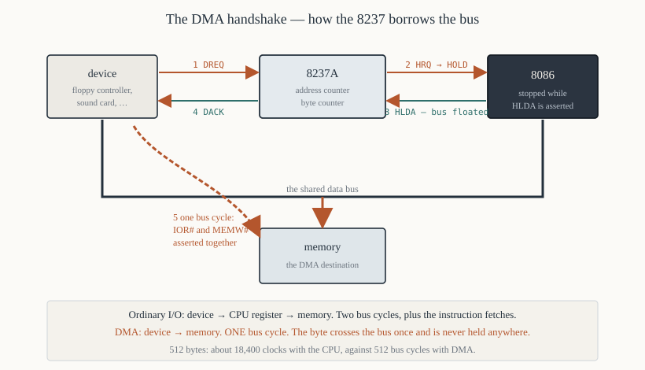

# Chapter 51 — The 8237A DMA controller

[← 8251A USART](50-8251a-usart.md) · [Contents](README.md) · [Next: ADC and DAC →](52-adc-dac.md)

---

## Goal

Direct Memory Access: moving data between a device and memory **without the processor touching it**.
The 8237A takes the bus from the 8086, performs the transfer itself, and hands it back.

> **Does this run under DOSBox?** The register descriptions apply, and DOSBox emulates the PC's 8237
> well enough for floppy emulation, but programming it directly from a DOS program is not something
> DOSBox supports usefully. Treat this chapter as paper-and-hardware.

---

## 1. Why DMA

Moving 512 bytes from a disk controller to memory with the processor:

```asm
        mov  cx, 512
        mov  di, buffer
        mov  dx, DATA_PORT
.next:
        in   al, dx             ; 8 clocks + a bus cycle
        stosb                   ; 11 clocks + a bus cycle
        loop .next              ; 17 clocks
                                ; ≈ 36 clocks and TWO bus cycles per byte
```

512 × 36 = **18,432 clocks**, and the processor can do nothing else.

With DMA, the same transfer costs **512 bus cycles** — about 2,048 clocks of *bus* time — and the
processor continues executing from its prefetch queue for much of it.

The saving comes from removing the middle step. Ordinary I/O is:

```
   device  →  CPU register  →  memory        two bus cycles
```

DMA is:

```
   device  →  memory                          one bus cycle
```

The 8237A asserts the device's read strobe and memory's write strobe **simultaneously**, so the
byte crosses the data bus once and is never held anywhere.

---

## 2. The bus handshake



```
   1. the device asserts DREQn to the 8237A
   2. the 8237A asserts HRQ  ──► the 8086's HOLD pin
   3. the 8086 finishes the current bus cycle, FLOATS its bus pins,
      and asserts HLDA
   4. the 8237A now owns the bus. It drives the address and the
      control lines, and asserts DACKn to the device
   5. transfer: MEMW# and IOR# asserted together (or MEMR# and IOW#)
   6. when finished, the 8237A releases HRQ
   7. the 8086 drops HLDA and resumes
```

**The 8086 is completely stopped between steps 3 and 6** — it cannot even prefetch, because it has
no bus. That is the cost.

In maximum mode the handshake uses `RQ/GT0#`/`RQ/GT1#` instead (Chapter 15 §5), but the principle is
identical.

---

## 3. The transfer modes

| Mode | Behaviour | Use |
|------|-----------|-----|
| **Single** (cycle stealing) | one byte per bus acquisition; `HRQ` released after each | the usual choice — the CPU gets the bus back between bytes |
| **Block** | the whole count transferred in one acquisition | fastest, but the CPU is frozen throughout |
| **Demand** | transfers continue while `DREQ` stays asserted | a device that can signal "I have more" |
| **Cascade** | this channel is another 8237 | chaining controllers |

**Single mode is right for nearly everything.** Block mode locks out interrupts for the whole
transfer, so a 64 KiB block at 5 MHz would freeze the machine for 50 ms and lose timer ticks.

### 3.1 The three transfer directions

| Direction | Signals asserted | Meaning |
|-----------|-----------------|---------|
| **Write** | `IOR#` + `MEMW#` | device → memory (a disk read) |
| **Read** | `MEMR#` + `IOW#` | memory → device (a disk write) |
| **Verify** | neither | addresses are generated but no data moves — used for testing |

**The names are from the memory's point of view**, which is the opposite of what you expect: a DMA
"write" fills memory *from* a device.

---

## 4. The registers

Four channels, each with its own address and count.

### 4.1 Per-channel registers

| Channel | Address register | Count register |
|---------|-----------------|----------------|
| 0 | `0x00` | `0x01` |
| 1 | `0x02` | `0x03` |
| 2 | `0x04` | `0x05` |
| 3 | `0x06` | `0x07` |

Each is 16 bits accessed through an 8-bit port, **low byte then high byte**, with an internal
flip-flop tracking which is next — exactly like the 8253 (Chapter 48 §2.2).

**Clear the flip-flop before writing a pair**, by writing anything to port `0x0C`:

```asm
        out  0x0C, al           ; clear the byte pointer flip-flop
        mov  al, bl
        out  0x04, al           ; low byte of channel 2's address
        mov  al, bh
        out  0x04, al           ; high byte
```

**Forgetting this is the classic 8237 bug**: if the flip-flop happens to be in the wrong state, the
bytes land the wrong way round and the transfer goes to an address 256 times too far away.

### 4.2 Control registers

| Port | Write | Read |
|------|-------|------|
| `0x08` | command register | status register |
| `0x09` | request register | — |
| `0x0A` | single mask register | — |
| `0x0B` | mode register | — |
| `0x0C` | clear byte-pointer flip-flop | — |
| `0x0D` | master clear | temporary register |
| `0x0E` | clear mask register | — |
| `0x0F` | all-mask register | — |

### 4.3 The mode register (`0x0B`)

```
    7   6    5    4    3   2    1   0
  ┌────────┬────┬────┬────────┬────────┐
  │  mode  │DEC │AUTO│ xfer   │channel │
  └────────┴────┴────┴────────┴────────┘
```

| Bits | Field | Values |
|------|-------|--------|
| 7–6 | mode | `00` demand, `01` **single**, `10` block, `11` cascade |
| 5 | address direction | 0 = **increment**, 1 = decrement |
| 4 | auto-initialise | 1 = reload the address and count automatically at the end |
| 3–2 | transfer type | `00` verify, `01` **write** (to memory), `10` **read** (from memory) |
| 1–0 | channel | 0–3 |

**Channel 2, single mode, increment, no auto-init, write to memory:**

```
   01 0 0 01 10  =  0100 0110  =  0x46
```

`0x46` is what a floppy driver writes before reading a sector. `0x4A` (transfer type `10`) is what it
writes before writing one.

### 4.4 The single mask register (`0x0A`)

```asm
        mov  al, 0000_0110b     ; bit 2 = 1 (mask), bits 1-0 = channel 2
        out  0x0A, al           ; disable channel 2

        mov  al, 0000_0010b     ; bit 2 = 0 (unmask), channel 2
        out  0x0A, al           ; enable channel 2
```

**Mask the channel before programming it** and unmask it afterwards. A `DREQ` arriving mid-setup
would start a transfer with half-written registers.

---

## 5. The page registers — reaching 1 MiB

The 8237A is an 8-bit-era chip with a **16-bit** address counter. That reaches only 64 KiB.

The IBM PC's solution: an external latch per channel supplying address bits `A19`–`A16`.

| Channel | Page register port |
|---------|-------------------|
| 0 | `0x87` |
| 1 | `0x83` |
| 2 | **`0x81`** |
| 3 | `0x82` |

```asm
; Set up a transfer to physical address 0x2A400
        mov  al, 0x02           ; the page = bits 19-16
        out  0x81, al           ; channel 2's page register
        ; then the 8237's own address register gets 0xA400
```

### 5.1 The 64 KiB boundary rule

**The page register is not part of the counter.** When the 8237's 16-bit address wraps from `0xFFFF`
to `0x0000`, the page register does **not** increment — so the transfer jumps back to the start of
the same 64 KiB page and overwrites what it just wrote.

**A DMA buffer must not cross a 64 KiB physical boundary.**

```asm
; ---------------------------------------------------------------
; dma_check — does a buffer cross a 64 KiB boundary?
;   In:   ES:BX = the buffer, CX = its length
;   Out:  CF = 1 if it crosses
; ---------------------------------------------------------------
dma_check:
        push ax
        push dx
        ; physical = ES × 16 + BX
        mov  ax, es
        mov  dx, ax
        mov  cl, 4
        shl  ax, cl             ; the low 16 bits of ES × 16
        add  ax, bx             ; AX = the low 16 bits of the physical address
        ; if AX + length overflows 16 bits, we cross a page boundary
        add  ax, cx
        jc   .crosses
        clc
        jmp  .out
.crosses:
        stc
.out:
        pop  dx
        pop  ax
        ret
```

Every DOS disk driver contains this check, and when it fails it copies through a "bounce buffer"
that is known not to cross.

---

## 6. Programming a transfer

```asm
; ---------------------------------------------------------------
; dma_setup — prepare channel 2 to receive `count` bytes from a
;             device into the buffer at ES:BX.
;
;   This is the sequence a floppy driver uses for a sector read.
; ---------------------------------------------------------------
dma_setup:
        pushf
        cli                     ; the whole sequence must be atomic

        ; --- 1. mask the channel ---
        mov  al, 0000_0110b     ; mask channel 2
        out  0x0A, al

        ; --- 2. clear the byte-pointer flip-flop ---
        out  0x0C, al           ; the value written does not matter

        ; --- 3. set the mode ---
        mov  al, 0x46           ; single, increment, no auto-init,
        out  0x0B, al           ;   write to memory, channel 2

        ; --- 4. compute the 20-bit physical address ---
        mov  ax, es
        mov  dx, ax
        mov  cl, 4
        shl  ax, cl             ; low 16 bits of ES × 16
        shr  dx, cl             ; DX = the top 4 bits -> the page
        add  ax, bx
        adc  dx, 0              ; carry into the page

        ; --- 5. write the address, low byte first ---
        out  0x04, al
        mov  al, ah
        out  0x04, al

        ; --- 6. write the page ---
        mov  al, dl
        out  0x81, al

        ; --- 7. write the count, MINUS ONE ---
        mov  ax, [count]
        dec  ax                 ; the 8237 transfers count + 1 bytes
        out  0x05, al
        mov  al, ah
        out  0x05, al

        ; --- 8. unmask ---
        mov  al, 0000_0010b
        out  0x0A, al

        popf
        ret

count:  dw   512
```

### 6.1 The two details that catch everyone

**The count is one less than the number of bytes.** The 8237 transfers `count + 1` bytes and signals
terminal count when the counter underflows from 0 to `0xFFFF`. Programming 512 transfers 513 bytes
and corrupts the byte after your buffer.

**The address is physical, not segmented.** `ES:BX` must be converted, and the top four bits go to
the page register separately. The `shl`/`shr` pair extracts both halves of `ES × 16` — `shl ax, cl`
gives the low 16 bits and `shr dx, cl` the top four.

---

## 7. The PC's DMA channels

| Channel | Width | Use |
|---------|-------|-----|
| **0** | 8-bit | **DRAM refresh** (on the XT) — never reprogram |
| 1 | 8-bit | available (often a sound card) |
| **2** | 8-bit | **floppy disk controller** |
| 3 | 8-bit | available (often the hard disk on an XT) |
| 4 | — | cascade to the second controller (AT) |
| 5–7 | 16-bit | available (AT) |

**Channel 0 on an XT drives DRAM refresh**, triggered by 8253 counter 1 (Chapter 48 §9). Touching
either one destroys memory within milliseconds.

On the AT, refresh moved to dedicated hardware and channel 0 became available — but the timer's
counter 1 is still reserved.

### 7.1 Why 16-bit channels count words

Channels 5–7 on an AT transfer 16 bits at a time, and their **address and count registers are in
units of words, not bytes**. The address register holds `physical_address / 2`, and the count holds
`bytes / 2 − 1`. Getting this wrong halves or doubles everything.

---

## 8. Auto-initialise

With bit 4 of the mode register set, the 8237 reloads the address and count from internal base
registers when the transfer completes, and starts again.

**Use:** a continuously running transfer — sound playback from a circular buffer, a video capture
card. The device keeps requesting; the controller keeps cycling through the same buffer; software
refills the half the hardware is not currently reading.

Without auto-init, software must reprogram the channel after every buffer, and the gap between
buffers produces an audible click.

---

## 9. Reading the status

```asm
        in   al, 0x08           ; the status register
```

```
    7   6   5   4   3   2   1   0
  ┌───────────────┬───────────────┐
  │  DREQ 3-0     │   TC 3-0      │
  └───────────────┴───────────────┘
```

Bits 3–0: **terminal count reached** on each channel — set when the transfer finished, and
**cleared by reading the register**.

Bits 7–4: the current state of each `DREQ` input.

```asm
; Wait for channel 2's transfer to finish
.wait:
        in   al, 0x08
        test al, 0x04           ; TC for channel 2
        jz   .wait
```

**The TC bits are cleared on read**, so read the status once and keep the value — reading twice loses
the flags.

---

## 10. A complete picture — a floppy sector read

The sequence a DOS disk driver performs, showing where each chapter's chip fits:

```
   1. Software programs the 8237 (this chapter):
        channel 2, single mode, write to memory,
        address and page = the buffer, count = 511

   2. Software programs the floppy controller: "read cylinder C,
      head H, sector S"

   3. The FDC reads the sector from the disk surface and, for each
      byte, asserts DREQ2

   4. The 8237 asserts HRQ; the 8086 floats its bus and asserts HLDA
      (Chapter 11 §8.8)

   5. The 8237 drives the address, asserts DACK2 and IOR# + MEMW#.
      The byte goes from the FDC straight into memory.

   6. Steps 3-5 repeat 512 times, the 8086 running between them

   7. The count underflows; the 8237 asserts TC

   8. The FDC raises IRQ6, which the 8259A turns into INT 0Eh
      (Chapter 49 §6.1)

   9. The interrupt handler checks the FDC status, sends an EOI,
      and sets a flag the foreground is waiting on
```

**Four chips, three chapters, one disk read.** That sequence is the point of Part V.

---

## 11. Summary

```
  DMA moves data device <-> memory in ONE bus cycle, not two,
  by asserting IOR# and MEMW# (or MEMR# and IOW#) simultaneously

  handshake:  DREQ -> HRQ -> the 8086's HOLD -> HLDA -> the 8237 owns the bus
              the 8086 is completely stopped while HLDA is asserted

  modes:  single (cycle stealing) — one byte per acquisition, USE THIS
          block — the whole count at once; freezes the machine
          demand — while DREQ stays asserted
          cascade — another 8237

  direction names are from MEMORY's point of view:
     WRITE = device -> memory (a disk READ)
     READ  = memory -> device (a disk WRITE)

  MODE REGISTER (0x0B):
     7-6 mode · 5 decrement · 4 auto-init · 3-2 type · 1-0 channel
     0x46 = channel 2, single, increment, write to memory

  programming order: mask · clear the flip-flop (0x0C) · mode ·
                     address low/high · page · COUNT MINUS ONE low/high · unmask

  THE COUNT IS ONE LESS than the number of bytes
  the page register does NOT increment, so a buffer must not cross
     a 64 KiB physical boundary
  clear the byte-pointer flip-flop before every 16-bit register pair

  PC channels: 0 = DRAM refresh on an XT (never touch) · 2 = floppy
  status register 0x08: bits 3-0 = terminal count, CLEARED ON READ
```

---

## Exercises

**51.1** Compute the clock cost of moving 512 bytes from a port to memory with `IN`/`STOSB`/`LOOP`,
and compare with the bus cycles a DMA transfer needs.

**51.2** List, in order, the seven steps of the DMA bus handshake.

**51.3** Why can the 8086 not prefetch while `HLDA` is asserted?

**51.4** What is the difference between single and block mode, and why is single mode almost always
the right choice?

**51.5** A DMA "write" transfer moves data in which direction? Explain the naming.

**51.6** Give the mode register value for channel 3, single mode, address increment, auto-initialise,
reading from memory.

**51.7** Decode the mode byte `0x58`.

**51.8** Why must the byte-pointer flip-flop be cleared before writing an address? What is the
symptom if you forget?

**51.9** A transfer of 1024 bytes is wanted. What value goes in the count register?

**51.10** A buffer is at physical `0x1FF00` and is 512 bytes long. Does it cross a 64 KiB boundary?
What happens if you DMA into it anyway?

**51.11** Write the code that computes the 20-bit physical address and the page value from `ES:BX`.

**51.12** Why does channel 0 on an XT need to be left alone?

**51.13** Explain auto-initialise mode and give an application that needs it.

**51.14** The status register's TC bits are cleared on read. Write code that checks channels 2 and 3
in one pass.

**51.15** Write out the complete sequence of events, naming every chip involved, for reading one
floppy sector into memory.

Answers in [Appendix H](H-exercise-solutions.md#chapter-51).

---

[← 8251A USART](50-8251a-usart.md) · [Contents](README.md) · [Next: ADC and DAC →](52-adc-dac.md)
