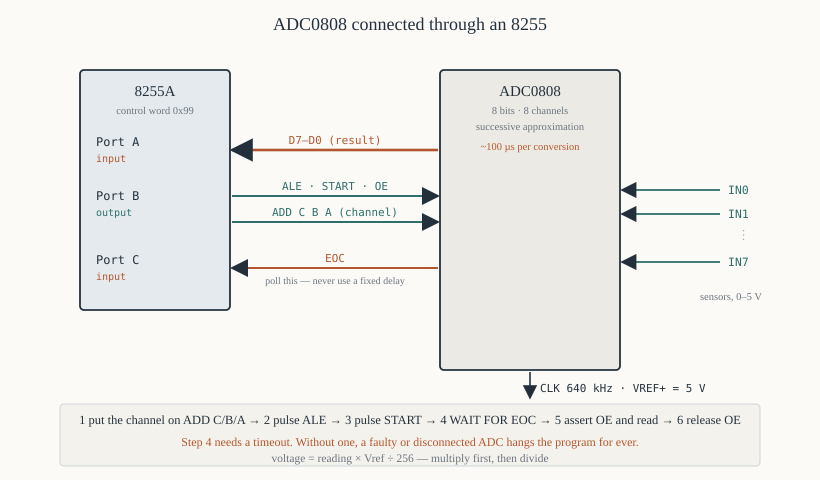

# Chapter 52 — ADC and DAC interfacing

[← 8237 DMA controller](51-8237-dma.md) · [Contents](README.md) · [Next: Motors, displays and the 8279 →](53-stepper-seven-segment-8279.md)

---

## Goal

Connecting a microprocessor to the analogue world: reading a voltage with an ADC0808 and producing
one with a DAC0800. Sampling theory in brief, the interfacing circuits, and complete programs for a
voltmeter, a waveform generator and a data logger.

> **Does this run under DOSBox?** No. These need real hardware or a trainer board. The programs are
> written for an 8255 at ports `0x00`–`0x06` (Chapter 47).

---

## 1. The two conversions

**ADC — Analogue to Digital Converter.** Measures a voltage and produces a number.

**DAC — Digital to Analogue Converter.** Takes a number and produces a voltage.

```
   sensor  →  ADC  →  8086  →  DAC  →  actuator
   (volts)    (bits)          (bits)   (volts)
```

Thermometers, microphones, light sensors and potentiometers need an ADC. Motors, speakers, meters
and anything that wants a variable voltage need a DAC.

---

## 2. Resolution, range and quantisation

An *n*-bit converter divides its input range into 2ⁿ steps.

```
   step size (the "LSB")  =  full-scale range  ÷  2ⁿ
```

| Bits | Steps | Step size over 0–5 V |
|------|-------|---------------------|
| 8 | 256 | **19.5 mV** |
| 10 | 1,024 | 4.88 mV |
| 12 | 4,096 | 1.22 mV |
| 16 | 65,536 | 76 µV |

**An 8-bit ADC cannot distinguish 2.000 V from 2.015 V.** That is not a fault; it is the resolution.
Quoting a reading to more precision than the step size is meaningless.

### 2.1 Converting a reading to volts

```
   voltage  =  reading × Vref  ÷  256          (for an 8-bit converter)
```

For a reading of 128 with `Vref` = 5 V: 128 × 5 ÷ 256 = **2.5 V**.

Doing this in integer arithmetic without losing precision:

```asm
; ---------------------------------------------------------------
; reading_to_mv — convert an 8-bit reading to millivolts.
;
;   mV = reading × 5000 / 256 = reading × 625 / 32
;
;   In:   AL = the reading
;   Out:  AX = millivolts (0 to 4980)
; ---------------------------------------------------------------
reading_to_mv:
        xor  ah, ah
        mov  bx, 625
        mul  bx                 ; DX:AX = reading × 625, max 159,375
        mov  cl, 5
        shr  ax, cl             ; ÷ 32
        ; DX is zero for any 8-bit reading, so no 32-bit shift is needed
        ret
```

**Multiply first, then divide.** Dividing first throws away the fraction; `128 / 256 = 0` and the
answer would be zero. This ordering is the whole of fixed-point arithmetic.

---

## 3. Sampling

### 3.1 The Nyquist rate

**To reconstruct a signal, you must sample at more than twice its highest frequency.**

```
   sample rate  >  2 × the highest frequency present
```

Sample a 1 kHz tone at 1.5 kHz and you do not get a poor 1 kHz — you get a **false 500 Hz tone** that
was never there. That is **aliasing**, and no amount of software can remove it afterwards.

The cure is an **anti-aliasing filter**: a low-pass filter *before* the ADC that removes everything
above half the sample rate.

| Application | Highest frequency | Minimum sample rate | Typical rate used |
|-------------|------------------|--------------------|--------------------|
| Temperature | 0.1 Hz | 0.2 Hz | 1 Hz |
| Voice | 3.4 kHz | 6.8 kHz | 8 kHz |
| Music | 20 kHz | 40 kHz | 44.1 kHz |

### 3.2 What an 8086 can manage

With the polled ADC0808 of §4, one conversion takes about 100 µs plus the software overhead — call
it 150 µs, so about **6,600 samples per second**. That covers temperature, pressure, light and
slow mechanical measurements comfortably, and voice only just.

For faster sampling you need a faster ADC, interrupt or DMA-driven transfers, and to do nothing else.

---

## 4. The ADC0808

An 8-bit successive-approximation ADC with an eight-channel analogue multiplexer — so one chip reads
eight sensors.



### 4.1 The pins that matter

| Pin | Direction | Purpose |
|-----|-----------|---------|
| `IN0`–`IN7` | in | eight analogue inputs |
| `ADD A/B/C` | in | which channel to select |
| `ALE` | in | latch the channel address |
| `START` | in | begin a conversion |
| `EOC` | out | **End Of Conversion** — goes high when the result is ready |
| `OE` | in | Output Enable — put the result on `D7`–`D0` |
| `D7`–`D0` | out | the 8-bit result, tri-state |
| `CLK` | in | 10–1280 kHz; 640 kHz typical |
| `VREF+`, `VREF−` | in | the conversion range |

### 4.2 The conversion sequence

```
   1. put the channel number on ADD A/B/C
   2. pulse ALE to latch it
   3. pulse START
   4. wait for EOC to go high          (about 100 µs at 640 kHz)
   5. assert OE and read D7-D0
   6. release OE
```

**It is a handshake, not a register read.** The chip takes real time to converge — successive
approximation tests one bit per clock, so eight bits take eight clock periods plus overhead.

### 4.3 The interface

Using an 8255 (Chapter 47):

```
   8255 Port A (input)   <-  ADC D7-D0
   8255 Port B (output)  ->  bit 0 = ALE
                             bit 1 = START
                             bit 2 = OE
                             bits 5-3 = ADD C, B, A
   8255 Port C (input)   <-  bit 0 = EOC
```

### 4.4 The driver

```asm
; ---------------------------------------------------------------
; adc_read — read ADC channel AL (0-7).
;
;   Out:       AL = the 8-bit result
;   Destroys:  AH, BL, CX
;
;   Port B bit assignments:
;     0 ALE   1 START   2 OE   5-3 channel
; ---------------------------------------------------------------
PORTA   equ  0x00
PORTB   equ  0x02
PORTC   equ  0x04
CTRL    equ  0x06

adc_read:
        and  al, 0x07           ; only channels 0-7
        mov  cl, 3
        shl  al, cl             ; move it to bits 5-3
        mov  bl, al             ; BL = the channel bits

        ; --- 1 & 2: present the channel and pulse ALE ---
        mov  al, bl
        out  PORTB, al          ; channel, ALE low
        or   al, 0x01           ; ALE high
        out  PORTB, al
        call short_delay
        mov  al, bl             ; ALE low again — the address is latched
        out  PORTB, al

        ; --- 3: pulse START ---
        mov  al, bl
        or   al, 0x02
        out  PORTB, al          ; START high
        call short_delay
        mov  al, bl
        out  PORTB, al          ; START low — the conversion begins

        ; --- 4: wait for EOC, with a timeout ---
        mov  cx, 10000          ; about 40 ms — far longer than needed
.wait_eoc:
        in   al, PORTC
        test al, 0x01           ; EOC?
        jnz  .converted
        loop .wait_eoc
        ; timed out — the ADC is not responding
        xor  al, al
        stc
        ret

.converted:
        ; --- 5: assert OE and read ---
        mov  al, bl
        or   al, 0x04           ; OE high
        out  PORTB, al
        call short_delay
        in   al, PORTA          ; the result
        mov  ah, al

        ; --- 6: release OE ---
        mov  al, bl
        out  PORTB, al
        mov  al, ah
        clc
        ret

short_delay:
        push cx
        mov  cx, 20
.wait:  loop .wait
        pop  cx
        ret
```

**The timeout is not optional.** Without it, a disconnected or faulty ADC hangs the program for ever
in `.wait_eoc`. Every hardware wait loop in production code has a timeout.

**`EOC` is checked, not assumed.** A fixed delay would work most of the time and fail when the clock
frequency changed.

---

## 5. Worked program — a digital voltmeter

```asm
; voltmeter.asm — display ADC channel 0 as a voltage
; nasm -f bin voltmeter.asm -o voltmeter.com
        cpu  8086
        org  0x100
%include "macros.inc"
%include "io.inc"

PORTA   equ  0x00
PORTB   equ  0x02
PORTC   equ  0x04
CTRL    equ  0x06

start:
        ; --- 8255: A input, B output, C input ---
        ;   bit7=1, A mode 0, A input(1), C upper input(1),
        ;   B mode 0, B output(0), C lower input(1)
        mov  al, 1001_1001b     ; 0x99
        out  CTRL, al

        cls  0x07
        gotoxy 0, 0
        print banner

.loop:
        xor  al, al             ; channel 0
        call adc_read
        jc   .adc_error

        push ax
        gotoxy 3, 0
        print rawmsg
        pop  ax
        push ax
        xor  ah, ah
        call print_udec
        print spaces

        pop  ax
        xor  ah, ah
        call reading_to_mv      ; AX = millivolts

        gotoxy 4, 0
        print voltmsg
        call print_volts
        print spaces

        call adc_delay

        mov  ah, 0x0B
        int  0x21
        or   al, al
        jz   .loop
        exit 0

.adc_error:
        gotoxy 6, 0
        print errmsg
        exit 1

; ---------------------------------------------------------------
; print_volts — print AX millivolts as "n.nnn V"
; ---------------------------------------------------------------
print_volts:
        push ax
        push bx
        push cx
        push dx

        mov  bx, 1000
        xor  dx, dx
        div  bx                 ; AX = volts, DX = millivolts
        push dx
        call print_udec         ; the whole volts
        putc '.'
        pop  ax

        ; --- three digits, zero padded ---
        mov  bx, 100
        xor  dx, dx
        div  bx
        add  al, '0'
        putc al
        mov  ax, dx
        mov  bx, 10
        xor  dx, dx
        div  bx
        add  al, '0'
        putc al
        mov  al, dl
        add  al, '0'
        putc al
        print vmsg

        pop  dx
        pop  cx
        pop  bx
        pop  ax
        ret

; ---------------------------------------------------------------
; reading_to_mv — AL (0-255) to millivolts in AX, Vref = 5 V
;   mV = reading × 5000 / 256 = reading × 625 / 32
; ---------------------------------------------------------------
reading_to_mv:
        push bx
        push cx
        push dx
        xor  ah, ah
        mov  bx, 625
        mul  bx                 ; DX:AX = reading × 625 (max 159,375)
        mov  cl, 5
        shr  ax, cl
        ; fold in the bits that came from DX
        mov  bx, dx
        mov  cl, 11
        shl  bx, cl
        or   ax, bx
        pop  dx
        pop  cx
        pop  bx
        ret

; ---------------------------------------------------------------
adc_delay:
        push cx
        mov  cx, 20000
.wait:  loop .wait
        pop  cx
        ret

; ... adc_read and short_delay from §4.4 ...

banner:  db  'ADC0808 voltmeter — channel 0. Press a key to quit.', 0x0D, 0x0A, '$'
rawmsg:  db  'Raw reading: $'
voltmsg: db  'Voltage:     $'
vmsg:    db  ' V$'
spaces:  db  '      $'
errmsg:  db  'ADC not responding — check the hardware.', 0x0D, 0x0A, '$'
```

### 5.1 The `reading_to_mv` precision detail

`reading × 625` can reach 159,375, which exceeds 16 bits — so `DX` is not always zero, and a plain
`shr ax, 5` would lose the top bits.

The fix shifts the whole 32-bit value:

```asm
        shr  ax, cl             ; the low word, shifted right 5
        mov  bx, dx
        mov  cl, 11
        shl  bx, cl             ; DX's low 5 bits, moved to the top of BX
        or   ax, bx             ; combined
```

Shifting `DX:AX` right by 5 means the bottom 5 bits of `DX` become the top 5 bits of the result.
`shl bx, 11` puts them there. This is a 32-bit shift built from 16-bit pieces (Chapter 26 §7.1
does it the general way with `RCR`).

**Check it:** reading 255 → 255 × 625 = 159,375 = `0x26E8F`. `DX` = 2, `AX` = `0x6E8F`. Shifting
right 5: `0x26E8F >> 5` = `0x1374` = 4980. And 4980 mV is 4.980 V — correct for 255 of 256 steps of
5 V. ✔

---

## 6. The DAC0800

An 8-bit current-output DAC. It is simpler than an ADC: write a byte, get a voltage, no handshaking
and no waiting.

### 6.1 The interface

```
   8255 Port A (output)  ->  DAC0800 B7-B0
   DAC0800 IOUT          ->  an op-amp current-to-voltage converter
                             giving 0 to +5 V (or −5 to +5 V, bipolar)
```

**The op-amp is essential.** The DAC0800 produces a *current*, not a voltage; a 741 or LM358 with a
feedback resistor converts it.

### 6.2 The driver

```asm
; ---------------------------------------------------------------
; dac_write — output AL to the DAC.
;   One instruction. No handshaking, no waiting.
; ---------------------------------------------------------------
dac_write:
        out  PORTA, al
        ret
```

The settling time of a DAC0800 is about 100 ns — faster than the 8086 can issue the next `OUT`, so
no delay is needed at all.

---

## 7. Worked program — a waveform generator

```asm
; wavegen.asm — generate sawtooth, triangle, square and sine waves
; nasm -f bin wavegen.asm -o wavegen.com
        cpu  8086
        org  0x100
%include "macros.inc"

PORTA   equ  0x00
CTRL    equ  0x06

start:
        mov  al, 0x80           ; all 8255 ports output
        out  CTRL, al

        call build_sine

        print menu

.getkey:
        xor  ah, ah
        int  0x16
        cmp  al, '1'
        je   .sawtooth
        cmp  al, '2'
        je   .triangle
        cmp  al, '3'
        je   .square
        cmp  al, '4'
        je   .sine
        cmp  al, 27
        je   .done
        jmp  .getkey

; ---------------------------------------------------------------
; A sawtooth: ramp 0 to 255, then snap back.
; ---------------------------------------------------------------
.sawtooth:
        xor  al, al
.saw_next:
        out  PORTA, al
        inc  al
        jnz  .saw_next          ; wraps to 0 and repeats
        call check_key
        jnc  .sawtooth
        jmp  .getkey

; ---------------------------------------------------------------
; A triangle: ramp up, then ramp down.
; ---------------------------------------------------------------
.triangle:
        xor  al, al
.tri_up:
        out  PORTA, al
        inc  al
        cmp  al, 255
        jb   .tri_up
.tri_down:
        out  PORTA, al
        dec  al
        jnz  .tri_down
        call check_key
        jnc  .triangle
        jmp  .getkey

; ---------------------------------------------------------------
; A square wave: alternate between 0 and 255.
; ---------------------------------------------------------------
.square:
        mov  al, 0
        out  PORTA, al
        call half_period
        mov  al, 255
        out  PORTA, al
        call half_period
        call check_key
        jnc  .square
        jmp  .getkey

; ---------------------------------------------------------------
; A sine wave, from the table built at start-up.
; ---------------------------------------------------------------
.sine:
        xor  si, si
.sin_next:
        mov  al, [sintab + si]
        out  PORTA, al
        inc  si
        cmp  si, 256
        jb   .sin_next
        call check_key
        jnc  .sine
        jmp  .getkey

.done:
        xor  al, al
        out  PORTA, al          ; leave the output at zero
        exit 0

; ---------------------------------------------------------------
; build_sine — fill a 256-entry sine table.
;
;   No floating point and no trigonometry: build a quarter wave by
;   successive approximation of the circle equation, then mirror it.
;
;   For a quarter sine we use  y = 127 × sin(90° × i/64), which we
;   approximate from a circle: for x from 0 to 63,
;       y = sqrt(63² − (63−x)²)  scaled
;   giving a quarter of an ellipse — close enough to a sine for a
;   waveform demonstration, and computable with integer maths only.
; ---------------------------------------------------------------
build_sine:
        push ax
        push bx
        push cx
        push dx
        push di

        mov  di, sintab
        xor  cx, cx             ; CX = the index 0..255
.next:
        ; --- map the index to a quarter and a quadrant ---
        mov  ax, cx
        and  ax, 0x3F           ; position within the quarter, 0-63
        mov  bx, cx
        shr  bx, 1
        shr  bx, 1
        shr  bx, 1
        shr  bx, 1
        shr  bx, 1
        shr  bx, 1              ; BX = the quadrant 0-3

        ; rising quarters use AX, falling quarters use 63-AX
        test bl, 1
        jz   .have_pos
        mov  dx, 63
        sub  dx, ax
        mov  ax, dx
.have_pos:
        call quarter_sine       ; AL = 0..127 for the quarter

        ; quadrants 2 and 3 are the negative half
        test bl, 2
        jz   .positive
        mov  ah, 128
        sub  ah, al
        mov  al, ah
        jmp  .store
.positive:
        add  al, 128
.store:
        mov  [di], al
        inc  di
        inc  cx
        cmp  cx, 256
        jb   .next

        pop  di
        pop  dx
        pop  cx
        pop  bx
        pop  ax
        ret

; ---------------------------------------------------------------
; quarter_sine — approximate 127 × sin(90° × AX/63) for AX = 0..63
;   using the circle  y = sqrt(63² − (63−x)²), scaled by 2.
; ---------------------------------------------------------------
quarter_sine:
        push bx
        push cx
        push dx
        mov  bx, 63
        sub  bx, ax             ; BX = 63 − x
        mov  ax, bx
        imul bx                 ; AX = (63−x)²
        mov  bx, ax
        mov  ax, 63*63
        sub  ax, bx             ; AX = 63² − (63−x)²
        call isqrt              ; AX = the integer square root, 0..63
        shl  ax, 1              ; scale to 0..126
        pop  dx
        pop  cx
        pop  bx
        ret

; ---------------------------------------------------------------
; isqrt — integer square root of AX, by successive subtraction of
;   odd numbers:  n² = 1 + 3 + 5 + ... + (2n−1)
;   Out: AX = floor(sqrt(input))
; ---------------------------------------------------------------
isqrt:
        push bx
        push cx
        mov  bx, 1              ; the next odd number
        xor  cx, cx             ; the running root
.next:
        cmp  ax, bx
        jb   .done
        sub  ax, bx
        add  bx, 2
        inc  cx
        jmp  .next
.done:
        mov  ax, cx
        pop  cx
        pop  bx
        ret

; ---------------------------------------------------------------
half_period:
        push cx
        mov  cx, 500
.wait:  loop .wait
        pop  cx
        ret

check_key:
        push ax
        mov  ah, 0x01
        int  0x16
        jz   .none
        pop  ax
        stc
        ret
.none:
        pop  ax
        clc
        ret

sintab:  times 256 db 0
menu:    db  'Waveform generator', 0x0D, 0x0A
         db  '  1 sawtooth  2 triangle  3 square  4 sine  Esc quit', 0x0D, 0x0A, '$'
```

### 7.1 Integer square root

`isqrt` uses the identity that the sum of the first *n* odd numbers is *n*²:

```
   1 = 1
   1 + 3 = 4
   1 + 3 + 5 = 9
   1 + 3 + 5 + 7 = 16
```

So repeatedly subtracting 1, 3, 5, 7… until the remainder goes negative counts the integer square
root. No division, no floating point, and at most 256 iterations for a 16-bit input.

**Building tables at start-up rather than hard-coding them** is often better on a memory-constrained
machine: the 256-byte table costs 256 bytes either way, but the code that builds it is reusable for
other sizes. For a fixed table, Chapter 38 §7 shows how to have the *assembler* compute it, which
costs no run-time at all.

---

## 8. Worked program — a data logger

```asm
; logger.asm — sample ADC channel 0 once a second and write to a file
; nasm -f bin logger.asm -o logger.com
        cpu  8086
        org  0x100
%include "macros.inc"
%include "io.inc"

PORTA   equ  0x00
PORTB   equ  0x02
PORTC   equ  0x04
CTRL    equ  0x06

SAMPLES equ  60                 ; one minute at one per second

start:
        mov  al, 0x99           ; A input, B output, C input
        out  CTRL, al

        ; --- create the output file ---
        mov  dx, filename
        xor  cx, cx
        mov  ah, 0x3C
        int  0x21
        jc   .file_error
        mov  [handle], ax

        print startmsg

        mov  cx, SAMPLES
        xor  si, si             ; SI = the sample number
.next:
        push cx

        xor  al, al             ; channel 0
        call adc_read
        jc   .adc_error
        mov  [sample], al

        ; --- format: "nn,mmmm\r\n" ---
        mov  di, line
        mov  ax, si
        call put_dec
        mov  al, ','
        stosb
        mov  al, [sample]
        xor  ah, ah
        call reading_to_mv
        call put_dec
        mov  al, 0x0D
        stosb
        mov  al, 0x0A
        stosb

        ; --- write it ---
        mov  cx, di
        sub  cx, line           ; CX = the line length
        mov  dx, line
        mov  bx, [handle]
        mov  ah, 0x40
        int  0x21
        jc   .write_error

        ; --- progress ---
        putc '.'

        inc  si
        mov  ax, 1
        call delay_seconds

        pop  cx
        loop .next

        ; --- close ---
        mov  bx, [handle]
        mov  ah, 0x3E
        int  0x21

        newline
        print donemsg
        exit 0

.file_error:  print ferrmsg
              exit 1
.adc_error:   pop cx
              print aerrmsg
              exit 2
.write_error: pop cx
              print werrmsg
              exit 3

; ---------------------------------------------------------------
; put_dec — write AX as decimal ASCII at ES:DI, advancing DI.
; ---------------------------------------------------------------
put_dec:
        push ax
        push bx
        push cx
        push dx
        mov  bx, 10
        xor  cx, cx
.divide:
        xor  dx, dx
        div  bx
        push dx
        inc  cx
        or   ax, ax
        jnz  .divide
.emit:
        pop  ax
        add  al, '0'
        stosb
        loop .emit
        pop  dx
        pop  cx
        pop  bx
        pop  ax
        ret

; ... adc_read, reading_to_mv, delay_seconds ...

filename: db  'ADCLOG.CSV', 0
handle:   dw  0
sample:   db  0
line:     times 32 db 0
startmsg: db  'Logging 60 samples to ADCLOG.CSV', 0x0D, 0x0A, '$'
donemsg:  db  'Finished.', 0x0D, 0x0A, '$'
ferrmsg:  db  'Cannot create the file.', 0x0D, 0x0A, '$'
aerrmsg:  db  'ADC failure.', 0x0D, 0x0A, '$'
werrmsg:  db  'Write failure — disk full?', 0x0D, 0x0A, '$'
```

**The output is a CSV file** that a spreadsheet can plot directly. That is usually the right format
for logged data: no parsing to write, no format to document.

---

## 9. Practical notes

**Decouple the analogue supply.** An ADC's reference and supply pins need a 0.1 µF ceramic capacitor
close to the chip, and ideally a separate regulator. Digital switching noise on the supply appears
directly in the readings as jitter in the low bits.

**Keep the analogue ground separate** and join it to digital ground at exactly one point, near the
ADC. A ground loop puts the digital return current through the analogue reference and ruins the
measurement.

**Buffer high-impedance sources.** The ADC0808's input must charge an internal capacitor; a source
impedance above a few kΩ makes the reading low. An op-amp voltage follower fixes it.

**Average several readings.** The bottom bit of an 8-bit ADC is almost always noisy. Taking eight
readings and shifting right by three gives a steadier result:

```asm
; ---------------------------------------------------------------
; adc_read_avg — average eight readings of channel AL.
; ---------------------------------------------------------------
adc_read_avg:
        push bx
        push cx
        push dx
        mov  dl, al             ; keep the channel
        xor  bx, bx             ; the accumulator
        mov  cx, 8
.next:
        mov  al, dl
        call adc_read
        jc   .fail
        xor  ah, ah
        add  bx, ax
        loop .next
        mov  ax, bx
        mov  cl, 3
        shr  ax, cl             ; ÷ 8
        clc
        jmp  .out
.fail:
        stc
.out:
        pop  dx
        pop  cx
        pop  bx
        ret
```

**Calibrate.** Measure a known voltage and record the error. A cheap ADC's reference may be 2% out,
which is five times the resolution.

---

## 10. Summary

```
  resolution: an n-bit converter has 2^n steps
     8 bits over 0-5 V = 19.5 mV per step
     voltage = reading × Vref / 256
     ALWAYS multiply before dividing, or the fraction is lost

  Nyquist: sample rate must EXCEED twice the highest frequency
     below that you get aliasing, and no software can undo it
     an anti-aliasing low-pass filter goes BEFORE the ADC

  ADC0808: 8 bits, 8 channels, successive approximation, ~100 µs
     sequence: address -> ALE pulse -> START pulse -> wait for EOC
               -> OE -> read -> release OE
     ALWAYS put a timeout on the EOC wait loop

  DAC0800: 8 bits, current output, ~100 ns settling
     one OUT instruction; no handshaking
     needs an op-amp to turn the current into a voltage

  practical: decouple the analogue supply · one ground join point ·
             buffer high-impedance sources · average several readings ·
             calibrate against a known voltage
```

---

## Exercises

**52.1** What is the step size of a 10-bit ADC with a 0–5 V range? Of a 12-bit one with 0–2.5 V?

**52.2** An 8-bit ADC with `Vref` = 5 V returns 200. What voltage is that? Give it to the precision
the converter justifies.

**52.3** Why must the multiplication come before the division in `reading_to_mv`? Give the answer
both ways for a reading of 128.

**52.4** A signal contains frequencies up to 4 kHz. What is the minimum sample rate? What happens if
you sample at 6 kHz?

**52.5** Write out the ADC0808 conversion sequence, step by step, naming the signal used at each
step.

**52.6** Why is a timeout needed on the `EOC` wait loop? What happens without one?

**52.7** In `adc_read`, why is `EOC` polled rather than simply waiting a fixed 100 µs?

**52.8** Modify `adc_read` to read all eight channels in turn into an array.

**52.9** `reading × 625` can exceed 16 bits. Show the largest value it reaches and explain why the
`DX` handling in §5.1 is necessary.

**52.10** Explain the integer square-root algorithm in §7.1 and trace it for an input of 30.

**52.11** Write a routine that generates a 1 kHz sine wave on the DAC, assuming each table lookup and
`OUT` takes 30 clocks at 5 MHz. How many table entries can you afford per cycle?

**52.12** Why does averaging eight readings and shifting right by three improve the result? What does
it cost?

**52.13** Design the complete interface — 8255 configuration and connections — for an ADC0808 and a
DAC0800 sharing one 8255.

**52.14** A logged voltage reads consistently 3% low. Name two possible causes and say how you would
distinguish them.

Answers in [Appendix H](H-exercise-solutions.md#chapter-52).

---

[← 8237 DMA controller](51-8237-dma.md) · [Contents](README.md) · [Next: Motors, displays and the 8279 →](53-stepper-seven-segment-8279.md)
