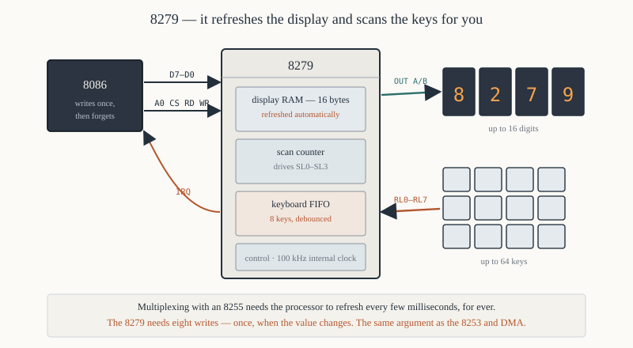

# Chapter 53 — Motors, displays and the 8279

[← ADC and DAC](52-adc-dac.md) · [Contents](README.md) · [Next: The 8087 coprocessor →](54-8087-coprocessor.md)

---

## Goal

Three more interfacing problems: driving a stepper motor, driving a DC motor's speed, and the 8279
keyboard/display controller that takes the multiplexing work off the processor.

> **Does this run under DOSBox?** No. These need a trainer board with an 8255 at ports `0x00`–`0x06`
> and an 8279 at `0x08`/`0x0A`.

---

## 1. Stepper motors

A stepper motor moves in discrete steps rather than rotating continuously. Energising its windings
in the right sequence rotates the shaft by a fixed angle per step — typically **1.8°**, giving 200
steps per revolution.

**No feedback is needed.** Count the steps and you know the position. That is why steppers drive
printers, plotters, disk heads and 3-D printers.

### 1.1 The windings

A unipolar stepper has four windings, driven from a common supply:

```
                    +12 V
                      │
          ┌───────┬───┴───┬───────┐
          │       │       │       │
         A│      B│      C│      D│      the four windings
          │       │       │       │
        ┌─┴─┐   ┌─┴─┐   ┌─┴─┐   ┌─┴─┐
        │   │   │   │   │   │   │   │    ULN2003 or four transistors
        └─┬─┘   └─┬─┘   └─┬─┘   └─┬─┘
          │       │       │       │
         PA0     PA1     PA2     PA3     from the 8255
```

**The 8255 cannot drive the windings directly.** A motor winding needs hundreds of milliamps; a
74LS-compatible output supplies a few. A **ULN2003** Darlington array — seven channels, 500 mA each,
with the flyback diodes built in — is the standard part.

**The flyback diodes are not optional.** Switching off an inductive load produces a voltage spike of
hundreds of volts that destroys the driver. The ULN2003 includes them; discrete transistors need one
across each winding.

### 1.2 The step sequences

**Wave drive** — one winding at a time. Lowest torque, lowest current.

| Step | D | C | B | A | Hex |
|------|---|---|---|---|-----|
| 1 | 0 | 0 | 0 | 1 | `0x01` |
| 2 | 0 | 0 | 1 | 0 | `0x02` |
| 3 | 0 | 1 | 0 | 0 | `0x04` |
| 4 | 1 | 0 | 0 | 0 | `0x08` |

**Full step** — two windings at a time. Twice the torque, twice the current. **The usual choice.**

| Step | D | C | B | A | Hex |
|------|---|---|---|---|-----|
| 1 | 0 | 0 | 1 | 1 | `0x03` |
| 2 | 0 | 1 | 1 | 0 | `0x06` |
| 3 | 1 | 1 | 0 | 0 | `0x0C` |
| 4 | 1 | 0 | 0 | 1 | `0x09` |

**Half step** — alternates between one and two windings, giving **eight** positions and half the
step angle: 0.9° instead of 1.8°.

| Step | Hex | Step | Hex |
|------|-----|------|-----|
| 1 | `0x01` | 5 | `0x04` |
| 2 | `0x03` | 6 | `0x0C` |
| 3 | `0x02` | 7 | `0x08` |
| 4 | `0x06` | 8 | `0x09` |

**Reversing the direction means walking the table backwards.** That is the whole of direction
control.

### 1.3 The driver

```asm
; ---------------------------------------------------------------
; stepper.asm — drive a unipolar stepper motor
; nasm -f bin stepper.asm -o stepper.com
;
; Port A bits 3-0 -> ULN2003 -> the motor windings
; ---------------------------------------------------------------
        cpu  8086
        org  0x100
%include "macros.inc"
%include "io.inc"

PORTA   equ  0x00
CTRL    equ  0x06
STEPS   equ  200                ; a full revolution at 1.8° per step

start:
        mov  al, 0x80           ; all 8255 ports output
        out  CTRL, al

        print menu
.key:
        xor  ah, ah
        int  0x16
        cmp  al, 'c'
        je   .clockwise
        cmp  al, 'a'
        je   .anticlockwise
        cmp  al, 27
        je   .done
        jmp  .key

.clockwise:
        mov  cx, STEPS
.cw_next:
        call step_forward
        call step_delay
        loop .cw_next
        jmp  .key

.anticlockwise:
        mov  cx, STEPS
.acw_next:
        call step_back
        call step_delay
        loop .acw_next
        jmp  .key

.done:
        xor  al, al
        out  PORTA, al          ; de-energise — do NOT leave a winding on
        exit 0

; ---------------------------------------------------------------
; step_forward — advance one step clockwise.
;   Destroys: nothing
; ---------------------------------------------------------------
step_forward:
        push ax
        push bx
        mov  bx, [phase]
        inc  bx
        and  bx, 0x03           ; wrap 0-3
        mov  [phase], bx
        mov  al, [seqtab + bx]
        out  PORTA, al
        inc  word [position]
        pop  bx
        pop  ax
        ret

; ---------------------------------------------------------------
; step_back — advance one step anticlockwise.
; ---------------------------------------------------------------
step_back:
        push ax
        push bx
        mov  bx, [phase]
        dec  bx
        and  bx, 0x03           ; wrapping works because AND masks
        mov  [phase], bx        ;   −1 to 3
        mov  al, [seqtab + bx]
        out  PORTA, al
        dec  word [position]
        pop  bx
        pop  ax
        ret

; ---------------------------------------------------------------
; step_delay — the minimum time between steps.
;
;   Too short and the motor stalls: the rotor cannot accelerate
;   fast enough to follow, and it sits and buzzes. Too long and it
;   is merely slow. About 5 ms per step is safe for a small motor.
; ---------------------------------------------------------------
step_delay:
        push cx
        mov  cx, 6000
.wait:  loop .wait
        pop  cx
        ret

seqtab:   db  0x03, 0x06, 0x0C, 0x09    ; full-step sequence
phase:    dw  0
position: dw  0
menu:     db  'Stepper: c = clockwise, a = anticlockwise, Esc = quit', 0x0D, 0x0A, '$'
```

### 1.4 The details that matter

**`and bx, 0x03` wraps in both directions.** Going forward, 3 + 1 = 4 becomes 0. Going backward,
0 − 1 = `0xFFFF` becomes 3. One instruction handles both, because `AND` with 3 keeps only the bottom
two bits.

**De-energise before exiting.** Leaving a winding on wastes power and heats both the motor and the
driver. A stepper holds its position with a winding energised — which is sometimes what you want
(holding torque) and sometimes not.

**Stalling is the characteristic failure.** If the step rate is too high, or the load too heavy, the
rotor cannot keep up and the motor buzzes without turning — and the software's step count is now
wrong, because there is no feedback. Real designs ramp the speed up and down rather than starting at
full rate.

---

## 2. DC motor speed control

A DC motor's speed is proportional to the average voltage across it. Rather than varying the
voltage — which wastes power as heat in a series resistor — switch it fully on and off rapidly:
**pulse-width modulation**.

```
   duty cycle 25%:  ──┐ ┌────┐ ┌────┐ ┌──      average = 25% of supply
                      └─┘    └─┘    └─┘

   duty cycle 75%:  ─┐ ┌──┐ ┌──┐ ┌──┐ ┌──      average = 75% of supply
                     └─┘  └─┘  └─┘  └─┘
```

The motor's inertia and inductance smooth the pulses, so it sees the average.

### 2.1 Software PWM

```asm
; ---------------------------------------------------------------
; pwm_output — one PWM cycle at duty cycle AL (0-255).
;
;   Resolution 256 steps; the period is 256 × the loop time.
;   Call it repeatedly to keep the motor running.
; ---------------------------------------------------------------
pwm_output:
        push ax
        push bx
        push cx
        mov  bl, al             ; BL = the duty cycle
        xor  cl, cl             ; CL = the counter 0-255
.next:
        cmp  cl, bl
        jae  .off
        mov  al, 0x01           ; motor on
        jmp  .drive
.off:
        xor  al, al             ; motor off
.drive:
        out  PORTA, al
        inc  cl
        jnz  .next              ; wraps at 256
        pop  cx
        pop  bx
        pop  ax
        ret
```

**This blocks the processor entirely**, which is why hardware PWM exists. The 8253 in mode 2
(Chapter 48 §3) generates a continuous pulse train without software, and the duty cycle is set by
the count.

For a motor, **mode 2's one-clock-wide pulse is not usable** — you need a genuine variable duty
cycle, which takes two counters or a dedicated PWM chip.

---

## 3. Multiplexed seven-segment displays

Chapter 47 §8 drove four digits from an 8255 by multiplexing. The cost:

- **The processor must refresh continuously.** Stop calling `show_number` for 50 ms and the display
  goes dark.
- Each digit is lit only 25% of the time, so it is dim.
- Twelve pins are occupied.

For an eight-digit display with a 64-key keypad, that becomes untenable. The 8279 exists to solve
it.

---

## 4. The 8279 keyboard/display controller



One chip that:

- **refreshes up to sixteen display digits automatically**, from its own 16-byte RAM;
- **scans up to a 64-key keyboard**, debounces it, and buffers up to eight keystrokes;
- **raises an interrupt** when a key is available.

The processor writes a digit's pattern once and the 8279 keeps displaying it. It reads a key code
when one arrives. Everything else is the chip's problem.

### 4.1 Registers

| `A0` | Write | Read |
|------|-------|------|
| 0 | display RAM data | FIFO (keyboard) or display RAM |
| 1 | command word | status |

On a 16-bit bus with `A0` from system `A1`: data at `0x08`, command/status at `0x0A`.

### 4.2 The command words

The top three bits select which command.

| Bits 7–5 | Command |
|----------|---------|
| `000` | **keyboard/display mode set** |
| `001` | **programmable clock** |
| `010` | **read FIFO/sensor RAM** |
| `011` | read display RAM |
| `100` | **write display RAM** |
| `101` | display write inhibit / blanking |
| `110` | **clear** |
| `111` | end interrupt / error mode set |

### 4.3 Mode set (`000`)

```
    7  6  5   4  3  2    1  0
  ┌─────────┬────────┬────────┐
  │  0 0 0  │  DD    │  KKK   │
  └─────────┴────────┴────────┘
```

Bits 4–3 — **display mode**:

| Value | Meaning |
|-------|---------|
| `00` | **8 digits, left entry** |
| `01` | 16 digits, left entry |
| `10` | 8 digits, right entry |
| `11` | 16 digits, right entry |

**Left entry** writes digits to fixed positions. **Right entry** shifts everything left as each new
digit arrives — which is exactly what a calculator does as you type.

Bits 2–0 — **keyboard mode**:

| Value | Meaning |
|-------|---------|
| `000` | **encoded scan, 2-key lockout** |
| `001` | decoded scan, 2-key lockout |
| `010` | encoded scan, N-key rollover |
| `100` | encoded sensor matrix |
| `110` | strobed input |

**2-key lockout** ignores a second key pressed while the first is held. **N-key rollover** accepts
them all in order. For a numeric keypad, lockout is right; for a typewriter keyboard, rollover.

```asm
        mov  al, 0x00           ; 8 digits left entry, encoded scan, 2-key lockout
        out  CMD, al
```

### 4.4 Programmable clock (`001`)

```
    7  6  5   4 3 2 1 0
  ┌─────────┬───────────┐
  │  0 0 1  │  divisor  │
  └─────────┴───────────┘
```

The 8279 needs an internal clock of about **100 kHz** for correct scan and debounce timing.

```
   divisor  =  input clock  ÷  100,000
```

With a 2 MHz input: 2,000,000 ÷ 100,000 = 20.

```asm
        mov  al, 0x20 | 20      ; command 001, divisor 20
        out  CMD, al            ; = 0x34
```

**Getting this wrong breaks debouncing**, and keys register two or three times.

### 4.5 Clear (`110`)

```asm
        mov  al, 0xD1           ; 110 1 00 01: clear display RAM and the FIFO
        out  CMD, al
        ; wait ~160 µs for the clear to complete
```

### 4.6 Writing to the display

```asm
        mov  al, 0x80           ; command 100, auto-increment off, address 0
        out  CMD, al
        mov  al, 0x3F           ; the segment pattern for '0'
        out  DATA, al
```

With auto-increment (bit 4 set), consecutive writes fill successive digits:

```asm
        mov  al, 0x90           ; command 100, AUTO-INCREMENT, address 0
        out  CMD, al
        mov  si, patterns
        mov  cx, 8
.next:
        lodsb
        out  DATA, al           ; each write advances the address
        loop .next
```

**One command and eight writes fills the whole display**, and the 8279 refreshes it for ever
afterwards.

### 4.7 Reading the keyboard

```asm
; ---------------------------------------------------------------
; kbd_ready — is a key waiting?
;   Out:  ZF = 0 if yes
; ---------------------------------------------------------------
kbd_ready:
        in   al, CMD            ; the status register
        and  al, 0x0F           ; bits 3-0 = the number of characters in the FIFO
        ret

; ---------------------------------------------------------------
; kbd_read — read one key code.
;   Out:  AL = the code, CF = 1 if nothing was waiting
;
;   The code is:  bits 2-0 = column, bits 5-3 = row,
;                 bit 6 = SHIFT, bit 7 = CONTROL
; ---------------------------------------------------------------
kbd_read:
        call kbd_ready
        jz   .none
        mov  al, 0x40           ; command 010: read the FIFO
        out  CMD, al
        in   al, DATA
        clc
        ret
.none:
        stc
        ret
```

**The key code is a row/column position, not ASCII.** A lookup table converts it:

```asm
keytab: db  '7', '8', '9', '/', 'C'
        db  '4', '5', '6', '*', 'E'
        ; ... one entry per matrix position
```

### 4.8 A complete 8279 initialisation

```asm
; ---------------------------------------------------------------
; init_8279 — 8 digits left entry, encoded keyboard scan, 2-key
;             lockout, 100 kHz internal clock from a 2 MHz input.
; ---------------------------------------------------------------
DATA    equ  0x08
CMD     equ  0x0A

init_8279:
        mov  al, 0x00           ; mode: 8 digits left entry, encoded, lockout
        out  CMD, al
        call io_delay

        mov  al, 0x34           ; clock: divide by 20
        out  CMD, al
        call io_delay

        mov  al, 0xD1           ; clear display RAM and FIFO
        out  CMD, al
        call clear_delay        ; the clear takes about 160 µs
        ret

clear_delay:
        push cx
        mov  cx, 500
.wait:  loop .wait
        pop  cx
        ret

io_delay:
        jmp  short $+2
        jmp  short $+2
        ret
```

---

## 5. Worked program — a calculator front panel

```asm
; panel.asm — an 8279 keypad and display
; nasm -f bin panel.asm -o panel.com
;
; Reads digits from the keypad and shows them on an eight-digit
; display, shifting left as each is entered.
        cpu  8086
        org  0x100
%include "macros.inc"
%include "io.inc"

DATA    equ  0x08
CMD     equ  0x0A

start:
        call init_8279
        print banner

        ; --- clear the display buffer ---
        cld
        mov  di, digits
        mov  cx, 8
        mov  al, 0x00           ; blank
        rep  stosb
        call refresh

.loop:
        call kbd_read
        jc   .check_quit

        ; --- convert the key code to a character ---
        and  al, 0x3F           ; strip the shift and control bits
        cmp  al, 16
        jae  .loop              ; out of range for our table
        mov  bx, keytab
        xlat                    ; AL = the character

        cmp  al, 'C'
        je   .clear
        cmp  al, '0'
        jb   .loop
        cmp  al, '9'
        ja   .loop

        ; --- shift the display left and append ---
        sub  al, '0'
        call shift_in
        call refresh
        jmp  .loop

.clear:
        mov  di, digits
        mov  cx, 8
        mov  al, 0x00
        rep  stosb
        call refresh
        jmp  .loop

.check_quit:
        mov  ah, 0x0B           ; the PC keyboard, for quitting
        int  0x21
        or   al, al
        jz   .loop
        exit 0

; ---------------------------------------------------------------
; shift_in — shift the display buffer left and put digit AL at the
;            right-hand end.
; ---------------------------------------------------------------
shift_in:
        push ax
        push cx
        push si
        push di
        mov  ah, al             ; keep the new digit

        cld
        mov  si, digits + 1
        mov  di, digits
        mov  cx, 7
        rep  movsb              ; shift everything one place left

        mov  bx, segtab
        mov  al, ah
        xlat                    ; AL = the segment pattern
        mov  [digits + 7], al

        pop  di
        pop  si
        pop  cx
        pop  ax
        ret

; ---------------------------------------------------------------
; refresh — write the eight patterns to the 8279's display RAM.
;
;   With auto-increment, one command and eight writes does it — and
;   the 8279 refreshes the display for ever afterwards, with no
;   further processor involvement at all.
; ---------------------------------------------------------------
refresh:
        push ax
        push cx
        push si
        mov  al, 0x90           ; write display RAM, auto-increment, address 0
        out  CMD, al
        mov  si, digits
        mov  cx, 8
        cld
.next:
        lodsb
        out  DATA, al
        loop .next
        pop  si
        pop  cx
        pop  ax
        ret

; ---------------------------------------------------------------
kbd_read:
        in   al, CMD
        and  al, 0x0F
        jz   .none
        mov  al, 0x40           ; read the FIFO
        out  CMD, al
        in   al, DATA
        clc
        ret
.none:
        stc
        ret

; ---------------------------------------------------------------
init_8279:
        mov  al, 0x00
        out  CMD, al
        call io_delay
        mov  al, 0x34
        out  CMD, al
        call io_delay
        mov  al, 0xD1
        out  CMD, al
        push cx
        mov  cx, 500
.w:     loop .w
        pop  cx
        ret

io_delay:
        jmp  short $+2
        jmp  short $+2
        ret

; ---------------------------------------------------------------
; Common-cathode seven-segment patterns, 0-9, then blank.
segtab: db  0x3F, 0x06, 0x5B, 0x4F, 0x66
        db  0x6D, 0x7D, 0x07, 0x7F, 0x6F
        db  0x00                ; 10 = blank

; Keypad matrix positions to characters.
keytab: db  '7','8','9','/'
        db  '4','5','6','*'
        db  '1','2','3','-'
        db  '0','.','=','C'

digits: times 8 db 0
banner: db  '8279 panel — type on the keypad, C clears.', 0x0D, 0x0A
        db  'Press any PC key to quit.', 0x0D, 0x0A, '$'
```

### 5.1 What the 8279 bought

| | 8255 multiplexing (Ch 47 §8) | 8279 |
|---|---|---|
| Processor time | **continuous refresh** — every few ms | **once, when the value changes** |
| Digits | 4 (12 pins) | 16 (from one chip) |
| Keyboard | scan and debounce in software | done by the chip, with an 8-key FIFO |
| Brightness | 25% duty | the chip drives at full available duty |
| Code | ~60 instructions of refresh loop | 8 writes |

**The processor is free.** That is the whole argument for a dedicated controller, and it is the same
argument as the 8253 versus software delays, or DMA versus `IN`/`STOSB`.

---

## 6. Summary

```
  STEPPER MOTOR
     unipolar, four windings, driven through a ULN2003 (flyback diodes essential)
     full-step sequence:  03 06 0C 09      — two windings at a time, best torque
     wave drive:          01 02 04 08      — one winding, least current
     half step:           01 03 02 06 04 0C 08 09  — eight positions, 0.9°
     reverse = walk the table backwards
     `and bx, 3` wraps the index in BOTH directions
     de-energise before exiting; too fast a step rate stalls the motor silently

  DC MOTOR
     speed by pulse-width modulation, not by varying the voltage
     software PWM blocks the processor; the 8253 does it in hardware

  8279 KEYBOARD/DISPLAY CONTROLLER
     refreshes up to 16 digits from its own RAM, with no processor involvement
     scans up to 64 keys, debounces them, buffers 8 in a FIFO
     A0 = 0 data, A0 = 1 command (write) / status (read)

     commands, by the top three bits:
        000 mode set        bits 4-3 display, bits 2-0 keyboard
        001 clock divisor   input clock / 100,000
        010 read FIFO
        100 write display RAM   (bit 4 = auto-increment)
        110 clear
     0x00 = 8 digits left entry, encoded scan, 2-key lockout
     0x34 = divide by 20, for a 2 MHz input
     0xD1 = clear everything
     0x90 = write display RAM from address 0, auto-incrementing

     status bits 3-0 = how many keys are waiting in the FIFO
     the key code is row/column, not ASCII — use a lookup table
```

---

## Exercises

**53.1** A stepper has a 1.8° step angle. How many steps per revolution? What if it is driven in
half-step mode?

**53.2** Give the full-step sequence, and say what changes to reverse the direction.

**53.3** Why does `and bx, 0x03` correctly wrap the phase index in both directions? Trace it for
`BX = 0` going backwards.

**53.4** Why can an 8255 output not drive a motor winding directly? Name the part that can.

**53.5** What are the flyback diodes for, and what happens without them?

**53.6** A stepper is commanded to make 200 steps but the shaft turns only part way and the motor
buzzes. What has happened, and why does the software not know?

**53.7** Write a routine that moves a stepper to an absolute position, given the current position in
a variable.

**53.8** Explain pulse-width modulation and why it is more efficient than a series resistor.

**53.9** Write a software PWM routine with 16 levels rather than 256. What does that buy?

**53.10** Give three advantages of an 8279 over multiplexing a display with an 8255.

**53.11** Give the 8279 mode-set command for 16 digits, right entry, encoded scan with N-key
rollover.

**53.12** An 8279 has a 3 MHz input clock. What divisor value does it need, and what is the command
byte?

**53.13** What happens if the 8279's clock divisor is set wrongly?

**53.14** Write the code that displays the decimal number in `AX` on an eight-digit 8279 display,
right-aligned with leading blanks.

**53.15** Explain the difference between 2-key lockout and N-key rollover, and say which suits a
numeric keypad.

Answers in [Appendix H](H-exercise-solutions.md#chapter-53).

---

[← ADC and DAC](52-adc-dac.md) · [Contents](README.md) · [Next: The 8087 coprocessor →](54-8087-coprocessor.md)
