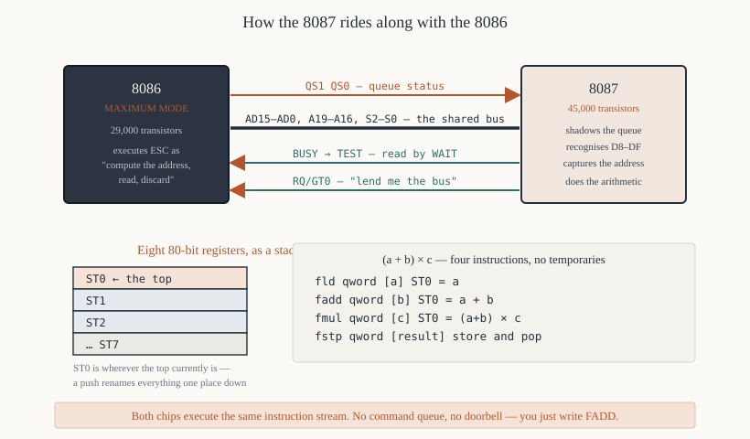

# Chapter 54 — The 8087 numeric coprocessor

[← Motors, displays and the 8279](53-stepper-seven-segment-8279.md) · [Contents](README.md) · [Next: Where to go next →](55-where-next.md)

---

## Goal

The 8086 cannot add two real numbers. The 8087 can — and also multiply, divide, take square roots,
logarithms and trigonometric functions, on 80-bit values, between 10 and 100 times faster than
software.

Cover how the two chips cooperate, the register stack model, the data types, the instruction set and
a complete program.

> **Does this run under DOSBox?** Yes — DOSBox emulates an x87 FPU. Add `cpu 8086` *and* explicitly
> allow FPU instructions with `fpu 8087` in NASM.

---

## 1. Why a separate chip

Floating-point arithmetic in software on an 8086:

| Operation | Software (typical) | 8087 |
|-----------|-------------------|------|
| Add | ~1,600 clocks | **70–100** |
| Multiply | ~1,600 clocks | **90–145** |
| Divide | ~3,200 clocks | **193–203** |
| Square root | ~19,600 clocks | **180–186** |
| Tangent | ~100,000 clocks | **30–540** |

**Between 10× and 100× faster**, and to greater precision. In 1980 a numerical application without a
coprocessor was not merely slower; it was a different kind of program.

The reason it is a separate chip is transistor budget. The 8087 has **45,000 transistors** — more
than the 8086's 29,000. Putting them on one die in 1980 was not possible; the 80486 was the first
x86 to integrate the FPU.

---

## 2. How the two chips cooperate



This is the interesting part, and it requires **maximum mode** (Chapter 15).

### 2.1 The mechanism

1. **The 8087 shares the bus.** Its `AD15`–`AD0`, `A19`–`A16`, `S2#`–`S0#` and clock connect to the
   same lines as the 8086's.

2. **It shadows the instruction queue.** The 8086's `QS1`/`QS0` pins report what the queue did on
   every clock (Chapter 15 §6). The 8087 watches them and maintains its own identical copy of the
   queue.

3. **It recognises its own opcodes.** The `ESC` instructions, opcodes `0xD8`–`0xDF` (Chapter 30 §9).
   When the 8087 sees one leave the queue, it knows the 8086 is about to execute it.

4. **The 8086 computes the address and does a dummy read.** It treats `ESC` as "calculate the
   effective address, perform a memory read, discard the result". The *address* appears on the bus,
   which is what the 8087 needs.

5. **The 8087 captures that address** and performs the operation itself, fetching or storing further
   words if the operand is 64 or 80 bits wide.

6. **It requests the bus with `RQ/GT0#`** when it needs more cycles.

7. **It asserts `BUSY` while computing**, which connects to the 8086's `TEST#` pin.

8. **`WAIT` synchronises them.** The assembler inserts a `WAIT` before any instruction that reads a
result the 8087 might still be producing.

### 2.2 Why this is clever

**The two processors execute the same instruction stream.** There is no command queue, no doorbell
register, no handshake protocol in software. You write `FADD` in the middle of ordinary code and it
works.

The cost is the tight coupling: the 8087 must see every clock the 8086 sees, must be in the same
maximum-mode system, and cannot be added to a minimum-mode design at all.

### 2.3 Overlapped execution

Because the 8087 runs independently once started, the 8086 can continue:

```asm
        fmul  qword [x]         ; tell the 8087 to multiply — 100+ clocks
        mov   ax, [counter]     ; the 8086 does this MEANWHILE
        inc   ax
        mov   [counter], ax
        fstp  qword [result]    ; the assembler puts a WAIT before this
```

**That is free parallelism**, and it is why well-written 8087 code interleaves integer work between
floating-point operations.

---

## 3. The register stack

The 8087 has **eight 80-bit registers arranged as a stack**, not as a flat file.

```
        ┌─────────────────────────┐
   ST0  │  the top of the stack   │  ← most instructions work here
        ├─────────────────────────┤
   ST1  │                         │
        ├─────────────────────────┤
   ST2  │                         │
        ├─────────────────────────┤
        │          ...            │
        ├─────────────────────────┤
   ST7  │  the bottom             │
        └─────────────────────────┘
```

**`ST0` is wherever the top currently is**, not a fixed register. Pushing moves everything down one
name: what was `ST0` becomes `ST1`.

### 3.1 Why a stack

It makes expression evaluation natural. To compute `(a + b) × c`:

```asm
        fld   qword [a]         ; ST0 = a
        fadd  qword [b]         ; ST0 = a + b
        fmul  qword [c]         ; ST0 = (a+b) × c
        fstp  qword [result]    ; store and pop
```

Four instructions, no register allocation, no temporaries. That is reverse Polish notation, and it
is why Hewlett-Packard calculators worked the same way.

### 3.2 Stack overflow

Eight registers. Pushing a ninth value **overwrites** `ST7` and sets the invalid-operation
exception. There is no automatic spilling to memory.

**Every `FLD` needs a matching pop.** The `FSTP`, `FADDP` and `FMULP` forms (the `P` suffix) pop as
they go; the non-popping forms do not. Losing track leaks stack entries, and after eight leaks
everything breaks.

---

## 4. The data types

| Type | Bits | Directive | Range | Significant digits |
|------|------|-----------|-------|-------------------|
| Word integer | 16 | `dw` | ±32,767 | — |
| Short integer | 32 | `dd` | ±2×10⁹ | — |
| Long integer | 64 | `dq` | ±9×10¹⁸ | — |
| Packed BCD | 80 | `dt` | ±10¹⁸ | 18 digits |
| **Short real** | 32 | `dd` | ±3.4×10³⁸ | ~7 |
| **Long real** | 64 | `dq` | ±1.8×10³⁰⁸ | ~15 |
| **Temporary real** | 80 | `dt` | ±1.2×10⁴⁹³² | ~19 |

**Everything is converted to temporary real inside the chip.** All eight stack registers are 80 bits,
and all arithmetic happens at that width. The 32- and 64-bit formats exist only for storage.

**That is why an 8087 computation can be more accurate than the same computation in C**: the
intermediate results keep 19 significant digits even when the variables hold 15.

### 4.1 The short-real format (IEEE 754 single precision)

```
    31  30        23  22                    0
  ┌───┬──────────────┬───────────────────────┐
  │ S │   exponent   │       mantissa        │
  └───┴──────────────┴───────────────────────┘
    1        8                  23
```

```
   value  =  (−1)^S  ×  1.mantissa  ×  2^(exponent − 127)
```

The leading `1` is **implicit** — it is not stored, which buys one extra bit of precision. The
exponent is stored with a **bias of 127**, so that comparisons can be done on the bit pattern as if
it were an integer.

Worked example — the value 1.0:

```
   S = 0, exponent = 127 (= 0 after the bias), mantissa = 0
   0 01111111 00000000000000000000000  =  0x3F800000
```

And −2.5:

```
   −2.5 = −1.25 × 2^1
   S = 1, exponent = 128, mantissa = .25 = 0100...
   1 10000000 01000000000000000000000  =  0xC0200000
```

**The 8087 was the chip the IEEE 754 standard was written around.** Intel's implementation came
first and the standard was largely a description of it, which is why every processor since agrees on
the format.

---

## 5. The instruction set

All 8087 mnemonics begin with `F`.

### 5.1 Load and store

| Instruction | Action |
|-------------|--------|
| `FLD src` | push a real onto the stack |
| `FILD src` | push an **integer**, converting it |
| `FBLD src` | push a packed **BCD** value |
| `FST dst` | store `ST0`, **without** popping |
| `FSTP dst` | store `ST0` **and pop** |
| `FIST` / `FISTP` | store as an integer, rounding |
| `FBSTP` | store as packed BCD and pop |
| `FXCH` | exchange `ST0` and `ST1` |

### 5.2 Constants

| Instruction | Pushes |
|-------------|--------|
| `FLDZ` | 0.0 |
| `FLD1` | 1.0 |
| `FLDPI` | π |
| `FLDL2E` | log₂(e) |
| `FLDL2T` | log₂(10) |
| `FLDLG2` | log₁₀(2) |
| `FLDLN2` | ln(2) |

**These are exact to 80 bits**, which is better than any constant you could write in source.

### 5.3 Arithmetic

| Instruction | Action |
|-------------|--------|
| `FADD` / `FADDP` | add / add and pop |
| `FSUB` / `FSUBP` | subtract |
| `FSUBR` / `FSUBRP` | **reverse** subtract: `src − ST0` |
| `FMUL` / `FMULP` | multiply |
| `FDIV` / `FDIVP` | divide |
| `FDIVR` / `FDIVRP` | **reverse** divide |
| `FABS` | absolute value |
| `FCHS` | change sign |
| `FSQRT` | square root |
| `FRNDINT` | round to an integer |
| `FPREM` | partial remainder |
| `FSCALE` | multiply by 2^ST1 |

**The `R` forms matter.** `FSUB` computes `ST0 − src`; `FSUBR` computes `src − ST0`. With a stack,
the operand order is not always the one you want, and the reverse forms save an `FXCH`.

### 5.4 Transcendental

| Instruction | Computes |
|-------------|----------|
| `FPTAN` | partial tangent |
| `FPATAN` | partial arctangent |
| `F2XM1` | 2^x − 1 |
| `FYL2X` | y × log₂(x) |
| `FYL2XP1` | y × log₂(x+1) |

**These are primitives, not the functions you want.** Sine, cosine, logarithm and exponential are
built from them. `FSIN` and `FCOS` arrived with the 80387.

For example, `ln(x) = log₂(x) × ln(2)`:

```asm
        fldln2                  ; ST0 = ln(2)
        fld   qword [x]         ; ST0 = x, ST1 = ln(2)
        fyl2x                   ; ST0 = ln(2) × log2(x) = ln(x)
```

### 5.5 Comparison

| Instruction | Action |
|-------------|--------|
| `FCOM` / `FCOMP` / `FCOMPP` | compare `ST0` with the operand |
| `FTST` | compare `ST0` with zero |
| `FXAM` | examine — classify `ST0` |

**The result goes into the 8087's status word, not the 8086's flags.** To branch on it you must
transfer the condition codes:

```asm
        fcom  qword [y]
        fstsw word [status]     ; store the 8087 status word
        fwait
        mov   ax, [status]
        sahf                    ; move AH into the 8086's flags
        jb    .less             ; now an ordinary conditional jump works
```

`FSTSW` puts the status word in memory; its top byte has the condition codes positioned so that
`SAHF` lands them on `CF`, `ZF` and `PF` in the arrangement the unsigned jumps expect. This is the
one place where `SAHF` (Chapter 21 §9) is genuinely the right instruction.

### 5.6 Control

| Instruction | Action |
|-------------|--------|
| `FINIT` / `FNINIT` | initialise the chip |
| `FLDCW` / `FSTCW` | load / store the control word |
| `FSTSW` | store the status word |
| `FCLEX` | clear the exceptions |
| `FSAVE` / `FRSTOR` | save / restore the entire state (94 bytes) |
| `FFREE` | mark a register empty |
| `FINCSTP` / `FDECSTP` | move the stack pointer without loading |
| `FWAIT` | wait for the 8087 to finish |

**The `N` forms** (`FNINIT`, `FNSTSW`) omit the `WAIT` prefix the assembler would otherwise insert.
Use them when the 8087 might be in an exception state, since a `WAIT` would hang.

---

## 6. The control word

Set with `FLDCW`. It decides rounding and which exceptions are masked.

```
    15-12   11-10   9-8   7-6   5   4   3   2   1   0
  ┌───────┬───────┬─────┬─────┬───┬───┬───┬───┬───┬───┐
  │   —   │  RC   │ PC  │  —  │ PM│ UM│ OM│ ZM│ DM│ IM│
  └───────┴───────┴─────┴─────┴───┴───┴───┴───┴───┴───┘
```

**Bits 11–10 — rounding control:**

| Value | Mode |
|-------|------|
| `00` | **round to nearest (even)** — the default and the right choice |
| `01` | round down (toward −∞) |
| `10` | round up (toward +∞) |
| `11` | truncate (toward zero) |

**Bits 9–8 — precision control:**

| Value | Precision |
|-------|-----------|
| `00` | 24 bits (single) |
| `10` | 53 bits (double) |
| `11` | **64 bits (extended)** — the default |

**Bits 5–0 — exception masks.** A 1 masks that exception, so the chip substitutes a default result
(infinity, NaN, zero) and continues rather than interrupting.

| Bit | Exception |
|-----|-----------|
| 0 | invalid operation |
| 1 | denormalised operand |
| 2 | **divide by zero** |
| 3 | overflow |
| 4 | underflow |
| 5 | precision (inexact result) |

**`FINIT` sets `0x037F`** — all exceptions masked, round to nearest, extended precision. That is what
you want unless you have a reason otherwise.

### 6.1 Unmasking divide-by-zero

```asm
        fstcw word [cw]
        fwait
        mov   ax, [cw]
        and   ax, 0xFFFB        ; clear bit 2 — unmask divide by zero
        mov   [cw], ax
        fldcw word [cw]
```

Now a division by zero raises an interrupt instead of producing infinity. Whether you want that
depends on whether infinity is a meaningful answer in your problem.

---

## 7. Worked program — quadratic roots

```asm
; quad.asm — solve ax² + bx + c = 0 using the 8087
; nasm -f bin quad.asm -o quad.com
;
; Runs under DOSBox, which emulates an x87.
        cpu  8086
        fpu  8087
        org  0x100
%include "macros.inc"
%include "io.inc"

start:
        finit                   ; initialise the 8087

        print banner

        ; --- discriminant: d = b² − 4ac ---
        fld   qword [b]
        fmul  st0, st0          ; ST0 = b²
        fld   qword [a]
        fmul  qword [c]         ; ST0 = ac, ST1 = b²
        fadd  st0, st0          ; ST0 = 2ac
        fadd  st0, st0          ; ST0 = 4ac
        fsubp st1, st0          ; ST0 = b² − 4ac, and pop
        fst   qword [disc]      ; keep a copy

        ; --- is it negative? ---
        ftst                    ; compare ST0 with 0
        fstsw word [status]
        fwait
        mov   ax, [status]
        sahf
        jb    .complex          ; CF = 1 means ST0 < 0

        ; --- real roots ---
        fsqrt                   ; ST0 = sqrt(d)
        fst   qword [sq]

        ; --- root1 = (−b + sqrt(d)) / (2a) ---
        fld   qword [b]
        fchs                    ; ST0 = −b, ST1 = sqrt(d)
        fadd  st0, st1          ; ST0 = −b + sqrt(d)
        fld   qword [a]
        fadd  st0, st0          ; ST0 = 2a
        fdivp st1, st0          ; ST0 = (−b + sqrt(d)) / (2a)
        fstp  qword [root1]     ; store and pop

        ; --- root2 = (−b − sqrt(d)) / (2a) ---
        fld   qword [b]
        fchs
        fsub  qword [sq]        ; ST0 = −b − sqrt(d)
        fld   qword [a]
        fadd  st0, st0
        fdivp st1, st0
        fstp  qword [root2]

        ; --- report ---
        print r1msg
        fld   qword [root1]
        call  print_real
        newline
        print r2msg
        fld   qword [root2]
        call  print_real
        newline
        exit 0

.complex:
        print cmsg
        exit 0

; ---------------------------------------------------------------
; print_real — print ST0 to three decimal places, then pop it.
;
;   Method: multiply by 1000, round to an integer, store as a
;   32-bit integer, then print it with a decimal point inserted.
;   That avoids any floating-point-to-string conversion.
;
;   Destroys: AX, BX, CX, DX
; ---------------------------------------------------------------
print_real:
        ; --- handle the sign ---
        ftst
        fstsw word [status]
        fwait
        mov   ax, [status]
        sahf
        jae   .positive
        putc  '-'
        fabs
.positive:
        fmul  qword [thousand]
        frndint                 ; round to the nearest integer
        fistp dword [itemp]     ; store as a 32-bit integer and pop
        fwait

        mov   ax, [itemp]
        mov   dx, [itemp+2]     ; DX:AX = the scaled value

        ; --- whole part ---
        mov   bx, 1000
        div   bx                ; AX = whole, DX = the fraction
        push  dx
        call  print_udec
        putc  '.'

        ; --- three fractional digits, zero padded ---
        pop   ax
        mov   bx, 100
        xor   dx, dx
        div   bx
        add   al, '0'
        putc  al
        mov   ax, dx
        mov   bx, 10
        xor   dx, dx
        div   bx
        add   al, '0'
        putc  al
        mov   al, dl
        add   al, '0'
        putc  al
        ret

; ---------------------------------------------------------------
a:         dq  1.0
b:         dq  -5.0
c:         dq  6.0
disc:      dq  0.0
sq:        dq  0.0
root1:     dq  0.0
root2:     dq  0.0
thousand:  dq  1000.0
itemp:     dd  0
status:    dw  0

banner: db  'Solving x^2 - 5x + 6 = 0', 0x0D, 0x0A, '$'
r1msg:  db  'Root 1: $'
r2msg:  db  'Root 2: $'
cmsg:   db  'The roots are complex.', 0x0D, 0x0A, '$'
```

**Output:**

```
Solving x^2 - 5x + 6 = 0
Root 1: 3.000
Root 2: 2.000
```

### 7.1 Notes

**`fadd st0, st0` doubles a value** — cheaper and exact, where multiplying by a constant 2.0 would
need a memory operand.

**`fsubp st1, st0`** computes `ST1 − ST0`, stores it in `ST1`, and pops — leaving the result as the
new `ST0`. The two-operand popping forms are where stack code gets dense; reading them carefully is
the skill.

**`fstsw` / `sahf` / `jb`** is the standard idiom for branching on a floating-point comparison. Note
the `FWAIT` between storing the status and reading it: the store is asynchronous.

**`print_real` avoids float-to-string entirely** by scaling to an integer. Writing a correct
general-purpose floating-point printer is genuinely hard; scaling and rounding is adequate for fixed
precision and takes fifteen instructions.

---

## 8. Detecting the presence of an 8087

An `ESC` instruction with no 8087 fitted does **nothing** — no fault, no error (Chapter 30 §9). So
you cannot detect it by trapping.

The standard test writes a known value to the control word and reads it back:

```asm
; ---------------------------------------------------------------
; has_8087 — is a coprocessor fitted?
;   Out:  CF = 0 if yes, CF = 1 if no
; ---------------------------------------------------------------
has_8087:
        fninit                  ; the N form — no WAIT, in case nothing is there
        mov   word [cw], 0
        fnstcw word [cw]        ; store the control word
        mov   ax, [cw]
        and   ax, 0x103F        ; the bits an 8087 always sets
        cmp   ax, 0x003F        ; FINIT leaves all exception masks set
        je    .present
        stc
        ret
.present:
        clc
        ret

cw:     dw  0
```

**The `N` forms are essential here.** `FINIT` and `FSTCW` would have `WAIT` prefixes, and a `WAIT`
with no coprocessor and a floating `TEST#` pin hangs for ever.

The BIOS also reports it: `INT 11h` returns the equipment word with bit 1 set if an 8087 is present
(Chapter 37 §6.1) — though that reflects a configuration switch, not the chip.

---

## 9. What came after

| Part | For | Added |
|------|-----|-------|
| 8087 | 8086/8088 | the original |
| 80287 | 80286 | protected-mode support |
| 80387 | 80386 | `FSIN`, `FCOS`, proper transcendentals, full IEEE 754 |
| 80486DX | — | **integrated on the CPU die** |
| Pentium | — | faster, and the famous FDIV bug |

From the 80486DX onwards, the FPU is part of the processor and `WAIT` is unnecessary — the pipeline
handles the synchronisation. The instruction set is unchanged, which is why an `FADD` written for an
8087 in 1981 assembles and runs today.

**SSE2 (2001) replaced the stack model** with sixteen flat registers, because compilers found the
stack hard to allocate for. The x87 instructions still work, but modern compilers do not emit them.

---

## 10. Summary

```
  the 8087 has 45,000 transistors — MORE than the 8086's 29,000
  10x to 100x faster than software floating point

  REQUIRES MAXIMUM MODE. It shadows the 8086's instruction queue
  through QS1/QS0, recognises ESC opcodes D8-DF, takes the address
  from the 8086's dummy read, and asserts BUSY -> the 8086's TEST# pin.
  WAIT synchronises them; the assembler inserts it automatically.

  EIGHT 80-BIT REGISTERS AS A STACK: ST0 is the top, not a fixed register
  all arithmetic is done at 80 bits, whatever the storage format
  every FLD needs a matching pop, or the stack leaks

  storage formats:  short real 32 · long real 64 · temporary real 80
                    word/short/long integer · packed BCD 80
  short real = sign(1) + biased exponent(8, bias 127) + mantissa(23)
     with an IMPLICIT leading 1;  1.0 = 0x3F800000

  key instructions:
     FLD FILD FBLD        push
     FST FSTP FIST FISTP  store (P = and pop)
     FADD FSUB FMUL FDIV  and the P and R variants
     FSQRT FABS FCHS FRNDINT
     FLDZ FLD1 FLDPI      exact constants
     FCOM FTST            result goes to the STATUS WORD, not the 8086's flags
                          -> FSTSW / FWAIT / SAHF / Jcc
     FINIT FLDCW FSTSW FCLEX FSAVE FRSTOR
     the N forms (FNINIT, FNSTSW) omit the WAIT — use them when detecting

  control word: bits 11-10 rounding (00 = nearest, the default)
                bits 9-8 precision (11 = 64-bit, the default)
                bits 5-0 exception masks; FINIT sets 0x037F — all masked

  detect it by writing and reading back the control word, with the N forms
```

---

## Exercises

**54.1** Why is the 8087 a separate chip rather than part of the 8086?

**54.2** Which operating mode does an 8087 require, and why can it not work in the other one?

**54.3** Explain, step by step, how the 8087 knows that the 8086 is executing one of its
instructions.

**54.4** What does the 8086 actually do when it encounters an `ESC` instruction?

**54.5** What connects the 8087's `BUSY` output, and what instruction reads it?

**54.6** Why does `ST0` not refer to a fixed register?

**54.7** Write the 8087 code that computes `(a + b) / (c − d)` for four long reals, leaving the
result in `ST0`.

**54.8** What is the difference between `FSUB` and `FSUBR`? Give a case where the reverse form saves
an instruction.

**54.9** What is the difference between `FST` and `FSTP`? What goes wrong if you use `FST` in a loop?

**54.10** Encode 1.0 and −2.5 as IEEE 754 single-precision values, showing the sign, exponent and
mantissa fields.

**54.11** Why is the leading 1 of the mantissa not stored? What does that buy?

**54.12** Write the four-instruction sequence that branches to `.bigger` if `ST0` is greater than the
long real at `[y]`.

**54.13** Why is `FWAIT` needed between `FSTSW` and reading the stored value?

**54.14** Write the code that unmasks the overflow exception without disturbing the other control
bits.

**54.15** Why must the `N` forms of the instructions be used when detecting whether an 8087 is
present?

**54.16** `ln(x)` is computed as `log₂(x) × ln(2)`. Write the three-instruction sequence, and explain
the order the operands must be pushed in.

Answers in [Appendix H](H-exercise-solutions.md#chapter-54).

---

[← Motors, displays and the 8279](53-stepper-seven-segment-8279.md) · [Contents](README.md) · [Next: Where to go next →](55-where-next.md)
